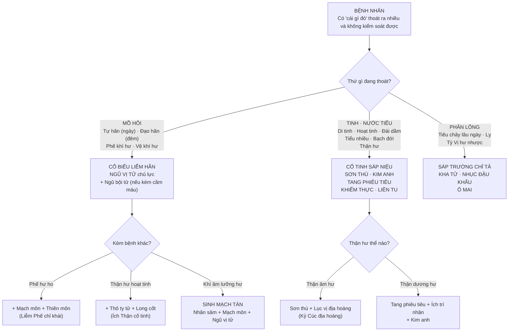
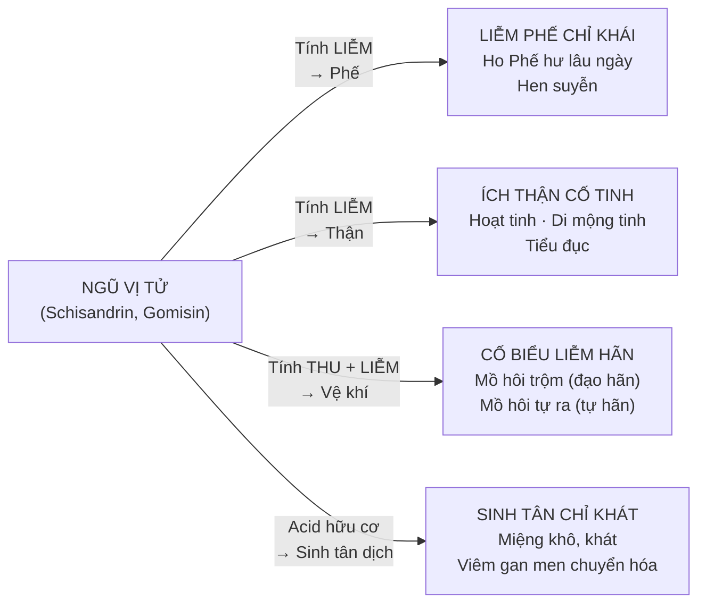
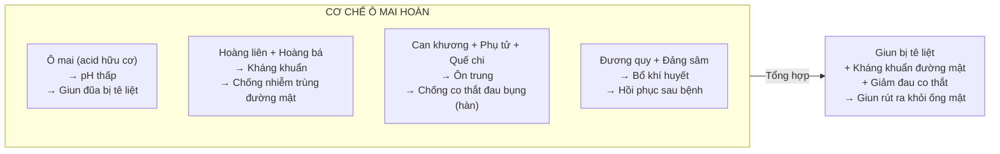
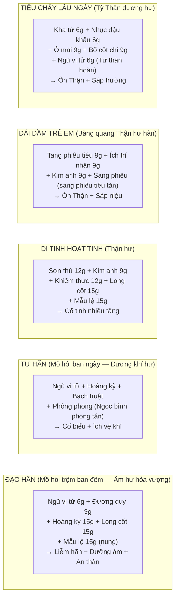

import CompareTable from '~/components/CompareTable.astro';
import ClinicalPearl from '~/components/ClinicalPearl.astro';
import RedFlags from '~/components/RedFlags.astro';
import MedicalNote from '~/components/MedicalNote.astro';

## 1. Luồng tư duy lâm sàng — Bài 15



---

## 2. Nguyên tắc quan trọng nhất — "Không dùng khi ngoại tà chưa giải"

**Đây là điểm phân biệt cốt lõi của toàn bộ nhóm thuốc cố sáp:**

```
NGOẠI TÀ (vi khuẩn, virus, yếu tố gây bệnh bên ngoài) xâm nhập
    ↓
Cơ thể phản ứng: Sốt + Ra mồ hôi (để đẩy tà ra) + Tiêu chảy (để tống độc)
    ↓
Đây là cơ chế BẢO VỆ — cần để tự diễn ra

DÙNG CỐ SÁP LÚC NÀY:
    ↓
Tính thu liễm → Mồ hôi không ra được → Tà không thoát ra
Tính sáp trường → Tiêu chảy cầm → Độc tố không tống ra
    ↓
TÀ TÍCH LẠI TRONG CƠ THỂ → Bệnh nặng thêm
    ↓
YHCT: "Lưu tà"
```

**So sánh với tả hạ:** Thuốc tả hạ KHÔNG dùng khi còn biểu chứng (vì sẽ "dẫn tà vào lý"). Thuốc cố sáp KHÔNG dùng khi còn ngoại tà (vì sẽ "lưu tà"). Cả hai đều cùng logic: chờ tà ra hết rồi mới điều chỉnh.

---

## 3. Ngũ vị tử — vị thuốc "5 vị, 4 công năng"

**Tại sao gọi là Ngũ vị tử?**

```
QUẢ NGŨ VỊ TỬ (Schisandra chinensis):
- Vỏ ngoài: Ngọt
- Thịt quả: Chua (acid hữu cơ cao)
- Hạt: Cay, đắng (schisandrin + các lignan)
- Vị tổng thể: Mặn (khoáng chất)
    ↓
5 VỊ: Chua + Ngọt + Đắng + Cay + Mặn = NGŨ VỊ TỬ
```

**4 công năng tương ứng với 4 tạng:**



### Sinh mạch tán — bài 3 vị kinh điển

**Chỉ định:** Khí âm lưỡng hư — mồ hôi ra nhiều, hơi thở ngắn, khô miệng, mạch tế yếu.

| Vị | Vai trò | Lý do chọn |
|---|---|---|
| Nhân sâm 9 g | Bổ Phế khí, sinh tân | Vừa bổ vừa sinh tân dịch |
| Mạch môn 9 g | Dưỡng Phế âm, nhuận Phế | Sinh tân, nhuận, thanh Phế |
| Ngũ vị tử 6 g | Liễm hãn, cố tinh | Thu lại mồ hôi đang thoát quá nhiều |

**Logic bài thuốc:** Nhân sâm + Mạch môn bổ cho cái đã mất → Ngũ vị tử giữ không để mất thêm. Bổ + Giữ = hoàn chỉnh.

<ClinicalPearl>

**Ngũ vị tử trong bảo vệ gan:** Schisandrin B ức chế NADPH oxidase và giảm ROS (reactive oxygen species) tại tế bào gan → Bảo vệ tế bào gan khỏi tổn thương oxy hóa. Được dùng trong điều trị hỗ trợ viêm gan mạn (men gan cao dai dẳng sau điều trị). Đây là cơ sở khoa học cho "Sinh tân — viêm gan men không hồi phục" trong sách.

</ClinicalPearl>

---

## 4. Mẫu lệ — khoáng vật YHCT, 5 công năng

**Mẫu lệ là vỏ hàu** — một trong số ít "thuốc khoáng vật" trong YHCT, không phải thực vật hay động vật. Điều này ảnh hưởng đến cách dùng:

```
MẪU LỆ (Concha Ostreae — Vỏ hàu)
    ↓
Thành phần: CaCO₃ 90% + CaPO₄ + CaSO₄ + protein biển
    ↓
SẮC LÂU HƠN THUỐC THƯỜNG (30-60 phút) → Vì là khoáng vật, cần nhiệt lâu
HOẶC dùng dạng tán bột mịn uống
    ↓
SỐNG → CaCO₃ nguyên → Ion Ca²⁺ cao → An thần + Nhuyễn kiên
NUNG (Đoạn) → CaCO₃ → CaO (vôi) → Thu liễm mạnh hơn + Antacid
```

**5 công năng Mẫu lệ:**

| Công năng | Cơ chế | Ứng dụng |
|---|---|---|
| Thu liễm cố sáp | CaO thu liễm protein niêm mạc | Di tinh, mồ hôi nhiều, tiểu són khi có thai |
| Trọng trấn an thần | Ca²⁺ ổn định màng thần kinh | Mất ngủ, đánh trống ngực, lo lắng |
| Tư âm tiềm dương | Khoáng Ca mát + hàn → hạ Can dương | Hoa mắt, chóng mặt, đau đầu do huyết áp cao |
| Nhuận kiên (Sống) | Chưa rõ cơ chế đầy đủ; protein biển? | Tràng nhạc, đờm hạch (phối Hạ khô thảo + Huyền sâm) |
| Chế toan (Nung) | CaO + HCl → CaCl₂ + H₂O (trung hòa acid) | Đau loét dạ dày, ợ chua |

---

## 5. Ô mai hoàn — bài thuốc giun chui ống mật

**Ô mai đặc biệt** ở công năng "Sát trùng" — không thuần cố sáp. Tại sao?

```
QUẢ MƠ xanh (chưa chín hẳn) được chế:
- Muối + Khói + Phơi → ÔI MAI (màu đen, vị rất chua)
    ↓
ACID MALIC + ACID CITRIC + ACID TARTARIC (rất cao)
    ↓
pH trong ruột non ↓ đột ngột khi Ô mai vào
    ↓
GIUN ĐŨA (*Ascaris lumbricoides*) sống ở pH 7-8
    ↓
Giun tiếp xúc môi trường acid cường độ cao → Bị kích thích mạnh
    ↓
Giun co cụm, bị tê liệt (paralysis)
    ↓
Không bám được vào niêm mạc ruột → Bị tống ra ngoài theo phân
```

### Ô mai hoàn — trị giun chui ống mật (Hội quyết)

**Ô mai hoàn:** Ô mai 12 g + Hoàng liên 6 g + Hoàng bá 6 g + Can khương 6 g + Phụ tử 12 g + Xuyên tiêu 6 g + Quế chi 8 g + Tế tân 4 g + Đương quy 12 g + Đảng sâm 12 g + Mật ong làm hoàn.



<MedicalNote>

**Giun chui ống mật (Ascaris biliary migration) hiện đại:** Hội quyết YHCT tương đương với Ascaris biliary infestation — giun đũa chui vào ống mật chủ → đau bụng dữ dội từng cơn (colic), vàng da, viêm đường mật. Ô mai hoàn YHCT thực sự có cơ sở — acid hữu cơ tạo môi trường pH thấp đường ruột → kích thích giun rút ra. Nhưng YHHĐ hiện nay dùng Albendazole/Mebendazole hiệu quả hơn. Ô mai hoàn có giá trị lịch sử quan trọng — một trong những bài thuốc giun đầu tiên được mô tả.

</MedicalNote>

---

## 6. Sơn thù — vị thuốc "bổ Can Thận kiêm cố sáp"

**Sơn thù là cầu nối** giữa nhóm cố sáp và nhóm bổ âm — vừa cố tinh, vừa bổ Can Thận toàn diện.

**Lục vị địa hoàng hoàn** — bài bổ âm kinh điển nhất YHCT — có Sơn thù:

```
LỤC VỊ ĐỊA HOÀNG HOÀN:
1. Thục địa 24 g — Bổ Thận âm (vị chính)
2. SƠN THÙ 12 g — Bổ Can Thận, cố tinh
3. Sơn dược 12 g — Kiện Tỳ Phế, bổ Thận âm
4. Trạch tả 9 g — Thông Thận tiết thấp
5. Phục linh 9 g — Kiện Tỳ thẩm thấp
6. Đan bì 9 g — Thanh Can hỏa, lương huyết
    ↓
"Ba bổ + Ba tả" = Bổ mà không trệ, vừa bổ vừa thanh
```

**Sơn thù trong bài này:** Vai trò "bổ Can Thận" → tăng tính bổ cho bài; vai trò "cố tinh" → giúp giữ tân dịch không thoát. Sơn thù là một trong số ít vị thuốc có thể dùng dài hạn mà không gây "bổ trệ".

---

## 7. Phối hợp lâm sàng 5 thể



---

<RedFlags title="Bẫy thi — Bài 15">

- **Nguyên tắc quan trọng nhất: Không dùng khi ngoại tà chưa giải** — câu hỏi "lưu ý khi dùng cố sáp" → Không dùng sớm, chờ ngoại tà giải hết. Đây là câu hỏi MC thường gặp nhất.
- **Ngũ bội tử (tổ côn trùng) ≠ Ngũ vị tử (quả cây)** — tên giống, nguồn gốc khác hẳn. Ngũ BỘI tử = bội = "cái tổ sâu gây phình to"; Ngũ VỊ tử = "quả có 5 vị".
- **Ngũ vị tử kiêng sởi/phát ban** — tính liễm giữ lại → ban không ra được → phát ban nặng hơn. Ngược lý nhưng đúng.
- **Mẫu lệ sống → nhuyễn kiên; Nung → cố sáp/chế toan** — giống pattern Đại hoàng sao. Câu hỏi "dùng dạng nào trị tràng nhạc" → Sống. "Dạng nào cầm mồ hôi" → Nung.
- **Ô mai "sát trùng"** — điểm đặc biệt nhất trong nhóm sáp trường. Không phải thuốc tẩy giun chuyên biệt nhưng có tác dụng với giun đũa và giun chui ống mật.
- **Tang phiêu tiêu — TRÊN CÂY DÂU** — không phải tổ bọ ngựa bất kỳ, phải là tổ trên cây Dâu. "Tang" = Dâu tằm.
- **Nhục đậu khấu tính ÔN → Không dùng nhiệt lỵ** — sáp trường nhưng kiêm ôn trung, chỉ dùng hư hàn tiêu chảy. Nhiễm khuẩn cấp (nhiệt lỵ) → kiêng.
- **Khiếm thực kiêng táo bón** — vị kiện Tỳ cố tinh nhưng có tính sáp, dùng khi táo bón → thêm táo. Tương tự: Kim anh kiêng thấp nhiệt tiểu bí.
- **Liên tu = Tua nhị hoa Sen** — không phải hạt Sen (Liên tử), không phải lá Sen (Hà diệp). Liên TU = nhị hoa = stamen. Ba bộ phận của Sen khác nhau hoàn toàn về công năng.

</RedFlags>

---

## 8. 3 câu hỏi tư duy

1. Bệnh nhân bị cảm cúm 5 ngày, đang sốt 39°C, tiêu chảy 4 lần/ngày. Có dùng thuốc sáp trường (Kha tử, Ô mai) không? Tại sao? Sau khi hết sốt 2 ngày, tiêu chảy vẫn còn — lúc đó có dùng không?

2. Ngũ vị tử có công năng "sinh tân chỉ khát" — tức là sinh tân dịch. Nhưng tính chất của nhóm cố sáp là "thu liễm". Hai điều này có mâu thuẫn không? Giải thích tại sao cùng một vị thuốc có thể vừa thu liễm vừa sinh tân.

3. Bài Tứ thần hoàn (Phá cố chỉ + Ngũ vị tử + Nhục đậu khấu + Ô mai) dùng để trị "ngũ canh tả" (tiêu chảy lúc 5 giờ sáng — Thận dương hư). Phân tích vai trò của từng vị trong bài, đặc biệt tại sao cần cả Ngũ vị tử VÀ Nhục đậu khấu VÀ Ô mai cùng lúc — không dùng một vị đủ không?
