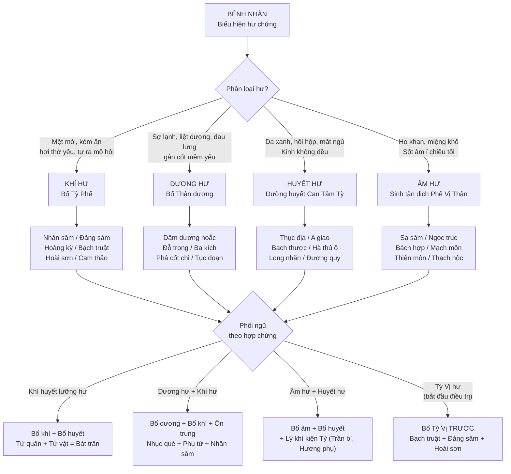
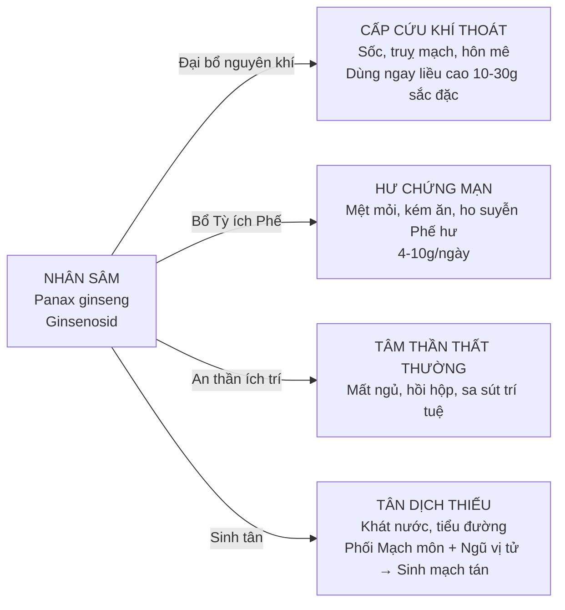
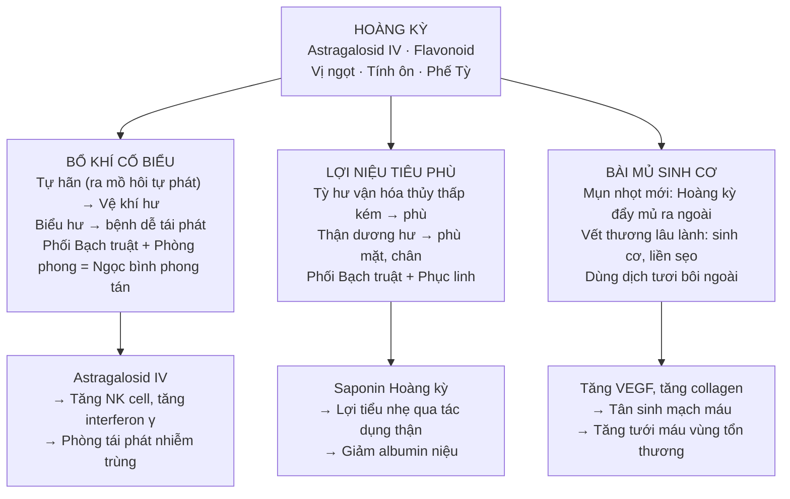
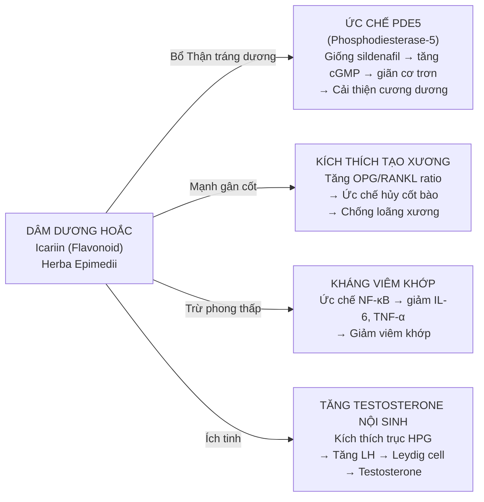
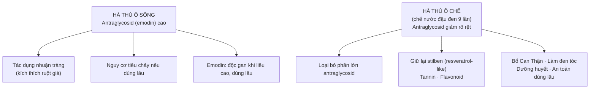
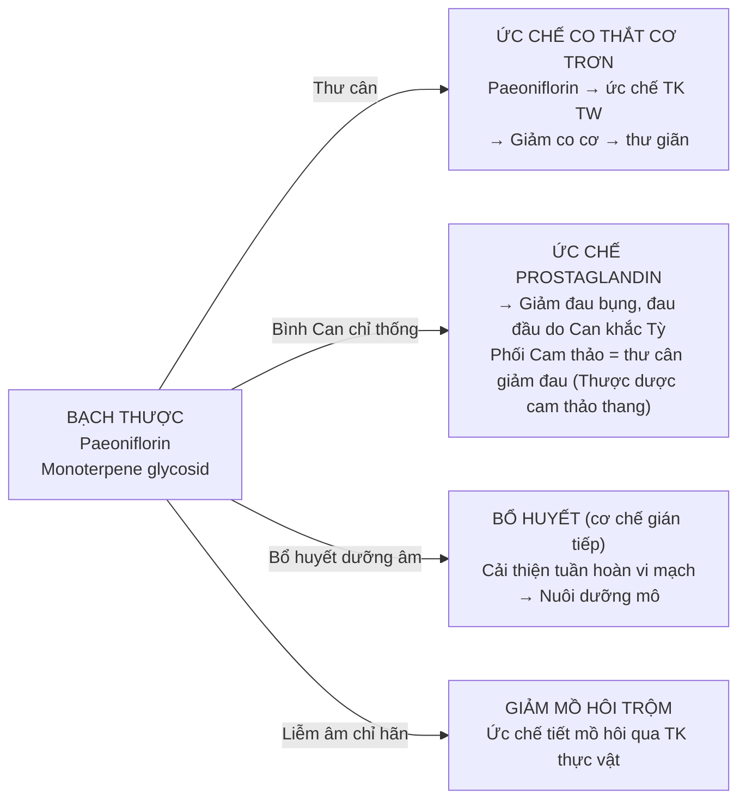

import CompareTable from '~/components/CompareTable.astro';
import ClinicalPearl from '~/components/ClinicalPearl.astro';
import RedFlags from '~/components/RedFlags.astro';
import MedicalNote from '~/components/MedicalNote.astro';

## 1. Luồng tư duy lâm sàng — Bài 16 từ đầu đến cuối

---

## 2. Phân tầng 4 nhóm bổ — chìa khóa chọn thuốc

Bài 16 không phải học thuộc 27 vị. Học logic 4 nhóm → biết chọn đúng nhóm → chọn vị trong nhóm.

<CompareTable
  headers={["", "Bổ khí", "Bổ dương", "Bổ huyết", "Bổ âm"]}
  rows={[
    ["Hư gốc", "Tỳ Phế khí hư", "Thận dương hư", "Can Tâm Tỳ huyết hư", "Phế Vị Can Thận âm hư"],
    ["Tính chung", "Ngọt, ôn hoặc bình", "Ngọt/cay, ôn → táo", "Ngọt/chua, màu đỏ, ôn hoặc bình", "Ngọt, hàn hoặc lương → nhầy"],
    ["Cơ chế YHCT", "Kiện Tỳ vận hóa, Phế khí sung túc", "Ôn Thận dương, dẫn hỏa về nguồn", "Sinh huyết, dưỡng huyết tại tạng", "Sinh tân dịch, bổ chân âm"],
    ["Cơ chế YHHĐ", "Immunomodulation, adaptogen, steroid-like", "Androgen/estrogen-like, PDE5i, osteogenesis", "Hematopoiesis, collagen, coagulation", "Polysaccharid dưỡng niêm mạc, kháng oxy hóa"],
    ["Phối bắt buộc", "Phối bổ huyết khi khí huyết lưỡng hư", "Phối bổ khí + ôn trung", "Phối bổ khí (khí huyết); phối an thần (Tâm phiền)", "Phối lý khí kiện Tỳ (Trần bì, Hương phụ)"],
    ["Cấm kỵ chung", "Ngoại tà còn tồn tại", "Dùng kéo dài, âm hư hỏa vượng", "Đầy bụng (bổ huyết nhầy)", "Tỳ Vị hư đơn độc"],
  ]}
/>

---

## 3. Nhân sâm — "Đại bổ nguyên khí": Khi nào dùng và tại sao?

**Cơ chế Ginsenosid:**
- Ginsenoside Rg1, Rb1 → kích hoạt trục HPA (Hypothalamic-Pituitary-Adrenal) → điều hòa cortisol → chống stress.
- Tăng hoạt động NK cell, tăng IgM, bổ thể → immunomodulation.
- Ức chế apoptosis tế bào thần kinh → bảo vệ não.
- Tác dụng **adaptogen**: không kích thích hay ức chế đơn thuần — điều hòa cân bằng hai chiều.

<ClinicalPearl>

**Nhân sâm vs Đảng sâm — quyết định lâm sàng:**

| Tình huống | Chọn | Lý do |
|---|---|---|
| Sốc, truỵ mạch, khí thoát cấp | Nhân sâm liều cao | "Đại bổ nguyên khí" — không thể thay thế |
| Hư chứng mạn thông thường | Đảng sâm | Rẻ hơn, an toàn hơn, liều 9-30g |
| Trẻ em, phụ nữ mang thai | Đảng sâm | Nhân sâm tác dụng mạnh, tránh dùng |
| Phối trong thang bài thuốc thông thường | Đảng sâm thay thế | Kinh tế, hiệu quả tương đương cho hư chứng thường |

Cả hai đều **kiêng Lê lô**.

</ClinicalPearl>

---

## 4. Hoàng kỳ — 3 công năng, 1 nguyên tắc

Hoàng kỳ không chỉ bổ khí — có 3 ứng dụng lâm sàng khác nhau:

**Nguyên tắc:** Hoàng kỳ chích mật → tăng tác dụng bổ Tỳ. Hoàng kỳ sống → bổ khí cố biểu, lợi niệu.

---

## 5. Dâm dương hoắc — Vị bổ dương có cơ chế rõ nhất

Dâm dương hoắc nổi bật nhất trong nhóm bổ dương vì **Icariin** có cơ chế YHHĐ được nghiên cứu sâu nhất:

<MedicalNote>

**Dâm dương hoắc và Đỗ trọng — cùng nhóm nhưng khác điểm mạnh:**

- **Dâm dương hoắc**: Bổ Thận dương mạnh nhất, nổi trội trong tráng dương, xương khớp.
- **Đỗ trọng**: Bổ Can Thận, an thai, **hạ huyết áp** (Pinoresinol → ức chế ACE, giãn mạch). Đặc biệt: **Đỗ trọng sao thì hạ áp tốt hơn dùng sống**.

Khi cần bổ Thận + hạ áp: dùng Đỗ trọng sao muối.
Khi cần bổ Thận + cải thiện sinh lý nam: dùng Dâm dương hoắc.

</MedicalNote>

---

## 6. Thục địa và Sinh địa — 1 dược liệu, 2 tính chất hoàn toàn khác

Đây là điểm thi kinh điển — không hiểu rõ sẽ nhầm lẫn kê đơn:

<CompareTable
  headers={["", "Sinh địa (chưa chế)", "Thục địa (đã chế cửu chưng cửu sái)"]}
  rows={[
    ["Màu sắc", "Vàng nâu hoặc đen nhạt", "Đen bóng"],
    ["Tính vị", "Ngọt, đắng — tính hàn", "Ngọt nhiều hơn — tính vi ôn"],
    ["Quy kinh", "Tâm, Can, Thận", "Tâm, Can, Thận"],
    ["Công năng", "Lương huyết (mát huyết), sinh tân dịch", "Bổ huyết, tư âm, ích tinh"],
    ["Dùng khi", "Huyết nhiệt: xuất huyết, sốt cao, phát ban nhiệt", "Huyết hư: thiếu máu, da xanh, kinh không đều"],
    ["Cơ chế đổi", "Cửu chưng (hấp 9 lần) → polysaccharid biến đổi → giảm tính hàn, tăng ngọt", "Iridoid rhemanin → tăng kích thích tạo máu"],
    ["Bài thuốc tiêu biểu", "Tê giác địa hoàng thang (lương huyết)", "Lục vị địa hoàng hoàn (bổ Thận âm)"],
  ]}
/>

**Nhớ nhanh:** "Sinh địa lương huyết — Thục địa bổ huyết."

---

## 7. Hà thủ ô đỏ — tại sao phải chế?

**Kết luận:** Sống = nhuận tràng (ngắn hạn). Chế = bổ dưỡng (dài hạn). Thi hay hỏi: "Chế Hà thủ ô để loại thành phần nào?" → **Antraglycosid**.

---

## 8. Bạch thược — "thuốc thư cân, bình Can" dựa trên Paeoniflorin

**Bạch thược vs Xích thược:** Cùng cây Thược dược (*Paeonia lactiflora*) nhưng khác bộ phận/chế biến:
- Bạch thược: rễ đã cạo vỏ, sao → bổ huyết, thư cân, bình Can.
- Xích thược: rễ còn vỏ, không sao → thanh nhiệt lương huyết, hoạt huyết tán ứ.

---

## 9. Nguyên tắc phối ngũ hợp chứng — bài học thực hành

Bài 16 quan trọng vì 80% bệnh nhân thực tế là **hợp chứng** — hư cả 2-3 loại cùng lúc:

<CompareTable
  headers={["Hợp chứng", "Phối ngũ điển hình", "Bài thuốc kinh điển"]}
  rows={[
    ["Khí huyết lưỡng hư", "Bổ khí (Nhân sâm, Bạch truật) + Bổ huyết (Thục địa, Đương quy, Bạch thược)", "Bát trân thang (Tứ quân + Tứ vật)"],
    ["Thận âm dương lưỡng hư", "Bổ âm (Thục địa, Sơn thù) + Bổ dương (Nhục quế, Phụ tử nhỏ lửa)", "Bát vị địa hoàng hoàn"],
    ["Tỳ Vị hư + Phế khí hư", "Kiện Tỳ (Đảng sâm, Bạch truật, Hoài sơn) + Ích Phế (Hoàng kỳ, Đảng sâm)", "Tứ quân tử thang + Hoàng kỳ"],
    ["Âm hư + Huyết hư", "Bổ âm (Sa sâm, Ngọc trúc) + Bổ huyết (Thục địa, A giao) + Lý khí kiện Tỳ (Trần bì)", "Dưỡng âm thang gia giảm"],
    ["Phế âm hư + Tâm thần bất an", "Bách hợp + Mạch môn + Long nhãn + Táo nhân", "Bách hợp tri mẫu thang + gia giảm"],
    ["Khí thoát (cấp cứu)", "Nhân sâm liều lớn độc vị", "Độc sâm thang"],
  ]}
/>

---

## 10. Câu hỏi kích thích tư duy

1. **Một bệnh nhân nam 60 tuổi đau lưng mỏi gối, liệt dương, sợ lạnh, táo bón.** Bạn chọn nhóm thuốc nào và vì sao? Tại sao không chọn Nhục thung dung đơn độc mà cần phối thêm?

2. **Tại sao thuốc bổ âm nhầy nhớt lại gây hại cho người Tỳ Vị hư?** Hãy giải thích theo học thuyết YHCT và thêm cơ chế YHHĐ (polysaccharid và khả năng tiêu hóa).

3. **Một bệnh nhân đang điều trị với Cam thảo liều cao kéo dài 3 tháng xuất hiện phù nề, tăng huyết áp.** Giải thích cơ chế phân tử. Vị thuốc nào cùng nhóm có thể thay thế an toàn hơn?
