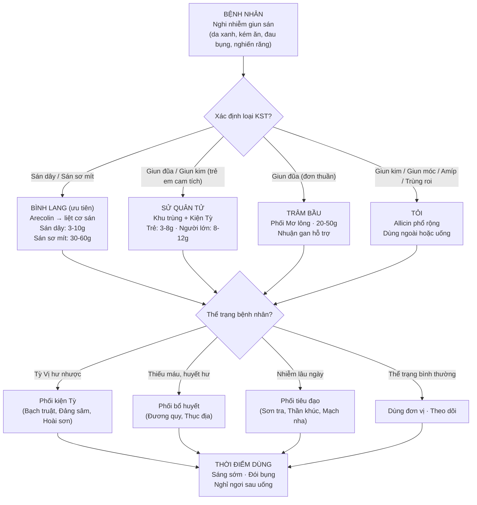
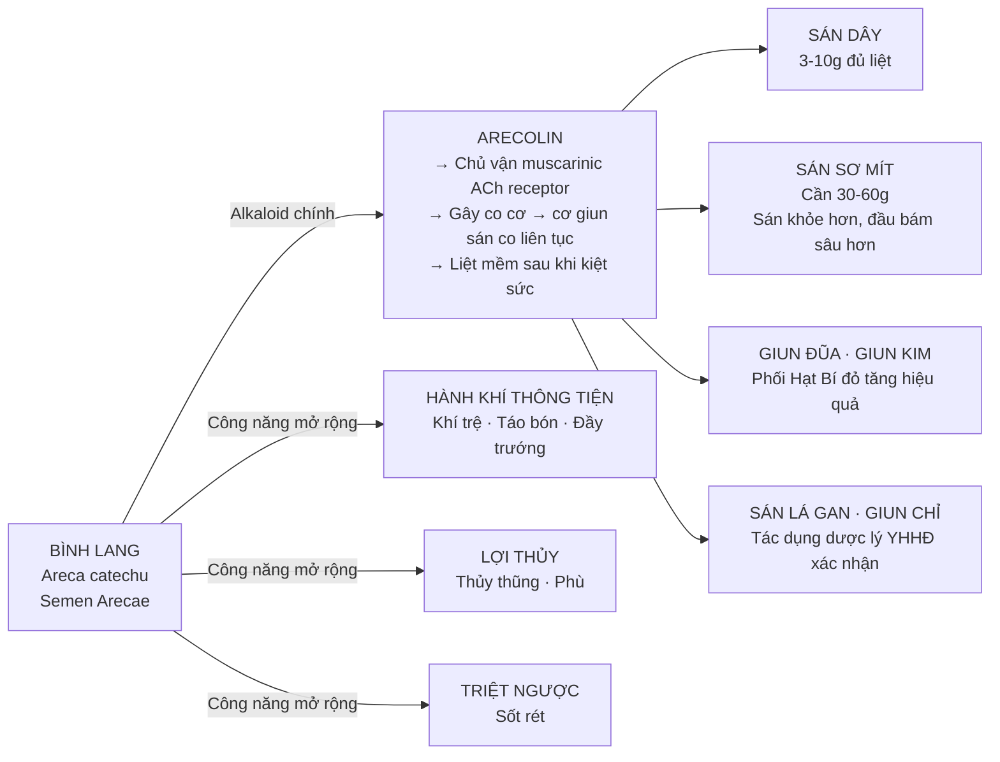
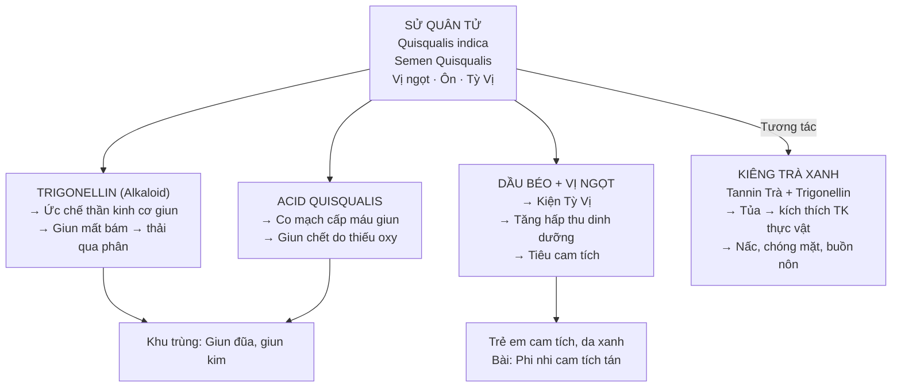
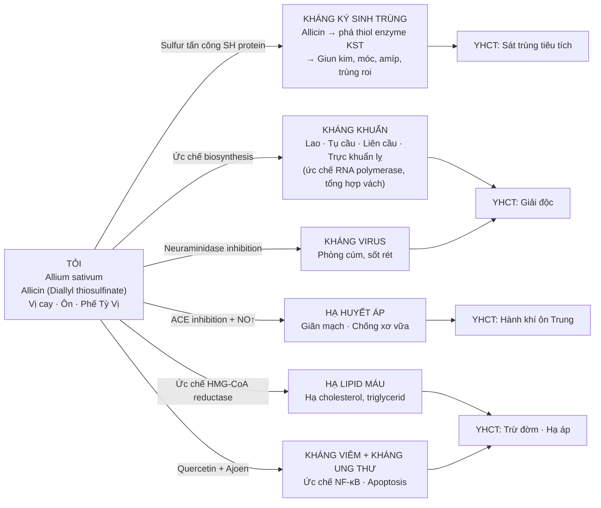
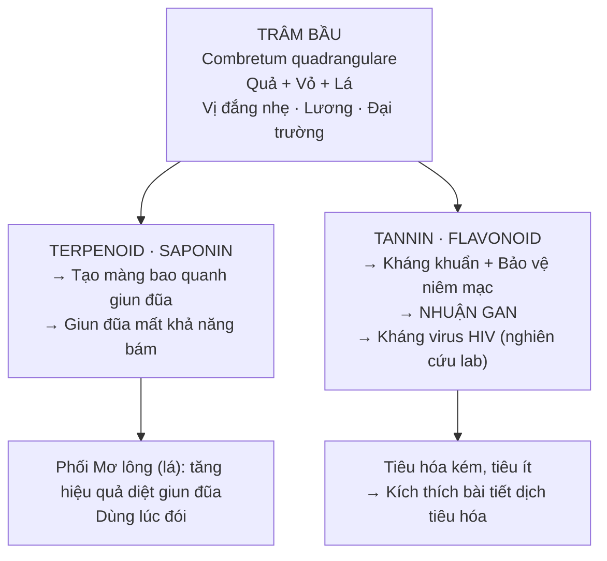

import CompareTable from '~/components/CompareTable.astro';
import ClinicalPearl from '~/components/ClinicalPearl.astro';
import RedFlags from '~/components/RedFlags.astro';
import MedicalNote from '~/components/MedicalNote.astro';

## 1. Luồng tư duy lâm sàng — Bài 17 từ đầu đến cuối

---

## 2. Bình lang — Arecolin và cơ chế liệt cơ sán

Bình lang là vị thuốc trừ giun **mạnh nhất, phổ rộng nhất** trong bài, đặc biệt với sán sơ mít — loại ký sinh trùng khó diệt nhất trong nhóm.

<ClinicalPearl>

**Tại sao sán sơ mít cần liều 30–60 g trong khi sán dây chỉ cần 3–10 g?**

Sán sơ mít (*Taenia solium*) có đầu sán (scolex) bám rất sâu vào niêm mạc ruột và sán có sức đề kháng cao hơn với arecolin. Liều thấp chỉ làm liệt tạm thời thân sán nhưng không đủ để scolex nhả bám → sán tái phát. Liều 30–60 g duy trì nồng độ arecolin đủ cao để làm liệt toàn bộ kể cả scolex.

**Thực hành:** Thường phối Bình lang với Hạt Bí đỏ (cucurbitin) — Hạt Bí làm liệt đốt sán, Bình lang đẩy sán ra ngoài nhờ tăng nhu động ruột.

</ClinicalPearl>

---

## 3. Sử quân tử — Vị thuốc duy nhất khu trùng + kiện Tỳ

Sử quân tử có vị trí đặc biệt vì **đồng thời** giải quyết cả 2 vấn đề thường gặp trong nhiễm giun trẻ em: giun sán và suy dinh dưỡng/cam tích.

<MedicalNote>

**Phi nhi cam tích tán** — bài thuốc kinh điển cho trẻ em nhiễm giun + cam tích:
Sử quân tử (khu trùng + kiện Tỳ) + Thần khúc, Sơn tra, Mạch nha (tiêu đạo) + Bạch truật, Phục linh (kiện Tỳ). Logic: diệt giun trước, sau đó bổ Tỳ để hồi phục.

</MedicalNote>

---

## 4. Tỏi — Allicin và cơ chế đa đích

Tỏi là vị thuốc **đa năng nhất** trong bài nhờ allicin — hợp chất sulfur phản ứng mạnh với nhiều loại protein sinh học:

<ClinicalPearl>

**Tỏi dùng ngoài — hiệu quả nhưng dễ bỏ qua:**

Trị giun kim: Ngâm 100 g Tỏi/1 L nước × 24h → rửa hậu môn liên tục 7 ngày. Cơ chế: allicin phân tán trong nước đủ nồng độ tiếp xúc trực tiếp với giun kim ở hậu môn, không cần hấp thu toàn thân → ít tác dụng phụ.

Trị viêm nhiễm da: Giã nát + thêm nước → bôi. Tránh để quá 20 phút tránh phỏng da (allicin kích thích tế bào da khi nồng độ cao kéo dài).

</ClinicalPearl>

---

## 5. Trâm bầu — Vị thuốc địa phương, phổ hẹp nhưng có giá trị hỗ trợ

**Hạn chế:** Chỉ tác dụng trên giun đũa, không diệt sán hay giun kim hiệu quả. Liều cao (20–50 g) so với các vị khác — cần dùng nhiều nguyên liệu hơn.

---

## 6. So sánh 4 vị — quyết định chọn thuốc

<CompareTable
  headers={["Tiêu chí", "Bình lang", "Sử quân tử", "Trâm bầu", "Tỏi"]}
  rows={[
    ["Hoạt chất chính", "Arecolin (nicotinic ACh)", "Trigonellin + Acid quisqualis", "Terpenoid + Tannin", "Allicin (thiol-reactive sulfur)"],
    ["Cơ chế YHHĐ", "Co cơ → liệt mềm KST", "Ức chế TK cơ + co mạch KST", "Bao màng + kháng khuẩn", "Phá thiol enzyme KST đa loại"],
    ["Phổ KST", "Rộng nhất (sán, giun, KST máu)", "Hẹp (giun đũa, giun kim)", "Hẹp (giun đũa)", "Rộng (giun kim, móc, amíp, trùng roi)"],
    ["Ưu tiên dùng khi", "Sán dây, sán sơ mít", "Trẻ em cam tích, Tỳ hư", "Giun đũa + tiêu hóa kém", "Nhiều loại giun + cần đa tác dụng"],
    ["Ưu điểm đặc biệt", "Mạnh với sán, hành khí thêm", "Duy nhất kiện Tỳ tiêu cam", "Bảo vệ gan, tận dụng cây địa phương", "Không cần đơn thuốc, dễ dùng, rẻ"],
    ["Nhược điểm", "Liều sán sơ mít cao (30-60g)", "Phổ hẹp, kiêng Trà xanh", "Phổ hẹp, liều cao (20-50g)", "Mùi khó chịu, dùng lâu tổn Can"],
    ["Tính vị YHCT", "Cay đắng · Ôn", "Ngọt · Ôn", "Đắng nhẹ · Lương", "Cay · Ôn"],
  ]}
/>

---

## 7. Nguyên tắc phối ngũ thực hành

<CompareTable
  headers={["Tình huống lâm sàng", "Phối ngũ", "Lý do"]}
  rows={[
    ["Nhiễm sán sơ mít", "Bình lang 30-60g + Hạt Bí đỏ", "Cucurbitin (Bí đỏ) liệt đốt sán, Bình lang đẩy ra"],
    ["Trẻ cam tích + giun đũa", "Sử quân tử + Bạch truật + Sơn tra", "Khu trùng đồng thời kiện Tỳ tiêu tích"],
    ["Nhiễm giun lâu ngày + kém ăn", "Bình lang/Sử quân tử + Thần khúc, Mạch nha", "Tiêu đạo giải ứ thực sau nhiều ngày nhiễm"],
    ["Nhiễm giun + thiếu máu", "Thuốc trừ giun + Đương quy, Thục địa", "Giun tiêu thụ sắt + dinh dưỡng → huyết hư"],
    ["Nhiễm giun + Tỳ Vị hư", "Thuốc trừ giun + Đảng sâm, Hoài sơn", "Cần nền Tỳ Vị khỏe để thải KST hiệu quả"],
    ["Giun kim tái phát", "Tỏi ngoài (rửa hậu môn) + uống Sử quân tử", "Phối ngoài-trong kép, tránh tái phát"],
  ]}
/>

---

## 8. Câu hỏi kích thích tư duy

1. **Tại sao Bình lang cần liều 30–60 g cho sán sơ mít nhưng chỉ 3–10 g cho sán dây?** Hãy giải thích theo cơ chế dược lý của arecolin và đặc điểm sinh học của 2 loại sán. Nếu bệnh nhân hư nhược, bạn xử lý như thế nào?

2. **Một trẻ 5 tuổi bị cam tích, da xanh, thỉnh thoảng nôn ra giun.** Phân tích tại sao Sử quân tử là lựa chọn hợp lý hơn Bình lang trong trường hợp này. Bài phối ngũ cụ thể là gì?

3. **Allicin là hợp chất thiol-reactive — điều này có nghĩa là nó tấn công nhóm SH trên protein.** Giải thích tại sao đặc tính này vừa là lợi thế (phổ kháng rộng) vừa là nguy cơ (tổn thương Can Mật khi dùng lâu)?
