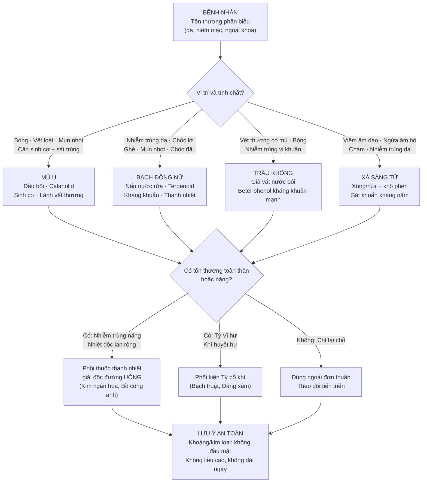
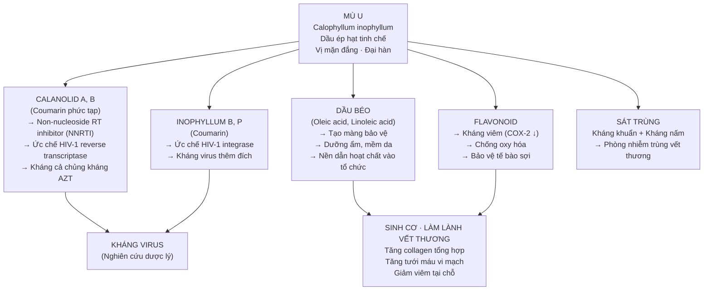
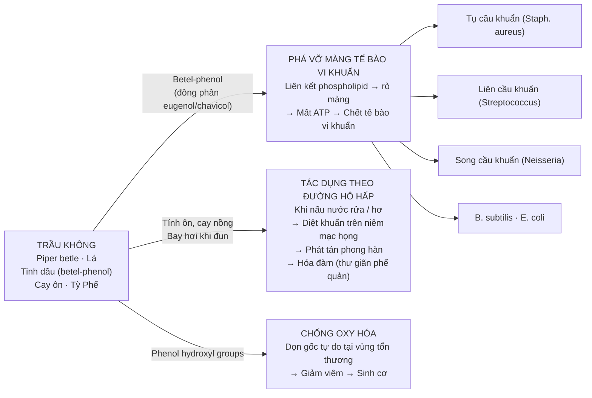
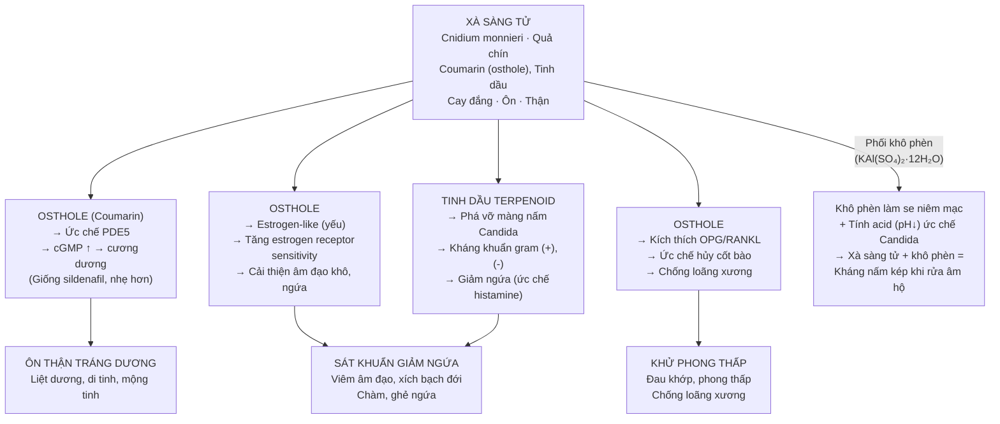
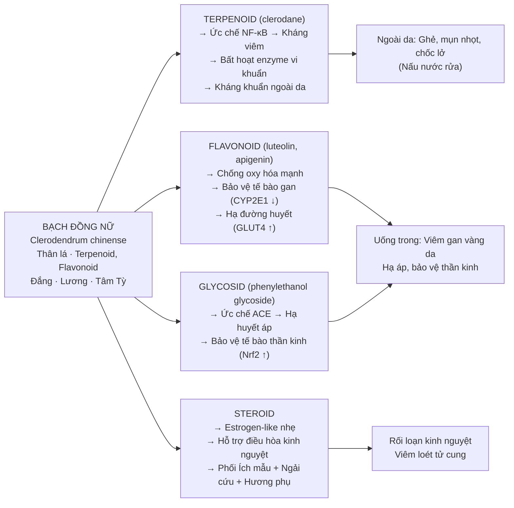

import CompareTable from '~/components/CompareTable.astro';
import ClinicalPearl from '~/components/ClinicalPearl.astro';
import RedFlags from '~/components/RedFlags.astro';
import MedicalNote from '~/components/MedicalNote.astro';

## 1. Luồng tư duy lâm sàng — Bài 18 từ đầu đến cuối

---

## 2. Mù u — Calanolid và cơ chế sinh cơ lành vết thương

Mù u có vị trí đặc biệt trong nhóm: **dùng DẦU từ HẠT** (không phải lá/thân), và chứa coumarin phức tạp nhất với hoạt tính kháng HIV được nghiên cứu kỹ.

<MedicalNote>

**Calanolid A — từ cây Mù u đến thuốc HIV:**

Calanolid A được phát hiện từ cây Mù u (*Calophyllum inophyllum*) vào thập niên 1990. Nó là NNRTI — ức chế enzyme reverse transcriptase của HIV-1 tại vị trí allosteric (không phải vị trí catalytic), nên kháng cả các chủng đã kháng AZT (nucleoside analog). Đây là ví dụ điển hình của **dược liệu cổ truyền → phân lập hoạt chất → thuốc hiện đại**. Trong YHCT, Mù u "tính đại hàn" phản ánh hoạt tính kháng virus mạnh, đặc biệt với nhiễm trùng "nhiệt độc" nặng.

</MedicalNote>

---

## 3. Trầu không — Betel-phenol và cơ chế kháng khuẩn phổ rộng

Trầu không là vị có **hoạt tính kháng khuẩn mạnh nhất trong bài**, nhờ betel-phenol — một họ hợp chất phenol bay hơi:

<ClinicalPearl>

**Trầu không + vôi + cau (trầu cau):** Hỗn hợp cổ truyền này không chỉ có ý nghĩa văn hóa:
- Vôi (Ca(OH)₂): kiềm hóa → tăng giải phóng betel-phenol từ lá → nồng độ kháng khuẩn cao hơn.
- Hạt Cau: arecolin kích thích nước bọt → rửa trôi vi khuẩn miệng.
- Tác dụng phụ: nhai lâu ngày → tăng nguy cơ ung thư miệng (arecolin) — không khuyến cáo dùng dài ngày.

**Ứng dụng dùng ngoài thực tế:** Lá Trầu không giã nát, vắt nước → bôi bỏng nhẹ. Nước sắc Trầu không → rửa vết thương nhiễm trùng, trĩ, viêm hạch. Tác dụng nhanh hơn nhiều kháng sinh tổng hợp yếu thông thường trong nhiễm khuẩn nông.

</ClinicalPearl>

---

## 4. Xà sàng tử — Coumarin, ôn Thận và "hai mặt" của một vị thuốc

Xà sàng tử là ví dụ điển hình về vị thuốc YHCT có **hai nhóm chứng hoàn toàn khác nhau**: da liễu phụ khoa và bổ Thận nam giới.

---

## 5. Bạch đồng nữ — Terpenoid và cơ chế đa hướng

---

## 6. So sánh 4 vị — quyết định chọn thuốc

<CompareTable
  headers={["Tiêu chí", "Mù u", "Trầu không", "Xà sàng tử", "Bạch đồng nữ"]}
  rows={[
    ["Cơ chế kháng khuẩn", "Calanolid kháng virus; dầu béo chống nấm", "Betel-phenol phá màng vi khuẩn", "Osthole + tinh dầu phá màng nấm/khuẩn", "Terpenoid ức chế NF-κB"],
    ["Đặc trưng độc đáo", "Kháng HIV (calanolid A, NNRTI)", "Kháng khuẩn phổ rộng nhất (gram+/-)", "Duy nhất ôn Thận tráng dương trong nhóm", "Dùng trong + ngoài; bảo vệ gan thần kinh"],
    ["Dùng ngoài dạng gì", "Dầu bôi trực tiếp", "Nước sắc rửa / nước vắt lá tươi bôi", "Nước sắc xông/rửa (+ khô phèn)", "Nước sắc rửa"],
    ["Có thể uống không?", "Không", "Có (8-16g sắc)", "Có (4-12g sắc)", "Có (10-12g sắc)"],
    ["Chứng dùng ngoài tốt nhất", "Bỏng, vết loét, sinh cơ", "Vết thương nhiễm trùng vi khuẩn", "Viêm âm đạo/nấm, chàm, ghẻ ngứa", "Ghẻ, mụn nhọt, chốc đầu"],
    ["Tính vị YHCT", "Mặn đắng · Đại hàn", "Cay nồng · Ôn", "Cay đắng · Ôn", "Đắng · Lương"],
    ["Thận trọng", "Không dùng dầu thô; không uống", "Nhai lâu ngày tăng nguy cơ ung thư miệng", "Không dùng kéo dài khi Âm hư nội nhiệt", "Không dùng đơn độc khi Dương hư"],
  ]}
/>

---

## 7. Phối ngũ "trong-ngoài kép" — chiến lược điều trị toàn diện

Nguyên tắc bài 18: **Dùng ngoài là chủ, phối trong là bổ trợ** khi cần.

<CompareTable
  headers={["Tình huống", "Dùng ngoài", "Phối uống thêm", "Mục đích phối"]}
  rows={[
    ["Viêm âm đạo nhiễm nấm + vi khuẩn", "Xà sàng tử + Khô phèn xông rửa", "Xà sàng tử 8g + Long đởm thảo sắc uống", "Kháng nấm tại chỗ + Thanh Can thấp nhiệt"],
    ["Nhiễm trùng da nặng, nhiệt độc", "Bạch đồng nữ nấu nước rửa", "Kim ngân hoa + Bồ công anh + Liên kiều uống", "Thanh nhiệt giải độc toàn thân"],
    ["Bỏng + nhiễm trùng thứ phát", "Mù u dầu bôi + Trầu không nước rửa", "Hoàng liên + Ngân hoa uống", "Sinh cơ + Kháng khuẩn + Thanh nhiệt"],
    ["Rối loạn kinh nguyệt + viêm tử cung", "Bạch đồng nữ nấu nước rửa âm đạo", "Bạch đồng nữ + Ích mẫu + Ngải cứu + Hương phụ uống", "Điều kinh + Thanh nhiệt từ trong"],
    ["Đau khớp + viêm da kết hợp", "Xà sàng tử + Trầu không đắp ngoài", "Xà sàng tử + Độc hoạt + Tục đoạn uống", "Khu phong thấp từ ngoài + Bổ Thận trong"],
  ]}
/>

---

## 8. Câu hỏi kích thích tư duy

1. **Mù u "tính đại hàn" trong YHCT — tại sao một loại dầu béo lại có tính hàn mạnh?** Hãy kết nối với cơ chế calanolid kháng virus (nhiệt độc) và tác dụng kháng viêm mạnh. Nếu bệnh nhân có vết bỏng nhưng thể hàn (sợ lạnh, tay chân lạnh), bạn có còn dùng Mù u không và tại sao?

2. **Xà sàng tử dùng một vị có thể trị cả liệt dương lẫn viêm âm đạo — đây là mâu thuẫn hay nhất quán?** Giải thích bằng cơ chế osthole (PDE5i + estrogen-like) và tại sao YHCT gọi cả hai đều là "Thận hư" nhưng biểu hiện trái ngược nhau.

3. **Betel-phenol của Trầu không kháng khuẩn rất mạnh nhưng không được dùng để điều trị nhiễm khuẩn toàn thân.** Giải thích giới hạn dược động học của hợp chất tinh dầu bay hơi so với kháng sinh hấp thu toàn thân. Trong trường hợp nào Trầu không đường uống có ý nghĩa lâm sàng?
