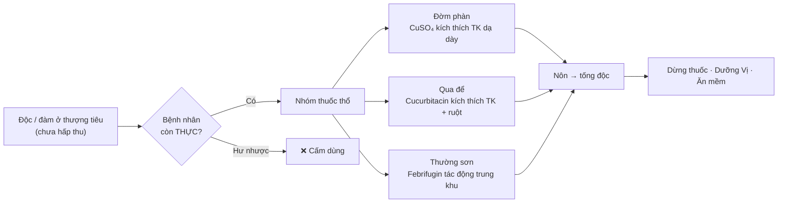
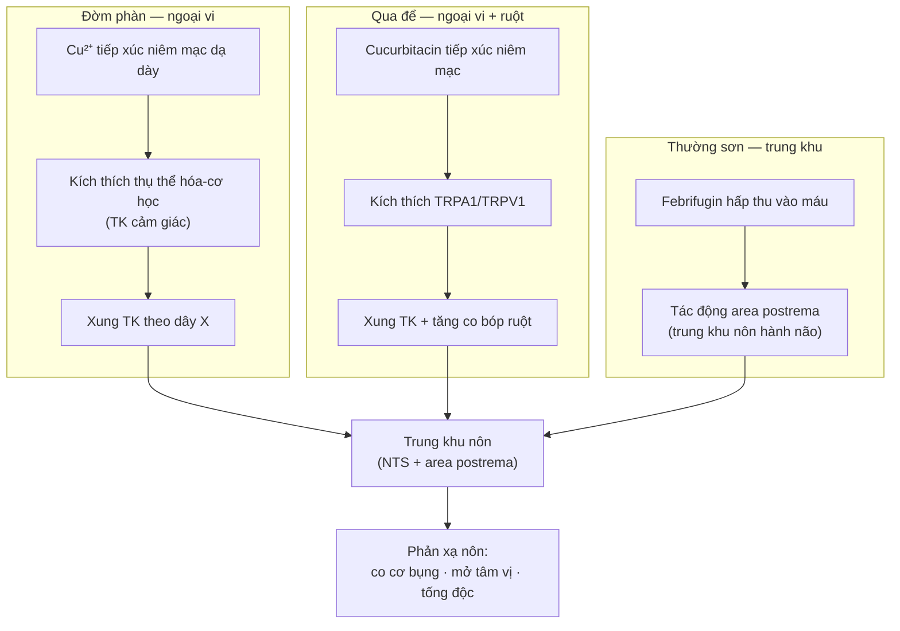
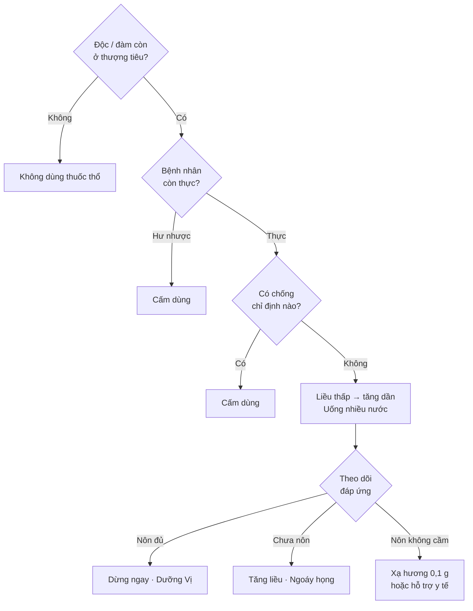

import MedicalNote from '~/components/MedicalNote.astro';
import KeyPoints from '~/components/KeyPoints.astro';
import RedFlags from '~/components/RedFlags.astro';
import CompareTable from '~/components/CompareTable.astro';
import ClinicalPearl from '~/components/ClinicalPearl.astro';

## Mục tiêu bài giảng

Sau bài này người học **hiểu được** (không chỉ thuộc):

- [ ] Logic chỉ định nhóm thuốc thổ: "tà còn thượng tiêu + bệnh nhân thực"
- [ ] Điểm khác biệt cơ chế giữa Đờm phàn (TK dạ dày), Qua để (TK cảm giác + ruột), Thường sơn (trung khu)
- [ ] Tại sao Thường sơn vừa gây nôn vừa triệt ngược — và cách kiểm soát tác dụng phụ
- [ ] Khi nào dừng thuốc, khi nào là tai biến, xử trí thế nào

<MedicalNote title="Góc nhìn giảng viên">
  **Điều GS 30 năm sẽ nói đầu bài:** "Thuốc thổ là con dao hai lưỡi — dùng đúng thì tống độc ra ngoài nhanh nhất; dùng sai thì làm bệnh nặng thêm và tổn thương chính khí. Hiểu khi nào *không* dùng quan trọng hơn biết liều dùng."
</MedicalNote>

---

## Bức tranh tổng thể

---

## 1. Đặc điểm nhóm thuốc thổ

**Định nghĩa:** Vị thuốc có tác dụng thúc đẩy nôn để tống chất độc, thức ăn tích trệ, đàm dãi qua đường tiêu hóa ra ngoài.

**Tính chất chung:** vị chua/đắng, tính mát-lạnh, **phần lớn có độc tính**. Hiện nay ít dùng trên lâm sàng do gây khó chịu mạnh.

| Chỉ định | Chống chỉ định tuyệt đối |
|---|---|
| Ngộ độc thức ăn chưa hấp thu | Cơ thể hư nhược |
| Thức ăn tích trệ ở Vị chưa xuống Tiểu trường | Người già, trẻ em |
| Đàm nhiệt ứ trệ trong ngực (khó thở) | Phụ nữ có thai |
| Đàm trọc bít thanh khiếu (điên cuồng) | Các chứng xuất huyết |
| Hoàng đàn thấp nhiệt (Qua để hít mũi) | Đau đầu, hồi hộp, đánh trống ngực |

---

## 2. Profile từng vị thuốc

### 2.1. Đờm phàn

| Trường | Thông tin |
|---|---|
| **Tên khoa học** | *Chalcanthum* (khoáng vật — không thuộc thực vật) |
| **Tên dược liệu** | *Chalcanthum* |
| **Bộ phận dùng** | Khoáng vật thiên nhiên chứa đồng sulphat (CuSO₄·5H₂O) |
| **Thành phần chính** | Cu²⁺ (đồng sulphat ngậm nước) |
| **Tính vị** | Vị cay, chua, chát |
| **Quy kinh** | Kinh Can, Kinh Đởm |
| **Tính** | Hàn |
| **Độc tính** | **Có độc** |
| **Công năng** | Gây nôn · tiêu đờm dãi · giải độc thu thấp · tiêu trừ mù |
| **Liều uống** | 0,3–0,6 g/lần |
| **Dùng ngoài** | Lượng vừa đủ (bột rắc, hòa nước rửa) |
| **Kiêng kỵ / Cấm kỵ** | Người hư nhược — cấm dùng |

**Chủ trị:**

- *Gây nôn, tiêu đờm:* Phong đàm ủng thịnh, ngộ độc thức ăn, điên cuồng do đàm — tán nhỏ uống.
- *Giải độc thu thấp:* Sưng đau họng tắc trệ — phối Bạch cương tàm bôi ngoài (bài **Nhị thánh tán**); ngộ độc thức ăn — hòa nước uống gây nôn.
- *Tiêu trừ mù (dùng ngoài):* Loét giác mạc — hòa nước rửa mắt; loét miệng, viêm mù quanh răng — phối Hồ hoàng liên, Nhị trà bôi tổn thương (bài **Đờm phàn tán**).

**Tác dụng dược lý (YHHĐ):** Cu²⁺ kích thích thụ thể hóa học thành dạ dày → xung TK theo dây X → trung khu nôn (area postrema). Ức chế *P. aeruginosa*, *Salmonella*, *Shigella* qua phá vỡ màng tế bào vi khuẩn.

---

### 2.2. Qua để

| Trường | Thông tin |
|---|---|
| **Tên khoa học** | *Cucumis melo* L. (họ Bí — Cucurbitaceae) |
| **Tên dược liệu** | *Pedicellus Melo* |
| **Bộ phận dùng** | Để (cuống) quả dưa lê/dưa vàng, phơi hay sấy khô |
| **Thành phần chính** | Glycosid cucurbitacin B, D, E; tannin; flavonoid; alkaloid; saponin |
| **Tính vị** | Vị đắng |
| **Quy kinh** | Kinh Vị |
| **Tính** | Lạnh (hàn) |
| **Độc tính** | **Có độc** |
| **Công năng** | Thông thổ đàm thấp · khứ thấp thoái hoàng |
| **Liều sắc uống** | 2,5–5 g |
| **Liều hoàn tán** | 0,3–1 g |
| **Dùng ngoài / hít** | Bột hít qua mũi (khứ thấp hoàng đàn) |
| **Kiêng kỵ / Cấm kỵ** | Hư nhược, mất máu, không có thực tà ở trên. Nôn không cầm → Xạ hương 0,1 g pha nước uống |

**Chủ trị:**

- *Thông thổ đàm thấp:* Đàm nhiệt ủng Phế, tích trệ thức ăn gây đầy trướng đau bụng — dùng đơn độc hoặc phối Xích tiểu đậu, Đậu xị (bài **Qua để tán**); ngộ độc Thạch tín (asen) — phối Cam thảo, Huyền sâm, Địa du (bài **Cầu từ đan**).
- *Khứ thấp thoái hoàng:* Thấp nhiệt hoàng đàn — tán nhỏ hít mũi (bài **Qua đình tán**) hoặc sắc uống; đau đầu chóng mặt do thấp nhiệt — phối Xuyên khung, Thương nhĩ tử, Bạc hà để hít.

**Tác dụng dược lý (YHHĐ):** Cucurbitacin kích thích thụ thể TRPA1/TRPV1 niêm mạc đường tiêu hóa → phản xạ nôn. Đồng thời tăng co bóp cơ trơn ruột → nhuận tràng song song với gây nôn.

---

### 2.3. Thường sơn

| Trường | Thông tin |
|---|---|
| **Tên khoa học** | *Dichroa febrifuga* Lour. (họ Thường sơn — Saxifragaceae / Hydrangeaceae) |
| **Tên dược liệu** | *Radix Dichroae febrifugae* |
| **Bộ phận dùng** | Rễ, phơi hay sấy khô |
| **Thành phần chính** | Alkaloid: febrifugin, isofebrifugin; phenol; saponin; terpenoid; flavonoid; tannin |
| **Tính vị** | Vị đắng |
| **Quy kinh** | Kinh Phế, Kinh Tâm, Kinh Can |
| **Tính** | Hàn |
| **Độc tính** | **Có độc** |
| **Công năng** | Thông thổ đàm diên · triệt ngược |
| **Liều dùng** | 6–12 g/ngày, dạng sắc |
| **Dùng ngoài** | Không |
| **Kiêng kỵ / Cấm kỵ** | Hư nhược, phụ nữ có thai. Phải phối vị ôn Tỳ Vị khi dùng điều trị sốt rét để giảm nôn |

**Chủ trị:**

- *Thông thổ đàm diên:* Đàm ẩm tích tụ trong ngực — phối Cam thảo sắc uống.
- *Triệt ngược:* Sốt rét cách nhật hoặc cách 3 ngày — phối Hậu phác, Bình lang, Thảo quả (bài **Tệt ngược thất bảo ẩm**).

**Tác dụng dược lý (YHHĐ):**

| Tác dụng | Cơ chế |
|---|---|
| Gây nôn | Febrifugin kích thích trung khu nôn (area postrema) |
| Diệt sốt rét | Ức chế prolyl-tRNA synthetase của *Plasmodium* — hoạt lực cao hơn quinine ~100 lần |
| Hạ huyết áp | Giãn mạch ngoại vi (cơ chế chưa rõ hoàn toàn) |
| Chống oxy hóa | Phenol, flavonoid dọn gốc tự do |

---

## 3. So sánh 3 vị trong nhóm

<CompareTable
  headers={["Tiêu chí", "Đờm phàn", "Qua để", "Thường sơn"]}
  rows={[
    ["Bản chất", "Khoáng vật (CuSO₄)", "Thực vật (cuống dưa)", "Thực vật (rễ Dichroa)"],
    ["Tính vị", "Cay-chua-chát, hàn", "Đắng, lạnh", "Đắng, hàn"],
    ["Quy kinh", "Can, Đởm", "Vị", "Phế, Tâm, Can"],
    ["Con đường gây nôn", "TK ngoại vi dạ dày → trung khu", "TK cảm giác + co bóp ruột", "Trực tiếp trung khu nôn"],
    ["Công năng đặc trưng thêm", "Kháng khuẩn, dùng ngoài", "Trừ hoàng đàn (hít mũi)", "Triệt ngược sốt rét"],
    ["Liều gây nôn (uống)", "0,3–0,6 g", "0,3–1 g (hoàn tán)", "6–12 g (sắc)"],
    ["Dùng ngoài", "Có (mắt, miệng)", "Có (hít mũi)", "Không"],
    ["Độc tính nổi bật", "Tích lũy Cu²⁺ → gan, thận", "Kích ứng niêm mạc", "Nôn dữ, độc alkaloid"],
    ["Cấm kỵ riêng", "Hư nhược", "Hư nhược + mất máu", "Hư nhược + thai"],
  ]}
/>

<ClinicalPearl>

**Khi nào chọn Thường sơn thay vì Đờm phàn?** Khi bệnh nhân có đàm ẩm kết hợp sốt rét (hoặc nghi sốt rét) — Thường sơn xử lý cả 2 mục tiêu. Đờm phàn chọn khi cần tác dụng nhanh và mạnh hơn ở ngộ độc thức ăn cấp tính (bệnh nhân còn thực).

</ClinicalPearl>

---

## 4. Cơ chế tác dụng tổng hợp

---

## 5. Điểm quyết định lâm sàng

| Tình huống | Xử trí |
|---|---|
| Chưa nôn sau liều thấp | Tăng liều từng bước; uống thêm nước ấm; ngoáy họng |
| Nôn đủ, độc đã ra | Dừng thuốc ngay; nghỉ ngơi; dưỡng Vị khí |
| Nôn không cầm (Qua để) | Xạ hương 0,1 g pha nước uống |
| Nôn không cầm (chung) | Hỗ trợ y tế; không dùng thêm thuốc thổ |
| Sau nôn xong | Không ăn uống ngay; khi Vị phục hồi mới ăn cháo mềm |

<RedFlags title="Sai lầm thường gặp">

- **Dùng khi bệnh nhân hư yếu** → nôn không ra hoặc nôn không cầm, tổn thương chính khí thêm.
- **Dùng liều cao ngay lần đầu** (nhất là Đờm phàn) → mất nước điện giải nặng, ngộ độc Cu²⁺.
- **Tiếp tục dùng sau khi nôn đủ** → kéo dài tổn thương Vị, tiêu hóa không hồi phục.
- **Dùng Thường sơn đơn độc điều trị sốt rét** → bệnh nhân nôn quá mức, không uống được đủ liều.
- **Nhầm "dưa chuột" với Qua để** → Qua để là cuống/để quả *dưa lê* (*Cucumis melo*), không phải dưa chuột (*Cucumis sativus*).

</RedFlags>

---

## 6. Câu hỏi tư duy cuối bài

1. **Bệnh nhân ngộ độc thức ăn đã 6 giờ, đang suy nhược.** Có dùng thuốc thổ không? Nếu không, dùng phép gì thay thế và vì sao?

2. **Qua để và Đờm phàn đều gây nôn qua con đường ngoại vi, nhưng cơ chế trung gian khác nhau.** Sự khác biệt đó ảnh hưởng thế nào đến lựa chọn vị thuốc trong tình huống lâm sàng cụ thể?

3. **Thường sơn vừa gây nôn vừa triệt ngược.** Khi phối trong bài *Tệt ngược thất bảo ẩm*, vai trò của Hậu phác, Bình lang, Thảo quả là gì — và điều này phản ánh nguyên tắc phối ngũ nào của YHCT?
