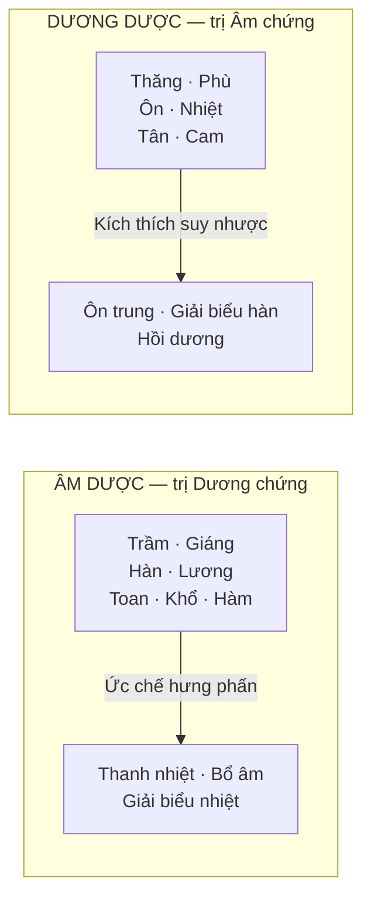

import KeyPoints from '~/components/KeyPoints.astro';
import CompareTable from '~/components/CompareTable.astro';
import ClinicalPearl from '~/components/ClinicalPearl.astro';
import RedFlags from '~/components/RedFlags.astro';
import SelfCheck from '~/components/SelfCheck.astro';
import SourceNote from '~/components/SourceNote.astro';

<KeyPoints title="5 ý lõi — đọc trước">

- **Thuốc cổ truyền** = dược liệu chế biến/bào chế/phối ngũ theo YHCT hoặc kinh nghiệm dân gian. 3 nguồn gốc: thực vật (phổ biến), động vật (hạn chế), khoáng vật (ít dùng).
- **Âm dược** trị Dương chứng (hàn-lương, trầm-giáng). **Dương dược** trị Âm chứng (ôn-nhiệt, thăng-phù).
- **Ngũ hành → Ngũ vị → Ngũ tạng:** Tân→Kim→Phế · Cam→Thổ→Tỳ · Khổ→Hỏa→Tâm · Toan→Mộc→Can · Hàm→Thủy→Thận.
- **Bát pháp** = 8 phương pháp trị bệnh: Hãn · Thổ · Hạ · Hòa · Thanh · Ôn · Tiêu · Bổ — mỗi pháp tương ứng một nhóm thuốc.
- Danh mục YHCT Việt Nam hiện hành: **380 vị**, chia **29 nhóm** theo tác dụng.

</KeyPoints>

---

## 1. Khái niệm và nguồn gốc

| Nguồn gốc | Đặc điểm | Ví dụ |
|---|---|---|
| **Thực vật** (thảo dược) | Phổ biến nhất, đa dạng | Nhân sâm, Cam thảo, Đương quy |
| **Động vật** | Dùng hạn chế — bảo vệ tự nhiên | Thuyền thoái, Địa long, Bạch cương tằm |
| **Khoáng vật** | Ít dùng — nhiều tạp chất và độc tính | Thạch cao, Phèn chua, Chu sa |

---

## 2. Phân loại theo Âm dương

**4 tổ hợp Âm-Dương:**

| Loại | Tính vị | Ví dụ điển hình |
|---|---|---|
| Âm trong Âm | Khổ, hàm, hàn | Hoàng liên, Hoàng bá, Bồ công anh |
| Âm trong Dương | Khổ, hàm, ôn | Câu tích, Tắc kè, Cốt toái bổ |
| Dương trong Dương | Tân, cam, ôn/nhiệt | Quế chi, Bạch chi, Phụ tử |
| Dương trong Âm | Tân, cam, hàn/lương | Bạc hà, Cúc hoa, Cát căn |

---

## 3. Phân loại theo Ngũ hành

| Hành | Màu | Vị | Tạng chính | Phủ | Ví dụ thuốc |
|---|---|---|---|---|---|
| **Mộc** | Xanh | Toan (chua) | Can | Đởm | Ngưu tất, Mộc qua, Sơn tra |
| **Hỏa** | Đỏ | Khổ (đắng) | Tâm | Tiểu trường | Hoàng liên, Liên tâm, Chu sa |
| **Thổ** | Vàng | Cam (ngọt) | Tỳ | Vị | Cam thảo, Hoàng kỳ, Bạch truật |
| **Kim** | Trắng | Tân (cay) | Phế | Đại trường | Bối mẫu, Cát cánh, Sa nhân |
| **Thủy** | Đen | Hàm (mặn) | Thận | Bàng quang | Huyền sâm, Địa long, Côn bố |

**Chế biến tăng quy kinh:**
- Tẩm muối → Thận (Đỗ trọng, Trạch tả)
- Sao vàng / chích mật → Tỳ Vị (Hoàng kỳ, Cam thảo)
- Tẩm dịch Sinh khương → Phế (Đảng sâm, Cát cánh)
- Tẩm mật bò / giấm → Can (Thiên nam tinh → Đờm nam tinh)
- Sao đen → Thận, cầm máu (Hà diệp, Trắc bá diệp)

---

## 4. Phân loại theo Bát pháp

<CompareTable
  headers={["Pháp", "Mục tiêu", "Nhóm thuốc tiêu biểu", "Chỉ định"]}
  rows={[
    ["Hãn", "Làm ra mồ hôi, đuổi tà khỏi Biểu", "Giải biểu: Ma hoàng, Quế chi, Bạc hà, Tang diệp", "Ngoại cảm biểu chứng"],
    ["Thổ", "Gây nôn tống độc ra qua trên", "Gây nôn: Thường sơn, Qua để, Đờm phàn", "Ngộ độc chưa hấp thu, đàm ứ"],
    ["Hạ", "Thông tiện, trục thủy ẩm", "Tả hạ: Đại hoàng, Mang tiêu; Trục thủy: Cam toại, Khiên ngư", "Đại tiện bí, thủy thũng, cổ trướng"],
    ["Hòa", "Điều hòa, sơ thông bán biểu bán lý", "Bình Can: Sài hồ, Câu đằng; Lý khí: Hương phụ, Hậu phác", "Thiếu dương chứng, khí uất"],
    ["Thanh", "Thanh nhiệt lý phạm", "Thanh nhiệt: Thạch cao, Kim ngân, Hoàng liên, Sinh địa", "Sốt cao, nhiệt nhập lý"],
    ["Ôn", "Ôn trung trừ hàn lý phạm", "Khử hàn: Phụ tử, Nhục quế, Đại hồi, Can khương", "Hàn chứng nội, dương hư"],
    ["Tiêu", "Tiêu trừ tích trệ, huyết ứ, đàm thấp", "Tiêu đạo: Mạch nha; Hoạt huyết: Tam thất, Hồng hoa; Lợi thủy: Phục linh", "Tích thực, huyết ứ, thủy thũng"],
    ["Bổ", "Bổ dưỡng chính khí hư nhược", "Bổ dưỡng: Nhân sâm, Đương quy, Thục địa; An thần: Lạc tiên", "Khí huyết âm dương hư"],
  ]}
/>

<ClinicalPearl>

**Một nhóm thuốc có thể thuộc nhiều pháp:** Thuốc chi khái bình suyễn = Hòa pháp (giáng khí) + Hãn pháp (phát tán) + Tiêu pháp (trừ đàm). Không áp dụng cứng nhắc "một nhóm một pháp."

</ClinicalPearl>

---

## 5. Phân loại theo Thần Nông và Lôi Công (tham khảo)

**Thần Nông bản thảo** (365 vị, 3 nhóm theo độc tính):

| Nhóm | Đặc điểm | Dùng |
|---|---|---|
| Thượng phẩm | Bổ dưỡng, không độc | Dùng lâu dài |
| Trung phẩm | Trị bệnh, ít độc | Dùng vừa phải |
| Hạ phẩm | Trị bệnh nặng, độc tính cao | Dùng thận trọng |

---

## 6. Nguyên tắc đặt tên vị thuốc

| Nguyên tắc | Ví dụ |
|---|---|
| Tính chất / Tác dụng | Phòng phong (trị bệnh gió), Ích mẫu (ích cho mẹ) |
| Khí vị / Mùi | Cam thảo (ngọt), Tế tân (nhỏ cay), Đinh hương (hình đinh, mùi thơm) |
| Hình dạng | Ô đầu (đầu quạ), Ngưu tất (gối trâu), Câu đằng (dây leo có gai cong) |
| Màu sắc | Hoàng liên (vàng), Huyền sâm (đen), Hồng hoa (hồng) |
| Cách sống | Bán hạ (giữa mùa hạ), Nhân đông (chịu đông), Tang ký sinh (sống nhờ dâu) |
| Bộ phận dùng | Tang diệp (lá dâu), Quế chi (cành quế), Cúc hoa (hoa cúc) |
| Tên người | Đỗ trọng, Hà thủ ô |
| Phiên âm ngoại quốc | Actiso (Artichaut), Mạn đà la (tiếng Ấn) |
| Nơi sản xuất | Ba đậu (đất Ba Thục), Xuyên hoàng liên (Tứ Xuyên) |

<RedFlags title="Bẫy nhầm tên thuốc">

- **"Nam" hoặc "Thổ" trước tên = vị thuốc KHÁC HOÀN TOÀN:** Nam hoàng liên ≠ Hoàng liên. Cam thảo nam ≠ Cam thảo bắc.
- **Xuyên bối mẫu vs Triết bối mẫu:** Cùng tên "Bối mẫu" nhưng khác cây, khác chỉ định. Xuyên: hư lao ho khan. Triết: ho cảm, ho gió.
- **Phục linh vs Thổ phục linh:** Hoàn toàn khác họ thực vật.

</RedFlags>

---

## 7. Danh mục YHCT Việt Nam — 380 vị, 29 nhóm

Các nhóm quan trọng nhất:

| Nhóm | Ví dụ tiêu biểu |
|---|---|
| Phát tán phong hàn (1) | Bạch chi, Kinh giới, Quế chi, Tế tân |
| Phát tán phong nhiệt (2) | Bạc hà, Cát căn, Tang diệp |
| Thanh nhiệt giải độc (7) | Kim ngân hoa, Bạch hoa xà thiệt thảo |
| Thanh nhiệt tả hỏa (8) | Thạch cao, Chi tử, Tri mẫu |
| Thanh nhiệt táo thấp (9) | Hoàng bá, Hoàng cầm, Hoàng liên |
| Hoạt huyết khứ ứ (18) | Đan sâm, Hồng hoa, Tam thất, Ích mẫu |
| Bổ âm, bổ huyết (26) | A giao, Bạch thược, Thục địa |
| Bổ dương, bổ khí (27) | Nhân sâm, Hoài sơn, Lộc nhung |

---

<SelfCheck title="Tự kiểm tra nhanh">

1. Bệnh nhân sợ lạnh, đau bụng do hàn, ăn kém — chọn Âm dược hay Dương dược?
2. Thuốc Chu sa màu đỏ, vị đắng → quy vào tạng nào theo Ngũ hành?
3. Muốn tăng tác dụng vào kinh Thận, chế biến bằng gì?
4. Theo Bát pháp, Phụ tử thuộc pháp gì? Kim ngân hoa thuộc pháp gì?
5. Tại sao "Cam thảo nam" và "Cam thảo bắc" không thể dùng thay nhau tùy tiện?

</SelfCheck>

<SourceNote>

- Nguồn gốc: `Raw/Thuoc_YHCT/chuong-01-dai-cuong/bai-01-dai-cuong-thuoc-yhct_001.md`
- Sách: *Thuốc Y học cổ truyền (Tập 1)* — TS. Hứa Hoàng Oanh, TS. Nguyễn Thành Triết.

</SourceNote>
