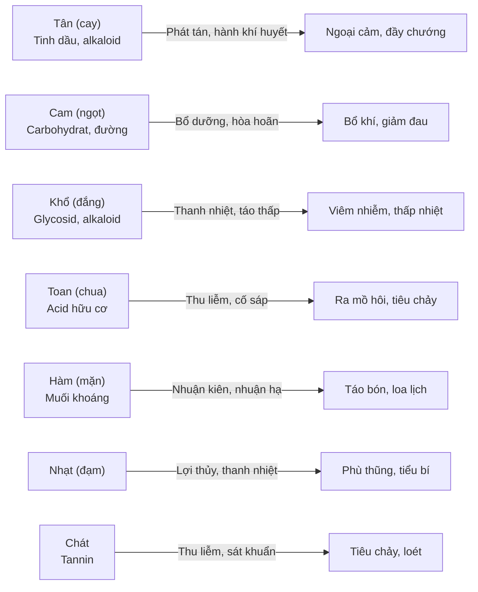

import KeyPoints from '~/components/KeyPoints.astro';
import CompareTable from '~/components/CompareTable.astro';
import ClinicalPearl from '~/components/ClinicalPearl.astro';
import RedFlags from '~/components/RedFlags.astro';
import SelfCheck from '~/components/SelfCheck.astro';
import SourceNote from '~/components/SourceNote.astro';

<KeyPoints title="6 ý lõi — đọc trước">

- **Tính năng = Tứ khí + Ngũ vị + Quy kinh + Thăng-Giáng-Phù-Trầm** — 4 chiều mô tả một vị thuốc.
- Tứ khí (Hàn-Lương-Ôn-Nhiệt): thuốc hàn trị nhiệt chứng, thuốc ôn trị hàn chứng.
- Ngũ vị gồm 7 vị thực tế: Tân · Cam · Khổ · Toan · Hàm · Nhạt · Chát — mỗi vị có công năng riêng.
- Quy kinh: màu + vị → quy vào hành → tạng phủ tương ứng (Ngũ hành).
- Phối ngũ 6 loại: Tương tu · Tương sử (tăng tác dụng) / Tương úy · Tương sát (giảm độc) / Tương ác (giảm tác dụng) / Tương phản (cấm phối).
- **Thập bát phản** (18 cặp cấm) và **Thập cửu úy** (19 cặp tránh) là bắt buộc phải thuộc.

</KeyPoints>

---

## 1. Tứ khí (Tính của thuốc)

| Tính | Mức | Dùng cho | Ví dụ tiêu biểu |
|---|---|---|---|
| Hàn | Lạnh mạnh | Nhiệt chứng nặng | Thạch cao, Hoàng liên, Miết giáp |
| Lương | Mát | Nhiệt chứng nhẹ | Mạch môn, Kim tiền thảo |
| **Bình** | Trung lập | Cả hàn lẫn nhiệt | Cam thảo, Đảng sâm |
| Ôn | Ấm | Hàn chứng nhẹ | Ma hoàng, Tía tô, Kinh giới |
| Nhiệt | Nóng mạnh | Hàn chứng nặng | Quế nhục, Phụ tử |

**Cơ chế tương đối:** Thuốc hàn-lương = ức chế hưng phấn cơ năng. Thuốc ôn-nhiệt = kích thích chức năng suy nhược.

---

## 2. Ngũ vị (7 vị thực tế)

**Ngũ cấm** (theo Ngũ hành — tạng bệnh cấm dùng vị khắc):

| Tạng bệnh | Cấm vị | Lý do (Ngũ hành) |
|---|---|---|
| Tỳ | Toan | Mộc khắc Thổ |
| Phế | Khổ | Hỏa khắc Kim |
| Thận | Cam | Thổ khắc Thủy |
| Can | Tân | Kim khắc Mộc |
| Tâm | Hàm | Thủy khắc Hỏa |

---

## 3. Quy kinh

Thuốc đi vào kinh nào dựa vào **màu sắc + vị**:

| Màu | Vị | Hành | Tạng / Phủ |
|---|---|---|---|
| Xanh | Toan | Mộc | Can · Đởm |
| Đỏ | Khổ | Hỏa | Tâm · Tiểu trường |
| Vàng | Cam | Thổ | Tỳ · Vị |
| Trắng | Tân | Kim | Phế · Đại trường |
| Đen | Hàm | Thủy | Thận · Bàng quang |

**Thay đổi quy kinh bằng chế biến:** Tẩm muối → Thận; tẩm giấm → Can; tẩm Mật ong → Tỳ Vị; sao đen → Thận.

<ClinicalPearl>

Hoàng liên, Hoàng bá, Hoàng cầm, Chi tử — đều vị khổ tính hàn, đều thanh nhiệt. Nhưng quy kinh khác: Hoàng liên → Tâm; Hoàng bá → Thận; Hoàng cầm → Phế; Chi tử → Tam tiêu. **Chọn sai kinh = sai thuốc.**

</ClinicalPearl>

---

## 4. Thăng Giáng Phù Trầm

| Xu hướng | Hướng | Dùng khi | Thuốc mẫu |
|---|---|---|---|
| **Thăng** | Lên | Sa giáng (dạ dày, tử cung, trĩ) | Hoàng kỳ, Thăng ma, Sài hồ |
| **Giáng** | Xuống | Khí nghịch (suyễn, nôn) | Hạnh nhân, Bán hạ, Thị đế |
| **Phù** | Ra ngoài | Cảm mạo, biểu chứng | Quế chi, Cát căn, Cúc hoa |
| **Trầm** | Vào trong | Đạo hãn, phù thũng, ban chẩn | Đại hoàng, Kim tiền thảo |

**Quy tắc:** Hoa-lá-vỏ → nhẹ → thăng phù. Khoáng thạch → nặng → trầm giáng.
**Tương quan Khí-Vị:** Thăng-phù = vị tân, cam, tính ôn nhiệt (Dương). Trầm-giáng = vị khổ, toan, hàm, tính hàn lương (Âm).

---

## 5. Phối ngũ — 6 loại tương tác

<CompareTable
  headers={["Loại", "Ý nghĩa", "Ví dụ", "Xử trí"]}
  rows={[
    ["Tương tu", "Cùng tính vị, phối hợp → tác dụng tăng", "Kim ngân + Liên kiều (thanh nhiệt)", "Dùng bình thường"],
    ["Tương sử", "Khác tính vị, phối hợp → tác dụng tăng", "Liên kiều + Ngô thù du (cầm nôn)", "Dùng bình thường"],
    ["Tương úy", "Vị A ức chế độc tính của vị B", "Bán hạ úy Sinh khương", "Lợi dụng để giảm độc"],
    ["Tương sát", "Vị A diệt độc của vị B", "Đậu xanh sát Ba đậu", "Dùng khi giải độc"],
    ["Tương ác", "Vị A kiềm chế tác dụng của vị B", "Hoàng cầm ác Sinh khương", "Tránh phối nếu không cần"],
    ["Tương phản", "Phối hợp → sinh độc, tăng hại", "Cam thảo phản Cam toại", "TUYỆT ĐỐI CẤM"],
  ]}
/>

### Thập bát phản (18 cặp cấm phối)

| Vị trung tâm | Phản với |
|---|---|
| **Cam thảo** | Đại kích · Nguyên hoa · Cam toại · Hải táo |
| **Ô đầu** | Bối mẫu · Qua lâu · Bán hạ · Bạch liễm · Bạch cập |
| **Lê lô** | Nhân sâm · Sa sâm · Đan sâm · Khổ sâm · Tế tân · Bạch thược |

### Thập cửu úy (9 cặp chính)

Lưu hoàng úy Phác tiêu · Thủy ngân úy Phê sương · Ba đậu úy Khiên ngư · Đinh hương úy Uất kim · Nhân sâm úy Ngũ linh chi · Nhục quế úy Xích thạch chi (và 4 cặp khác).

---

## 6. Tương tác thuốc hóa dược quan trọng

| YHCT | Hóa dược | Hậu quả |
|---|---|---|
| Bạch quả (Ginkgo) | Warfarin, aspirin | Tăng nguy cơ xuất huyết |
| Đan sâm | Warfarin | Tác dụng kháng đông mạnh hơn |
| Nhân sâm | Metformin | Hạ đường huyết |
| Cam thảo | Corticoid | Tăng tác dụng corticoid |
| Ma hoàng | Caffein, chất kích thích | Tăng huyết áp, loạn nhịp |

<RedFlags title="Bẫy cần nhớ">

- **Phụ tử** (vị tân, nhiệt): loạn nhịp tim, hạ huyết áp nếu quá liều.
- **Acid aristolochic** (Nam mộc hương): độc thận nặng, sinh ung thư đường tiết niệu — **cấm dùng**.
- **Đương quy, Bạch thược**: chống chỉ định phụ nữ có thai do gây co thắt tử cung.

</RedFlags>

---

<SelfCheck title="Tự kiểm tra nhanh">

1. Bệnh nhân Tỳ hư nên kiêng vị gì? Vì sao?
2. Muốn tăng khả năng nhập kinh Thận của Đỗ trọng, chế biến bằng gì?
3. Khi dùng Bán hạ có cần phối Sinh khương không? Đây là loại tương tác gì?
4. Cam thảo không được phối với những vị nào? (liệt kê đủ 4 vị)
5. Thuốc nào dưới đây có khuynh hướng trầm: Ma hoàng, Đại hoàng, Hoàng kỳ, Thăng ma?

</SelfCheck>

<SourceNote>

- Nguồn gốc: `Raw/Thuoc_YHCT/chuong-01-dai-cuong/bai-02-tinh-nang-thuoc-co-truyen_001.md`
- Sách: *Thuốc Y học cổ truyền (Tập 1)* — TS. Hứa Hoàng Oanh, TS. Nguyễn Thành Triết.

</SourceNote>
