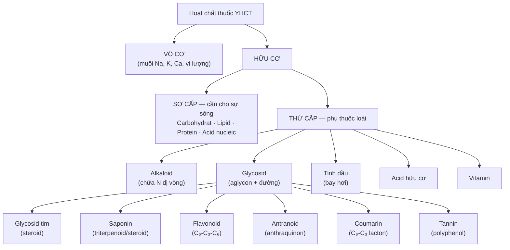
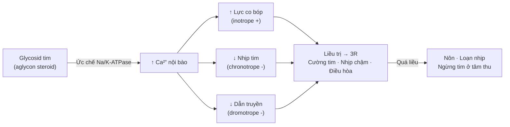

import KeyPoints from '~/components/KeyPoints.astro';
import CompareTable from '~/components/CompareTable.astro';
import ClinicalPearl from '~/components/ClinicalPearl.astro';
import RedFlags from '~/components/RedFlags.astro';
import SelfCheck from '~/components/SelfCheck.astro';
import SourceNote from '~/components/SourceNote.astro';

<KeyPoints title="6 ý lõi — đọc trước">

- **2 nhóm lớn:** Chất vô cơ (muối đa lượng, vi lượng) + Chất hữu cơ sơ cấp (carbohydrat, lipid, protein) + Chất hữu cơ **thứ cấp** (hoạt chất chính: alkaloid, glycosid, tinh dầu...).
- **Alkaloid** = hợp chất hữu cơ chứa N, dị vòng, tính kiềm yếu, > 20.000 chất, tác dụng mạnh lên hệ thần kinh.
- **Glycosid** = aglycon + đường. **Aglycon quyết định tác dụng** — phân loại: glycosid tim, saponin, flavonoid, antranoid, coumarin, tannin.
- **Glycosid tim:** cường tim 3R (co bóp tăng, nhịp chậm, điều hòa nhịp) — khoảng an toàn cực hẹp, quá liều gây loạn nhịp ngừng tim.
- **Flavonoid** (C₆-C₃-C₆) chống oxy hóa, làm bền thành mạch. **Saponin** tạo bọt, phá huyết, dùng làm thuốc bổ và long đờm.
- **Tannin** co se cầm máu, giải độc alkaloid và kim loại nặng. **Tinh dầu** bay hơi, kháng khuẩn đường hô hấp.

</KeyPoints>

---

## 1. Sơ đồ phân loại tổng quát

---

## 2. Alkaloid

| Đặc điểm | Nội dung |
|---|---|
| **Định nghĩa** | Hợp chất hữu cơ chứa N, đa số dị vòng, tính kiềm yếu |
| **Số lượng** | > 20.000 alkaloid từ > 300 khung cấu trúc |
| **Thể chất** | Có O: thường rắn (morphin, strychnin). Không O: lỏng (nicotin, coniin) |
| **Màu sắc** | Đa số không màu, trừ berberin/palmatin (vàng) |
| **Độ tan** | **Base:** tan dung môi hữu cơ, không tan nước. **Muối:** tan nước, không tan hữu cơ |

**Phân loại theo cấu trúc và ví dụ tác dụng:**

| Nhóm | Ví dụ | Tác dụng |
|---|---|---|
| Isoquinolin | Morphin, papaverin, berberin | Giảm đau, giãn cơ trơn, kháng khuẩn |
| Quinolin | Quinin, quinidin | Sốt rét, chống loạn nhịp |
| Indol | Strychnin, vincristin, vinblastin | Kích thích TK, chống ung thư |
| Tropan | Atropin, scopolamin | Liệt phó giao cảm, chống nôn |
| Purin | Caffein, theophyllin, theobromin | Kích thích TKTW, giãn phế quản |
| Phenylalkylamin | Ephedrin, capsaicin | Kích thích giao cảm, cay nóng |
| Diterpen | Aconitin (Phụ tử) | Giảm đau, rất độc |

<RedFlags title="Alkaloid nguy hiểm cần nhớ">

- **Aconitin (Phụ tử):** liều trị và liều độc rất gần nhau. Ngộ độc: tê lưỡi, loạn nhịp tim, tử vong.
- **Strychnin (Mã tiền):** kích thích TK tủy sống → co giật. Khoảng an toàn cực hẹp.
- **Alkaloid base không tan nước → dùng dạng MUỐI để hấp thu tốt** (vd atropin sulfat, morphin HCl).

</RedFlags>

---

## 3. Glycosid tim

| Dược liệu | Hoạt chất | Chỉ định |
|---|---|---|
| Trúc đào | Oleandrin | Suy tim, phù tim |
| Thông thiên | Thevetin | Trợ tim, lợi tiểu |
| Dương địa hoàng | Digitalin | Suy tim, loạn nhịp |

---

## 4. Saponin

| Tính chất đặc trưng | Ứng dụng |
|---|---|
| Tạo bọt bền khi lắc với nước | Nhận diện sơ bộ trong dược liệu |
| Phá huyết (vỡ hồng cầu) | Không tiêm tĩnh mạch (chỉ uống) |
| Độc với cá và động vật máu lạnh | Không độc với người ở liều uống thông thường |
| Tạo phức với cholesterol | Thuốc hạ mỡ máu, xơ vữa động mạch |

**Tác dụng và dược liệu tiêu biểu:**

| Tác dụng | Dược liệu |
|---|---|
| Bổ dưỡng, chống suy nhược | Nhân sâm, Tam thất, Đinh lăng, Ngũ gia bì |
| Long đờm, trừ ho | Cam thảo bắc, Cát cánh, Viễn chí |
| Hạ cholesterol, tim mạch | Cỏ xước, saponin steroid |
| Kháng khuẩn, liền sẹo | Rau má |
| Nguyên liệu bán tổng hợp hormon steroid | Diosgenin (Mía dọ), hecogenin (Thùa) |

---

## 5. Flavonoid

**Khung C₆-C₃-C₆ — sắc tố chủ đạo trong thực vật:**

| Nhóm con | Màu | Ví dụ |
|---|---|---|
| Flavon, Flavonol | Vàng nhạt → vàng | Rutin (nụ Hòe), quercitrin (Diếp cá) |
| Chalcon, Auron | Vàng đậm → đỏ cam | Carthamin (Hồng hoa) |
| Anthocyanidin | Đỏ-tím-xanh (phụ pH) | Màu quả mọng, hoa |
| Isoflavonoid | Không màu | Genistein (Đậu nành), daidzein (Sắn dây) |

**Tác dụng quan trọng:**
- Chống oxy hóa (dập tắt gốc tự do HO•, ROO•)
- Làm bền thành mạch, giảm tính thấm mao mạch (Rutin, Citroflavonoid)
- Bảo vệ gan, lợi mật (Artichaut, Búp giấm)
- Chống viêm (ức chế COX, LOX)
- Phytoestrogen: isoflavonoid (Genistein, Daidzein)

---

## 6. Antranoid (Antraglycosid)

| Nhóm | Cấu trúc | Dùng |
|---|---|---|
| **Nhuận tẩy** | -OH ở C-1, C-8 | Đại hoàng, Phan tả diệp, Hà thủ ô, Muồng trâu |
| Phẩm nhuộm | -OH ở C-1, C-2 | Alizarin (Cây Madder), Acid carminic (sâu Coccus) |

**Tác dụng liều phụ thuộc:** Nhỏ → tiêu hóa. Trung bình → nhuận tràng. Cao → tẩy xổ. Tác dụng chậm 10–12 giờ.

<ClinicalPearl>

**Đại hoàng phải để 1 năm sau khi thu hái mới dùng.** Dạng khử (anthron/anthranol) tác dụng tẩy mạnh, gây đau bụng. Để 1 năm thì dạng khử chuyển sang dạng oxy hóa (emodin, chrysophanol) tác dụng nhẹ hơn.

</ClinicalPearl>

---

## 7. Coumarin

- Cấu trúc C₆-C₃ (phenylpropanoid) — vòng lacton.
- **Huỳnh quang mạnh dưới UV 365 nm** (đặc biệt nhóm OH ở C-7).

| Tác dụng | Hợp chất / Dược liệu |
|---|---|
| Chống đông máu | Dicoumarol, Warfarin (từ coumarin lên men) |
| Giãn động mạch vành | Visnagin (Tiền hồ), Bergapten |
| Làm bền thành mạch (vitamin P-like) | Aesculin, fraxin |
| Trị bạch biến, vẩy nến | Psoralen, angelicin (chữa bệnh da) |
| Kháng khuẩn, chống viêm | Mù u |

<RedFlags title="Aflatoxin — coumarin độc">

**Aflatoxin** (nấm *Aspergillus flavus* trên ngũ cốc/đậu ẩm mốc) là coumarin độc — **một trong những chất gây ung thư gan mạnh nhất**. Không dùng dược liệu bị mốc dù chỉ một phần.

</RedFlags>

---

## 8. Tannin

| Loại | Phản ứng FeCl₃ | Nguồn |
|---|---|---|
| Pyrogallic (thủy phân được) | Xanh đen | Ngũ bội tử, lá Trà, Đại hoàng |
| Pyrocatechic (không thủy phân) | Xanh lục | Cà phê, Canh kina, Bạch đàn |

**Tác dụng:** Co se biểu bì → cầm máu nhẹ, trị tiêu chảy, kháng khuẩn nhẹ, **giải độc alkaloid và kim loại nặng** (kết tủa tanat-protein).

---

## 9. Tinh dầu

- Hỗn hợp nhiều chất, **bay hơi ở nhiệt độ thường**, không tan nước.
- Chiết xuất bằng **cất kéo hơi nước**.
- Phần lớn tỷ trọng < 1 (trừ Quế, Đinh hương, Hương nhu > 1).

| Tác dụng | Dược liệu |
|---|---|
| Kháng khuẩn, đường hô hấp | Bạc hà, Tràm, Bạch đàn, Húng chanh |
| Kích thích tiêu hóa, lợi mật | Sa nhân, Thảo quả, Hồi, Quế |
| Giải biểu, hạ sốt | Bạc hà, Tía tô, Kinh giới |
| Diệt ký sinh trùng | Artemisinin, thymol, tinh dầu Giun |

---

## 10. Acid hữu cơ và Dầu béo

**Acid hữu cơ:** 3 dạng — tự do (chua), muối (giảm chua), ester (mùi thơm).
- Acid shikimic: nguyên liệu bán tổng hợp **Tamiflu** (kháng H5N1).
- Acid salicylic (vỏ Liễu): tiền thân aspirin — giảm đau, hạ sốt.

**Dầu béo:** ester acid béo + glycerol. Acid béo thiết yếu (cơ thể không tự tổng hợp): **linoleic, linolenic, arachidonic, DHA, EPA** — chỉ từ thức ăn.

---

<SelfCheck title="Tự kiểm tra nhanh">

1. Tại sao muối alkaloid dùng trong bào chế thuốc tiêm, còn alkaloid base thì không?
2. Glycosid tim tác dụng cường tim theo cơ chế nào? Tại sao quá liều gây ngừng tim?
3. Tại sao không được tiêm tĩnh mạch saponin?
4. Đại hoàng thu hái xong có được dùng ngay không? Tại sao?
5. Aflatoxin là loại hợp chất nào? Tại sao nguy hiểm?

</SelfCheck>

<SourceNote>

- Nguồn gốc: `Raw/Thuoc_YHCT/chuong-01-dai-cuong/bai-03-cac-hop-chat-tu-nhien_001.md`
- Sách: *Thuốc Y học cổ truyền (Tập 1)* — TS. Hứa Hoàng Oanh, TS. Nguyễn Thành Triết.

</SourceNote>
