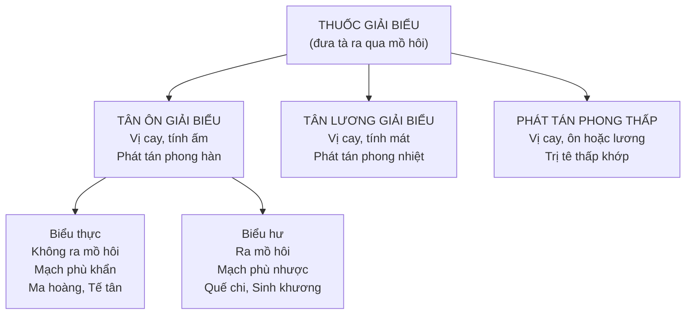

import KeyPoints from '~/components/KeyPoints.astro';
import CompareTable from '~/components/CompareTable.astro';
import ClinicalPearl from '~/components/ClinicalPearl.astro';
import RedFlags from '~/components/RedFlags.astro';
import SelfCheck from '~/components/SelfCheck.astro';
import SourceNote from '~/components/SourceNote.astro';

<KeyPoints title="6 ý lõi — đọc trước">

- **Định nghĩa:** Thuốc giải biểu đưa ngoại tà (phong, hàn, nhiệt) ra ngoài **bằng đường mồ hôi** — chỉ dùng khi tà còn ở **biểu**.
- **3 nhóm:** Tân ôn (phong hàn, cay ấm) — Tân lương (phong nhiệt, cay mát) — Phát tán phong thấp (tê thấp khớp).
- **Biểu thực vs Biểu hư:** Không có mồ hôi, mạch phù khẩn → Biểu thực → **Ma hoàng, Tế tân**. Có mồ hôi, mạch phù nhược → Biểu hư → **Quế chi, Sinh khương**.
- **Tính chất chung:** Vị cay, thăng tán, phần lớn chứa **tinh dầu**, quy kinh **Phế** — sắc nhanh, đậy nắp kín.
- **Không dùng kéo dài:** Chủ thăng tán → hao tổn tân dịch → ngưng ngay khi tà giải.
- **Kiêng kỵ tuyệt đối:** Sốt không có biểu chứng, tăng huyết áp, xuất huyết, âm hư (mất nước), mụn nhọt đã vỡ.

</KeyPoints>

---

## 1. Phân loại tổng quan

---

## 2. Công năng chủ trị — 6 nhóm chỉ định

| Công năng YHCT | Chỉ định thực tế |
|---|---|
| Phát tán giải biểu | Cảm phong hàn / phong nhiệt (cảm mạo, cúm) |
| Sơ phong giải kinh | Đau dây thần kinh, liệt VII, co cứng cơ do hàn |
| Tuyên Phế | Ho, viêm phế quản, hen suyễn do hàn/nhiệt |
| Giải độc, thấu chẩn | Sởi, đậu thời kỳ đầu chưa mọc đủ, mụn nhọt |
| Hành thủy tiêu thũng | Phù viêm cầu thận cấp (phong thủy), dị ứng phù |
| Trừ thấp khớp | Viêm đa khớp, thoái hóa khớp, viêm khớp cấp |

---

## 3. Tân ôn giải biểu — Phát tán phong hàn

| Vị thuốc | Bộ phận | Tính vị | Đặc điểm nổi bật |
|---|---|---|---|
| **Ma hoàng** | Toàn cây bỏ rễ | Cay đắng, ấm, Phế-Bàng quang | Phát hãn mạnh nhất; bình suyễn; lợi niệu tiêu phù. Biểu **thực** |
| **Quế chi** | Cành non | Cay ngọt, ấm, Tâm-Phế-Bàng quang | Ôn kinh thông mạch; biểu **hư** có mồ hôi |
| **Sinh khương** | Thân rễ tươi | Cay, nhiệt, Tâm-Phế-Tỳ-Vị | Ôn Vị chỉ ẩu; giải độc Nam tinh/Bán hạ; hóa đàm |
| **Kinh giới** | Ngọn cành mang hoa | Cay hơi đắng, ấm, Phế-Can | Trung tính — dùng cả phong hàn lẫn phong nhiệt; sao cháy cầm máu |
| **Bạch chi** | Rễ | Cay, ấm, Phế-Vị-Đại trường | Đau trán/xoang/hốc mắt đặc hiệu; bài nùng (kháng sinh) |
| **Tía tô** | Lá, ngành non | Cay, ấm, Tỳ-Phế | Giải biểu + an thai + giải độc cua cá; phòng say tàu xe |
| **Tế tân** | Rễ, thân rễ | Cay, ấm, Thận-Phế-Tâm | Giảm đau mạnh, gây tê tại chỗ; biểu thực đau dữ |
| **Phòng phong** | Rễ | Cay ngọt, ấm, Phế-Can-Vị | Trừ phong thấp tê đau, co quắp, uốn ván |
| **Tân di** | Nụ hoa | Cay, ấm, Phế-Vị | Thông khiếu — viêm xoang đặc hiệu |
| **Cảo bản** | Thân rễ, rễ | Cay, ấm, Bàng quang | Đau đỉnh đầu đặc hiệu |

---

## 4. Tân lương giải biểu — Phát tán phong nhiệt

| Vị thuốc | Bộ phận | Tính vị | Đặc điểm nổi bật |
|---|---|---|---|
| **Bạc hà** | Trên mặt đất | Cay, mát, Phế-Can | Phong nhiệt + kiện Vị. **Không cho trẻ < 1 tuổi** (menthol → ngừng hô hấp) |
| **Cát căn** (Sắn dây) | Rễ củ | Cay ngọt, bình, Tỳ-Vị | Đau gáy/chẩm đặc hiệu; sinh tân dịch, chỉ khát; thúc sởi mọc |
| **Cúc hoa** | Cụm hoa | Ngọt hơi đắng, mát, Phế-Can-Thận | Thanh Can minh mục; bình Can hạ áp |
| **Sài hồ** | Rễ, lá | Đắng cay, hơi hàn, Can-Đởm | Hàn nhiệt vãng lai (như sốt rét); bình Can giải uất; thăng dương (sa giáng) |
| **Tang diệp** | Lá | Ngọt đắng, hàn, Phế-Can | Cổ biểu liễm hãn (độc đáo — điều tiết mồ hôi); thanh Phế chỉ khái |
| **Thăng ma** | Thân rễ | Cay hơi ngọt, hơi hàn, Phế-Tỳ-Vị | Thấu chẩn + thăng dương (sa tử cung, sa trực tràng) |
| **Ngưu bàng tử** | Quả chín | Cay đắng, hàn, Phế-Vị | Thấu chẩn giải độc; nhuận tràng |
| **Thuyền thoái** | Xác ve sầu | Ngọt, hàn, Phế-Can | Tiêu màng mắt; giải kinh (uốn ván, kinh phong) |

---

## 5. Chú ý quan trọng khi sử dụng

| Vấn đề | Xử lý |
|---|---|
| Tà vào trong lý, biểu chứng chưa hết | Phối hợp giải biểu + thuốc trị lý (biểu lý song giải) |
| Cơ thể suy nhược | Phối hợp trợ dương ích khí + thuốc giải biểu |
| Có ho đờm / khó ngủ / đau nhức nhiều | Thêm thuốc chỉ khái / an thần / hành khí |
| Mùa nóng | Liều nhỏ hơn mùa lạnh |
| Phụ nữ mới sinh, người già, trẻ em | Giảm liều; thêm thuốc dưỡng âm bổ huyết |
| Sắc thuốc | Sắc **nhanh**, đậy nắp kín (tinh dầu bay hơi) |
| Uống thuốc tân ôn | Uống nóng, ăn cháo nóng, đắp chăn kín |

<ClinicalPearl>

**Kinh giới — vị thuốc trung tính quan trọng.** Đây là thuốc tân ôn giải biểu duy nhất được dùng cho cả cảm phong hàn lẫn cảm phong nhiệt (phối hợp với Bạc hà, Liên kiều). Khi sao cháy (Kinh giới thán), chuyển công năng thành cầm máu (chỉ huyết). Sao vàng để giải dị ứng da.

</ClinicalPearl>

<ClinicalPearl>

**Sài hồ — bài thuốc hàn nhiệt vãng lai.** Bệnh nhân sốt không đều, sáng-chiều chênh 1°C, miệng đắng, ngực sườn đầy tức → nghĩ đến Sài hồ. Không phải chỉ dùng cho cảm mạo mà còn dùng cho sa giáng (sa tử cung, thoát giang) khi phối hợp bài Bổ trung ích khí thang.

</ClinicalPearl>

---

## 6. Kiêng kỵ tuyệt đối

<RedFlags title="Không dùng thuốc giải biểu trong các trường hợp sau">

- **Sốt không có biểu chứng** (tà đã vào lý) — dùng giải biểu làm hao tân dịch, nặng hơn.
- **Tăng huyết áp hoặc xuất huyết vùng đầu** — thăng tán làm tăng áp lực lên não.
- **Thiếu máu, tiểu ra máu, nôn ra máu** — hao tổn thêm âm huyết.
- **Mụn nhọt đã vỡ, ban chẩn đã mọc đủ** — không còn cần thấu chẩn.
- **Âm hư (mất nước, sốt lâu ngày)** — triều nhiệt, giai đoạn hồi phục bệnh truyền nhiễm.
- **Trẻ < 1 tuổi** — không dùng Bạc hà (menthol gây ngừng hô hấp).

</RedFlags>

---

<SelfCheck title="Tự kiểm tra nhanh">

1. Bệnh nhân cảm lạnh, sốt nhẹ, **không ra mồ hôi**, mạch phù khẩn → chọn nhóm nào và vị thuốc đại diện?
2. Thuốc nào trong nhóm tân ôn dùng được cả cảm phong hàn lẫn phong nhiệt? Tại sao?
3. Tại sao không được dùng thuốc giải biểu kéo dài?
4. Bệnh nhân cảm nhiệt, sốt cao, đau vùng gáy và chẩm, cứng cổ — nghĩ đến vị thuốc nào?
5. Kiêng kỵ đặc biệt của Bạc hà với trẻ em là gì? Cơ chế?

</SelfCheck>

<SourceNote>

- Nguồn gốc: `Raw/Thuoc_YHCT/chuong-02-cac-nhom-thuoc/bai-04-thuoc-giai-bieu_001.md`
- Sách: *Thuốc Y học cổ truyền (Tập 1)* — TS. Hứa Hoàng Oanh, TS. Nguyễn Thành Triết.

</SourceNote>
