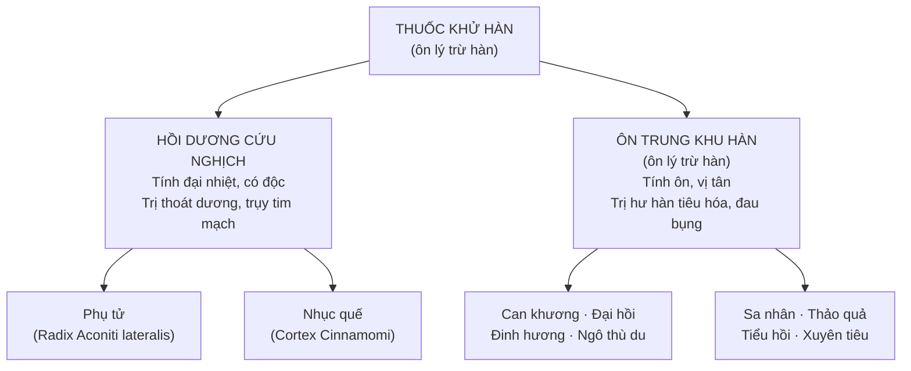

import KeyPoints from '~/components/KeyPoints.astro';
import CompareTable from '~/components/CompareTable.astro';
import ClinicalPearl from '~/components/ClinicalPearl.astro';
import RedFlags from '~/components/RedFlags.astro';
import SelfCheck from '~/components/SelfCheck.astro';
import SourceNote from '~/components/SourceNote.astro';

<KeyPoints title="6 ý lõi — đọc trước">

- **Định nghĩa:** Thuốc khử hàn (ôn lý) có tính ấm/nóng — ôn trung tán hàn, hồi dương cứu nghịch. Chỉ dùng khi hàn tà ở **lý** (bên trong), không phải biểu.
- **2 nhóm:** Hồi dương cứu nghịch (Phụ tử, Nhục quế — mạnh, trị thoát dương/choáng) vs Ôn trung khu hàn (Can khương, Đinh hương, Sa nhân… — nhẹ hơn, trị hư hàn tiêu hóa).
- **Phụ tử phải chế biến:** Phụ tử sống có aconitin → block Nav → loạn nhịp → tử vong. Chế bằng nhiệt → benzoylaconin → cường tim an toàn. **Không dùng Ô đầu sống để uống**.
- **Hoạt chất chủ yếu là tinh dầu:** Vị cay, tính ôn/nhiệt, quy kinh Tỳ và Thận.
- **Bài thuốc kinh điển:** Tứ nghịch thang (Phụ tử + Can khương + Cam thảo) — hồi dương cứu nghịch. Bát vị Quế Phụ — ấm Thận.
- **18 phản Phụ tử:** Không phối hợp Bán hạ, Qua lâu, Bối mẫu, Bạch cập, Bạch liễm. Đinh hương kỵ Uất kim.

</KeyPoints>

---

## 1. Phân loại tổng quan

---

## 2. Nhóm hồi dương cứu nghịch

| Vị thuốc | Bộ phận | Tính vị | Công năng đặc trưng |
|---|---|---|---|
| **Phụ tử** | Rễ củ nhánh cây Ô đầu | Cay ngọt, đại nhiệt, **có độc** — Tâm Thận Tỳ | Hồi dương cứu nghịch, bổ hỏa trợ dương, tán hàn chỉ thống, ấm Thận hành thủy |
| **Nhục quế** | Vỏ thân cây Quế | Tân cam, đại nhiệt, có độc — Can Thận Tâm Tỳ | Bổ hỏa trợ dương tán hàn, hoạt huyết thông kinh, ấm Thận hành thủy, chỉ huyết |

<ClinicalPearl>

**Phụ tử — vị thuốc mạnh nhất nhóm khử hàn.** Tứ nghịch thang (Phụ tử 12g + Can khương 9g + Cam thảo 6g) là bài cổ điển trị choáng do lạnh, tay chân lạnh toát, mạch vi muốn tuyệt. Cam thảo ở đây không chỉ điều hòa mà còn **giải độc aconitin** — không thể bỏ ra.

</ClinicalPearl>

---

## 3. Nhóm ôn trung khu hàn — 8 vị tiêu biểu

| Vị thuốc | Bộ phận | Tính vị | Điểm đặc biệt |
|---|---|---|---|
| **Can khương** | Thân rễ khô cây Gừng | Cay, nhiệt — Tỳ Vị Thận Phế | Ôn trung chỉ ẩu; thành phần bài Tứ nghịch thang |
| **Đại hồi** | Quả chín cây Hồi | Cay ngọt, ôn — Can Thận Tỳ Vị | Tiêu thực, lý khí; hoạt chất anethol |
| **Đinh hương** | Nụ hoa cây Đinh hương | Cay, ôn — Phế Tỳ Vị Thận | Ôn trung giáng nghịch — trị nấc hiệu quả; eugenol gây tê nha khoa |
| **Ngô thù du** | Quả chín cây Ngô thù | Cay đắng, ôn, hơi độc — Can Thận Tỳ Vị | Trị đau đầu do hàn, đau cước khí (bàn chân lạnh đau) |
| **Sa nhân** | Quả (bỏ vỏ) cây Sa nhân | Cay, ôn — Tỳ Vị Thận | An thai — điểm độc đáo nhóm ôn trung |
| **Thảo quả** | Quả khô cây Thảo quả | Cay, ôn — Tỳ Vị | Triệt ngược (trị sốt rét hư hàn); trừ đờm |
| **Tiểu hồi** | Quả chín cây Tiểu hồi | Cay, ôn — Can Thận Tỳ Vị | Hàn sán (thoát vị bẹn); viêm tinh hoàn; hoạt chất anethol |
| **Xuyên tiêu** | Quả khô cây Xuyên tiêu | Cay, ôn — Phế Tỳ Thận | Sát trùng — trị đau bụng giun phối hợp Ô mai |

---

## 4. So sánh 2 vị quan trọng: Phụ tử vs Nhục quế

<CompareTable
  headers={["", "Phụ tử", "Nhục quế"]}
  rows={[
    ["Cường độ tác dụng", "Mạnh nhất — đại nhiệt", "Mạnh — đại nhiệt"],
    ["Hoạt chất", "Aconitin (độc) → chế → benzoylaconin", "Cinnamaldehyde, coumarin, tannin"],
    ["Cơ chế dược lý", "Kích thích Nav → cường tim, hô hấp", "TRPV1 → giãn mạch, ấm người; ức chế tiểu cầu"],
    ["Chỉ định chính", "Choáng do hàn, Thận dương hư nặng, thoát dương", "Mệnh môn hỏa suy, bế kinh, đau bụng lạnh mạn"],
    ["Đặc điểm riêng", "PHẢI chế biến; 18 phản", "Không nấu lâu (cinnamaldehyde bay hơi); liều 1–4g"],
    ["Kiêng kỵ", "Phụ nữ có thai, âm hư nội nhiệt, trẻ <15 tuổi", "Phụ nữ có thai, âm hư hỏa vượng"],
  ]}
/>

---

## 5. Kiêng kỵ tuyệt đối

<RedFlags title="Không dùng thuốc khử hàn trong các trường hợp sau">

- **Chân nhiệt giả hàn** (shock nhiễm trùng: tay chân lạnh nhưng mạch nhanh, sốt cao) — dùng ôn nhiệt càng nguy hiểm.
- **Âm hư sinh nội nhiệt** — người gầy, lòng bàn tay nóng, triều nhiệt, mồ hôi trộm.
- **Can dương thượng cang / tăng huyết áp** — thuốc ôn nhiệt kích thích tuần hoàn.
- **Phụ nữ có thai** — tuyệt đối với nhóm hồi dương cứu nghịch; thận trọng với ôn trung.
- **Trẻ em &lt;15 tuổi** — không dùng Phụ tử.
- **18 phản Phụ tử:** Không phối hợp **Bán hạ, Qua lâu (Thiên hoa phấn), Bối mẫu, Bạch cập, Bạch liễm**.
- **Đinh hương kỵ Uất kim** — không phối hợp.

</RedFlags>

---

## 6. Ngộ độc và giải độc Phụ tử

| Triệu chứng ngộ độc | Cơ chế |
|---|---|
| Chảy nước bọt, buồn nôn, nôn | Kích thích cơ trơn |
| Tê mình mẩy, tay chân | Block Nav ngoại biên |
| Loạn nhịp tim, huyết áp tụt | Block Nav tại tim |
| Co giật, khó thở | Block Nav tại TKTW |

**Giải độc:** Kim ngân hoa 80g + Đậu xanh (cả vỏ) 80g + Cam thảo 20g + Sinh khương 20g + đường, sắc uống ngay.

---

<SelfCheck title="Tự kiểm tra nhanh">

1. Phân biệt biểu hiện lâm sàng chỉ định nhóm hồi dương cứu nghịch vs ôn trung khu hàn?
2. Tại sao Phụ tử bắt buộc phải chế biến trước khi dùng? Sản phẩm chế là gì?
3. Bệnh nhân bị shock nhiễm trùng, tay chân lạnh, mạch nhanh nhỏ — có dùng Phụ tử không? Tại sao?
4. Liệt kê 5 vị thuốc kỵ Phụ tử (18 phản).
5. Vì sao Đinh hương trị nấc hiệu quả mà Can khương thì không?

</SelfCheck>

<SourceNote>

- Nguồn gốc: `Raw/Thuoc_YHCT/chuong-02-cac-nhom-thuoc/bai-05-thuoc-khu-han_001.md`
- Sách: *Thuốc Y học cổ truyền (Tập 1)* — TS. Hứa Hoàng Oanh, TS. Nguyễn Thành Triết.

</SourceNote>
