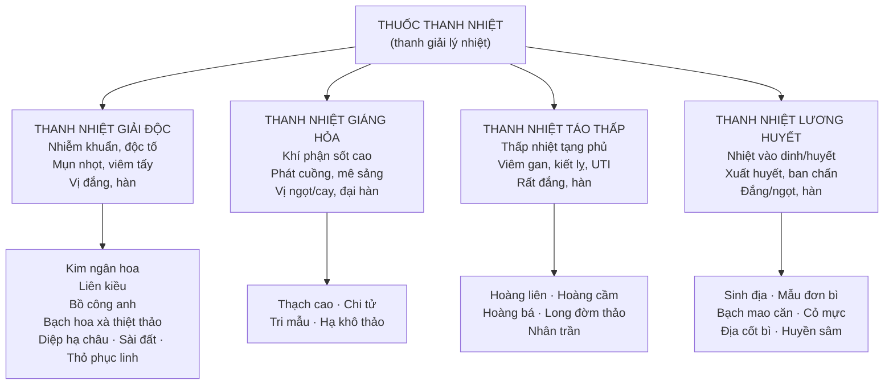

import KeyPoints from '~/components/KeyPoints.astro';
import CompareTable from '~/components/CompareTable.astro';
import ClinicalPearl from '~/components/ClinicalPearl.astro';
import RedFlags from '~/components/RedFlags.astro';
import SelfCheck from '~/components/SelfCheck.astro';
import SourceNote from '~/components/SourceNote.astro';

<KeyPoints title="7 ý lõi — đọc trước">

- **Định nghĩa:** Thuốc thanh nhiệt loại trừ tà nhiệt bên trong (lý nhiệt) — **không phải** ngoại tà ở biểu (cảm sốt → dùng giải biểu).
- **4 nhóm theo vị trí nhiệt:** Giải độc (nhiễm khuẩn) → Giáng hỏa (khí phận, sốt cao) → Táo thấp (thấp nhiệt tạng phủ) → Lương huyết (nhiệt vào dinh huyết, xuất huyết).
- **Tam hoàng:** Hoàng bá + Hoàng cầm + Hoàng liên — cùng chứa berberin, phối hợp kháng khuẩn phổ rộng, giảm kháng thuốc.
- **Thạch cao hạ sốt khác giải biểu:** CaSO₄ ức chế trung khu nhiệt qua Ca²⁺, **không gây mồ hôi** — dùng sốt cao khí phận (Bạch hổ thang). Phải sắc trước 20 phút.
- **Sinh địa vs Thục địa:** Sinh địa (tươi/khô) tính hàn → thanh nhiệt lương huyết. Thục địa (chế Gừng + rượu) tính ấm → bổ huyết tư âm.
- **Địa cốt bì vs Mẫu đơn bì:** Cả 2 trị cốt chưng (nóng âm ỉ trong xương). Địa cốt bì dùng khi **có** mồ hôi trộm; Mẫu đơn bì dùng khi **không** mồ hôi.
- **Kiêng kỵ chung:** Tỳ Vị hư hàn (tiêu chảy, chán ăn), thiếu máu mất máu, chân hàn giả nhiệt.

</KeyPoints>

---

## 1. Phân loại tổng quan — 4 nhóm theo cơ chế bệnh

---

## 2. Nhóm 1: Thanh nhiệt giải độc — 7 vị tiêu biểu

| Vị thuốc | Bộ phận | Tính vị | Điểm đặc biệt |
|---|---|---|---|
| **Kim ngân hoa** | Nụ hoa Kim ngân | Ngọt, hàn — Phế Vị Tâm | Phổ kháng khuẩn rộng nhất nhóm; giải độc Phụ tử |
| **Liên kiều** | Quả chín | Đắng, hơi hàn — Tâm Đởm Tam Tiêu | Tăng sức bền mao mạch; lương huyết hạt Liên kiều |
| **Bồ công anh** | Toàn cây trên đất | Ngọt hơi đắng, hàn — Can Vị | Trị nhũ ung (viêm vú); lợi mật nhuận tràng |
| **Bạch hoa xà thiệt thảo** | Toàn cây | Ngọt đắng, hàn — Can Vị Đại trường | Kháng ung thư nhiều dòng tế bào (vú, ruột kết, gan) |
| **Diệp hạ châu** | Toàn thân | Ngọt đắng, mát — Can Phế | Lignan phyllanthin — bảo vệ gan, kháng HBV |
| **Sài đất** | Trên mặt đất | Mặn hơi đắng, mát — Tâm Phế Vị | Wedelolacton; trị sốt phát ban, rôm sảy |
| **Thỏ phục linh** | Thân rễ | Ngọt nhạt, bình — Can Vị | Trị giang mai, tràng nhạc; kiêng trà khi dùng |

<ClinicalPearl>

**Kim ngân hoa — vị thuốc giải độc nền tảng.** Kim ngân hoa có trong bài Ngân kiều tán (tân lương giải biểu), bài giải độc Phụ tử, bài Ngũ vị tiêu độc ẩm. Đây là vị thuốc "trung tâm" có thể kết hợp với hầu hết nhóm thuốc khác. Dây Kim ngân (Kim ngân đằng) thanh nhiệt yếu hơn, nhưng thông kinh lạc tốt hơn — dùng cho đau nhức gân khớp có nhiễm khuẩn.

</ClinicalPearl>

---

## 3. Nhóm 2: Thanh nhiệt giáng hỏa — 4 vị tiêu biểu

| Vị thuốc | Bộ phận | Tính vị | Công năng đặc trưng |
|---|---|---|---|
| **Thạch cao** | Khoáng CaSO₄·2H₂O | Ngọt cay, **đại hàn** — Phế Vị Tam Tiêu | Sinh: thanh nhiệt giáng hỏa, hạ sốt không ra mồ hôi. Đoạn (nung): dùng ngoài liễm sang |
| **Chi tử** | Quả chín cây Dành dành | Đắng, hàn — Tâm Phế Tam Tiêu | Thanh Tâm nhiệt, trừ phiền; lợi tiểu; lương huyết |
| **Tri mẫu** | Thân rễ | Đắng ngọt, hàn — Phế Vị Thận | Vừa thanh thực nhiệt vừa thanh hư nhiệt (âm hư hỏa vượng) |
| **Hạ khô thảo** | Cụm quả | Cay đắng, hàn — Can Đởm | Can nhiệt đau đầu, tăng huyết áp; tán kết tràng nhạc |

<ClinicalPearl>

**Thạch cao — phải sắc trước.** CaSO₄ khó tan → phải đập vụn và sắc trước 20 phút rồi mới cho các vị khác vào. Dùng Đoạn thạch cao (nung) ngoài da — không uống. Sinh thạch cao hạ sốt nhưng **không** gây mồ hôi (khác Ma hoàng, Quế chi) — cơ chế ức chế trung khu nhiệt qua Ca²⁺.

</ClinicalPearl>

---

## 4. Nhóm 3: Thanh nhiệt táo thấp — Tam hoàng + 2 vị

### Tam hoàng — So sánh chỉ định tạng phủ

<CompareTable
  headers={["", "Hoàng liên", "Hoàng cầm", "Hoàng bá"]}
  rows={[
    ["Bộ phận", "Thân rễ", "Rễ", "Vỏ thân/cành"],
    ["Tính vị", "Đắng, hàn", "Đắng, hàn", "Đắng, hàn"],
    ["Quy kinh chính", "Tâm Tỳ Vị Can Đởm", "Tâm Phế Can Đởm", "Thận Bàng quang"],
    ["Tạng đích chính", "TRUNG TIÊU (Tỳ Vị)", "THƯỢNG TIÊU (Phế)", "HẠ TIÊU (Thận, Bàng quang)"],
    ["Chỉ định đặc hiệu", "Kiết lị, Tâm hỏa loạn nhịp, mất ngủ", "Phế ung, ho do Phế nhiệt, an thai", "Bàng quang thấp nhiệt UTI, âm hư cốt chưng"],
    ["Hoạt chất chính", "Berberin, palmatin", "Baicalein, baicalin", "Berberin"],
    ["Liều/ngày", "2–12 g", "3–9 g", "6–12 g"],
  ]}
/>

**Long đờm thảo:** Hạ tiêu Can Đởm thấp nhiệt đặc hiệu — viêm gan, hoàng đản, viêm sinh dục ngoài, đau sườn. Liều nhỏ trước ăn → kích thích tiêu hóa; liều lớn/sau ăn → giảm tiêu hóa.

**Nhân trần:** Thanh nhiệt lợi thấp, thoái hoàng — vị thuốc đặc hiệu viêm gan, vàng da. Tinh dầu cineol + flavonoid tăng tiết mật.

---

## 5. Nhóm 4: Thanh nhiệt lương huyết — 6 vị tiêu biểu

| Vị thuốc | Bộ phận | Tính vị | Điểm đặc biệt |
|---|---|---|---|
| **Sinh địa** | Rễ củ khô/tươi cây Địa hoàng | Ngọt (hàn) — Tâm Can Thận | Tươi (Tiên địa hoàng): lương huyết. Khô (Sinh địa): tư âm sinh tân |
| **Mẫu đơn bì** | Vỏ rễ cây Mẫu đơn | Đắng cay, hơi hàn — Tâm Can Thận | Hoạt huyết tán ứ + lương huyết. Cốt chưng **không** mồ hôi |
| **Địa cốt bì** | Vỏ rễ cây Câu kỷ | Ngọt, hàn — Phế Can Thận | Cốt chưng **có** mồ hôi trộm; thanh Phế giáng hỏa |
| **Cỏ mực** | Toàn cây trên đất | Ngọt chua, hàn — Can Thận | Bổ Can Thận + lương huyết — dùng sốt xuất huyết Dengue |
| **Bạch mao căn** | Thân rễ Cỏ tranh | Ngọt, hàn — Phế Vị Bàng quang | Tiểu tiện ra máu, thổ huyết; lợi niệu viêm thận |
| **Huyền sâm** | Rễ củ | Mặn đắng, hàn — Phế Thận | Tư âm giáng hỏa + lương huyết; kỵ Lê lô (18 phản) |

---

## 6. Bẫy quan trọng: Chân hàn giả nhiệt vs Thực nhiệt

<RedFlags title="Không dùng thuốc thanh nhiệt trong các trường hợp sau">

- **Tà còn ở biểu** (sốt + sợ lạnh + mạch phù) — dùng giải biểu, không dùng thanh nhiệt.
- **Chân hàn giả nhiệt** (Tỳ Vị đại hư sốt, thiếu máu nặng sốt nhẹ) — thanh nhiệt làm nặng hơn.
- **Tỳ Vị hư hàn, tiêu chảy, ăn không ngon** — vị đắng hàn thêm tổn thương Tỳ.
- **Mất máu sau sinh, xuất huyết do dương hư** — không phải huyết nhiệt, không dùng lương huyết.
- **Âm hư không thực nhiệt** — không dùng Hoàng liên, Hoàng cầm liều cao (quá táo).
- **Nhọt đã vỡ, ung nhọt đã có mủ loãng** — đã là hư chứng, không tiếp tục thanh nhiệt giải độc.

</RedFlags>

---

<SelfCheck title="Tự kiểm tra nhanh">

1. Phân biệt 4 nhóm thuốc thanh nhiệt theo vị trí nhiệt trong cơ thể?
2. Tại sao Thạch cao hạ sốt không gây mồ hôi? Điểm khác biệt với Ma hoàng?
3. Hoàng liên, Hoàng cầm, Hoàng bá: cùng nhóm nhưng chỉ định tạng nào?
4. Bệnh nhân âm hư, sốt về chiều, đổ mồ hôi trộm, đau nhức trong xương — dùng Địa cốt bì hay Mẫu đơn bì?
5. Sinh địa và Thục địa khác nhau ở điểm gì? Khi nào dùng loại nào?

</SelfCheck>

<SourceNote>

- Nguồn gốc: `Raw/Thuoc_YHCT/chuong-02-cac-nhom-thuoc/bai-06-thuoc-thanh-nhiet_001.md`
- Sách: *Thuốc Y học cổ truyền (Tập 1)* — TS. Hứa Hoàng Oanh, TS. Nguyễn Thành Triết.

</SourceNote>
