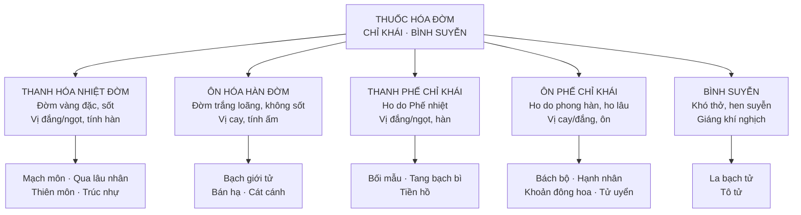

import KeyPoints from '~/components/KeyPoints.astro';
import CompareTable from '~/components/CompareTable.astro';
import ClinicalPearl from '~/components/ClinicalPearl.astro';
import RedFlags from '~/components/RedFlags.astro';
import SelfCheck from '~/components/SelfCheck.astro';
import SourceNote from '~/components/SourceNote.astro';

<KeyPoints title="7 ý lõi — đọc trước">

- **3 loại tác động:** Hóa đờm (làm loãng/trừ đờm) ≠ Chỉ khái (giảm ho trực tiếp) ≠ Bình suyễn (giảm khó thở). Một vị có thể có cả 3.
- **Hàn đờm vs Nhiệt đờm:** Đờm loãng, trắng trong → ôn hóa hàn đờm (Bán hạ, Bạch giới tử). Đờm vàng, đặc, dính, sốt → thanh hóa nhiệt đờm (Bối mẫu, Qua lâu nhân).
- **Bán hạ phải chế biến:** Bán hạ sống có alkaloid kích ứng gây nôn mạnh, độc gan. Chế với gừng (Khương bán hạ) → an toàn, có tác dụng cầm nôn, hóa đờm.
- **Hạnh nhân — amygdalin → HCN:** Amygdalin thủy phân → acid cyanhydric → ức chế ho. Liều cao → methemoglobin, ngộ độc. **Không dùng quá liều, không dùng kéo dài**.
- **Tam tử dưỡng thân thang:** La bạch tử + Tô tử + Bạch giới tử — bài thuốc kinh điển trị đờm nghẽn, khí nghịch, ho suyễn mạn (COPD YHCT).
- **Bách bộ — kháng lao độc đáo:** Alkaloid tuberostemonin ức chế vi khuẩn lao (*Mycobacterium tuberculosis*) — vị duy nhất trong nhóm có đặc tính này.
- **Cát cánh = "thuyền chở thuốc vào Phế":** Saponin Cát cánh dẫn thuốc vào kinh Phế, đồng thời tăng tiết dịch phế quản → dễ khạc đờm. Dùng cả khi phong hàn lẫn phong nhiệt.

</KeyPoints>

---

## 1. Phân loại tổng quan — 5 nhóm

---

## 2. Nhóm 1: Thanh hóa nhiệt đờm

| Vị thuốc | Bộ phận | Tính vị | Điểm đặc biệt |
|---|---|---|---|
| **Mạch môn** | Rễ củ cây Mạch môn | Ngọt đắng, hơi hàn — Tâm Phế Vị | Dưỡng âm nhuận Phế; điển hình nhất nhóm |
| **Qua lâu nhân** | Hạt cây Qua lâu | Đắng ngọt, hàn — Phế Vị Đại trường | Nhuận tràng kèm hóa đờm; kỵ Ô đầu/Phụ tử |
| **Thiên môn đông** | Rễ củ | Ngọt đắng, hàn — Phế Thận | Bổ Thận âm tốt hơn Mạch môn; thường đi cặp |
| **Trúc nhự** | Lớp vỏ giữa Tre | Ngọt, hơi hàn — Phế Can Vị | Thêm tác dụng chỉ ẩu (buồn nôn) |

---

## 3. Nhóm 2: Ôn hóa hàn đờm

| Vị thuốc | Bộ phận | Tính vị | Điểm đặc biệt |
|---|---|---|---|
| **Bán hạ** | Thân rễ | Cay, ấm, **có độc** — Phế Tỳ Vị | **PHẢI chế biến**. Tiêu đờm + giáng nghịch chỉ ẩu. Kỵ Ô đầu |
| **Bạch giới tử** | Hạt cải trắng | Cay, ấm — Phế | Sinalbin + myrosinase → kích ứng da; uống → tăng tiết phế quản |
| **Cát cánh** | Rễ | Đắng cay, hơi ấm — Phế | Saponin "dẫn thuốc" vào Phế; bài nùng (Phế ung) |

<ClinicalPearl>

**Bán hạ sống vs Bán hạ chế — điểm mấu chốt.** Bán hạ sống chứa calcium oxalate + alkaloid kích ứng → nôn mạnh, độc gan. Chế với gừng (Khương bán hạ) → phá vỡ tinh thể oxalate, chuyển alkaloid sang dạng ít độc → tác dụng cầm nôn, hóa đờm. "Mai hạch khí" (cảm giác có cục trong cổ họng) = Bán hạ + Hậu phác thang.

</ClinicalPearl>

---

## 4. Nhóm 3: Thanh Phế chỉ khái

| Vị thuốc | Bộ phận | Tính vị | Điểm đặc biệt |
|---|---|---|---|
| **Bối mẫu** | Thân hành cây Xuyên Bối mẫu | Đắng ngọt, hơi hàn — Phế Tâm | Nhuận Phế hóa đờm + tán kết (tràng nhạc, bướu cổ); kỵ Ô đầu |
| **Tang bạch bì** | Vỏ rễ Dâu tằm | Ngọt, hàn — Phế | Bình suyễn + lợi thủy tiêu thũng (kết hợp hen + phù) |
| **Tiền hồ** | Rễ | Đắng cay, hơi hàn — Phế Tỳ | Thêm tuyên tán phong nhiệt; coumarin |

---

## 5. Nhóm 4: Ôn Phế chỉ khái

| Vị thuốc | Bộ phận | Tính vị | Điểm đặc biệt |
|---|---|---|---|
| **Bách bộ** | Rễ củ | Ngọt đắng, hơi ấm — Phế | Kháng lao, sát trùng (giun kim). Ho gà, lao hạch |
| **Hạnh nhân** | Hạt Mơ | Đắng cay, ấm, ít độc — Phế Đại trường | Amygdalin → HCN → ức chế ho. **Không quá liều** |
| **Khoản đông hoa** | Nụ hoa chưa nở | Cay ngọt, ôn — Phế | Nhuận Phế hóa đờm; dùng cả ho mới lẫn lâu |
| **Tử uyển** | Rễ và thân rễ | Đắng ngọt, ôn — Phế | Khứ đờm tốt, chỉ khái yếu hơn; luôn phối Khoản đông hoa |

---

## 6. Nhóm 5: Bình suyễn

| Vị thuốc | Bộ phận | Tính vị | Điểm đặc biệt |
|---|---|---|---|
| **La bạch tử** | Hạt Cải củ | Cay ngọt, bình — Phế Tỳ Vị | Giáng khí bình suyễn + tiêu thực trừ tích |
| **Tô tử** | Quả Tía tô | Cay, ấm — Phế | Giáng khí tiêu đờm + nhuận tràng; α-linolenic acid |

<ClinicalPearl>

**Tam tử dưỡng thân thang** (La bạch tử + Tô tử + Bạch giới tử) — mỗi thứ 12g: La bạch tử giáng khí tiêu thực, Tô tử giáng khí bình suyễn, Bạch giới tử ôn Phế trừ đờm. Ba vị nhắm đúng 3 nguyên nhân gây khó thở mạn (đờm ứ + khí nghịch + thức ăn tích trệ). Dùng khi người cao tuổi ho suyễn lâu ngày, đờm nhiều, bụng đầy.

</ClinicalPearl>

---

## 7. So sánh then chốt: Ho hàn vs Ho nhiệt

<CompareTable
  headers={["", "Đờm hàn (ôn hóa)", "Đờm nhiệt (thanh hóa)"]}
  rows={[
    ["Màu đờm", "Trắng, loãng, dễ khạc", "Vàng, đặc, dính, khó khạc"],
    ["Toàn trạng", "Không sốt, tay chân lạnh, rêu trắng", "Sốt hoặc nóng trong, rêu vàng"],
    ["Thuốc dùng", "Bán hạ, Bạch giới tử, Cát cánh, Hạnh nhân", "Bối mẫu, Qua lâu nhân, Tang bạch bì, Mạch môn"],
    ["Bài tiêu biểu", "Tam tử dưỡng thân thang", "Bối mẫu + Tang bạch bì"],
  ]}
/>

---

<RedFlags title="Kiêng kỵ quan trọng">

- **Bán hạ sống:** Tuyệt đối không uống sống — gây nôn mạnh, độc gan.
- **Bán hạ chế + Cát cánh + Qua lâu nhân: Kỵ Ô đầu/Phụ tử** (18 phản).
- **Hạnh nhân quá liều:** Amygdalin → HCN dư → methemoglobin, ngộ độc. Liều an toàn: 4,5–9 g/ngày.
- **Bạch giới tử đắp ngoài:** Sinalbin + myrosinase → isothiocyanate → phỏng rộp da nếu đắp lâu.
- **Không dùng Bách bộ, Khoản đông hoa** cho âm hư Phế nhiệt (tính ấm làm khô thêm).
- **Bán hạ: kỵ phụ nữ có thai** (kích thích tử cung).

</RedFlags>

---

<SelfCheck title="Tự kiểm tra nhanh">

1. Phân biệt 3 loại tác động: hóa đờm, chỉ khái, bình suyễn — khác nhau chỗ nào?
2. Bệnh nhân ho đờm trắng loãng, không sốt, tay chân lạnh → dùng nhóm nào? Kể 3 vị.
3. Tại sao Bán hạ phải chế biến? Chế với gì? Thay đổi tác dụng thế nào?
4. Hạnh nhân chứa amygdalin — cơ chế giảm ho? Nguy cơ khi quá liều?
5. Tam tử dưỡng thân thang gồm những vị gì? Chỉ định chính?

</SelfCheck>

<SourceNote>

- Nguồn gốc: `Raw/Thuoc_YHCT/chuong-02-cac-nhom-thuoc/bai-07-thuoc-hoa-dom-chi-khai-binh-suyen_001.md`
- Sách: *Thuốc Y học cổ truyền (Tập 1)* — TS. Hứa Hoàng Oanh, TS. Nguyễn Thành Triết.

</SourceNote>
