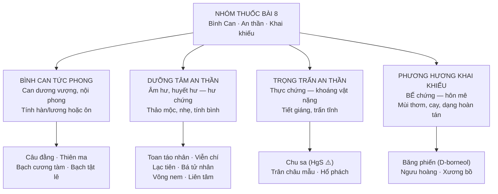

import KeyPoints from '~/components/KeyPoints.astro';
import CompareTable from '~/components/CompareTable.astro';
import ClinicalPearl from '~/components/ClinicalPearl.astro';
import RedFlags from '~/components/RedFlags.astro';
import SelfCheck from '~/components/SelfCheck.astro';
import SourceNote from '~/components/SourceNote.astro';

<KeyPoints title="7 ý lõi — đọc trước">

- **4 nhóm chức năng:** Bình Can tức phong (Câu đằng, Thiên ma) → Dưỡng Tâm an thần (Toan táo nhân, Viễn chí) → Trọng trấn an thần (Chu sa, Trân châu mẫu) → Khai khiếu (Băng phiến, Ngưu hoàng).
- **Bế vs Thoát — quyết định then chốt:** Khai khiếu CHỈ dùng cho **bế chứng** (hôn mê do tắc nghẽn). Tuyệt đối KHÔNG dùng cho **thoát chứng** (hôn mê do kiệt sức — miệng há, tay xòe, mồ hôi nhiều, mạch vô lực).
- **Câu đằng — sắc tối đa 20 phút:** Rhinchophyllin hạ huyết áp bị nhiệt phân hủy trên 20 phút. Cho vào sau cùng, không sắc chung từ đầu.
- **Chu sa HgS — độc, liều thấp:** Thủy ngân sulfid 0,5–1 g/ngày. Không sao chế trực tiếp (HgS → Hg tự do). Chế bằng phương pháp thủy phi.
- **Băng phiến và Ngưu hoàng không sắc:** Tinh thể borneol/acid mật dễ bay hơi khi đun. Dùng dạng hoàn, tán; cho vào sau khi đã sắc xong các vị khác.
- **Nội phong vs Ngoại phong:** Nhóm bình Can tức phong chỉ trị **nội phong** (Can dương vượng, nhiệt cực sinh phong). Ngoại phong (phong hàn, phong nhiệt) phải dùng thuốc giải biểu.
- **Thiên ma câu đằng thang** — bài thuốc tăng huyết áp YHCT kinh điển: Thiên ma + Câu đằng + Chi tử + Dạ giao đằng + Thảo quyết minh + Ngưu tất + Đỗ trọng.

</KeyPoints>

---

## 1. Phân loại — 4 nhóm

---

## 2. Nhóm 1: Bình Can tức phong

| Vị thuốc | Bộ phận dùng | Tính vị | Điểm đặc biệt |
|---|---|---|---|
| **Câu đằng** | Cành có gai móc câu | Ngọt, lương — Can Tâm bào | **Không sắc >20 phút.** Rhinchophyllin hạ HA giãn mạch |
| **Thiên ma** | Thân rễ | Cay, ấm — Can | Bài Thiên ma câu đằng thang (tăng HA YHCT). **Kỵ âm hư** |
| **Bạch cương tàm** | Con tằm chết trắng (nhiễm nấm) | Mặn cay, bình — Tâm Can Tỳ Phế | Trừ phong hóa đờm + định kinh giãn + tiêu độc |
| **Bạch tật lê** | Quả cây Gai chống | Cay đắng, hơi ấm — Can Phế | Bình Can minh mục + tăng testosterone (Tribulus saponin) |

<ClinicalPearl>

**Thiên ma câu đằng thang** = bài thuốc THA kinh điển YHCT (Can dương vượng). Gồm 11 vị: Thiên ma bình can, Câu đằng tức phong (cho vào sau), Chi tử thanh nhiệt, Ngưu tất dẫn huyết xuống dưới, Đỗ trọng–Tang ký sinh bổ Thận, Dạ giao đằng–Bạch phục linh an thần. Logic: đau đầu + THA + mất ngủ → can dương vượng + thận âm hư.

</ClinicalPearl>

---

## 3. Nhóm 2: Dưỡng Tâm an thần (hư chứng)

| Vị thuốc | Tính vị | Điểm chính | Chỉ định |
|---|---|---|---|
| **Toan táo nhân** | Chua ngọt, bình — Tâm Can Tỳ | Dưỡng Tâm + liễm hãn (mồ hôi trộm) | Mất ngủ do huyết hư; kiêng: sốt/cảm nặng |
| **Viễn chí** | Đắng cay, ôn — Tâm Phế Thận | An thần ích trí + hóa đờm | Mất ngủ hay quên + ho đờm đặc; kiêng: thai, viêm loét dạ dày |
| **Bá tử nhân** | Ngọt, bình — Tâm Thận Đại trường | An thần + nhuận tràng | Mất ngủ + táo bón; kiêng: tiêu chảy, nhiều đàm |
| **Lạc tiên** | Ngọt hơi đắng, lương — Tâm Can | Giải lo âu (anxiolytic) | Mất ngủ + đau mắt đỏ |
| **Liên tâm** | Đắng, hàn — Tâm Thận | Thanh Tâm nhiệt + sáp tinh | Mất ngủ do nhiệt, nói mê |
| **Thảo quyết minh** | Mặn, bình — Can Thận | An thần + minh mục + nhuận tràng | Sao đen → tăng an thần, giảm nhuận tràng |
| **Thạch quyết minh** | Mặn, hàn — Can | Bình Can tiềm dương (vỏ bào ngư CaCO₃) | THA + mắt mờ; sắc trước 30 phút |
| **Vông nem** | Đắng, bình — Tâm Tỳ | Ức chế TKTW (erythramin) | Mất ngủ đơn thuần |

---

## 4. Nhóm 3: Trọng trấn an thần (thực chứng)

| Vị thuốc | Thành phần | Tính vị | Điểm nguy hiểm |
|---|---|---|---|
| **Chu sa** | HgS (thủy ngân sulfid) | Ngọt, hàn, **có độc** — Tâm | **0,5–1 g/ngày, không dài ngày, không sao chế** |
| **Trân châu mẫu** | CaCO₃ + protein (vỏ trai) | Ngọt mặn, hàn — Tâm Can | Sắc trước; dùng ngoài liền vết thương |
| **Hổ phách** | Nhựa thông hóa thạch (acid succinic) | Ngọt, bình — Tâm Can | Thêm khử ứ + lợi niệu |

---

## 5. Nhóm 4: Khai khiếu (bế chứng)

| Vị thuốc | Hoạt chất | Tính vị | Dùng dạng |
|---|---|---|---|
| **Băng phiến** | D-borneol (tinh thể) | Cay đắng, hơi hàn — Tâm Tỳ Phế | Hoàn/tán, liều thấp 0,22–0,44 g |
| **Ngưu hoàng** | Acid cholic + bilirubin (sỏi mật) | Đắng, bình — Tâm Can | Hoàn/tán 0,3–0,6 g; kiêng thai |
| **Xương bồ** | β-asarone (tinh dầu) | Cay, ấm — Tâm Can Tỳ | Sắc được (Thạch xương bồ); khai khiếu + kiện Vị |

---

## 6. So sánh then chốt: Bế chứng vs Thoát chứng

<CompareTable
  headers={["", "Bế chứng (dùng khai khiếu)", "Thoát chứng (KHÔNG dùng khai khiếu)"]}
  rows={[
    ["Nguyên nhân", "Đờm trọc/nhiệt tà tắc nghẽn khiếu", "Nguyên khí kiệt, tạng phủ suy"],
    ["Biểu hiện", "Hàm răng cắn chặt, tay nắm, người cứng", "Miệng há, tay xòe, mắt lim dim"],
    ["Mồ hôi", "Ít hoặc không", "Vã mồ hôi nhiều"],
    ["Mạch", "Hữu lực, huyền/hoạt", "Vô lực, vi tế hoặc tán"],
    ["Xử trí", "Khai khiếu tỉnh thần (Băng phiến, Ngưu hoàng)", "Hồi dương cứu nghịch (Phụ tử, Nhân sâm)"],
  ]}
/>

---

<RedFlags title="Kiêng kỵ quan trọng">

- **Chu sa:** Không sao chế trực tiếp (HgS → Hg gây độc thần kinh). Không dùng dài ngày. Liều: 0,5–1 g/ngày.
- **Câu đằng:** Rhinchophyllin bị phân hủy ở nhiệt độ cao — sắc không quá 20 phút, cho vào sau cùng.
- **Khai khiếu tuyệt đối không dùng cho thoát chứng** — gây thoát khí nhanh hơn, nguy hiểm tính mạng.
- **Băng phiến, Ngưu hoàng:** không sắc — dùng dạng hoàn/tán.
- **Phụ nữ có thai:** Ngưu hoàng, thuốc bình Can tức phong tính ôn nhiệt.
- **Thiên ma:** Kỵ âm hư (tính ấm làm khô âm huyết hơn).
- **Thuốc phương hương khai khiếu:** không dùng lâu dài — tổn thương nguyên khí.

</RedFlags>

---

<SelfCheck title="Tự kiểm tra nhanh">

1. Bệnh nhân đột ngột hôn mê, hàm cắn chặt, tay nắm, mồ hôi ít — đây là bế hay thoát? Dùng nhóm thuốc nào?
2. Tại sao Câu đằng không được sắc quá 20 phút?
3. Phân biệt Dưỡng Tâm an thần vs Trọng trấn an thần: khi nào dùng từng loại?
4. Chu sa thành phần là gì? Vì sao không được sao chế trực tiếp?
5. Nội phong khác ngoại phong như thế nào? Mỗi loại dùng thuốc gì?

</SelfCheck>

<SourceNote>

- Nguồn gốc: `Raw/Thuoc_YHCT/chuong-02-cac-nhom-thuoc/bai-08-thuoc-binh-can-tuc-phong-an-than-khai-khieu_001.md`
- Sách: *Thuốc Y học cổ truyền (Tập 1)* — TS. Hứa Hoàng Oanh, TS. Nguyễn Thành Triết.

</SourceNote>
