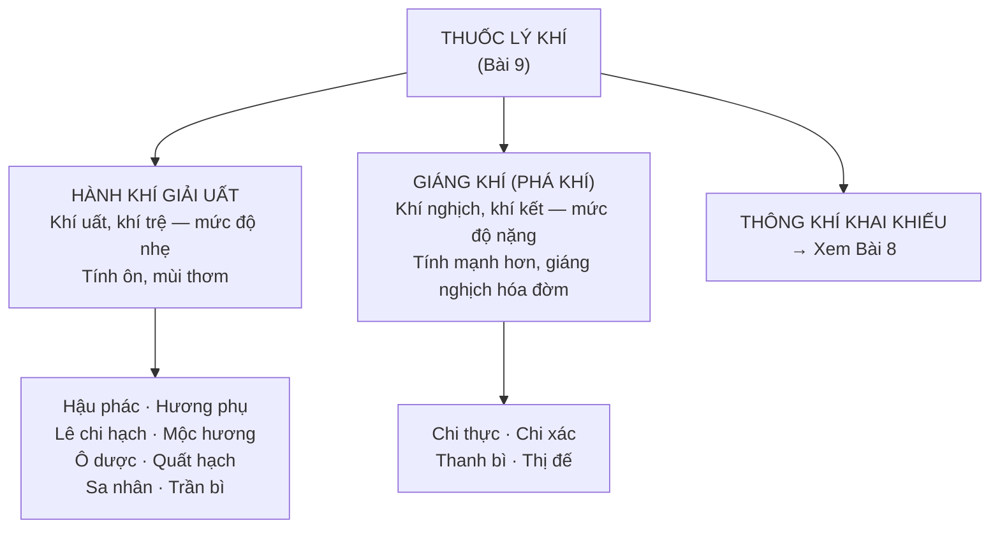

import KeyPoints from '~/components/KeyPoints.astro';
import CompareTable from '~/components/CompareTable.astro';
import ClinicalPearl from '~/components/ClinicalPearl.astro';
import RedFlags from '~/components/RedFlags.astro';
import SelfCheck from '~/components/SelfCheck.astro';
import SourceNote from '~/components/SourceNote.astro';

<KeyPoints title="6 ý lõi — đọc trước">

- **3 nhóm lý khí:** Hành khí giải uất (nhẹ) → Giáng khí/phá khí (mạnh) → Thông khí khai khiếu (xem Bài 8). Bài 9 chỉ bàn 2 nhóm đầu.
- **Tính chất chung:** Đa số vị tân/khổ, tính ôn, mùi thơm, khô táo → dễ hao tổn tân dịch, chính khí — **không dùng liều cao, kéo dài.**
- **Phối hợp 4 tình huống:** Khí hư + khí trệ → thêm bổ khí; hàn ngưng khí trệ → thêm ôn trung; khí uất hóa hỏa → thêm thanh nhiệt; khí trệ huyết ứ → thêm hoạt huyết.
- **Hương phụ** = "thuốc vạn năng của phụ nữ": hành khí chỉ thống + khai uất điều kinh + kiện Vị + thanh Can hỏa. 4 kinh: Can, Tỳ, Tam tiêu.
- **Mộc hương kỵ lửa** — tinh dầu bay hơi khi sắc lâu → dùng dạng bột hoặc mài với nước sắc để uống.
- **Thanh bì vs Trần bì** — cùng vỏ quýt, đối lập tác dụng: Trần bì thăng-phù-hành khí kiện Vị; Thanh bì giáng-sơ Can-phá khí tiêu tích.

</KeyPoints>

---

## 1. Phân loại thuốc lý khí

---

## 2. Tính chất chung & nguyên tắc dùng thuốc

| Đặc điểm | Chi tiết |
|---|---|
| Vị | Đa số tân, khổ |
| Tính | Đa số ôn |
| Quy kinh | Phế, Tỳ, Vị, Can, Đờm |
| Đặc điểm | Mùi thơm, khô táo |
| Cách sắc | Không sắc quá lâu — mất khí vị |
| Kiêng kỵ chung | Khí hư, âm hư hỏa vượng, thai phụ (giáng khí/khai khiếu) |

---

## 3. Vị thuốc hành khí giải uất

| Vị thuốc | Bộ phận dùng | Tính vị / Quy kinh | Công năng chính | Điểm ghi nhớ |
|---|---|---|---|---|
| **Hậu phác** | Vỏ thân, rễ, cành | Cay đắng, ôn — Phế Tỳ Vị Đại tràng | Ôn trung hạ khí, táo thấp tiêu đờm, thanh trường chỉ lệ | Phối Thương truật, Trần bì → bình Vị tán |
| **Hương phụ** | Thân rễ (thân rễ cù gấu) | Hơi cay/đắng, bình — Can Tỳ Tam tiêu | Hành khí chỉ thống, khai uất điều kinh, kiện Vị tiêu thực, thanh Can hỏa | Vị thuốc điều kinh số 1; có tác dụng estrogen |
| **Lê chi hạch** | Hạt quả vải chín | Đắng ngọt, ôn — Can Thận | Hành khí chỉ thống, kiện Vị chỉ ẩu | Sán khí, đau bụng dưới; không dùng hạt vải rừng (độc) |
| **Mộc hương** | Rễ | Đắng cay, ôn — Can Tỳ Vị Đại tràng | Hành khí chỉ thống, kiện Tỳ hòa Vị, bình Can giảm áp | **Kỵ lửa** — dùng dạng bột/mài với nước sắc |
| **Ô dược** | Rễ | Cay, ôn — Phế Tỳ Thận Bàng quang | Hành khí chỉ thống, kiện Vị tiêu thực, ôn Thận tán hàn | Thêm tác dụng ôn Thận — dùng khi có lạnh, sán khí |

---

## 4. Vị thuốc giáng khí

| Vị thuốc | Bộ phận dùng | Tính vị / Quy kinh | Công năng chính | Điểm ghi nhớ |
|---|---|---|---|---|
| **Chi thực** | Quả non Chỉ thực | Đắng cay, hơi hàn — Tỳ Vị Đại tràng | Phá khí tiêu tích, hóa đờm, thông tiện | Mạnh hơn Chi xác |
| **Chi xác** | Quả chưa chín Chi xác | Đắng cay, hơi hàn — Tỳ Vị | Phá khí tiêu tích, hóa đờm | Hoà hoãn hơn Chi thực |
| **Thanh bì** | Vỏ quýt **non/xanh** | Cay đắng, ôn — Can Đờm Vị | Sơ Can phá khí, tiêu tích hóa trệ | **Giáng** — sơ Can; mạnh hơn Trần bì |
| **Thị đế** | Tai hồng (đài hoa quả hồng) | Đắng, bình — Vị | Giáng khí nghịch, hạ khí | Chuyên nôn nấc; Vị hàn + Can khương; Vị nhiệt + Trúc nhự |

---

## 5. So sánh then chốt: Hành khí giải uất vs Giáng khí

<CompareTable
  headers={["", "Hành khí giải uất", "Giáng khí (Phá khí)"]}
  rows={[
    ["Mức độ tắc trệ", "Nhẹ — khí trệ, khí uất", "Nặng — khí nghịch, khí kết thành khối"],
    ["Tác dụng chính", "Điều hòa vận hành khí huyết, giải uất giảm đau", "Giáng khí nghịch, phá tan khí kết, hóa đờm"],
    ["Vị thuốc đại biểu", "Hương phụ, Mộc hương, Hậu phác, Trần bì", "Chi thực, Chi xác, Thanh bì, Thị đế"],
    ["Phụ nữ có thai", "Thận trọng một số vị", "Kiêng dùng"],
    ["Bệnh cảnh", "Đau bụng, đầy trướng, kinh nguyệt không đều, ngực tức", "Ho suyễn khó thở, nôn nấc, trướng bụng cứng, sán khí"],
  ]}
/>

---

## 6. So sánh Thanh bì vs Trần bì

<CompareTable
  headers={["", "Trần bì (vỏ quýt già/chín)", "Thanh bì (vỏ quýt non/xanh)"]}
  rows={[
    ["Nguồn gốc", "Vỏ quả chín đã phơi khô lâu", "Vỏ quả non hoặc chưa chín"],
    ["Hướng tác dụng", "Thăng phù", "Giáng"],
    ["Công năng chính", "Hành khí kiện Vị, hóa đờm chỉ khái, táo thấp", "Sơ Can khí, tiêu tích trệ, giảm đau sườn ngực"],
    ["Chỉ định", "Đầy bụng, ho đờm, ăn kém, buồn nôn", "Đau sườn, sán khí, hạch vú, tiêu tích"],
    ["Kiêng kỵ", "Âm hư có nhiệt, ho khan không đờm", "Can huyết hư không có khí trệ"],
  ]}
/>

<ClinicalPearl>

**Hương phụ + Ích mẫu** = bài đôi kinh điển điều kinh: Hương phụ hành khí giải uất (trị "nguyên nhân"), Ích mẫu hoạt huyết điều kinh (trị "hậu quả"). Kinh nguyệt không đều do Can khí uất kết thường đi kèm huyết ứ — cần phối hợp cả khí và huyết.

</ClinicalPearl>

---

<RedFlags title="Kiêng kỵ quan trọng">

- **Không dùng liều cao, kéo dài** — thuốc hành khí tân ôn mùi thơm: hao tổn tân dịch, chính khí.
- **Phụ nữ có thai:** Kiêng thuốc **giáng khí** (Chi thực, Chi xác, Thanh bì) và **thông khí khai khiếu**.
- **Mộc hương kỵ lửa** — không sắc; không dùng cho người khí hư có nhiệt, huyết hư táo bón.
- **Âm hư hỏa vượng:** Không dùng nhóm hành khí (tính ôn khô táo làm nặng thêm âm hư).
- **Lê chi hạch rừng** — độc. Chỉ dùng hạt vải trồng (*Litchi chinensis*).
- **Không sắc chung** với thuốc bổ nếu dùng liều lớn hành khí — phá khí bổ.
- **Không sắc quá lâu** các vị có tinh dầu (Mộc hương, Hương phụ) — mất khí vị.

</RedFlags>

---

<SelfCheck title="Tự kiểm tra nhanh">

1. Bệnh nhân nữ 30 tuổi, kinh nguyệt không đều, đau bụng kinh, ngực căng tức, hay cáu — chọn vị nào? Vì sao?
2. Phân biệt Thanh bì và Trần bì: vỏ nào dùng khi đau sườn? Vỏ nào dùng khi ho đờm?
3. Tại sao Mộc hương "kỵ lửa"? Cách dùng đúng là gì?
4. Bệnh nhân nôn nấc không ngừng, Vị hàn — phối hợp Thị đế với vị nào?
5. Thuốc hành khí có thể dùng kéo dài cho người âm hư không? Vì sao?

</SelfCheck>

<SourceNote>

- Nguồn gốc: `Raw/Thuoc_YHCT/chuong-02-cac-nhom-thuoc/bai-09-thuoc-ly-khi_001.md`
- Sách: *Thuốc Y học cổ truyền (Tập 1)* — TS. Hứa Hoàng Oanh, TS. Nguyễn Thành Triết.

</SourceNote>
