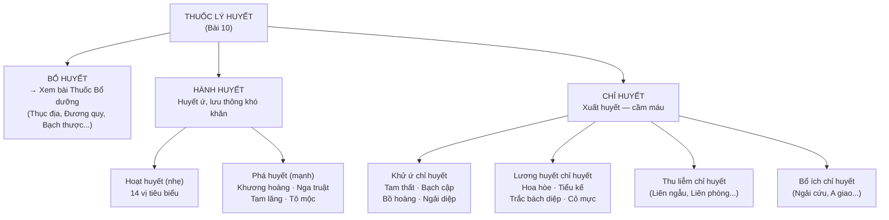

import KeyPoints from '~/components/KeyPoints.astro';
import CompareTable from '~/components/CompareTable.astro';
import ClinicalPearl from '~/components/ClinicalPearl.astro';
import RedFlags from '~/components/RedFlags.astro';
import SelfCheck from '~/components/SelfCheck.astro';
import SourceNote from '~/components/SourceNote.astro';

<KeyPoints title="7 ý lõi — đọc trước">

- **3 nhóm lý huyết:** Bổ huyết (→ bài Bổ dưỡng) · Hành huyết (hoạt huyết + phá huyết) · Chỉ huyết (cầm máu 4 loại).
- **Đương quy — 3 phần 3 tác dụng:** Quy đầu (chỉ huyết) → Quy thân (bổ huyết) → Quy vĩ (hành huyết). Toàn rễ = hoạt huyết + bổ huyết.
- **Hồng hoa — liều phụ thuộc:** Liều nhỏ (4-6 g) dưỡng huyết; liều lớn (>9 g) phá huyết, kích thích tử cung mạnh. Phụ nữ có thai kiêng.
- **Bồ hoàng — sống-sao ngược nhau:** Bồ hoàng sống → hoạt huyết; Bồ hoàng sao đen → chỉ huyết. Dùng nhầm sẽ ngược tác dụng.
- **Tam thất — vừa tán ứ vừa cầm máu:** Độc đáo duy nhất trong nhóm chỉ huyết. Dùng được cả xuất huyết và huyết ứ. Liều bột 1-3 g/lần.
- **Thuốc chỉ huyết sao cháy/sao tẩm:** Tính hàn lương của nhóm này cần "sao cháy" để chuyển tính → tăng tác dụng chỉ huyết (Hoa hòe sao đen).
- **Bạch cập kỵ Ô đầu** (thập bát phản) — kiêng kỵ tuyệt đối không phải lý do lâm sàng đơn thuần mà là tương tác làm tăng độc tính.

</KeyPoints>

---

## 1. Phân loại thuốc lý huyết

---

## 2. Vị thuốc hoạt huyết tiêu biểu

| Vị thuốc | Bộ phận | Tính vị / Kinh | Công năng nổi bật | Điểm ghi nhớ |
|---|---|---|---|---|
| **Đan sâm** | Rễ + thân rễ | Đắng, vi hàn — Tâm Can | Hoạt huyết thông kinh, thanh Tâm lương huyết | **"Một Đan sâm = bốn vật thang"** — kiêng Lê lô |
| **Đương quy** | Rễ | Cay ngọt, ôn — Tâm Can Tỳ | Bổ huyết + hoạt huyết + điều kinh + nhuận tràng | **3 phần 3 tác dụng** (xem dưới) |
| **Hồng hoa** | Hoa | Cay, ôn — Tâm Can | Hoạt huyết thông kinh, tán ứ chỉ thống | **Liều nhỏ dưỡng, liều lớn phá** |
| **Huyền hồ** | Rễ củ | Cay đắng, ôn — Phế Can Tỳ | Hoạt huyết + hành khí + chỉ thống | Giảm đau mạnh nhất nhóm (corydalin) |
| **Ích mẫu** | Toàn thân trên đất | Đắng cay, vi hàn — Tâm Can | Hoạt huyết khử ứ, lợi thủy tiêu thũng | Đặc trị phụ khoa + lợi tiểu |
| **Ngưu tất** | Rễ | Đắng chua, bình — Can Thận | Hoạt huyết + bổ Can Thận + lợi thủy | Dẫn huyết xuống dưới; kiêng thai, băng huyết |
| **Xuyên khung** | Thân rễ | Cay, ôn — Can Đờm Tâm bào | Hoạt huyết + hành khí + trừ phong hàn | Đau đầu do phong hàn; Kiêng: âm hư hỏa vượng |
| **Xích thược** | Rễ | Đắng chua, vi hàn — Can Tỳ | Hoạt huyết tán ứ, thanh Can nhiệt | Kiêng Lê lô (giống Đan sâm) |
| **Huyết giác** | Lõi gỗ gốc thân | Đắng chát, bình — Tâm Can | Hoạt huyết chỉ thống, tán ứ sinh tân, chỉ huyết | Cả trong lẫn ngoài; dùng ngoài vết thương |
| **Kê huyết đằng** | Thân dây leo | Đắng ngọt, ôn — Can Thận | Hoạt huyết thông lạc, bổ huyết | Vừa hoạt vừa bổ — tốt cho huyết hư ứ |

---

## 3. Đương quy — 3 phần 3 tác dụng

<ClinicalPearl>

**Quy đầu** (phần đầu rễ) → **Chỉ huyết** — Dùng khi xuất huyết không có ứ.
**Quy thân** (phần giữa) → **Bổ huyết** — Dùng khi huyết hư, xanh xao, mệt mỏi.
**Quy vĩ** (phần rễ nhánh) → **Hành huyết** — Dùng khi huyết ứ, bế kinh, thống kinh.
**Toàn Đương quy** = vừa bổ huyết vừa hoạt huyết → dùng phổ biến nhất.

Logic YHCT: Phần đầu "thu" (tập trung huyết lại), phần thân "giữ" (dưỡng huyết), phần vĩ "phóng" (đẩy huyết đi).

</ClinicalPearl>

---

## 4. Vị thuốc phá huyết

| Vị thuốc | Bộ phận | Tính vị | Công năng chính | Điểm ghi nhớ |
|---|---|---|---|---|
| **Khương hoàng** (Nghệ vàng) | Thân rễ | Cay đắng, ôn — Can Tỳ | Phá huyết, hành khí, chỉ thống, sinh cơ | Curcumin — chống viêm mạnh; dân gian hầm gà sau sinh |
| **Nga truật** (Nghệ đen) | Thân rễ | Cay đắng, ôn — Can Tỳ | Phá huyết, hành khí, tiêu tích | Kết hợp Khương hoàng tăng tác dụng; kiêng thai |
| **Tam lăng** | Thân rễ | Cay đắng, bình — Can Tỳ | Phá huyết, hành khí, tiêu tích, chỉ thống | Phá mạnh — kiêng thai, huyết hư, Tỳ hư |
| **Tô mộc** (Gỗ vang) | Lõi gỗ | Ngọt mặn, bình — Tâm Can Tỳ | Phá huyết khứ ứ, tiêu viêm chỉ thống | Thêm kháng khuẩn tốt — trị kiết lỵ lâu ngày |

---

## 5. Vị thuốc chỉ huyết tiêu biểu

| Vị thuốc | Nhóm | Bộ phận | Tính vị | Điểm đặc biệt |
|---|---|---|---|---|
| **Tam thất** | Khử ứ chỉ huyết | Rễ củ | Ngọt hơi đắng, ôn — Can Vị | **Vừa tán ứ vừa cầm máu** — độc đáo nhất bài |
| **Bạch cập** | Khử ứ chỉ huyết | Thân rễ | Ngọt đắng chát, vi hàn — Phế Vị | Chuyên Phế: ho ra máu, áp-xe phổi. **Kỵ Ô đầu** |
| **Bồ hoàng** | Khử ứ chỉ huyết | Hoa (cỏ nến) | Cay, ôn — Can Tâm | **Sống hoạt huyết / Sao đen chỉ huyết** |
| **Ngải diệp** | Khử ứ chỉ huyết | Thân lá | Đắng cay, ấm — Can Tỳ Thận | Điều kinh + an thai; làm ngải nhung (cứu) |
| **Hoa hòe** | Lương huyết chỉ huyết | Nụ hoa | Đắng, vi hàn — Can Đại tràng | Rutin — bền thành mao mạch; sao đen khi cầm máu |
| **Trắc bách diệp** | Lương huyết chỉ huyết | Cành non + lá | Đắng chát, hàn — Phế Can Tỳ | Vitamin K-like → tăng prothrombin |
| **Tiểu kế** | Lương huyết chỉ huyết | Toàn cây | Chua ngọt, lương — Tâm Can | Lương huyết chỉ huyết + giải độc |

---

## 6. So sánh then chốt: Hoạt huyết vs Phá huyết

<CompareTable
  headers={["", "Hoạt huyết", "Phá huyết (Phá huyết trực ứ)"]}
  rows={[
    ["Mức độ ứ huyết", "Nhẹ-vừa: huyết mạch lưu thông kém, sưng đau nhẹ", "Nặng: ứ huyết thành khối cục, đau dữ dội"],
    ["Bệnh cảnh", "Thống kinh, bế kinh, đau khớp, sang chấn nhẹ", "Khối u, thai chết lưu, sang chấn nặng, bế kinh nặng"],
    ["Đại biểu", "Đan sâm, Hồng hoa, Ích mẫu, Ngưu tất, Xuyên khung", "Khương hoàng, Nga truật, Tam lăng, Tô mộc"],
    ["Phụ nữ có thai", "Thận trọng một số vị", "Tuyệt đối kiêng"],
    ["Người hư yếu", "Phối hợp thuốc bổ", "Không dùng khi hư yếu — trừ khi có ứ trệ rõ + bổ đồng thời"],
  ]}
/>

---

## 7. Nhũ hương + Một dược — "cặp đôi hoàn hảo"

<ClinicalPearl>

**Nhũ hương** (nhựa Boswellia) + **Một dược** (nhựa Myrrha) thường dùng cùng nhau:
- Nhũ hương: hành khí → lý khí chỉ thống (mạnh về khí)
- Một dược: hoạt huyết → tán ứ (mạnh về huyết)
- Phối hợp = điều trị toàn diện khí-huyết cùng lúc → giảm đau chấn thương, thống kinh, nhọt độc.

Dùng ngoài: cả hai tán nhỏ trộn với dầu bôi lên vết thương → sinh cơ (lên da non).

</ClinicalPearl>

---

<RedFlags title="Kiêng kỵ quan trọng">

- **Phụ nữ có thai:** Kiêng hoàn toàn nhóm phá huyết (Khương hoàng, Nga truật, Tam lăng). Thận trọng hoạt huyết. Hồng hoa, Đào nhân, Ích mẫu, Ngưu tất đều kiêng thai.
- **Bạch cập + Ô đầu/Phụ tử/Thiên hùng** — Thập bát phản: tuyệt đối không phối hợp.
- **Đan sâm + Lê lô** — tương kỵ; **Xích thược + Lê lô** — tương kỵ.
- **Bồ hoàng sống vs sao đen:** Nhầm sẽ ngược tác dụng. Sao đen chỉ huyết, sống hoạt huyết.
- **Hồng hoa liều cao:** >9 g → phá huyết, gây co bóp tử cung mạnh → dùng cẩn thận kể cả người không mang thai có bệnh tim mạch.
- **Thuốc phá huyết không dùng khi không có ứ trệ** — hao tổn khí huyết.
- **Người khí hư, huyết hư nặng:** Không dùng hành huyết đơn độc — phải phối bổ khí/bổ huyết.

</RedFlags>

---

<SelfCheck title="Tự kiểm tra nhanh">

1. Phân biệt Quy đầu, Quy thân, Quy vĩ: tác dụng khác nhau như thế nào?
2. Bồ hoàng dùng sống khác sao đen ở điểm nào? Nếu đề cho bệnh nhân xuất huyết — chọn dạng nào?
3. Tam thất khác Bạch cập về công năng chỉ huyết ra sao? Khi nào chọn Tam thất thay vì Bạch cập?
4. Tại sao Nhũ hương + Một dược thường dùng cùng nhau?
5. Hồng hoa liều 3 g và 12 g tác dụng gì khác nhau? Cơ sở YHCT và YHHĐ là gì?

</SelfCheck>

<SourceNote>

- Nguồn gốc: `Raw/Thuoc_YHCT/chuong-02-cac-nhom-thuoc/bai-10-thuoc-ly-huyet_001.md`
- Sách: *Thuốc Y học cổ truyền (Tập 1)* — TS. Hứa Hoàng Oanh, TS. Nguyễn Thành Triết.

</SourceNote>
