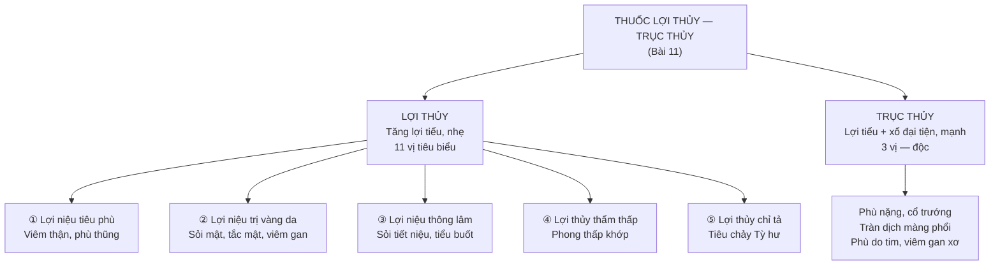

import KeyPoints from '~/components/KeyPoints.astro';
import CompareTable from '~/components/CompareTable.astro';
import ClinicalPearl from '~/components/ClinicalPearl.astro';
import RedFlags from '~/components/RedFlags.astro';
import SelfCheck from '~/components/SelfCheck.astro';
import SourceNote from '~/components/SourceNote.astro';

<KeyPoints title="7 ý lõi — đọc trước">

- **Lợi thủy ≠ Trục thủy:** Lợi thủy = tăng bài tiết nước tiểu (nhẹ, dùng dài). Trục thủy = vừa lợi tiểu vừa xổ đại tiện (mạnh, độc, chỉ dùng thực chứng nặng).
- **5 tác dụng lợi thủy:** Tiêu phù · Trị vàng da (sỏi mật) · Thông lâm (sỏi tiết niệu) · Thẩm thấp (phong thấp khớp) · Chỉ tả (tiêu chảy Tỳ hư). Ghi nhớ bằng: "Phù — Vàng — Sỏi — Khớp — Ỉa".
- **4 phép phối hợp tam tiêu:** (1) Tuyên Phế + Ma hoàng → phong thủy (phù trên). (2) Ích khí + Bạch truật/Hoàng kỳ → Tỳ hư. (3) Thông khí + Quế chi → Thận khí hóa kém. (4) Ôn Thận → Thận dương hư.
- **Phục linh 4 phần — 4 tác dụng:** Phục linh **bì** → lợi niệu tiêu thũng · **Xích** phục linh → thấp nhiệt · **Bạch** phục linh → kiện Tỳ · Phục **thần** → an thần (rễ Thông xuyên qua).
- **Trư linh > Trạch tả > Bạch linh** (mức độ lợi tiểu): Trư linh mạnh nhất nhưng không kiện Tỳ; Trạch tả hàn-lợi tiểu; Bạch linh nhẹ nhất nhưng kiêm kiện Tỳ + an thần.
- **Ý dĩ sống vs sao vàng đối lập:** Ý dĩ sống → lợi thấp nhiệt (mát, thanh nhiệt). Ý dĩ sao vàng → ôn bổ Phế Tỳ (ấm, kiện Tỳ). Nguyên tắc tương tự Bồ hoàng sống-sao đen.
- **Trục thủy = độc mạnh:** Cam toại (terpenoid độc), Khiên ngư (alkaloid, kỵ Ba đậu), Thương lục (phytolaccatoxin — độc nhất, có thể tử vong). Tuyệt đối kiêng thai.

</KeyPoints>

---

## 1. Phân loại và tác dụng chung

---

## 2. 4 phép phối hợp lợi thủy theo tam tiêu

| Phép | Vị trí bệnh | Phối hợp thêm | Ví dụ |
|---|---|---|---|
| **Tuyên Phế lợi niệu** | Phế khí ủng trệ → phù nửa trên, sợ lạnh (phong thủy) | + Ma hoàng | Viêm cầu thận cấp dạng phong thủy |
| **Ích khí lợi niệu** | Tỳ vận hóa kém → phù thùng | + Bạch truật, Hoàng kỳ | Phù do suy dinh dưỡng nhẹ, Tỳ hư |
| **Thông khí lợi niệu** | Thận khí hóa kém → tiểu ít | + Quế chi | Tiểu ít không phải nhiệt (hàn) |
| **Ôn Thận lợi niệu** | Thận dương hư → Tỳ dương yếu theo | + Phụ tử, Nhục quế | Phù do Thận dương hư mãn tính |

---

## 3. Thuốc lợi thủy tiêu biểu

| Vị thuốc | Bộ phận | Tính vị / Kinh | Công năng nổi bật | Điểm ghi nhớ |
|---|---|---|---|---|
| **Bạch linh** (Phục linh) | Nấm ký sinh rễ Thông | Ngọt nhạt, bình — Tâm Phế Tỳ Vị Thận | Lợi thủy + kiện Tỳ + an thần | **4 phần 4 tác dụng** (xem dưới) |
| **Đẳng tâm thảo** | Lõi thân Cỏ bắc đèn | Ngọt nhạt, hơi hàn — Tâm Phế Tiểu trường | Lợi tiểu + thanh Tâm hỏa | Liều nhỏ 1-3 g; trẻ khóc đêm |
| **Kim tiền thảo** | Thân lá | Ngọt mặn, lương — Can Đờm Thận Bàng quang | Lợi niệu + lợi mật | Chuyên **sỏi mật + sỏi tiết niệu**; liều 15-30 g |
| **Mộc thông** | Thân leo | Đắng, hàn — Tâm Phế Tiểu trường Bàng quang | Lợi niệu + hành huyết + tăng sữa | Vừa lợi niệu vừa thông kinh; mạnh hơn Thông thảo |
| **Râu bắp** | Vòi nhụy ngô | Ngọt, bình — Thận Bàng quang | Lợi thủy + lợi mật | Liều lớn 30-50 g; tăng prothrombin → máu đông nhanh |
| **Thông thảo** | Lõi thân | Ngọt nhạt, vi hàn — Phế Vị | Lợi tiểu + tăng sữa | Nhẹ hơn Mộc thông; **kiêng thai phụ** |
| **Trạch tả** | Thân rễ | Ngọt mặn, hàn — Thận Bàng quang | Lợi tiểu + thanh thấp nhiệt | Mạnh hơn Bạch linh; tính hàn — kiêng Thận hư hoạt tinh |
| **Trư linh** | Nấm ký sinh rễ Sau sau | Ngọt nhạt, bình — Thận Bàng quang | Lợi tiểu + táo thấp | Mạnh nhất nhóm nấm; **không kiện Tỳ** |
| **Tỳ giải** | Thân rễ | Đắng, bình — Can Vị Thận Bàng quang | Phân thanh trừ trọc + khu phong thấp | **Tiểu đục, dưỡng chấp** — chuyên biệt; khu phong thấp |
| **Xa tiền** (Mã đề) | Hạt (tử) / Lá (thảo) | Ngọt lương/hàn — Can Phế Thận Tiểu trường | Tử: thông lâm + minh mục. Thảo: tiêu thũng + Phế | **Tử vs Thảo** khác công năng |
| **Ý dĩ** (Bo bo) | Hạt | Ngọt, hàn — Tỳ Phế | Lợi thủy + kiện Tỳ + bài nùng | **Sống lợi nhiệt; sao vàng ôn bổ** |

---

## 4. Phục linh — 4 phần 4 tác dụng

<ClinicalPearl>

**Phục linh bì** (vỏ ngoài) → **Lợi niệu tiêu thũng** — phù toàn thân.
**Xích phục linh** (lớp thứ 2, hơi hồng) → **Lợi thấp nhiệt** — tiểu đỏ, viêm nhiễm.
**Bạch phục linh** (lõi trắng) → **Kiện Tỳ** — tiêu chảy Tỳ hư, kém ăn.
**Phục thần** (có rễ Thông xuyên qua) → **An thần** — mất ngủ, hồi hộp, hay quên.

**Ghi nhớ:** Bì → thũng; Xích → nhiệt; Bạch → Tỳ; Thần → thần (tâm thần).

</ClinicalPearl>

---

## 5. So sánh 3 vị lợi tiểu nấm/thân rễ hay nhầm

<CompareTable
  headers={["Tiêu chí", "Bạch linh (Phục linh)", "Trạch tả", "Trư linh"]}
  rows={[
    ["Nguồn gốc", "Nấm ký sinh rễ Thông", "Thân rễ cây Trạch tả", "Nấm ký sinh rễ Sau sau"],
    ["Mức lợi tiểu", "Nhẹ nhất", "Trung bình", "Mạnh nhất"],
    ["Tính", "Bình", "Hàn", "Bình"],
    ["Kiêng kỵ", "Âm hư thấp nhiệt; kỵ Giấm", "Thận hư hoạt tinh, Tỳ hư", "Thai phụ, Thận bệnh thận trọng"],
    ["Tác dụng thêm", "Kiện Tỳ + An thần (Phục thần)", "Hạ urê, cholesterol, đường huyết", "Tăng miễn dịch, bảo vệ gan"],
    ["Không có tác dụng", "Không mạnh lợi tiểu như Trạch tả", "Không kiện Tỳ, không an thần", "Không kiện Tỳ, không sinh tân chỉ khát"],
  ]}
/>

---

## 6. Xa tiền — tử vs thảo

<CompareTable
  headers={["Tiêu chí", "Xa tiền tử (hạt)", "Xa tiền thảo (lá)"]}
  rows={[
    ["Tính vị", "Ngọt, lương", "Ngọt, hàn"],
    ["Công năng chính", "Lợi thủy thông lâm + Thanh Can minh mục + hóa đờm", "Lợi thủy tiêu thũng + Thanh nhiệt + Lợi Phế"],
    ["Chỉ định đặc biệt", "Tiểu gắt buốt, mắt đỏ sưng, hiếm muộn, Phế nhiệt ho đờm", "Bỏng (dịch lá tươi), mụn nhọt ngoài da, viêm khí quản"],
    ["Liều", "Sắc hoặc bột 16-20 g", "Lá tươi 60-90 g hoặc dịch ép"],
    ["Hoạt chất nổi bật", "Aucubin (iridoid), chất nhầy", "Acid plantenolic, cholin, adenin"],
  ]}
/>

---

## 7. Thuốc trục thủy — độc, chỉ thực chứng nặng

| Vị thuốc | Bộ phận | Tính | Độc | Công năng | Chỉ định | Kiêng kỵ |
|---|---|---|---|---|---|---|
| **Cam toại** | Rễ | Đắng, hàn | Có độc | Trục thủy tả hạ | Phù bụng, tràn dịch màng phổi, đại tiểu tiện bí | Thai phụ |
| **Khiên ngư** (hạt Bìm bìm) | Hạt | Đắng, hàn | Hơi độc | Trục thủy + sát trùng (giun) | Phù bụng thực chứng, bí đại tiểu tiện | Thai phụ; **kỵ Ba đậu** |
| **Thương lục** | Rễ củ | Đắng, hàn | Độc mạnh (phytolaccatoxin) | Trục thủy mạnh nhất + giải độc tiêu viêm | Phù thũng toàn thân thực chứng nặng; dùng ngoài mụn nhọt | Thai phụ; Tỳ hư thủy thũng |

---

<RedFlags title="Kiêng kỵ quan trọng">

- **Tuyệt đối không dùng trục thủy khi có thai** — Cam toại, Khiên ngư, Thương lục đều kiêng thai.
- **Không dùng lợi thủy khi bí tiểu do thiếu tân dịch** — làm tổn thương tân dịch thêm, bí hơn.
- **Không dùng lợi thủy kéo dài** — tổn thương tân dịch, mất điện giải.
- **Phụ nữ có thai + người già Thận hư kém** — kiêng toàn bộ nhóm lợi thủy mạnh (Trạch tả, Trư linh); Thông thảo kiêng thai.
- **Di tinh, hoạt tinh không thấp nhiệt** — không dùng lợi thủy (sẽ thoát tinh thêm).
- **Phù do suy dinh dưỡng** — không dùng lợi tiểu mạnh (phối hợp thuốc bổ là chính).
- **Thương lục ngộ độc**: tăng thân nhiệt, nhịp tim nhanh, nôn mửa; nặng → hôn mê, khó thở, sung huyết tim, tử vong. Dùng liều tối thiểu (3-9 g) và theo dõi sát.
- **Khiên ngư kỵ Ba đậu** — không phối hợp: cả hai đều xổ mạnh → nguy cơ mất nước điện giải nghiêm trọng.

</RedFlags>

---

<SelfCheck title="Tự kiểm tra nhanh">

1. Phân biệt lợi thủy và trục thủy: đường bài tiết khác nhau thế nào? Mức độ nặng nhẹ chỉ định?
2. Phục linh có mấy phần? Khi bệnh nhân phù toàn thân dùng phần nào? Khi mất ngủ dùng phần nào?
3. Trạch tả và Trư linh khác Bạch linh ở điểm nào quan trọng nhất? Khi nào chọn Bạch linh thay vì Trư linh?
4. Ý dĩ sống và sao vàng tác dụng gì khác nhau? Điểm tương đồng với Bồ hoàng?
5. Kim tiền thảo trị sỏi theo cơ chế nào (gợi ý: pH nước tiểu)?

</SelfCheck>

<SourceNote>

- Nguồn gốc: `Raw/Thuoc_YHCT/chuong-02-cac-nhom-thuoc/bai-11-thuoc-loi-thuy-truc-thuy_001.md`
- Sách: *Thuốc Y học cổ truyền (Tập 1)* — TS. Hứa Hoàng Oanh, TS. Nguyễn Thành Triết.

</SourceNote>
