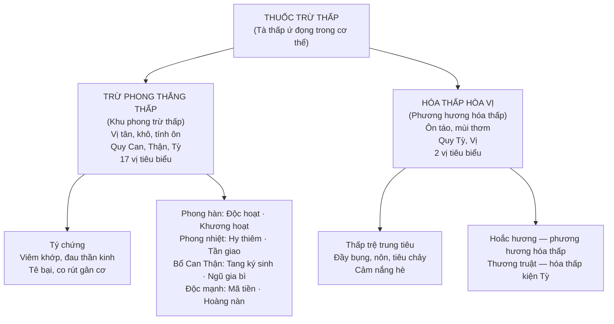

import CompareTable from '~/components/CompareTable.astro';
import KeyPoints from '~/components/KeyPoints.astro';
import ClinicalPearl from '~/components/ClinicalPearl.astro';
import RedFlags from '~/components/RedFlags.astro';
import SelfCheck from '~/components/SelfCheck.astro';
import SourceNote from '~/components/SourceNote.astro';

<KeyPoints title="7 ý lõi — Bài 12">

- **2 nhóm khác vị trí bệnh:** Trừ phong thắng thấp → tý chứng (khớp, gân cơ, kinh lạc). Hóa thấp hòa Vị → thấp trệ trung tiêu (Tỳ Vị, đầy bụng, nôn, tiêu chảy).
- **Tính chất phân biệt:** Trừ phong thắng thấp: vị **tân, khô**, tính **ôn**, quy **Can-Thận-Tỳ**. Hóa thấp hòa Vị: **ôn táo**, mùi **thơm**, quy **Tỳ-Vị**.
- **4 phép phối hợp:** Phong thắng → khu phong mạnh. Hàn thắng → ôn kinh tán hàn (+ Quế chi). Thấp thắng → táo thấp (+ Bạch truật). Nhiệt thắng → thanh nhiệt trừ thấp.
- **Mã tiền + Hoàng nàn = strychnin/brucin ĐỘC:** Liều cực nhỏ (Mã tiền: 0,05–0,10 g/lần; Hoàng nàn: ≤0,1 g/lần, max 0,4 g/ngày). Quá liều → co giật, tử vong.
- **Cốt khí — Resveratrol:** Stilben chống oxy hóa mạnh, bảo vệ tim mạch + thần kinh, kháng viêm.
- **Tang ký sinh đặc biệt:** Vừa trừ phong thấp, vừa **bổ Can Thận mạnh gân cốt**, lại **an thai** (huyết hư động thai) + lợi sữa — nhóm duy nhất có đầy đủ 3 công dụng này.
- **Thương truật minh mục:** Trị quáng gà (dạ manh) — vị duy nhất trong nhóm có tác dụng này. Sống → ráo thấp mạnh; sao → tính ráo giảm (ngâm nước gạo, sao vàng cho người thấp nhẹ).

</KeyPoints>

---

## Sơ đồ phân loại

---

## 17 vị trừ phong thắng thấp — tra cứu nhanh

| Vị thuốc | Bộ phận | Hoạt chất nổi bật | Đặc điểm riêng |
|---|---|---|---|
| **Cốt khí** | Rễ củ | Resveratrol, polydatin, emodin | Kháng viêm + tim mạch + chống OXH mạnh |
| **Đau xương** | Thân leo | Tinosisin A/B (diterpene glycosid) | Trừ phong + triệt ngược (sốt rét) |
| **Độc hoạt** | Rễ | Coumarin, tinh dầu | Phong hàn thấp tý — đau **nửa dưới** (thắt lưng, gối) |
| **Hoàng nàn** | Vỏ thân/cành | Strychnin, brucin — **ĐỘC** | ≤0,4 g/ngày; trị nhược cơ, bán thân bất toại |
| **Hy thiêm** | Cả cây | Darutosid (diterpen), flavonoid | Phong thấp **nhiệt** + bình Can tiềm dương (hạ HA) |
| **Ké đầu ngựa** | Quả (Thương nhĩ tử) | Sesquiterpenoid | Thông Ty khiếu — viêm xoang mũi |
| **Khương hoạt** | Thân rễ + rễ | Coumarin (imperatorin) | Đau **nửa trên** (vai, đầu, lưng trên) |
| **Lá lốt** | Cả cây | β-caryophyllen, piperin | Khu phong + ôn trung tán hàn (đau dạ dày) |
| **Mã tiền** | Hạt | Strychnin, brucin — **RẤT ĐỘC** | 0,05–0,10 g/lần; nhược cơ, liệt mềm |
| **Mắc cở** | Lá + rễ | Mimosin, flavonoid, selen | Trừ phong + an thần (mất ngủ, hồi hộp) |
| **Nhàu** | Rễ | Xeronin (alkaloid), anthraquinon | Trừ phong + nhuận tràng + hạ HA nhẹ |
| **Ngũ gia bì** | Vỏ thân | Saponin triterpenoid, diterpenoid | Mạnh gân cốt + giải độc lá Ngón, say Sắn |
| **Tang chi** | Cành non | Resveratrol, flavonoid, polyphenol | Đau tay chân (chi trên) + lợi thủy |
| **Tang ký sinh** | Thân cành lá | Quercetin, avicularin | Trừ phong + bổ Can Thận + **an thai** + lợi sữa |
| **Tần giao** | Rễ | Alkaloid (justicin) | Phong thấp **nhiệt** + âm hư nội nhiệt (sốt chiều) |
| **Thiên niên kiện** | Thân rễ | L-linalol, terpineol (tinh dầu), hederagenin | Phong hàn thấp + kiện Vị (đau dạ dày) |
| **Uy linh tiên** | Rễ + thân rễ | Anemonin, anemonol, saponin | Khu phong mạnh + trị vàng da |

---

## 2 vị hóa thấp hòa Vị

| Vị thuốc | Bộ phận | Hoạt chất | Tác dụng đặc trưng |
|---|---|---|---|
| **Hoắc hương** | Trên mặt đất | Patchouli alcohol (tinh dầu) | Phương hương hóa thấp + giải thử (cảm nắng) + chỉ ẩu (nôn) |
| **Thương truật** | Thân rễ | Tinh dầu, sesquiterpen | Hóa thấp kiện Tỳ + khu phong trừ thấp + **minh mục** (quáng gà) |

---

## So sánh nhanh

<CompareTable
  headers={["Tiêu chí", "Trừ phong thắng thấp", "Hóa thấp hòa Vị"]}
  rows={[
    ["Vị trí bệnh", "Gân xương, cơ nhục, kinh lạc (ngoại vi)", "Trung tiêu (Tỳ Vị, tiêu hóa)"],
    ["Tính vị", "Tân, khô, tính ôn", "Ôn táo, mùi thơm"],
    ["Quy kinh", "Can, Thận, Tỳ", "Tỳ, Vị"],
    ["Triệu chứng chính", "Đau khớp, tê bại, co rút, phong tý", "Đầy bụng, nôn, tiêu chảy, kém ăn"],
    ["Bệnh YHHĐ", "Viêm khớp, đau thần kinh, bại liệt", "Rối loạn tiêu hóa, cảm nắng"],
    ["Kiêng dùng", "Âm hư huyết hư (tính ôn táo hao âm)", "Khí hư, âm hư, tân dịch giảm"],
  ]}
/>

<CompareTable
  headers={["Tiêu chí", "Mã tiền", "Hoàng nàn"]}
  rows={[
    ["Bộ phận dùng", "Hạt (Semen Strychni)", "Vỏ thân/cành (Cortex)"],
    ["Họ thực vật", "Loganiaceae (Mã tiền)", "Loganiaceae (Mã tiền)"],
    ["Hoạt chất độc", "Strychnin + brucin", "Strychnin + brucin (tương tự)"],
    ["Liều dùng", "0,05–0,10 g/lần, 3 lần/ngày", "≤0,1 g/lần, max 0,4 g/ngày"],
    ["Chỉ định đặc trưng", "Nhược cơ, liệt mềm, bại liệt trẻ em", "Bán thân bất toại, nhược cơ, bệnh ngoài da"],
    ["Cơ chế độc", "Strychnin ức chế glycine → co giật", "Strychnin ức chế glycine → co giật (giống nhau)"],
  ]}
/>

<CompareTable
  headers={["Tiêu chí", "Độc hoạt", "Khương hoạt"]}
  rows={[
    ["Họ thực vật", "Apiaceae (Đỗ Hải tự)", "Apiaceae (Đỗ Hải tự)"],
    ["Hoạt chất", "Coumarin, tinh dầu, flavonoid", "Coumarin (imperatorin), phenol"],
    ["Vùng đau đặc trưng", "Nửa dưới cơ thể (thắt lưng, gối, cổ chân)", "Nửa trên cơ thể (vai, đầu, lưng trên)"],
    ["Tính vị", "Cay, đắng, vi ôn", "Cay, đắng, ôn"],
    ["Phối hợp điển hình", "Ngưu tất, Phòng kỷ, Đỗ trọng (thắt lưng)", "Phòng phong, Tế tân (cảm phong hàn)"],
  ]}
/>

<CompareTable
  headers={["Tiêu chí", "Tang chi", "Tang ký sinh"]}
  rows={[
    ["Nguồn gốc", "Cành non cây Dâu (Morus alba)", "Tầm gửi trên cây Dâu (Loranthus)"],
    ["Hoạt chất", "Resveratrol, flavonoid, polyphenol", "Quercetin, avicularin"],
    ["Quy kinh", "Can", "Can, Thận"],
    ["Công năng chính", "Khu phong thấp, thông khớp — đặc biệt tay chân", "Trừ phong thấp + BỔ Can Thận + an thai + lợi sữa"],
    ["Đặc điểm độc đáo", "Thêm lợi thủy (phối Kim tiền thảo)", "Vị duy nhất vừa khu phong vừa an thai"],
  ]}
/>

<RedFlags title="Bẫy hay gặp">

- **Mã tiền ≠ Hoàng nàn:** Cùng strychnin nhưng khác bộ phận (hạt vs vỏ), khác liều tối đa. Đề thi thường hỏi "liều tối đa" → phân biệt rõ.
- **Tang chi ≠ Tang ký sinh:** Cùng cây Dâu nhưng Tang chi = cành Dâu (không bổ Thận), Tang ký sinh = ký sinh trên Dâu (bổ Can Thận + an thai).
- **Độc hoạt vs Khương hoạt:** Ghi nhớ: Độc = Dưới (thắt lưng xuống); Khương = trên (vai, đầu). Cùng Apiaceae, khác vùng đau.
- **Hy thiêm kiêng sắt (kỵ Sắt):** Điểm đặc biệt duy nhất của Hy thiêm — không sắc trong nồi sắt.
- **Thương truật sống ráo thấp mạnh → người thấp nhẹ dùng sao vàng** (ngâm nước gạo trước).
- **Hóa thấp hòa Vị phải cho vào sau cùng** khi sắc thuốc (tinh dầu dễ bay hơi → mất tác dụng nếu sắc lâu).
- **Mắc cở rễ liều cao bất thường:** Lá 6–12 g, nhưng Rễ lên đến 120 g — chênh lệch 10 lần.
- **Nhàu (rễ Morinda):** Vừa trừ phong vừa nhuận tràng nhẹ — không nhầm với Nhàu dùng làm nước uống sức khỏe (quả Morinda citrifolia = quả noni).

</RedFlags>

<SelfCheck title="Tự kiểm — 5 câu">

1. Tại sao thuốc trừ phong thắng thấp quy kinh **Can** và **Thận** (không chỉ Tỳ)?
2. Bệnh nhân viêm khớp đang có âm hư hỏa vượng — chọn nhóm thuốc nào trong bài 12? Kiêng gì?
3. Phân biệt cơ chế của Độc hoạt (đau nửa dưới) và Khương hoạt (đau nửa trên) theo lý luận YHCT.
4. Tại sao Hoắc hương **phải cho vào sau cùng** khi sắc thuốc?
5. Tang ký sinh "an thai" — cơ chế YHCT là gì? Bài thuốc điển hình nào?

</SelfCheck>

<SourceNote>
Bài 12 — Thuốc trừ thấp. Nguồn: *Thuốc Y học cổ truyền (Tập 1)*, TS. Hứa Hoàng Oanh, TS. Nguyễn Thành Triết.
</SourceNote>
