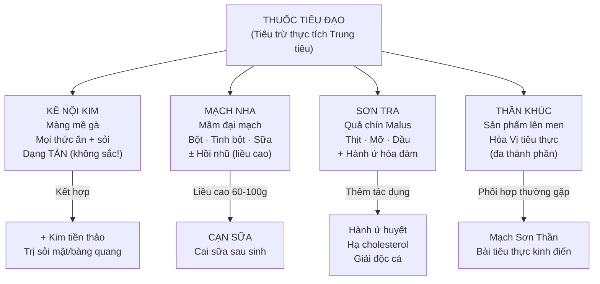

import CompareTable from '~/components/CompareTable.astro';
import KeyPoints from '~/components/KeyPoints.astro';
import ClinicalPearl from '~/components/ClinicalPearl.astro';
import RedFlags from '~/components/RedFlags.astro';
import SelfCheck from '~/components/SelfCheck.astro';
import SourceNote from '~/components/SourceNote.astro';

<KeyPoints title="6 ý lõi — Bài 13">

- **Định nghĩa:** Tiêu đạo = Tiêu trừ **thực tích** ở Trung tiêu (thức ăn ứ trệ dạ dày-ruột). Khác với lý khí (thông khí) hay tả hạ (tống thẳng ra).
- **4 vị — mỗi vị tiêu loại thức ăn khác nhau:** Kê nội kim (mọi loại + sỏi); Mạch nha (bột, tinh bột, sữa); Sơn tra (thịt, mỡ, dầu); Thần khúc (hòa hoãn, tiêu hóa chung).
- **Kê nội kim PHẢI dùng dạng tán** (bột sao vàng), **không sắc** — enzyme protein bị biến tính khi đun sôi → mất tác dụng.
- **Mạch nha hồi nhũ:** Liều cao 60–100 g/ngày sắc 3 ngày → làm mất sữa (cai sữa). Liều thường (9–15 g) → tiêu thực. Kiêng phụ nữ có thai và đang cho con bú.
- **Sơn tra độc đáo:** Vừa tiêu thực (đặc biệt thịt-mỡ), vừa **hành ứ** (hoạt huyết nhẹ — trị sản hậu ứ huyết), vừa hạ cholesterol. Vị duy nhất trong nhóm có tác dụng huyết.
- **Thần khúc = sản phẩm lên men:** α-amylase + enzyme từ nhiều vị thuốc phối hợp. Tính ôn, cay — có thể kiêm hóa thấp hòa Vị khi thực tích kèm thấp trệ.

</KeyPoints>

---

## Sơ đồ phân loại

---

## 4 vị tiêu đạo tiêu biểu

| Vị thuốc | Nguồn gốc | Hoạt chất chính | Tính vị | Quy kinh | Đặc điểm nổi bật |
|---|---|---|---|---|---|
| **Kê nội kim** | Màng trong mề gà khô | Isoflavon, protid, acid mật | Ngọt, bình | Tỳ, Vị, Tiểu trường, Bàng quang | Tiêu mọi loại thức ăn + sáp tinh (sỏi, di tinh, đái dầm) |
| **Mạch nha** | Quả đại mạch nảy mầm | Amylase A+B, maltase, maltose | Ngọt, bình | Tỳ, Vị | Tiêu bột/tinh bột/sữa; hồi nhũ liều cao |
| **Sơn tra** | Quả chín Malus doumeri | Acid tartaric, citric, flavonoid, fructose | Chua, ngọt, ôn | Can, Tỳ, Vị | Tiêu thịt mỡ; hành ứ hóa đàm; hạ cholesterol |
| **Thần khúc** | Bột mì/gạo lên men + nhiều vị | α-amylase, acid hữu cơ, tinh dầu | Ngọt, cay, ôn | Tỳ, Vị | Tiêu thực hòa Vị toàn diện; sản phẩm lên men |

---

## So sánh 4 vị tiêu đạo

<CompareTable
  headers={["Tiêu chí", "Kê nội kim", "Mạch nha", "Sơn tra", "Thần khúc"]}
  rows={[
    ["Thức ăn tích đặc trưng", "Mọi loại (toàn năng nhất)", "Bột, tinh bột, sữa (glucid)", "Thịt, mỡ, dầu (lipid/protein)", "Hòa hoãn, không đặc hiệu"],
    ["Tính chất đặc biệt", "Sáp tinh, trị sỏi", "Hồi nhũ (cai sữa)", "Hành ứ hóa đàm, hạ cholesterol", "Lên men, kiêm hóa thấp"],
    ["Dạng dùng tốt nhất", "TÁN bột (không sắc)", "Sắc (sống hoặc sao)", "Sắc, bột, viên", "Sắc, bột, trà"],
    ["Tính vị", "Ngọt, bình", "Ngọt, bình", "Chua, ngọt, ôn", "Ngọt, cay, ôn"],
    ["Quy kinh thêm", "Tiểu trường, Bàng quang", "—", "Can", "—"],
    ["Kiêng kỵ chính", "Không tích trệ", "Phụ nữ có thai, cho con bú", "—", "—"],
  ]}
/>

<CompareTable
  headers={["Tiêu chí", "Mạch nha sống", "Mạch nha sao vàng"]}
  rows={[
    ["Tính", "Bình", "Bình (không đổi nhiều)"],
    ["Tác dụng chính", "Kiện Tỳ dưỡng Vị", "Tiêu tích hành khí (mạnh hơn)"],
    ["Chỉ định", "Tỳ Vị hư, ăn kém không có tích", "Thực tích, đầy bụng, khí trệ"],
    ["Amylase còn hoạt tính?", "Còn nhiều (mầm tươi/khô nhẹ)", "Giảm một phần (nhiệt phá enzyme)"],
  ]}
/>

<ClinicalPearl>

**Bài "Mạch Sơn Thần" kinh điển:** Mạch nha sao 12 g + Sơn tra sống 12 g + Thần khúc 12 g — bài đơn giản nhất tiêu thực tổng hợp (tinh bột + thịt mỡ + hòa vị). Thêm Kê nội kim 6 g (dạng bột riêng uống kèm) nếu tích nặng hơn. Đây là bài thuốc cha mẹ hay dùng cho trẻ em biếng ăn, cam tích.

</ClinicalPearl>

<RedFlags title="Bẫy hay gặp">

- **Kê nội kim không sắc** — enzyme protein biến tính ở nhiệt cao → dùng dạng TÁN (bột sao vàng). Mạch nha và Sơn tra vẫn có thể sắc bình thường.
- **Mạch nha cai sữa ≠ tiêu thực liều thường:** Liều tiêu thực 9–15 g; liều cai sữa 60–100 g/ngày × 3 ngày. Nhầm liều → hoặc không hiệu quả, hoặc gây tác dụng không mong muốn.
- **Mạch nha kiêng phụ nữ có thai** — không phải vì độc tính mà vì có thể gây cạn sữa khi dùng lâu.
- **Sơn tra xanh ≠ Sơn tra chín:** Quả chín (đỏ) → sinh tân dịch. Quả còn xanh → gây tiêu chảy, khó tiêu — tác dụng ngược!
- **Tiêu đạo kiêng Tỳ hư không tích:** Dùng nhầm tiêu đạo cho người chỉ Tỳ hư (không có tích thực) → tiêu hao thêm chính khí. Phải phối hợp kiện Tỳ trước.
- **Thần khúc** là bài thuốc, không phải vị thuốc đơn — thành phần thay đổi theo địa phương và nhà sản xuất.

</RedFlags>

<SelfCheck title="Tự kiểm — 5 câu">

1. Tại sao Kê nội kim phải dùng dạng tán, không sắc? Giải thích theo cơ chế hóa học.
2. Bệnh nhân sau sinh muốn cai sữa. Vị nào trong bài 13? Liều bao nhiêu? Dùng bao nhiêu ngày?
3. Sơn tra có công năng "hành ứ" — điều này khác nhóm thuốc tiêu đạo thông thường thế nào? Phối hợp gì để tăng tác dụng?
4. Thần khúc là gì? Tại sao nó "ôn" hơn Kê nội kim và Mạch nha (cả hai đều bình)?
5. Bệnh nhi 5 tuổi bị cam tích (thực tích + Tỳ hư). Bài thuốc tiêu đạo phù hợp nhất gồm những gì?

</SelfCheck>

<SourceNote>
Bài 13 — Thuốc tiêu đạo. Nguồn: *Thuốc Y học cổ truyền (Tập 1)*, TS. Hứa Hoàng Oanh, TS. Nguyễn Thành Triết.
</SourceNote>
