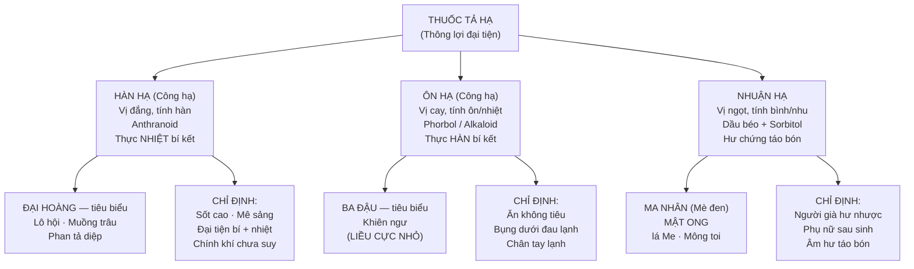

import CompareTable from '~/components/CompareTable.astro';
import KeyPoints from '~/components/KeyPoints.astro';
import ClinicalPearl from '~/components/ClinicalPearl.astro';
import RedFlags from '~/components/RedFlags.astro';
import SelfCheck from '~/components/SelfCheck.astro';
import SourceNote from '~/components/SourceNote.astro';

<KeyPoints title="7 ý lõi — Bài 14">

- **3 nhóm, 3 cơ chế khác nhau:** Hàn hạ (anthranoid kích thích ruột) → Ôn hạ (phorbol ester kích thích cực mạnh) → Nhuận hạ (dầu béo bôi trơn + thẩm thấu).
- **Anthranoid liều phụ thuộc:** Liều thấp = Nhuận tràng; Liều cao = Tả mạnh. Áp dụng: Đại hoàng, Lô hội, Phan tả diệp, Muồng trâu.
- **Đại hoàng 3 dạng dùng:** (1) Sắc ngắn → Tả mạnh (anthranoid); (2) Sắc lâu → Tả yếu (anthranoid phân hủy, còn tannin); (3) Sao cháy → **Cầm máu** (tannin chiếm ưu thế). Đây là vị thuốc YHCT điển hình thay đổi tác dụng theo cách chế biến.
- **Ba đậu cực độc, liều cực nhỏ:** 0,02–0,5 g/ngày. Phorbol ester — kích thích PKC → co thắt ruột dữ dội. Giải độc: Đậu xanh/Đậu đen/Hoàng liên. **Kỵ Khiên ngư** (tổng hợp 2 tác nhân xổ mạnh).
- **Ma nhân (Mè đen) đa công năng:** Không chỉ nhuận táo (40–60 g) mà còn **bổ Can Thận** (12–25 g), dưỡng huyết, lợi sữa, chỉ huyết (giảm tiểu cầu). Phân biệt với **Đại ma nhân** (*Cannabis sativa* — cần sa).
- **Mật ong "hoãn cấp giảm đau":** Tác dụng điều hòa, giải độc Ô đầu, bổ trung, nhuận Phế chỉ khái — không chỉ nhuận trường. Mật **tươi** → nhuận trường; Mật **luyện** → trị ho giảm đau.
- **Đại hoàng KHÔNG sắc lâu** — Anthranoid dễ phân hủy khi đun lâu → tả yếu. Cho vào sau cùng hoặc hãm (hậu hạ).

</KeyPoints>

---

## Sơ đồ phân loại 3 nhóm

---

## 4 vị thuốc tiêu biểu

| Vị thuốc | Nhóm | Bộ phận | Hoạt chất | Tính vị | Quy kinh |
|---|---|---|---|---|---|
| **Đại hoàng** | Hàn hạ | Thân rễ | Antraglycosid (rhein, emodin, chrysophanol) + Tannin | Đắng, hàn | Tâm, Can, Tỳ, Vị, **Đại trường** |
| **Ba đậu** | Ôn hạ | Quả chín | Dầu béo, phorbol, acid aratonic — **RẤT ĐỘC** | Cay, nhiệt | Vị, **Đại trường** |
| **Ma nhân** | Nhuận hạ | Hạt Mè đen | Dầu béo, vitamin, khoáng chất | Ngọt, bình | Tâm, Phế, Tỳ, Can, Thận |
| **Mật ong** | Nhuận hạ | Mật ong | Acid amin, vitamin, khoáng chất, men | Ngọt, bình | Phế, Tỳ, **Đại trường** |

---

## Đại hoàng — 3 trạng thái, 3 tác dụng

<CompareTable
  headers={["Dạng dùng", "Cơ chế", "Tác dụng", "Áp dụng"]}
  rows={[
    ["Sắc ngắn / Hậu hạ (cho vào cuối)", "Anthranoid còn nguyên vẹn", "Tả mạnh nhất", "Thực nhiệt bí kết cấp, Đại thừa khí thang"],
    ["Sắc lâu (30-45 phút)", "Anthranoid phân hủy → còn Tannin", "Tả yếu, hòa hoãn", "Bệnh mạn, người yếu, phối Cam thảo"],
    ["Sao cháy (Đại hoàng thán)", "Tannin chiếm ưu thế → thu sáp", "CẦM MÁU (chỉ huyết)", "Nôn máu, chảy máu cam do hỏa độc, sung huyết"],
  ]}
/>

<CompareTable
  headers={["Tiêu chí", "Hàn hạ (Đại hoàng)", "Ôn hạ (Ba đậu)", "Nhuận hạ (Ma nhân, Mật ong)"]}
  rows={[
    ["Bệnh cảnh", "Thực nhiệt — sốt, khát, phân khô cứng", "Thực hàn — chân tay lạnh, bụng đau lạnh", "Hư chứng — người già, sau sinh, âm hư"],
    ["Tính chất", "Đắng hàn", "Cay nhiệt (rất độc)", "Ngọt nhu, hòa hoãn"],
    ["Hoạt chất chủ lực", "Anthranoid (kích thích ruột)", "Phorbol ester (kích thích PKC)", "Dầu béo (bôi trơn + thẩm thấu)"],
    ["Liều tả mạnh", "12 g, sắc ngắn", "0,02–0,5 g (cực nhỏ!)", "Không có liều tả mạnh"],
    ["Phối hợp điển hình", "+ Hậu phác + Chỉ thực (Đại thừa khí)", "+ Sinh khương + Đại hoàng", "+ Dưỡng âm (Mạch môn, Sinh địa)"],
    ["Kiêng kỵ chính", "Không tích nhiệt; Phụ nữ có thai", "Tất cả người yếu; Thai kỳ; Kỵ Khiên ngư", "Âm hư khô ráo (Ma nhân); Tiêu chảy (Mật ong)"],
  ]}
/>

<ClinicalPearl>

**Đại thừa khí thang — bài tả mạnh nhất YHCT:**
Đại hoàng (hậu hạ) 12 g + Mang tiêu 9 g + Hậu phác 15 g + Chỉ thực 12 g.
- Đại hoàng: Tả nhiệt thông trường (anthranoid).
- Mang tiêu (Na₂SO₄): Giữ nước trong lòng ruột (osmotic laxative).
- Hậu phác: Giáng khí, giảm trướng bụng.
- Chỉ thực: Hành khí, tăng nhu động.
Bốn vị phối hợp → tác dụng gấp nhiều lần từng vị đơn lẻ.

</ClinicalPearl>

<RedFlags title="Bẫy hay gặp">

- **Ba đậu kỵ Khiên ngư** — cả 2 đều xổ mạnh, phối hợp gây mất nước nghiêm trọng, nguy hiểm tính mạng.
- **Đại hoàng không sắc lâu** — cho vào sau cùng (hậu hạ) để giữ anthranoid. Sắc lâu → còn tannin → hiệu quả ngược (táo sau tả).
- **Đại hoàng sao cháy = cầm máu** (không phải tả). Đề hỏi "chỉ huyết dùng dạng nào" → sao cháy (thán).
- **Ma nhân khác Đại ma nhân (Cannabis):** Ma nhân = Mè đen (*Sesamum*); Đại ma nhân = cần sa (*Cannabis*). Tên gần nhau nhưng họ thực vật hoàn toàn khác.
- **Mật ong tươi ≠ Mật ong luyện:** Tươi → nhuận trường; Luyện (đun nóng xử lý) → trị ho giảm đau (nhuận Phế hoãn cấp).
- **Ma nhân liều nhuận hạ (40–60 g) > liều bổ (12–25 g)** — cùng vị thuốc, liều thấp bổ, liều cao nhuận.
- **Không dùng hàn hạ khi biểu chứng còn** — phải giải biểu trước, công lý sau (hoặc biểu lý song giải).
- **Hàn hạ kiêng:** Người già dương khí suy, phụ nữ có thai, kinh nguyệt, sau sinh, loét dạ dày, xuất huyết ruột, trĩ.
- **Tannin rebound:** Đại hoàng dùng nhiều → sau tả gây táo bón lại (tannin thu sáp). Không lạm dụng.

</RedFlags>

<SelfCheck title="Tự kiểm — 5 câu">

1. Tại sao cùng một vị Đại hoàng mà sắc lâu tả yếu hơn sắc ngắn? Giải thích cơ chế hóa học.
2. Bệnh nhân 70 tuổi, âm hư táo bón, sau sốt kéo dài tân dịch kiệt. Không dùng hàn hạ — tại sao? Dùng nhóm nào? Phối hợp thêm gì?
3. Ba đậu giải độc bằng gì? Cơ chế tại sao Đậu xanh/Hoàng liên giải được?
4. Mật ong "giải độc Ô đầu" — điều này liên quan đến tính chất gì của Mật ong?
5. So sánh Ma nhân và Mạch nha về công năng "hồi nhũ" — hai vị này khác nhau thế nào?

</SelfCheck>

<SourceNote>
Bài 14 — Thuốc tả hạ. Nguồn: *Thuốc Y học cổ truyền (Tập 1)*, TS. Hứa Hoàng Oanh, TS. Nguyễn Thành Triết.
</SourceNote>
