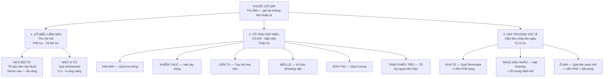

import CompareTable from '~/components/CompareTable.astro';
import KeyPoints from '~/components/KeyPoints.astro';
import ClinicalPearl from '~/components/ClinicalPearl.astro';
import RedFlags from '~/components/RedFlags.astro';
import SelfCheck from '~/components/SelfCheck.astro';
import SourceNote from '~/components/SourceNote.astro';

<KeyPoints title="7 ý lõi — Bài 15">

- **Cố sáp = Thu giữ cái đang thoát:** Mồ hôi → liễm hãn; Tinh/nước tiểu → cố tinh sáp niệu; Phân lỏng → sáp trường. Cơ chế chung: tannin + acid hữu cơ → thu liễm protein niêm mạc.
- **Nguyên tắc vàng:** Không dùng cố sáp khi **ngoại tà chưa giải** → tính thu liễm giữ tà lại → nặng hơn. Chỉ dùng khi hư chứng lâu ngày, tà đã sạch.
- **Mẫu lệ 2 dạng, 2 tác dụng:** Sống → Nhuyễn kiên (làm mềm hạch, đờm hạch); Nung (Đoạn) → Cố sáp (cầm mồ hôi, chế toan dạ dày). Tương tự Đại hoàng sao/sắc đổi tác dụng.
- **Ngũ vị tử "5 vị"** — vị duy nhất có đủ cả 5 vị (chua-ngọt-đắng-mặn-cay). 4 công năng: cố biểu liễm hãn + liễm Phế chỉ khái + ích Thận cố tinh + sinh tân chỉ khát. Bài **Sinh mạch tán** kinh điển (Nhân sâm + Mạch môn + Ngũ vị tử).
- **Ô mai "sát trùng"** — vị cố sáp duy nhất có tác dụng trị giun đũa. Acid hữu cơ tạo pH thấp → giun bị tê liệt. **Ô mai hoàn** là bài thuốc kinh điển trị giun chui ống mật (chứng "hội quyết" YHCT).
- **Sơn thù bổ Can Thận** — là vị cố tinh sáp niệu nhưng kiêm bổ Can Thận toàn diện. Có trong bài Lục vị địa hoàng hoàn (1 trong 6 vị). Iridoid Morroniside → bảo vệ thận đặc biệt tốt.
- **Ngũ bội tử ≠ Ngũ vị tử:** Ngũ bội tử = tổ ấu trùng côn trùng trên cây Muối (tannin cao nhất); Ngũ vị tử = quả cây (Schisandrin). Tên gần nhau, tác dụng khác hẳn — bẫy thi kinh điển.

</KeyPoints>

---

## Sơ đồ 3 nhóm + 11 vị

---

## 11 vị thuốc tiêu biểu

| Vị thuốc | Nhóm | Bộ phận | Hoạt chất | Tính vị | Quy kinh |
|---|---|---|---|---|---|
| **Ngũ bội tử** | Liễm hãn + Sáp trường | Tổ ấu trùng trên cây Muối | Tannin, flavonoid, terpenoid | Mặn, chua, chát, bình | Phế, Thận, Đại trường |
| **Ngũ vị tử** | Liễm hãn (đa công năng) | Quả *Schisandra chinensis* | Tinh dầu chanh, acid hữu cơ, tannin | Chua, mặn, **ôn** | Phế, Thận |
| **Kim anh** | Cố tinh sáp niệu | Quả già *Rosa laevigata* | Saponin, acid citric, malic, tannin | Ngọt, chua, chát, bình | Phế, Thận, Bàng quang |
| **Khiếm thực** | Cố tinh + Kiện Tỳ | Hạt *Euryales ferox* | Carbohydrate, protid, lipid | Ngọt, chát, bình | Tỳ, Thận |
| **Liên tu** | Cố tinh + Thanh Tâm | Tua nhị hoa Sen (*Nelumbo*) | Tinh dầu, tannin, flavonoid | Ngọt, chát, bình | Tâm, Tỳ, Thận |
| **Mẫu lệ** | Cố sáp + An thần + Chế toan | Vỏ hàu (*Ostrea* sp.) | CaCO₃, CaPO₄, CaSO₄ | Mặn, vi hàn | Can, Đờm, Thận |
| **Sơn thù** | Cố tinh + Bổ Can Thận | Quả *Cornus officinalis* | Acid hữu cơ, iridoid (morroniside, loganin) | Chua, chát, vi ôn | Can, Thận |
| **Tang phiêu tiêu** | Cố tinh sáp niệu | Tổ trứng bọ ngựa trên Dâu | Protid, chất béo, calci | Ngọt, mặn, bình | Can, Thận |
| **Kha tử** | Sáp trường + Liễm Phế | Quả *Terminalia chebula* | Tannin, flavonoid, acid phenolic | Đắng, chua, chát, bình | Phế, Đại trường |
| **Nhục đậu khấu** | Sáp trường + Ôn trung | Hạt *Myristica fragrans* | Tinh dầu (myristicin), tannin, dầu béo | **Cay, ôn** | Tỳ, Vị, Đại trường |
| **Ô mai** | Sáp trường + Liễm Phế + Sát trùng | Quả Mơ xanh chế biến | Acid hữu cơ, đường, men | Chua, chát, **ôn** | Phế, Can, Tỳ |

---

## Mẫu lệ — Sống vs Nung

<CompareTable
  headers={["Tiêu chí", "Mẫu lệ sống", "Mẫu lệ nung (Đoạn Mẫu lệ)"]}
  rows={[
    ["Xử lý", "Không nung, dùng nguyên", "Nung đỏ, để nguội"],
    ["Hoạt chất chủ lực", "CaCO₃ hòa tan chậm + protein biển", "CaO (vôi sống) + CaCO₃ phân hủy một phần"],
    ["Tác dụng chính", "Nhuyễn kiên tán kết (làm mềm hạch, đờm hạch, tràng nhạc)", "Cố sáp: Cầm mồ hôi, băng huyết; Chế toan dạ dày (antacid)"],
    ["Phối hợp điển hình", "+ Hạ khô thảo + Huyền sâm (tràng nhạc)", "+ Phẩn chua (cầm mồ hôi); + Phác tiêu (chế toan)"],
    ["An thần", "Mạnh hơn (Ca²⁺ hòa tan cao)", "Yếu hơn"],
  ]}
/>

<CompareTable
  headers={["Tiêu chí", "Ngũ bội tử", "Ngũ vị tử"]}
  rows={[
    ["Nguồn gốc", "Tổ ấu trùng côn trùng trên cây Muối (Động vật/Thực vật)", "Quả cây Ngũ vị bắc (Schisandra — Thực vật)"],
    ["Hoạt chất", "Tannin 60-70% (cao nhất trong dược liệu)", "Schisandrin, acid hữu cơ, tinh dầu"],
    ["Công năng chính", "Sáp trường chỉ tả + Liễm Phế + Chỉ huyết liễm sang", "Cố biểu liễm hãn + Liễm Phế chỉ khái + Ích Thận cố tinh + Sinh tân"],
    ["Quy kinh", "Phế, Thận, Đại trường", "Phế, Thận"],
    ["Tính vị", "Mặn, chua, chát, bình", "Chua, mặn, ÔN"],
    ["Đặc điểm riêng", "Tannin cao → cầm máu ngoài da tốt nhất nhóm", "5 vị đầy đủ; Sinh mạch tán; Bảo vệ gan"],
  ]}
/>

<ClinicalPearl>

**Sinh mạch tán — bài kinh điển dùng Ngũ vị tử:**
Nhân sâm 9 g + Mạch môn 9 g + Ngũ vị tử 6 g.
- Nhân sâm: Bổ Phế khí, sinh tân dịch.
- Mạch môn: Dưỡng Phế âm, nhuận Phế.
- Ngũ vị tử: Liễm hãn cố tinh, sinh tân chỉ khát.
Chỉ định: Khí âm lưỡng hư, mồ hôi ra nhiều, hơi thở ngắn, khô miệng khát.
YHHĐ: Dùng trong phục hồi sau sốt kéo dài, sau mổ tim, sốc tim phối hợp.

</ClinicalPearl>

---

## So sánh 3 vị sáp trường

<CompareTable
  headers={["Tiêu chí", "Kha tử", "Nhục đậu khấu", "Ô mai"]}
  rows={[
    ["Tính vị", "Đắng, chua, chát, bình", "Cay, ÔN", "Chua, chát, ÔN"],
    ["Quy kinh", "Phế, Đại trường", "Tỳ, Vị, Đại trường", "Phế, Can, Tỳ"],
    ["Chỉ định chính", "Tiêu chảy lâu ngày + Viêm họng khan tiếng", "Tỳ Vị hư hàn tiêu chảy + Đau trướng bụng", "Tiêu chảy lâu ngày + Ho + GIUN ĐŨA"],
    ["Hoạt chất đặc trưng", "Tannin + Acid phenolic", "Myristicin (tinh dầu) + Dầu béo", "Acid hữu cơ (malic, citric, tartaric)"],
    ["Thêm công năng", "Liễm Phế lợi hầu họng (khan tiếng, viêm họng)", "Ôn trung hành khí (đau bụng hàn)", "Sát trùng (giun đũa, giun ống mật)"],
    ["Kiêng kỵ", "Táo bón, mới cảm ngoại tà", "Nhiệt lý, nhiệt tà", "Bệnh cần phát tán"],
  ]}
/>

<RedFlags title="Bẫy hay gặp">

- **KHÔNG DÙNG CỐ SÁP khi ngoại tà còn** — đây là nguyên tắc TUYỆT ĐỐI. Tính thu liễm giữ tà → tà độc lưu giữ trong cơ thể → bệnh nặng thêm. Đề hỏi "chống chỉ định chung của cố sáp" → Ngoại tà chưa giải.
- **Ngũ bội tử ≠ Ngũ vị tử** — tên gần giống, nguồn gốc hoàn toàn khác. Ngũ bội tử = tổ ấu trùng côn trùng (động vật); Ngũ vị tử = quả cây (thực vật). Công năng cũng khác.
- **Mẫu lệ sống nhuyễn kiên ≠ Mẫu lệ nung cố sáp** — câu hỏi "dùng dạng nào để cầm mồ hôi" → Nung (Đoạn). "Dùng dạng nào để trị tràng nhạc" → Sống.
- **Ô mai KIÊM sát trùng giun** — không phải thuốc tẩy giun thông thường, nhưng có đặc tính trị giun đũa và giun chui ống mật. Đề hỏi "vị sáp trường nào sát trùng được" → Ô mai.
- **Nhục đậu khấu tính ÔN** — dùng cho Tỳ Vị HƯ HÀN tiêu chảy. Không dùng thực nhiệt tiêu chảy (e.g. nhiễm khuẩn cấp). Liều cao myristicin gây ngộ độc thần kinh.
- **Tang phiêu tiêu "tổ bọ ngựa trên cây Dâu"** — không phải tổ bọ ngựa bất kỳ, phải là tổ trên cây Dâu (Tang = Dâu tằm). Đề hỏi bộ phận dùng → "Tổ trứng bọ ngựa trên cây Dâu".
- **Kiêng kỵ riêng Ngũ vị tử** — đang sốt cao, sởi, phát ban KHÔNG dùng (tính liễm giữ ban không ra được).
- **Kim anh kiêng thấp nhiệt tiểu bí** — cố sáp niệu nhưng nếu tiểu bí do thấp nhiệt → càng nặng hơn.

</RedFlags>

<SelfCheck title="Tự kiểm — 5 câu">

1. Bệnh nhân đang bị cảm cúm (sốt, sợ lạnh, không ra mồ hôi). Có nên dùng thuốc cố sáp không? Tại sao?
2. Mẫu lệ sống và Mẫu lệ nung khác nhau về tác dụng như thế nào? Giải thích cơ chế hóa học.
3. Sinh mạch tán gồm 3 vị: Nhân sâm + Mạch môn + Ngũ vị tử. Vai trò của Ngũ vị tử trong bài này là gì?
4. Ô mai "sát trùng" giun đũa — cơ chế nào? Tại sao acid hữu cơ lại tê liệt được giun?
5. So sánh Sơn thù và Tang phiêu tiêu cùng nhóm cố tinh sáp niệu — điểm khác biệt lâm sàng chính là gì?

</SelfCheck>

<SourceNote>
Bài 15 — Thuốc cố sáp. Nguồn: *Thuốc Y học cổ truyền (Tập 1)*, TS. Hứa Hoàng Oanh, TS. Nguyễn Thành Triết.
</SourceNote>
