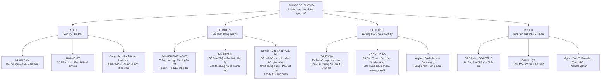

import CompareTable from '~/components/CompareTable.astro';
import KeyPoints from '~/components/KeyPoints.astro';
import ClinicalPearl from '~/components/ClinicalPearl.astro';
import RedFlags from '~/components/RedFlags.astro';
import SelfCheck from '~/components/SelfCheck.astro';
import SourceNote from '~/components/SourceNote.astro';

<KeyPoints title="8 ý lõi — Bài 16">

- **4 nhóm bổ = 4 hư chứng tạng:** Khí hư → bổ Tỳ Phế; Dương hư → bổ Thận dương; Huyết hư → bổ Can Tâm Tỳ; Âm hư → bổ Phế Vị Can Thận âm.
- **Bổ khí đại biểu: Nhân sâm** — Đại bổ nguyên khí, ginsenosid điều hòa miễn dịch, tăng kháng stress; Kiêng Lê lô + Ngũ linh chi. **Hoàng kỳ** — Bổ khí cố biểu, astragalosid IV kích thích NK cell, chích mật tăng bổ Tỳ.
- **Bổ dương đặc biệt: Dâm dương hoắc** — Icariin ức chế PDE5 (giống sildenafil) + tăng tạo xương. **Đỗ trọng** — Pinoresinol hạ huyết áp; **sao tác dụng hạ áp tốt hơn dùng sống**.
- **Chế biến đổi công năng:** Sinh địa → **Thục địa** (cửu chưng cửu sái): màu đen, ngọt hơn, ấm hơn → bổ huyết thay vì lương huyết. **Hà thủ ô** chế nước đậu đen: loại antraglycosid (gây tiêu chảy) → an toàn bổ Can Thận đen tóc.
- **Bổ âm đặc điểm:** Tính hàn, nhầy nhớt → dễ nê trệ → **bắt buộc phối lý khí kiện Tỳ** (Trần bì, Hương phụ) khi Tỳ Vị hư. Sa sâm, Ngọc trúc cho Phế Vị âm hư; Bách hợp cho Tâm Phế âm hư + thần bất an.
- **Hợp chứng là quy tắc:** Lâm sàng hiếm khi hư 1 loại đơn thuần. Khí huyết lưỡng hư → phối bổ khí + bổ huyết; Dương hư → phối bổ khí + ôn trung.
- **Nguyên tắc liều:** Hư mạn → liều thấp, dùng từ từ; Âm dương khí huyết hư đột ngột → dùng ngay liều cao. **Bổ Tỳ Vị trước tiên** khi bắt đầu liệu trình.
- **Bẫy thi:** Cam thảo dùng lâu gây phù nề (corticoid-like). Bổ dương táo ôn → không dùng kéo dài. Bổ âm-huyết hàn nhầy → kỵ Tỳ hư nhược đơn độc.

</KeyPoints>

---

## Sơ đồ 4 nhóm — tạng phủ — đại biểu

---

## Bảng so sánh 4 nhóm bổ

<CompareTable
  headers={["", "Bổ khí", "Bổ dương", "Bổ huyết", "Bổ âm"]}
  rows={[
    ["Tạng hư chính", "Tỳ Phế", "Thận (+ Can)", "Can Tâm Tỳ", "Phế Vị Can Thận"],
    ["Tính chất", "Ngọt, ôn hoặc bình", "Ngọt/cay, ôn", "Ngọt/chua, ôn hoặc bình", "Ngọt, hàn hoặc lương"],
    ["Biểu hiện dùng", "Mệt mỏi, kém ăn, hơi thở yếu, tự hãn", "Liệt dương, đau lưng, sợ lạnh, di tinh", "Da xanh, hồi hộp, kinh không đều", "Ho khan, miệng khô, sốt âm ỉ chiều tối"],
    ["Phối hợp", "+ Bổ huyết khi khí huyết lưỡng hư", "+ Bổ khí + ôn trung để tăng hiệu", "+ Bổ khí khi khí huyết lưỡng hư", "+ Lý khí kiện Tỳ (tránh nê trệ)"],
    ["Thận trọng", "Bổ Tỳ Vị trước tiên", "Không dùng kéo dài (hao tân dịch, sinh nhiệt)", "Huyết tảo → phối nhuận tràng; Huyết hư Tâm loạn → phối an thần", "Tỳ hư nhược → phải phối lý khí"],
    ["Đại biểu", "Nhân sâm, Hoàng kỳ, Đảng sâm", "Dâm dương hoắc, Đỗ trọng, Ba kích", "Thục địa, Hà thủ ô đỏ, Bạch thược", "Sa sâm, Ngọc trúc, Bách hợp"],
  ]}
/>

---

## Vị tiêu biểu hay thi — ghi nhớ nhanh

<CompareTable
  headers={["Vị thuốc", "Nhóm", "Bộ phận dùng", "Hoạt chất chính", "Điểm đặc trưng"]}
  rows={[
    ["Nhân sâm", "Bổ khí", "Thân rễ + rễ", "Ginsenosid (saponin triterpen)", "Đại bổ nguyên khí · An thần ích trí · Kiêng Lê lô"],
    ["Hoàng kỳ", "Bổ khí", "Rễ", "Astragalosid IV · Flavonoid", "Cố biểu · Lợi niệu · Bài mủ sinh cơ · Chích mật tốt hơn"],
    ["Đảng sâm", "Bổ khí", "Rễ", "Alkaloid codonopsinol · Polysaccharid", "Bổ trung ích khí · Ích Phế · Kiêng Lê lô"],
    ["Bạch truật", "Bổ khí", "Thân rễ", "Atractylenolid (terpenoid)", "Kiện Tỳ · Táo thấp · An thai · Kiêng âm hư nội nhiệt"],
    ["Hoài sơn", "Bổ khí", "Rễ củ chế biến", "Saponin diosgenin · Tinh bột", "Bổ Tỳ Phế Thận · Sáp tinh · Trị đái tháo đường"],
    ["Cam thảo bắc", "Bổ khí", "Rễ + thân rễ", "Glycyrrhizin · Liquiritin (flavonoid)", "Điều hòa 12 vị · Dùng lâu phù nề · Kiêng 4 vị"],
    ["Dâm dương hoắc", "Bổ dương", "Phần trên mặt đất", "Icariin (flavonoid)", "Tráng dương · Mạnh gân cốt · PDE5 inhibitor"],
    ["Đỗ trọng", "Bổ dương", "Vỏ thân", "Pinoresinol-diglucosid (lignan)", "Bổ Can Thận · An thai · Hạ áp · Sao → hạ áp tốt hơn"],
    ["Ba kích", "Bổ dương", "Rễ", "Polysaccharid · Iridoid · Anthraglycosid", "Bổ Thận tráng dương · Trừ phong thấp · Ghét Lôi hoàn"],
    ["Thục địa", "Bổ huyết", "Rễ củ chế biến", "Iridoid glycosid (rhemanin)", "Tư âm bổ huyết · Ích tinh · Kỵ sắt · Kỵ Tỳ Vị hư hàn"],
    ["Hà thủ ô đỏ", "Bổ huyết", "Rễ củ chế nước đậu đen", "Stilben · Flavonoid · Tannin", "Đen tóc · Bổ Can Thận · Nhuận tràng · Chế để bổ dưỡng"],
    ["Bạch thược", "Bổ huyết", "Rễ bỏ vỏ", "Paeoniflorin (monoterpen glycosid)", "Bổ huyết · Thư cân · Bình Can chỉ thống · Kiêng Lê lô"],
    ["A giao", "Bổ huyết", "Keo da lừa", "Acid amin · Collagen · Polysaccharid", "Dưỡng huyết · Nhuận Phế · Cầm máu · Hòa tan trước khi dùng"],
    ["Sa sâm", "Bổ âm", "Rễ", "Flavonoid · Coumarin · Lignan", "Dưỡng âm Phế Vị · Trừ hư nhiệt · Kiêng Lê lô"],
    ["Ngọc trúc", "Bổ âm", "Thân rễ", "Saponin steroid · Polysaccharid · Lectin", "Dưỡng âm nhuận táo · Sinh tân · Kiêng dương hư âm thịnh"],
    ["Bách hợp", "Bổ âm", "Vây thân hành", "Saponin steroid · Polysaccharid", "Dưỡng âm Phế · Thanh Tâm an thần · Kiêng hàn thấp"],
  ]}
/>

---

<ClinicalPearl>

**Nhân sâm vs Đảng sâm — khi nào dùng cái nào?**

Nhân sâm: "Đại bổ nguyên khí" — dùng trong tình huống cấp tính (khí thoát, sốc, truỵ mạch), liều nhỏ 4–10 g, tác dụng mạnh. Đảng sâm: thay thế Nhân sâm trong hư chứng thông thường, liều 9–30 g, an toàn hơn, rẻ hơn. Không thay nhau trong cấp cứu.

**Chế biến thay đổi cả tính dược lý:**
Sinh địa (lương huyết) → Thục địa (cửu chưng cửu sái) → bổ huyết, ấm hơn.
Hà thủ ô sống (nhuận tràng, kích thích ruột) → chế nước đậu đen → loại antraglycosid → an toàn dùng lâu, bổ Can Thận.
Đỗ trọng sống (bổ Can) → sao muối (bổ Thận, đau lưng) → sao đen (chỉ huyết, an thai).

</ClinicalPearl>

<RedFlags title="Kiêng kỵ quan trọng">

1. **Thuốc bổ âm-huyết (hàn, nhầy)**: Không dùng đơn độc khi Tỳ Vị hư nhược → nê trệ, kém tiêu. Phải phối Trần bì, Hương phụ.
2. **Thuốc bổ dương (ôn, táo)**: Không dùng kéo dài → hao tổn tân dịch, sinh hỏa.
3. **Nhân sâm**: Kiêng Lê lô, Ngũ linh chi. Không dùng khi ngoại tà còn.
4. **Cam thảo bắc**: Không dùng với Đại kích, Nguyên hoa, Hải tảo, Cam toại. Dùng lâu gây phù nề.
5. **Đảng sâm**: Kiêng Lê lô.
6. **Bạch thược, Sa sâm**: Kiêng Lê lô.
7. **Thiên hoa phấn**: Phản Ô đầu, Phụ tử, Thiên hùng.
8. **Thục địa**: Kỵ sắt. Kiêng Tỳ Vị hư hàn. Dùng lâu phối Trần bì, Hương phụ.

</RedFlags>

<SelfCheck title="Tự kiểm tra — 6 câu thi hay ra">

1. Thành phần hoạt chất chính của Cam thảo bắc là gì? → *Glycyrrhizin (saponin)*
2. Chế biến Hà thủ ô với nước đậu đen nhằm loại bỏ thành phần nào? → *Antraglycosid*
3. Hoàng kỳ thuộc nhóm thuốc bổ nào? → *Bổ khí*
4. Sau khi chế từ Sinh địa thành Thục địa, tính chất thay đổi như thế nào? → *Màu đen, vị ngọt tăng, tính ấm hơn → bổ huyết thay vì lương huyết*
5. Câu kỷ tử công năng gì? → *Tư bổ Can Thận · Ích tinh minh mục · Bổ Phế sinh tân*
6. Tại sao không dùng thuốc bổ âm-huyết đơn độc khi Tỳ hư? → *Tính hàn nhầy nhớt → nê trệ, tiêu hóa kém hơn*

</SelfCheck>

<SourceNote>
Nguồn: *Thuốc Y học cổ truyền (Tập 1)* — TS. Hứa Hoàng Oanh, TS. Nguyễn Thành Triết. Bài 16.
</SourceNote>
