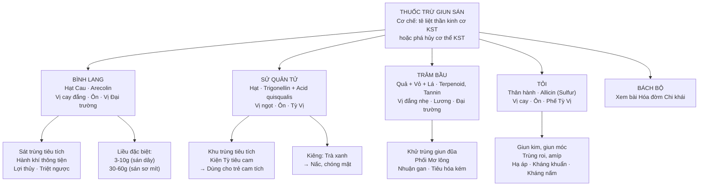
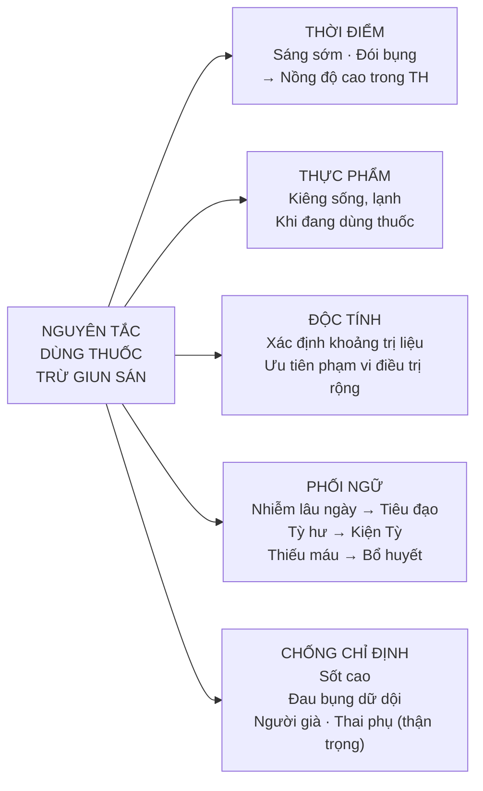

import CompareTable from '~/components/CompareTable.astro';
import KeyPoints from '~/components/KeyPoints.astro';
import ClinicalPearl from '~/components/ClinicalPearl.astro';
import RedFlags from '~/components/RedFlags.astro';
import SelfCheck from '~/components/SelfCheck.astro';
import SourceNote from '~/components/SourceNote.astro';

<KeyPoints title="6 ý lõi — Bài 17">

- **Cơ chế thuốc trừ giun:** Làm tê liệt giun sán → mất bám niêm mạc → thải qua tẩy xổ. Hoặc phá hủy dần ký sinh trùng (không cần tẩy xổ, không thấy giun ra theo phân).
- **Nguyên tắc dùng thuốc:** Uống lúc sáng sớm, đói bụng → duy trì nồng độ cao trong ống tiêu hóa. Không ăn thực phẩm sống, lạnh khi dùng thuốc.
- **Bình lang (hạt Cau):** Arecolin → tê liệt thần kinh cơ giun sán. Đặc biệt: diệt sán sơ mít dùng liều 30–60 g (cao hơn nhiều so với sán dây 3–10 g). Phổ rộng: giun đũa, sán dây, sán sơ mít, sán lá gan.
- **Sử quân tử:** Vị thuốc DUY NHẤT trong nhóm vừa khu trùng vừa **kiện Tỳ tiêu cam** → ưu tiên dùng cho trẻ em cam tích da xanh. Kiêng uống chung với Trà xanh (gây nấc, chóng mặt).
- **Tỏi:** Allicin (hợp chất sulfur) phổ hoạt động rộng nhất: giun kim, giun móc, trùng roi âm đạo, amíp; ngoài ra kháng khuẩn, kháng virus, hạ áp, hạ lipid. Đa năng nhất trong nhóm.
- **Phối ngũ bắt buộc:** Tỳ Vị hư nhược → phối kiện Tỳ. Thiếu máu → phối bổ huyết. Nhiễm lâu ngày → phối tiêu đạo. Không dùng khi sốt cao hoặc đau bụng dữ dội.

</KeyPoints>

---

## Sơ đồ phân loại vị thuốc trừ giun sán

---

## Bảng so sánh 4 vị tiêu biểu

<CompareTable
  headers={["", "Bình lang", "Sử quân tử", "Trâm bầu", "Tỏi"]}
  rows={[
    ["Tên KH", "Areca catechu", "Quisqualis indica", "Combretum quadrangulare", "Allium sativum"],
    ["Bộ phận dùng", "Hạt", "Hạt", "Quả + vỏ thân + lá", "Thân hành (lá dự trữ)"],
    ["Hoạt chất chính", "Arecolin (alkaloid)", "Trigonellin + Acid quisqualis", "Terpenoid, Saponin, Tannin", "Allicin, Alliin (sulfur)"],
    ["Tính vị quy kinh", "Cay đắng · Ôn · Vị Đại trường", "Ngọt · Ôn · Tỳ Vị", "Đắng nhẹ · Lương · Đại trường", "Cay · Ôn · Phế Tỳ Vị"],
    ["Công năng nổi bật", "Sát trùng, hành khí, lợi thủy, triệt ngược", "Khu trùng + Kiện Tỳ tiêu cam", "Khử trùng + Nhuận gan", "Đa năng: sát trùng, hạ áp, kháng khuẩn, trừ đờm"],
    ["Phổ ký sinh trùng", "Giun đũa, kim, sán dây, sán sơ mít, sán lá gan", "Giun đũa, giun kim", "Giun đũa", "Giun kim, móc, trùng roi, amíp"],
    ["Liều ngày", "8-24g (sắc); 30-60g trừ sán sơ mít", "3-8g (trẻ); 8-12g (NL)", "20-50g", "6-12g"],
    ["Kiêng kỵ", "Hư nhược", "Kiêng Trà xanh; bỏ vỏ nhẵn", "—", "Can Thận hỏa vượng; dùng lâu tổn Can Mật"],
  ]}
/>

---

<ClinicalPearl>

**Chọn thuốc theo loại ký sinh trùng và thể trạng:**

| Tình huống | Chọn | Lý do |
|---|---|---|
| Sán sơ mít | Bình lang 30–60 g | Liều cao nhất, arecolin làm liệt sán |
| Trẻ em cam tích, da xanh | Sử quân tử | Duy nhất vừa khu trùng vừa kiện Tỳ |
| Giun đũa + tiêu hóa kém | Trâm bầu + Mơ lông | Nhuận gan, hỗ trợ tiêu hóa |
| Nhiều loại giun + hạ áp + kháng khuẩn | Tỏi | Phổ hoạt động rộng nhất |
| Tỳ Vị hư nhược kèm giun | Sử quân tử + Bạch truật, Đảng sâm | Phối kiện Tỳ bắt buộc |

**Bình lang và Sử quân tử:** cùng họ Bàng (Combretaceae) nhưng Bình lang = hạt Cau (*Arecaceae*) — đừng nhầm.

</ClinicalPearl>

---

## Nguyên tắc sử dụng thuốc trừ giun sán

---

<RedFlags title="Kiêng kỵ quan trọng">

1. **Không dùng khi sốt cao hoặc đau bụng dữ dội** — nguy cơ nặng thêm chứng trạng.
2. **Sử quân tử + Trà xanh** — tương tác gây nấc, chóng mặt, buồn nôn.
3. **Bình lang:** Hư nhược không nên dùng — thuốc có tính tán, tiêu.
4. **Tỏi dùng lâu** — tổn thương Can và Mật. Không dùng khi Phế Vị nhiệt, Can Thận hỏa vượng.
5. **Thận trọng:** Người già, phụ nữ có thai — liều thấp, theo dõi chặt.

</RedFlags>

<SelfCheck title="Tự kiểm tra — 5 câu thi hay ra">

1. Hoạt chất chính của Bình lang là gì? → *Arecolin (alkaloid)*
2. Tại sao không uống Sử quân tử cùng Trà xanh? → *Gây nấc, chóng mặt, buồn nôn*
3. Vị thuốc nào vừa trừ giun vừa kiện Tỳ tiêu cam? → *Sử quân tử*
4. Tỏi thuộc họ thực vật nào và hoạt chất chính là gì? → *Họ Hành (Alliaceae), Allicin (hợp chất sulfur)*
5. Nên dùng thuốc trừ giun vào thời điểm nào và tại sao? → *Sáng sớm lúc đói — duy trì nồng độ cao trong ống tiêu hóa*

</SelfCheck>

<SourceNote>
Nguồn: *Thuốc Y học cổ truyền (Tập 1)* — TS. Hứa Hoàng Oanh, TS. Nguyễn Thành Triết. Bài 17.
</SourceNote>
