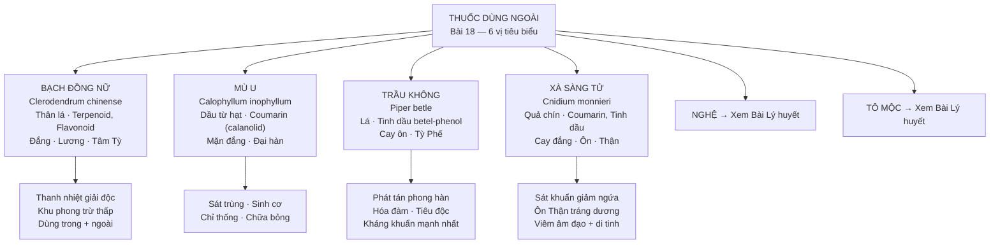

import CompareTable from '~/components/CompareTable.astro';
import KeyPoints from '~/components/KeyPoints.astro';
import ClinicalPearl from '~/components/ClinicalPearl.astro';
import RedFlags from '~/components/RedFlags.astro';
import SelfCheck from '~/components/SelfCheck.astro';
import SourceNote from '~/components/SourceNote.astro';

<KeyPoints title="7 ý lõi — Bài 18">

- **Định nghĩa + đặc thù:** Thuốc dùng ngoài trị bệnh phần biểu (da, cơ, lông, tóc), ngoại khoa, da liễu, sinh dục. Phần lớn nhóm tổng quát là **khoáng thạch, kim loại** — rất độc. 6 vị trong bài đều là **thực vật**, an toàn hơn nhưng vẫn cần thận trọng.
- **Mù u — bộ phận đặc biệt:** Dùng **DẦU ép từ HẠT** (tinh chế), không phải lá/thân. Coumarin (calanolid A, B) — hoạt tính kháng HIV và kháng lao đặc biệt. Dùng ngoài trị bỏng, loét, thấp khớp.
- **Trầu không — kháng khuẩn mạnh nhất trong nhóm:** Betel-phenol (đồng phân eugenol/chavicol) → ức chế hàng loạt vi khuẩn (tụ cầu, liên cầu, E. coli). Vừa dùng trong (sắc 8–16 g) vừa dùng ngoài (rửa, đắp bỏng).
- **Xà sàng tử — đa năng nhất:** Coumarin + tinh dầu → sát khuẩn giảm ngứa + ôn Thận tráng dương. Hai nhóm chứng hoàn toàn khác nhau: ngoài da (viêm âm đạo, chàm, ghẻ) + nội tạng (liệt dương, di tinh). Dùng ngoài: xông/rửa kết hợp khô phèn.
- **Bạch đồng nữ — linh hoạt nhất:** Dùng cả trong (10–12 g sắc) lẫn ngoài (nấu nước rửa). Terpenoid + flavonoid → kháng khuẩn + chống viêm + bảo vệ gan + hạ áp. Có thể phối Ích mẫu, Ngải cứu để trị viêm phụ khoa.
- **Nguyên tắc 4 điểm:** (1) Thuốc độc — không liều cao, không dài ngày; (2) Kim loại không dùng vùng đầu mặt; (3) Bào chế đúng quy trình thuốc độc; (4) Phối thuốc thanh nhiệt giải độc đường uống.
- **Nghệ + Tô mộc:** Đề cập trong bài nhưng nội dung chi tiết ở bài Thuốc Lý huyết — không thi riêng trong bài 18.

</KeyPoints>

---

## Sơ đồ phân nhóm thuốc dùng ngoài

---

## Bảng so sánh 4 vị tiêu biểu

<CompareTable
  headers={["", "Bạch đồng nữ", "Mù u", "Trầu không", "Xà sàng tử"]}
  rows={[
    ["Tên KH", "Clerodendrum chinense", "Calophyllum inophyllum", "Piper betle", "Cnidium monnieri"],
    ["Bộ phận dùng", "Thân lá", "Dầu ép từ hạt (tinh chế)", "Lá tươi hoặc khô", "Quả chín khô"],
    ["Hoạt chất chính", "Terpenoid, Flavonoid, Glycosid, Steroid", "Coumarin (calanolid, inophyllum), Dầu béo", "Tinh dầu betel-phenol (đồng phân eugenol/chavicol)", "Coumarin, Tinh dầu, Terpenoid"],
    ["Tính vị quy kinh", "Đắng · Lương · Tâm Tỳ", "Mặn đắng · Đại hàn", "Cay nồng · Ôn · Tỳ Phế", "Cay đắng · Ôn · Thận"],
    ["Công năng nổi bật", "Thanh nhiệt giải độc, khu phong trừ thấp", "Sát trùng, sinh cơ, chỉ thống", "Phát tán phong hàn, hóa đàm, tiêu độc, giảm ngứa", "Sát khuẩn giảm ngứa, ôn Thận tráng dương"],
    ["Chứng điều trị ngoài da", "Ghẻ, mụn nhọt, chốc đầu, lở loét", "Bỏng, vết loét, mụn nhọt, thấp khớp", "Vết thương mủ, trĩ, bỏng, viêm hạch", "Viêm âm đạo, chàm, ghẻ, nhiễm trùng da"],
    ["Chứng điều trị nội tạng", "Đau nhức gân xương, viêm gan, rối loạn kinh", "—", "Cảm phong hàn, đau dạ dày, hen suyễn", "Liệt dương, di tinh, mộng tinh, đau khớp"],
    ["Liều dùng trong", "10–12 g sắc", "Chỉ dùng ngoài", "8–16 g sắc", "4–12 g sắc"],
    ["Đặc điểm nổi bật YHHĐ", "Bảo vệ gan, hạ áp, bảo vệ thần kinh", "Calanolid A kháng HIV, kháng lao", "Kháng khuẩn phổ rộng nhất", "Phổ tác dụng rộng nhất trong nhóm"],
  ]}
/>

---

<ClinicalPearl>

**Chọn thuốc theo vị trí và tính chất tổn thương:**

| Tình huống | Chọn | Lý do |
|---|---|---|
| Bỏng nhẹ, vết loét ngoài da | Mù u (dầu bôi) | Sinh cơ, lành vết thương, sát trùng nhẹ |
| Nhiễm trùng ngoài da có mủ | Trầu không + rửa | Betel-phenol kháng khuẩn mạnh nhất |
| Viêm âm đạo, ngứa âm hộ | Xà sàng tử + khô phèn (xông/rửa) | Sát khuẩn + kháng nấm |
| Ghẻ, chốc đầu, mụn nhọt | Bạch đồng nữ (nấu nước rửa) | Kháng khuẩn + kháng viêm toàn diện |
| Liệt dương + viêm ngứa | Xà sàng tử (trong + ngoài) | Ôn Thận + sát khuẩn trong một vị |
| Hen suyễn thời tiết + đau dạ dày | Trầu không (sắc uống) | Hóa đàm + ôn trung hành khí |

**Mù u vs Trầu không cho bỏng:**
- Mù u: bỏng → dầu bôi trực tiếp, sinh cơ lành da.
- Trầu không: bỏng → giã vắt nước bôi, kháng khuẩn phòng nhiễm trùng.
- Thực tế có thể phối hợp: Mù u sinh cơ + Trầu không kháng khuẩn.

</ClinicalPearl>

---

<RedFlags title="Nguyên tắc an toàn thuốc dùng ngoài">

1. **Khoáng thạch, kim loại (Long não, Chu sa, Hùng hoàng...):** Không dùng vùng đầu mặt, không dùng dài ngày, bào chế đúng quy trình thuốc độc.
2. **Mù u:** Chỉ dùng dầu tinh chế — dầu thô chưa loại nhựa có độc tính. Không uống.
3. **Tất cả thuốc dùng ngoài:** Khi có nhiễm trùng nặng → phải phối thuốc thanh nhiệt giải độc đường uống, không chỉ điều trị tại chỗ.
4. **Xà sàng tử dùng ngoài:** Nấu nước rửa/xông đúng nồng độ — dùng đậm đặc kéo dài có thể kích thích niêm mạc.
5. **Bạch đồng nữ dùng trong:** Không dùng khi âm hư nội nhiệt (tính lương có thể tổn thương dương khí khi dùng nhiều).

</RedFlags>

<SelfCheck title="Tự kiểm tra — 5 câu thi hay ra">

1. Bộ phận dùng của Mù u là gì? → *Dầu ép từ hạt đã tinh chế*
2. Hoạt chất tạo tác dụng kháng khuẩn mạnh của Trầu không? → *Tinh dầu betel-phenol (đồng phân eugenol/chavicol)*
3. Xà sàng tử quy kinh nào và vì sao? → *Quy kinh Thận — vì có công năng ôn Thận tráng dương, trị di tinh liệt dương*
4. Nguyên tắc quan trọng nhất khi dùng thuốc dùng ngoài nhóm khoáng/kim loại? → *Không dùng vùng đầu mặt; không liều cao, không dài ngày; phối thanh nhiệt giải độc uống*
5. Vì sao Bạch đồng nữ được dùng cả trong lẫn ngoài? → *Tính lương, thanh nhiệt giải độc khi uống; kháng khuẩn kháng viêm tại chỗ khi rửa ngoài*

</SelfCheck>

<SourceNote>
Nguồn: *Thuốc Y học cổ truyền (Tập 1)* — TS. Hứa Hoàng Oanh, TS. Nguyễn Thành Triết. Bài 18.
</SourceNote>
