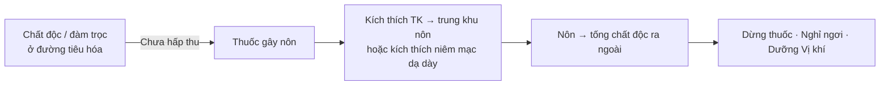

import KeyPoints from '~/components/KeyPoints.astro';
import CompareTable from '~/components/CompareTable.astro';
import ClinicalPearl from '~/components/ClinicalPearl.astro';
import RedFlags from '~/components/RedFlags.astro';
import SelfCheck from '~/components/SelfCheck.astro';
import SourceNote from '~/components/SourceNote.astro';

<KeyPoints title="5 ý lõi — đọc trước">

- **Thuốc gây nôn (thuốc thổ)** = vị chua/đắng, tính hàn, phần lớn **có độc** → dùng hạn chế.
- Chỉ định: ngộ độc chưa hấp thu, thức ăn tích trệ chưa xuống Tiểu trường, đàm trọc bít thanh khiếu.
- 3 vị: **Đờm phàn** (CuSO₄), **Qua để** (để dưa chuột), **Thường sơn** (rễ *Dichroa*).
- Nguyên tắc: bắt đầu **liều thấp, tăng dần**; uống nhiều nước; dừng ngay khi đạt hiệu quả.
- **Tuyệt đối không dùng** khi hư nhược, người già, trẻ em, phụ nữ có thai, xuất huyết.

</KeyPoints>

---

## 1. Nhóm thuốc thổ — nhìn nhanh

**Tính chất chung:** vị chua/đắng, tính mát-lạnh, hầu hết có độc tính. Hiện nay **ít dùng trên lâm sàng** do tác dụng mạnh và gây khó chịu.

---

## 2. Ba vị thuốc tiêu biểu

<CompareTable
  headers={["Vị thuốc", "Nguồn gốc", "Tính vị / quy kinh", "Công dụng chính", "Liều"]}
  rows={[
    ["Đờm phàn", "Khoáng vật: CuSO₄·5H₂O", "Cay-chua-chát, hàn, ĐỘC; Can Đởm", "Gây nôn · tiêu đờm · giải độc · tiêu mù", "0,3–0,6 g uống"],
    ["Qua để", "Để quả dưa chuột (*Cucumis melo*)", "Đắng, lạnh, ĐỘC; Vị", "Gây nôn đàm thấp · trừ hoàng đàn", "2,5–5 g sắc; 0,3–1 g hoàn tán"],
    ["Thường sơn", "Rễ *Dichroa febrifuga* Lour.", "Đắng, hàn, ĐỘC; Phế Tâm Can", "Gây nôn đàm diên · triệt ngược (sốt rét)", "6–12 g/ngày sắc"],
  ]}
/>

<ClinicalPearl>

**Thường sơn** vừa gây nôn vừa **triệt ngược** (diệt ký sinh trùng sốt rét nhờ febrifugin/isofebrifugin) — dùng phối Hậu phác, Bình lang, Thảo quả trong bài *Tệt ngược thất bảo ẩm*.

</ClinicalPearl>

---

## 3. Chỉ định & chống chỉ định

| Chỉ định dùng | Chống chỉ định tuyệt đối |
|---|---|
| Ngộ độc thức ăn chưa hấp thu | Cơ thể hư nhược |
| Thức ăn tích trệ ở Vị (chưa xuống Tiểu trường) | Người già, trẻ em |
| Đàm nhiệt ứ trệ trong ngực, gây khó thở | Phụ nữ có thai |
| Đàm trọc bít thanh khiếu, gây điên cuồng | Các chứng xuất huyết |
| Hoàng đàn do thấp nhiệt (Qua để hít mũi) | Đau đầu chóng mặt, hồi hộp |

<RedFlags title="Bẫy lâm sàng thường gặp">

- Dùng liều cao ngay lần đầu → nôn quá mạnh, mất nước, trúng độc.
- Không cầm nôn được → dùng **Xạ hương 0,1 g** pha nước uống (với Qua để) hoặc biện pháp hỗ trợ khác.
- Dùng kéo dài → tổn thương chính khí, rối loạn chức năng Vị Trường.

</RedFlags>

---

## 4. Nguyên tắc 4 bước khi dùng thuốc thổ

1. **Bắt đầu liều thấp** — tăng dần cho đến khi đạt hiệu quả.
2. **Uống nhiều nước** sau thuốc (tăng tác dụng); dùng thêm ngoáy họng nếu cần.
3. **Dừng ngay** khi đã nôn đủ — không dùng liên tục, không kéo dài.
4. **Dưỡng Vị khí sau nôn:** nghỉ ngơi, không ăn uống ngay, rồi mới ăn thức ăn mềm dễ tiêu.

---

<SelfCheck title="Tự kiểm tra nhanh">

1. Nhóm thuốc thổ dùng khi nào? (chất độc đã hấp thu chưa? bệnh nhân hư hay thực?)
2. Đờm phàn và Qua để khác nhau ở chỉ định dùng ngoài như thế nào?
3. Thường sơn điều trị thêm bệnh gì ngoài gây nôn?
4. Khi Qua để gây nôn không cầm, xử trí thế nào?

</SelfCheck>

<SourceNote>

- Nguồn gốc: `Raw/Thuoc_YHCT/chuong-02-cac-nhom-thuoc/bai-19-thuoc-gay-non_001.md`
- Sách: *Thuốc Y học cổ truyền (Tập 1)* — TS. Hứa Hoàng Oanh, TS. Nguyễn Thành Triết.

</SourceNote>
