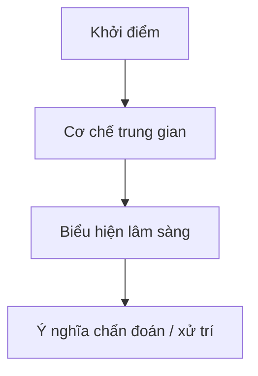

import MedicalNote from '~/components/MedicalNote.astro';
import KeyPoints from '~/components/KeyPoints.astro';
import ClinicalPearl from '~/components/ClinicalPearl.astro';
import CompareTable from '~/components/CompareTable.astro';
import SourceNote from '~/components/SourceNote.astro';

<MedicalNote title="Giải thích sâu">

## Câu hỏi trung tâm

## Tóm tắt ý chính

<KeyPoints>

- Vì sao vấn đề này quan trọng?
- Cơ chế / lý luận cốt lõi là gì?
- Điều gì thường bị hiểu sai?

</KeyPoints>

## Nền tảng

## Cơ chế / lý luận

## Diễn tiến hoặc mô hình

## So sánh với khái niệm gần giống

<CompareTable title="So sánh khái niệm">

| Tiêu chí | Khái niệm A | Khái niệm B |
| --- | --- | --- |
| Bản chất |  |  |
| Biểu hiện |  |  |
| Ý nghĩa |  |  |

</CompareTable>

<ClinicalPearl>

- Điểm giúp nối lý thuyết với thực hành.

</ClinicalPearl>

<SourceNote>

- Nguồn chính:
- Nguồn bổ sung:
- Ngày rà soát:

</SourceNote>

</MedicalNote>
