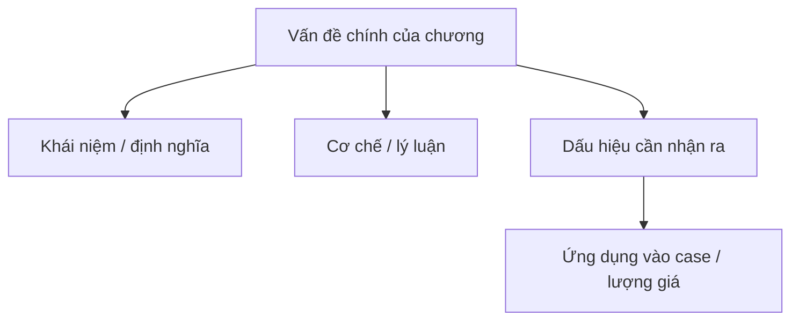

import KeyPoints from '~/components/KeyPoints.astro';
import CompareTable from '~/components/CompareTable.astro';
import ClinicalPearl from '~/components/ClinicalPearl.astro';
import MedicalNote from '~/components/MedicalNote.astro';
import RedFlags from '~/components/RedFlags.astro';
import SelfCheck from '~/components/SelfCheck.astro';
import SourceNote from '~/components/SourceNote.astro';

## Cách dùng trang này

1. Đọc 20% cốt lõi.
2. Dùng framework áp dụng ngay.
3. Tự kiểm bằng case mini và bẫy dễ nhầm.

## Nắm nhanh theo 80/20

<KeyPoints title="20% cốt lõi cần nắm">

- Ý 1: khái niệm hoặc quyết định quan trọng nhất của chương.
- Ý 2: cơ chế/framework chi phối các phần còn lại.
- Ý 3: dấu hiệu/cách phân loại giúp áp dụng vào case.
- Ý 4: điểm dễ nhầm gây sai khi học hoặc khi làm lâm sàng.
- Ý 5: câu hỏi cần nhớ để nối chương này với chương tiếp theo.

</KeyPoints>

## Một câu nắm bài

<MedicalNote title="Câu lõi">

Viết một câu duy nhất trả lời: chương này giúp người học nhìn vấn đề gì tốt hơn?

</MedicalNote>

## Tóm tắt nhanh

Viết lại chương trong 1-3 đoạn ngắn. Ưu tiên trả lời: chương này giải quyết vấn đề gì, người học cần nhớ khung nào, và dùng khung đó vào lâm sàng/ôn tập ra sao.

## Sơ đồ 80/20

## Visual brief

<CompareTable title="Hình nên bổ sung">

| Loại hình | Khi dùng | Gợi ý tạo |
| --- | --- | --- |
| Mermaid | Luồng cơ chế, phân loại, thuật toán | Viết trực tiếp trong MDX. |
| SVG | Bản đồ khái niệm, timeline, bảng phân tầng cần chính xác | Tạo trong `public/assets/<sách>/`. |
| Ảnh sinh bởi Codex | Minh họa khái niệm, tạo cảm giác bài giảng sinh động | Ghi rõ là hình minh họa. |
| Hình y khoa từ nguồn | Hình ảnh học, mô bệnh học, biểu đồ nghiên cứu | Chỉ dùng khi có quyền/nguồn rõ. |

</CompareTable>

## Bản đồ chương

Liệt kê các mục của chương theo thứ tự học, nhưng mỗi mục chỉ rút ra giá trị cốt lõi.

## Framework áp dụng ngay

<CompareTable title="Từ lý thuyết sang thao tác">

| Câu hỏi | Ý nghĩa | Dấu hiệu / dữ kiện cần tìm |
| --- | --- | --- |
|  |  |  |

</CompareTable>

<ClinicalPearl>

- Điểm nối chương này với thực hành / case.

</ClinicalPearl>

## Bẫy dễ nhầm

<RedFlags title="Các lỗi cần tránh">

- Lỗi 1.
- Lỗi 2.
- Lỗi 3.

</RedFlags>

## Case mini

<MedicalNote title="Tình huống">

Một tình huống ngắn để người học dùng framework vừa học.

</MedicalNote>

<CompareTable title="Cách đọc case">

| Dữ kiện | Diễn giải | Ý nghĩa |
| --- | --- | --- |
|  |  |  |

</CompareTable>

## Học tiếp

<CompareTable title="Lộ trình sau chương này">

| Bước | Học gì | Vì sao |
| --- | --- | --- |
| 1 |  |  |
| 2 |  |  |

</CompareTable>

## Tự kiểm

<SelfCheck>

1. 20% ý nào giúp hiểu phần lớn chương?
2. Framework áp dụng ngay của chương là gì?
3. Điểm nào dễ nhầm nhất?
4. Nếu gặp case, dấu hiệu đầu tiên cần tìm là gì?
5. Sau chương này nên học gì tiếp?

</SelfCheck>

<SourceNote>

- Nguồn chương:

</SourceNote>
