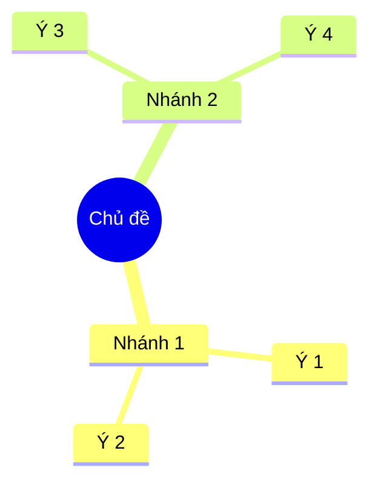

import KeyPoints from '~/components/KeyPoints.astro';
import SourceNote from '~/components/SourceNote.astro';

## Câu hỏi trung tâm

<KeyPoints>

- Khái niệm gốc:
- Nhánh chính:
- Quan hệ cần nhớ:

</KeyPoints>

## Diễn giải bản đồ

<SourceNote>

- Nguồn:

</SourceNote>
