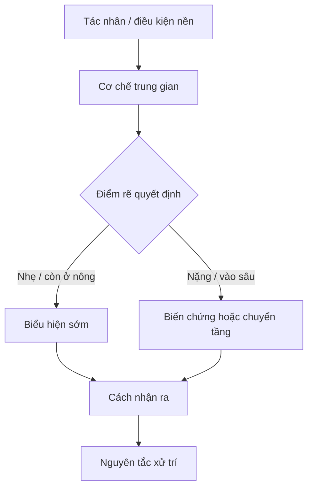

import KeyPoints from '~/components/KeyPoints.astro';
import CompareTable from '~/components/CompareTable.astro';
import ClinicalPearl from '~/components/ClinicalPearl.astro';
import MedicalNote from '~/components/MedicalNote.astro';
import RedFlags from '~/components/RedFlags.astro';
import SelfCheck from '~/components/SelfCheck.astro';
import SourceNote from '~/components/SourceNote.astro';

## Câu hỏi cơ chế

<MedicalNote title="Câu hỏi dẫn đường">
Vì sao hiện tượng này xảy ra, đi theo chuỗi nào, tạo ra dấu hiệu gì, và điểm nào làm thay đổi quyết định chẩn đoán hoặc điều trị?
</MedicalNote>

## Bản đồ cơ chế 1 trang

<KeyPoints>

- **Nút khởi phát:** tác nhân / điều kiện nền.
- **Cơ chế trung gian:** đường bệnh lý nối nguyên nhân với biểu hiện.
- **Điểm rẽ:** yếu tố làm bệnh nhẹ, nặng, chuyển tầng hoặc đổi pháp trị.
- **Dấu hiệu quan sát:** triệu chứng, mạch, lưỡi, xét nghiệm hoặc hình ảnh.
- **Hành động:** chẩn đoán phân biệt, nguyên tắc xử trí, câu hỏi lượng giá.

</KeyPoints>

## Workflow diễn tiến

## Cầu nối sách vở → lâm sàng

<CompareTable title="Từ cơ chế đến quyết định">

| Nút cơ chế | Giải thích ngắn | Dấu hiệu kéo theo | Ý nghĩa chẩn đoán / xử trí |
| --- | --- | --- | --- |
|  |  |  |  |

</CompareTable>

## Worked example

1. Quan sát dấu hiệu nổi bật.
2. Suy ngược nút cơ chế đang chi phối.
3. Tìm điểm rẽ: còn ở nông hay đã vào sâu, còn thực hay đã hư, có bế hay có thoát.
4. Chọn hướng xử trí hoặc câu hỏi cần kiểm chứng tiếp.

<RedFlags>

- Không biến trang này thành tóm tắt chương lần hai.
- Không liệt kê heading của sách nếu chưa nối được bằng quan hệ nhân quả.
- Không vẽ sơ đồ chỉ để trang trí; mỗi mũi tên phải có nghĩa học thuật.

</RedFlags>

<ClinicalPearl>

- Một trang giải thích cơ chế tốt phải giúp người học trả lời được: “Nếu cơ chế này đúng, tôi sẽ thấy gì tiếp theo?”

</ClinicalPearl>

## Tự kiểm

<SelfCheck>

1. Cơ chế trung tâm của bài là gì?
2. Nếu chỉ vẽ một sơ đồ, sơ đồ đó phải nối những nút nào?
3. Dấu hiệu nào chứng minh bệnh đang đi theo nhánh nặng hơn?
4. Điểm nào dễ nhầm với bệnh/cơ chế khác?

</SelfCheck>

<SourceNote>

- Nguồn chương:
- Nguồn bổ sung:
- Gợi ý biên tập: ưu tiên Mermaid flowchart, bảng cơ chế → dấu hiệu, và worked example ngắn.

</SourceNote>
