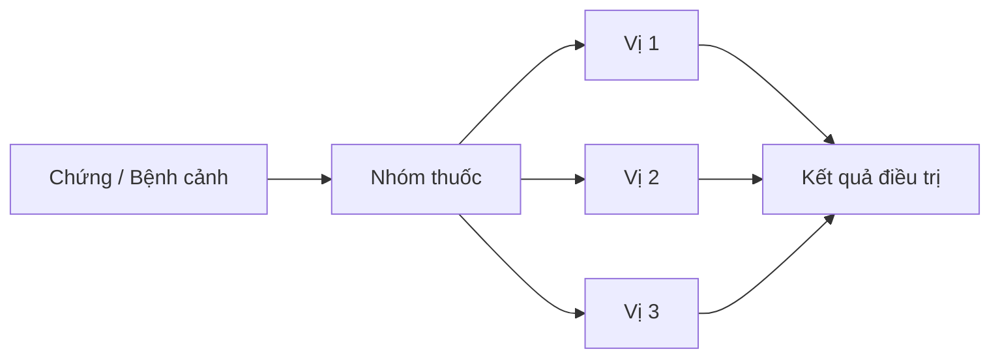
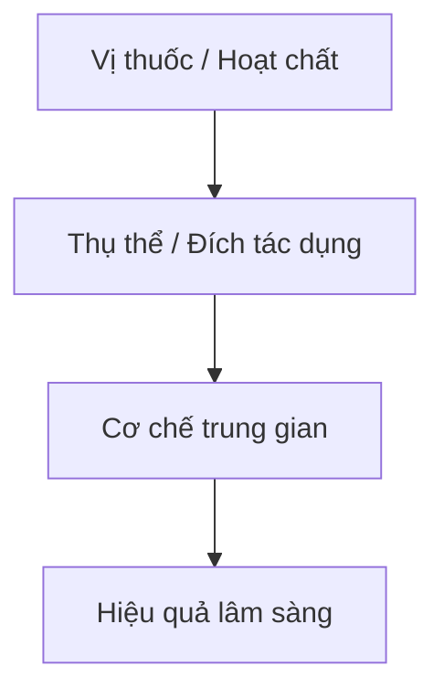
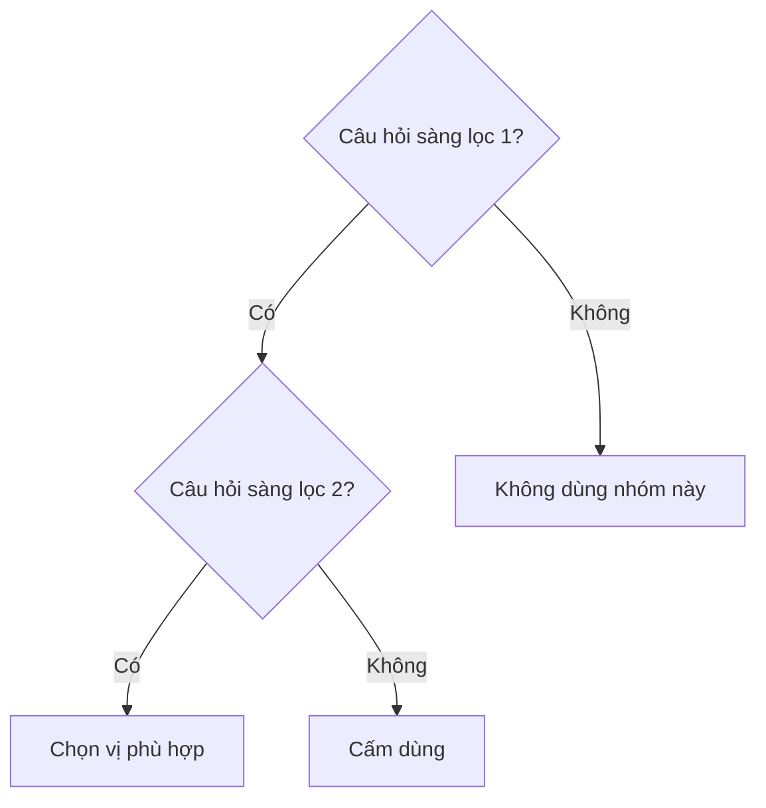

{/*
  TEMPLATE: deep-lecture-duoc-lieu.mdx
  Dùng cho: bai-giang/ của sách Thuốc YHCT (hoặc bất kỳ bài có nhiều vị thuốc cụ thể)
  Khác deep-lecture.mdx chung: có bảng profile dược liệu chuẩn cho mỗi vị.

  Xóa draft/pagefind/sidebar.hidden khi xuất bản.
  Xóa block comment này trước khi dùng.

  ── CẤU TRÚC ──────────────────────────────────────────────────────────────
  1. Mục tiêu bài giảng
  2. Góc nhìn giảng viên (MedicalNote)
  3. Bức tranh tổng thể (flowchart Mermaid)
  4. Đặc điểm nhóm thuốc (tính chất chung, chỉ định / chống chỉ định)
  5. Profile từng vị thuốc  ← BẢNG DƯỢC LIỆU chuẩn
  6. So sánh các vị trong nhóm (CompareTable)
  7. Cơ chế tác dụng (YHCT + dược lý YHHĐ)
  8. Điểm quyết định lâm sàng (flowchart + bảng xử trí)
  9. RedFlags
  10. Câu hỏi tư duy cuối bài

  ── HƯỚNG DẪN BẢNG PROFILE ────────────────────────────────────────────────
  Mỗi vị thuốc dùng layout 2 phần:
    A. Bảng thông tin nhanh  (dùng HTML table với class drug-profile)
    B. Mô tả chủ trị theo nhóm bệnh (bullet có indent rõ)
  Không gộp nhiều vị vào 1 bảng — dễ mất thông tin, khó scan.
*/}

import { Aside } from '@astrojs/starlight/components';
import MedicalNote from '~/components/MedicalNote.astro';
import KeyPoints from '~/components/KeyPoints.astro';
import RedFlags from '~/components/RedFlags.astro';
import CompareTable from '~/components/CompareTable.astro';
import ClinicalPearl from '~/components/ClinicalPearl.astro';

## Mục tiêu bài giảng

Sau bài này người học **hiểu được** (không chỉ thuộc):

- [ ] Logic chỉ định / chống chỉ định của nhóm thuốc
- [ ] Điểm khác biệt cốt lõi giữa các vị trong nhóm
- [ ] Cơ chế tác dụng (YHCT + dược lý YHHĐ)
- [ ] Điểm quyết định lâm sàng quan trọng nhất

<MedicalNote title="Góc nhìn giảng viên">
  **Điều GS 30 năm sẽ nhấn mạnh đầu bài:** (viết 1–2 câu định hướng tư duy).
</MedicalNote>

---

## Bức tranh tổng thể

---

## 1. Đặc điểm nhóm thuốc

**Định nghĩa:** ...

**Tính chất chung:** vị ..., tính ..., (có độc / không độc).

| Chỉ định | Chống chỉ định |
|---|---|
| ... | ... |
| ... | ... |

---

## 2. Profile từng vị thuốc

{/*
  ── CÁCH DÙNG BẢNG PROFILE ──────────────────────────────────────────────
  Copy block "### 2.x. TÊN VỊ" và điền đầy đủ cho mỗi vị.
  Không bỏ dòng nào — nếu không có dữ liệu thì ghi "—".
*/}

### 2.1. [Tên vị thuốc]

| Trường | Thông tin |
|---|---|
| **Tên khoa học** | *Tên loài* Tác giả (Họ — Familiae) |
| **Tên dược liệu** | *Nomen Latinum* |
| **Bộ phận dùng** | (rễ / lá / hoa / quả / hạt / toàn cây / khoáng vật...) phơi hay sấy khô |
| **Thành phần chính** | alkaloid / flavonoid / saponin / tinh dầu / ... |
| **Tính vị** | Vị ... (...), tính ... |
| **Quy kinh** | Kinh ..., Kinh ... |
| **Độc tính** | Có độc / Không độc |
| **Công năng** | ...; ...; ... |
| **Liều dùng** | ... g/ngày dạng sắc; ... g dạng hoàn tán; dùng ngoài: lượng vừa đủ |
| **Kiêng kỵ / Cấm kỵ** | ... |

**Chủ trị:**

- *Nhóm chứng 1:* mô tả ngắn + bài thuốc tiêu biểu nếu có (bài ...).
- *Nhóm chứng 2:* mô tả ngắn.
- *Dùng ngoài (nếu có):* mô tả.

**Tác dụng dược lý (YHHĐ):** ...

---

### 2.2. [Tên vị thuốc]

| Trường | Thông tin |
|---|---|
| **Tên khoa học** | |
| **Tên dược liệu** | |
| **Bộ phận dùng** | |
| **Thành phần chính** | |
| **Tính vị** | |
| **Quy kinh** | |
| **Độc tính** | |
| **Công năng** | |
| **Liều dùng** | |
| **Kiêng kỵ / Cấm kỵ** | |

**Chủ trị:**

- *Nhóm chứng 1:* ...

**Tác dụng dược lý (YHHĐ):** ...

---

### 2.3. [Tên vị thuốc]

| Trường | Thông tin |
|---|---|
| **Tên khoa học** | |
| **Tên dược liệu** | |
| **Bộ phận dùng** | |
| **Thành phần chính** | |
| **Tính vị** | |
| **Quy kinh** | |
| **Độc tính** | |
| **Công năng** | |
| **Liều dùng** | |
| **Kiêng kỵ / Cấm kỵ** | |

**Chủ trị:**

- *Nhóm chứng 1:* ...

**Tác dụng dược lý (YHHĐ):** ...

---

## 3. So sánh các vị trong nhóm

<CompareTable
  headers={["Tiêu chí", "Vị 1", "Vị 2", "Vị 3"]}
  rows={[
    ["Tính vị", "", "", ""],
    ["Quy kinh", "", "", ""],
    ["Công năng đặc trưng", "", "", ""],
    ["Liều uống", "", "", ""],
    ["Dùng ngoài", "", "", ""],
    ["Độc tính", "", "", ""],
    ["Chống chỉ định nổi bật", "", "", ""],
  ]}
/>

<ClinicalPearl>

**Pearl:** (Điểm GS 30 năm sẽ nhấn: chọn vị nào khi nào và vì sao.)

</ClinicalPearl>

---

## 4. Cơ chế tác dụng

### YHCT — cơ chế theo lý luận

...

### YHHĐ — dược lý phân tử

...

---

## 5. Điểm quyết định lâm sàng

| Tình huống | Xử trí |
|---|---|
| ... | ... |
| ... | ... |

<RedFlags title="Sai lầm thường gặp">

- **Sai lầm 1:** ...
- **Sai lầm 2:** ...

</RedFlags>

---

## 6. Câu hỏi tư duy cuối bài

1. ...?
2. ...?
3. ...?
