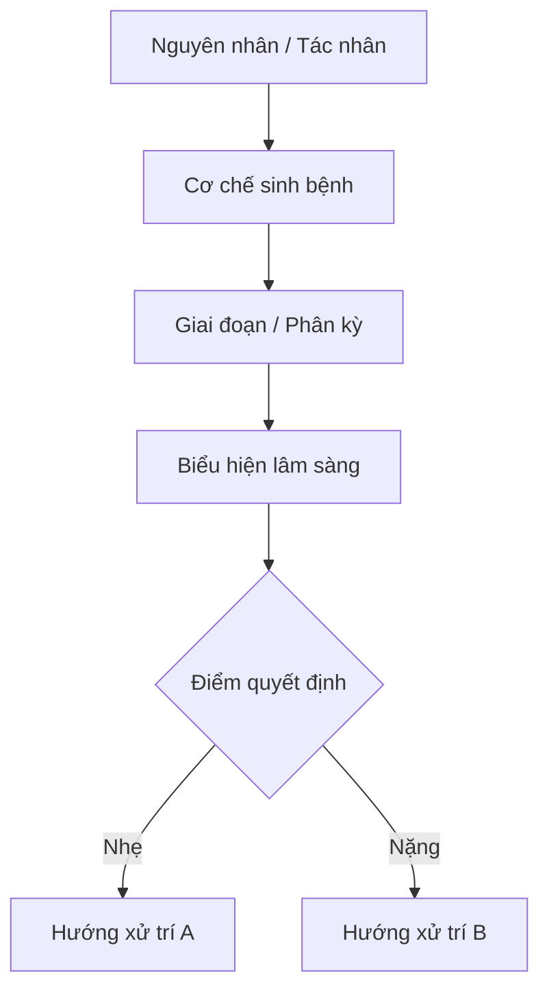
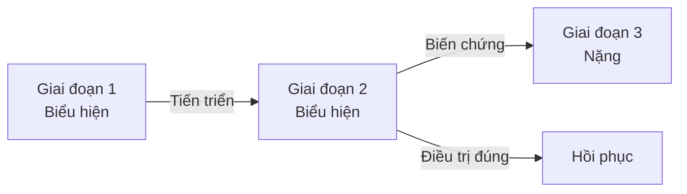
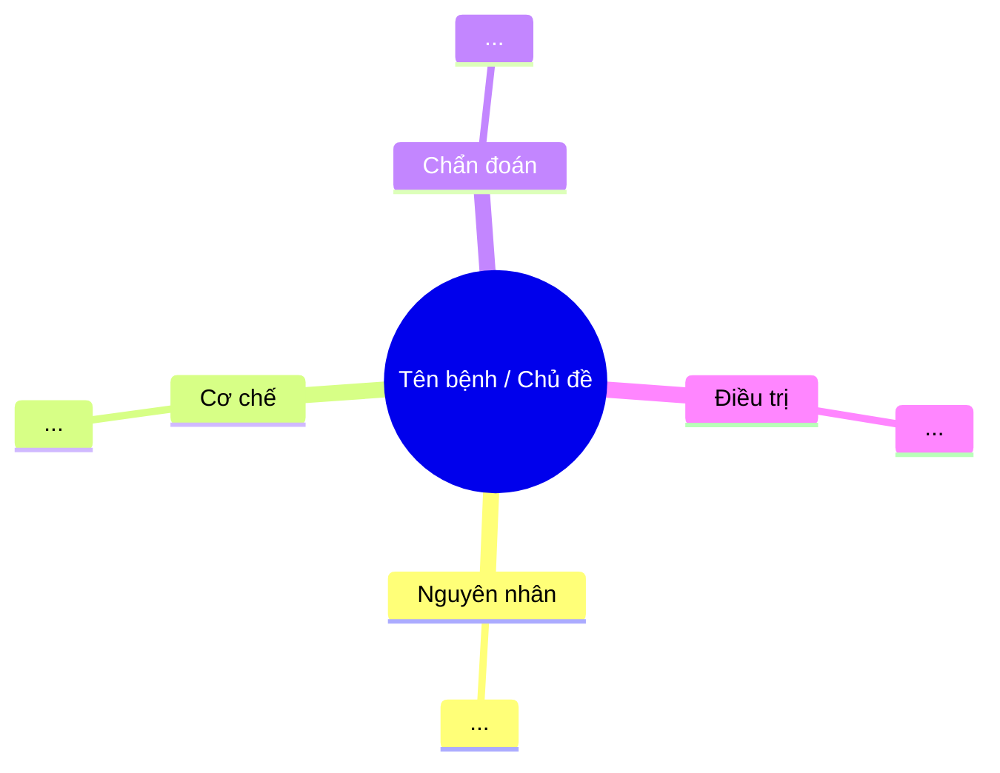

{/*
  TEMPLATE: deep-lecture.mdx
  Dùng cho: bai-giang/ trong mỗi sách
  Khác tom-tat: sâu hơn, có flow/bảng/pearl, góc nhìn lâm sàng chuyên môn.
  Khác nguyen-thuy: đã cắt rườm rà, được cấu trúc lại theo luồng tư duy BS.

  Xóa draft/pagefind/sidebar.hidden khi xuất bản.
  Xóa block comment này trước khi dùng.
*/}

import { Aside, Steps, Tabs, TabItem } from '@astrojs/starlight/components';
import MedicalNote from '~/components/MedicalNote.astro';
import KeyPoints from '~/components/KeyPoints.astro';
import RedFlags from '~/components/RedFlags.astro';
import AlgorithmBox from '~/components/AlgorithmBox.astro';
import CompareTable from '~/components/CompareTable.astro';
import ClinicalPearl from '~/components/ClinicalPearl.astro';
import EvidenceBox from '~/components/EvidenceBox.astro';

## Mục tiêu bài giảng

Sau bài này người học **hiểu được** (không chỉ thuộc):

- [ ] ...cơ chế / nguyên nhân cốt lõi
- [ ] ...tại sao biểu hiện lâm sàng lại như vậy
- [ ] ...logic phân tầng / phân loại
- [ ] ...điểm quyết định lâm sàng quan trọng nhất

<MedicalNote title="Góc nhìn giảng viên">
  **Điều GS 30 năm sẽ nhấn mạnh đầu bài:** (viết 1-2 câu định hướng tư duy).
  Ví dụ: "Ôn bệnh không phải danh mục bệnh — đây là hệ thống tư duy về nhiệt độc xâm nhập."
</MedicalNote>

---

## Bức tranh tổng thể

> Nhìn 30 giây — biết cả bài nói gì.

{/* Thay flowchart bằng SVG nếu cần hình phức tạp hơn */}

---

## 1. Tại sao lại vậy? — Cơ chế

### Lý luận YHCT

_(Giải thích theo tạng phủ, khí huyết, tà khí... bằng ngôn ngữ tư duy, không chỉ liệt kê)_

### Đối chiếu YHHĐ

_(Cơ chế sinh lý bệnh tương ứng — giúp nối YHCT ↔ YHHĐ)_

### Bảng phân loại / so sánh

<CompareTable>

| Tiêu chí | Loại A | Loại B | Loại C |
| :-- | :-- | :-- | :-- |
| ... | ... | ... | ... |

</CompareTable>

<ClinicalPearl>
  **Pearl #1:** Điều GS sẽ dừng lại nhấn mạnh ở đây. Ví dụ: "Khi gặp X, luôn nghĩ đến Y trước vì..."
</ClinicalPearl>

---

## 2. Diễn tiến — Giai đoạn & Biến chứng

### Flow giai đoạn

### Điểm rẽ quan trọng (Decision Points)

<AlgorithmBox>
1. **Bước 1:** Đánh giá... → nếu có X → chuyển ngay  
2. **Bước 2:** Phân tầng... → nhẹ / trung bình / nặng  
3. **Bước 3:** Chọn hướng điều trị...
</AlgorithmBox>

<RedFlags>
  - Dấu hiệu X → nguy cơ biến chứng nặng
  - Dấu hiệu Y → cần chuyển tuyến / can thiệp ngay
</RedFlags>

---

## 3. Chẩn đoán — Logic phân biệt

<Tabs>
  <TabItem label="Bệnh cảnh điển hình">
    _(Triệu chứng đặc trưng, đủ để nghĩ đến ngay)_
  </TabItem>
  <TabItem label="Phân biệt với...">
    _(Bệnh hay nhầm nhất và cách phân biệt nhanh)_
  </TabItem>
  <TabItem label="Bẫy chẩn đoán">
    _(Sai lầm GS đã thấy nhiều lần trong 30 năm)_
  </TabItem>
</Tabs>

<ClinicalPearl>
  **Pearl #2:** Câu hỏi phân biệt đơn giản nhất là...
</ClinicalPearl>

---

## 4. Điều trị — Logic chọn pháp

### Nguyên tắc

_(Không liệt kê bài thuốc — giải thích TẠI SAO chọn pháp này)_

### Bảng: Giai đoạn → Pháp → Đại diện

| Giai đoạn | Pháp điều trị | Đại diện | Lưu ý |
| :-- | :-- | :-- | :-- |
| ... | ... | ... | ... |

<EvidenceBox level="B">
  _(Bằng chứng / hướng dẫn nếu có — bỏ block này nếu thuần YHCT truyền thống)_
</EvidenceBox>

---

## Sơ đồ tổng hợp cuối bài

> Nối tất cả lại — nguyên nhân → cơ chế → chẩn đoán → điều trị.

---

## 3 câu hỏi kích thích tư duy

_(Không phải MCQ — mục đích: buộc người học phải lý luận)_

<MedicalNote title="Tự kiểm sau bài">
  1. **Tại sao** [hiện tượng A] lại dẫn đến [hệ quả B]? Giải thích theo cơ chế.
  2. **Phân biệt** [bệnh X] và [bệnh Y] — điểm khác biệt mấu chốt nhất là gì?
  3. **Nếu** bệnh nhân có thêm [dấu hiệu Z] — hướng xử trí thay đổi thế nào?
</MedicalNote>

---

<KeyPoints>
  - Điểm cốt lõi 1 cần nhớ
  - Điểm cốt lõi 2 cần nhớ
  - Điểm cốt lõi 3 cần nhớ
</KeyPoints>
