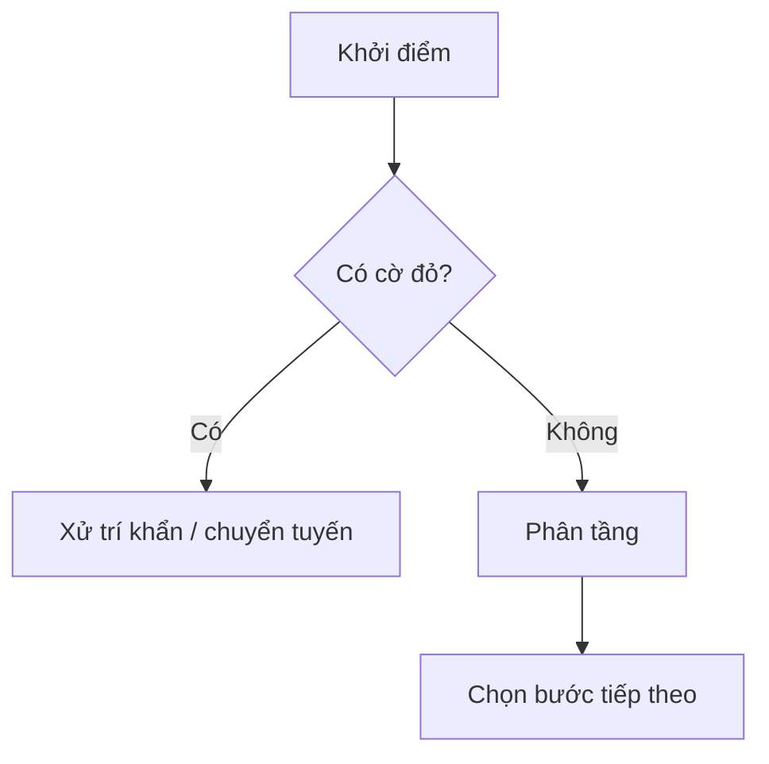

import AlgorithmBox from '~/components/AlgorithmBox.astro';
import SourceNote from '~/components/SourceNote.astro';

## Khi nào dùng thuật toán này?

<AlgorithmBox title="Diễn giải thuật toán">

1. Bước 1:
2. Bước 2:
3. Bước 3:

</AlgorithmBox>

<SourceNote>

- Nguồn:

</SourceNote>
