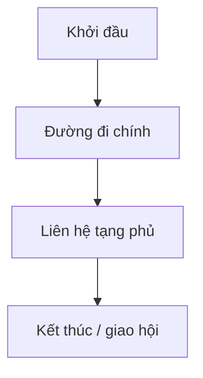

import CompareTable from '~/components/CompareTable.astro';
import SourceNote from '~/components/SourceNote.astro';

## Tên kinh

## Tuần hành

## Liên hệ tạng phủ

## Huyệt trọng yếu

<CompareTable title="Huyệt trọng yếu">

| Huyệt | Vai trò | Chủ trị chính |
| --- | --- | --- |
|  |  |  |

</CompareTable>

## Bệnh hậu kinh lạc

<SourceNote>

- Nguồn:

</SourceNote>
