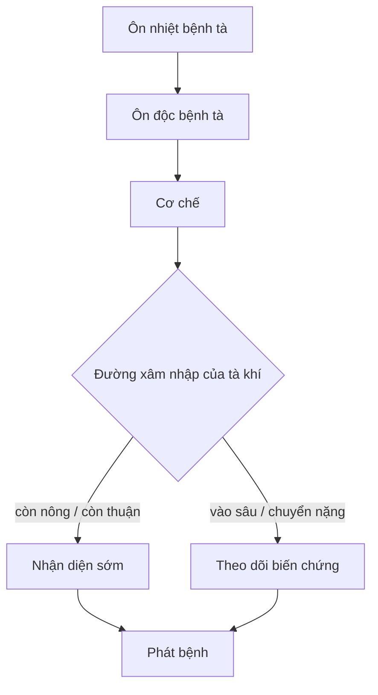

import KeyPoints from '~/components/KeyPoints.astro';
import CompareTable from '~/components/CompareTable.astro';
import ClinicalPearl from '~/components/ClinicalPearl.astro';
import MedicalNote from '~/components/MedicalNote.astro';
import RedFlags from '~/components/RedFlags.astro';
import SelfCheck from '~/components/SelfCheck.astro';
import SourceNote from '~/components/SourceNote.astro';

## Câu hỏi cơ chế

<MedicalNote title="Đọc trang này để trả lời">
Vì sao **Ôn nhiệt bệnh tà** xảy ra, đi theo chuỗi nào, tạo dấu hiệu gì, và điểm rẽ nào làm đổi hướng chẩn đoán hoặc xử trí?
</MedicalNote>

## Bản đồ cơ chế 1 trang

<KeyPoints title="Nút cần nối bằng nhân quả">

- **Ôn nhiệt bệnh tà:** Phàm là trong tự nhiên ngoại tà có biểu hiện khô tảo, thu liễm thanh túc gọi là tảo tà. Đây là trục đọc ban đầu, cần được nối tiếp bằng các nút cơ chế phía dưới. Giúp suy tà, phân biệt tân cảm với phục tà, và chọn hướng thấu tà hay thanh lý nhiệt.
- **Ôn độc bệnh tà:** Xác định tác nhân hoặc điều kiện khởi phát, rồi hỏi tác nhân đó đi vào cơ thể theo đường nào và đánh vào hệ nào trước. Giúp suy tà, phân biệt tân cảm với phục tà, và chọn hướng thấu tà hay thanh lý nhiệt.
- **Cơ chế:** Biến phần mô tả thành chuỗi nhân quả: nguyên nhân kích hoạt → cơ chế trung gian → tổn thương chức năng hoặc thực thể → biểu hiện. Giúp dự đoán diễn tiến và nhận ra điểm cần can thiệp trước khi bệnh chuyển sâu.
- **Đường xâm nhập của tà khí:** Xác định tác nhân hoặc điều kiện khởi phát, rồi hỏi tác nhân đó đi vào cơ thể theo đường nào và đánh vào hệ nào trước. Giúp suy tà, phân biệt tân cảm với phục tà, và chọn hướng thấu tà hay thanh lý nhiệt.
- **Phát bệnh:** Biến phần mô tả thành chuỗi nhân quả: nguyên nhân kích hoạt → cơ chế trung gian → tổn thương chức năng hoặc thực thể → biểu hiện. Giúp dự đoán diễn tiến và nhận ra điểm cần can thiệp trước khi bệnh chuyển sâu.

</KeyPoints>

## Workflow diễn tiến

## Cầu nối sách vở → lâm sàng

<CompareTable title="Từ cơ chế đến quyết định">

| Nút cơ chế | Giải thích ngắn | Dấu hiệu kéo theo | Ý nghĩa chẩn đoán / xử trí |
| --- | --- | --- | --- |
| Ôn nhiệt bệnh tà | Phàm là trong tự nhiên ngoại tà có biểu hiện khô tảo, thu liễm thanh túc gọi là tảo tà. Đây là trục đọc ban đầu, cần được nối tiếp bằng các nút cơ chế phía dưới. | Dấu hiệu sớm, mùa phát, đường vào, vị trí bị phạm đầu tiên. | Giúp suy tà, phân biệt tân cảm với phục tà, và chọn hướng thấu tà hay thanh lý nhiệt. |
| Ôn độc bệnh tà | Xác định tác nhân hoặc điều kiện khởi phát, rồi hỏi tác nhân đó đi vào cơ thể theo đường nào và đánh vào hệ nào trước. | Dấu hiệu sớm, mùa phát, đường vào, vị trí bị phạm đầu tiên. | Giúp suy tà, phân biệt tân cảm với phục tà, và chọn hướng thấu tà hay thanh lý nhiệt. |
| Cơ chế | Biến phần mô tả thành chuỗi nhân quả: nguyên nhân kích hoạt → cơ chế trung gian → tổn thương chức năng hoặc thực thể → biểu hiện. | Các dấu hiệu thay đổi theo tầng bệnh, mức nhiệt, mức thấp, hao khí tân hoặc tổn thương âm huyết. | Giúp dự đoán diễn tiến và nhận ra điểm cần can thiệp trước khi bệnh chuyển sâu. |
| Đường xâm nhập của tà khí | Xác định tác nhân hoặc điều kiện khởi phát, rồi hỏi tác nhân đó đi vào cơ thể theo đường nào và đánh vào hệ nào trước. | Dấu hiệu sớm, mùa phát, đường vào, vị trí bị phạm đầu tiên. | Giúp suy tà, phân biệt tân cảm với phục tà, và chọn hướng thấu tà hay thanh lý nhiệt. |
| Phát bệnh | Biến phần mô tả thành chuỗi nhân quả: nguyên nhân kích hoạt → cơ chế trung gian → tổn thương chức năng hoặc thực thể → biểu hiện. | Các dấu hiệu thay đổi theo tầng bệnh, mức nhiệt, mức thấp, hao khí tân hoặc tổn thương âm huyết. | Giúp dự đoán diễn tiến và nhận ra điểm cần can thiệp trước khi bệnh chuyển sâu. |
| Tân cảm Ôn bệnh | Đặt mục này vào chuỗi cơ chế của bài: nó là nguyên nhân, tầng trung gian, biểu hiện, biến chứng hay hướng xử trí? | Tìm trong nguyên văn các dấu hiệu đi kèm và nối chúng với nút cơ chế. | Dùng để hoàn thiện bản đồ cơ chế của chương. |

</CompareTable>

## Worked example

1. Bắt đầu từ **Ôn nhiệt bệnh tà**: hỏi đây là nguyên nhân, điều kiện nền hay định nghĩa khung.
2. Nối sang **Ôn độc bệnh tà**: viết thành câu “vì X nên Y”, tránh chỉ chép lại heading.
3. Kiểm bằng **Cơ chế**: dấu hiệu nào phải xuất hiện nếu cơ chế này đúng?
4. Kết luận bằng quyết định: cần phân biệt với gì, theo dõi điểm rẽ nào, và nguyên tắc xử trí đi ngược lại cơ chế nào.

<RedFlags>

- Đừng học trang này như một danh sách thuật ngữ. Hãy đọc theo mũi tên: nguyên nhân → cơ chế → dấu hiệu → quyết định.
- Nếu một dấu hiệu không nối được với cơ chế, quay lại nguyên thủy để kiểm tra văn cảnh trước khi ghi nhớ.
- Bản tự sinh này là khung cơ chế; khi biên tập, cần thay các nhãn khái quát bằng sơ đồ chuyên biệt hơn cho từng bệnh/chứng.

</RedFlags>

<ClinicalPearl>

- Cơ chế chỉ có giá trị học tập khi nó dự đoán được dấu hiệu tiếp theo hoặc giải thích được vì sao phải chọn pháp trị này thay vì pháp trị khác.

</ClinicalPearl>

## Tự kiểm

<SelfCheck>

1. Cơ chế trung tâm của bài này là gì?
2. Nút nào là điểm rẽ khiến bệnh nhẹ chuyển nặng hoặc từ biểu vào lý?
3. Dấu hiệu nào giúp chứng minh cơ chế đang diễn ra?
4. Nếu phải vẽ lại trong 60 giây, bạn sẽ giữ lại những mũi tên nào?

</SelfCheck>

<SourceNote>

- Nguồn: `Raw/on_benh_dai_cuong/01_ly-thuyet/bai-02-nguyen-nhan-phat-benh_002.md`
- Gợi ý template: `deep-explanation`
- Kiểu trình bày: mechanism map + workflow + worked example.

</SourceNote>
