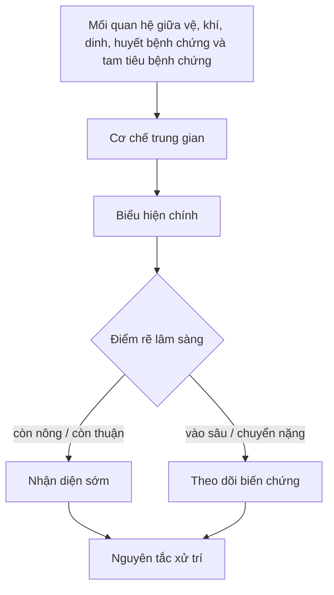

import KeyPoints from '~/components/KeyPoints.astro';
import CompareTable from '~/components/CompareTable.astro';
import ClinicalPearl from '~/components/ClinicalPearl.astro';
import MedicalNote from '~/components/MedicalNote.astro';
import RedFlags from '~/components/RedFlags.astro';
import SelfCheck from '~/components/SelfCheck.astro';
import SourceNote from '~/components/SourceNote.astro';

## Câu hỏi cơ chế

<MedicalNote title="Đọc trang này để trả lời">
Vì sao **Mối quan hệ giữa vệ, khí, dinh, huyết bệnh chứng và tam tiêu bệnh chứng** xảy ra, đi theo chuỗi nào, tạo dấu hiệu gì, và điểm rẽ nào làm đổi hướng chẩn đoán hoặc xử trí?
</MedicalNote>

## Bản đồ cơ chế 1 trang

<KeyPoints title="Nút cần nối bằng nhân quả">

- **Mối quan hệ giữa vệ, khí, dinh, huyết bệnh chứng và tam tiêu bệnh chứng:** Phạm vi bệnh của tam tiêu gồm thượng tiêu chủ yếu gồm thủ thái âm phế và thủ quyết âm tâm bào; trung tiêu chủ yếu bao gồm dương minh vị, trường và túc thái âm tỳ; hạ tiêu bao gồm túc thiếu âm thận và túc quyết âm can. Đây là trục đọc ban đầu, cần được nối tiếp bằng các nút cơ chế phía dưới. Giúp chuyển từ thuộc lòng triệu chứng sang định vị tầng bệnh và chọn pháp tương ứng.

</KeyPoints>

## Workflow diễn tiến

## Cầu nối sách vở → lâm sàng

<CompareTable title="Từ cơ chế đến quyết định">

| Nút cơ chế | Giải thích ngắn | Dấu hiệu kéo theo | Ý nghĩa chẩn đoán / xử trí |
| --- | --- | --- | --- |
| Mối quan hệ giữa vệ, khí, dinh, huyết bệnh chứng và tam tiêu bệnh chứng | Phạm vi bệnh của tam tiêu gồm thượng tiêu chủ yếu gồm thủ thái âm phế và thủ quyết âm tâm bào; trung tiêu chủ yếu bao gồm dương minh vị, trường và túc thái âm tỳ; hạ tiêu bao gồm túc thiếu âm thận và túc quyết âm can. Đây là trục đọc ban đầu, cần được nối tiếp bằng các nút cơ chế phía dưới. | Sốt, khát, phiền, ban chẩn, thần chí, lưỡi mạch và vị trí tổn thương. | Giúp chuyển từ thuộc lòng triệu chứng sang định vị tầng bệnh và chọn pháp tương ứng. |

</CompareTable>

## Worked example

1. Bắt đầu từ **Mối quan hệ giữa vệ, khí, dinh, huyết bệnh chứng và tam tiêu bệnh chứng**: hỏi đây là nguyên nhân, điều kiện nền hay định nghĩa khung.
2. Nối sang **cơ chế trung gian**: viết thành câu “vì X nên Y”, tránh chỉ chép lại heading.
3. Kiểm bằng **dấu hiệu quan sát**: dấu hiệu nào phải xuất hiện nếu cơ chế này đúng?
4. Kết luận bằng quyết định: cần phân biệt với gì, theo dõi điểm rẽ nào, và nguyên tắc xử trí đi ngược lại cơ chế nào.

<RedFlags>

- Đừng học trang này như một danh sách thuật ngữ. Hãy đọc theo mũi tên: nguyên nhân → cơ chế → dấu hiệu → quyết định.
- Nếu một dấu hiệu không nối được với cơ chế, quay lại nguyên thủy để kiểm tra văn cảnh trước khi ghi nhớ.
- Bản tự sinh này là khung cơ chế; khi biên tập, cần thay các nhãn khái quát bằng sơ đồ chuyên biệt hơn cho từng bệnh/chứng.

</RedFlags>

<ClinicalPearl>

- Cơ chế chỉ có giá trị học tập khi nó dự đoán được dấu hiệu tiếp theo hoặc giải thích được vì sao phải chọn pháp trị này thay vì pháp trị khác.

</ClinicalPearl>

## Tự kiểm

<SelfCheck>

1. Cơ chế trung tâm của bài này là gì?
2. Nút nào là điểm rẽ khiến bệnh nhẹ chuyển nặng hoặc từ biểu vào lý?
3. Dấu hiệu nào giúp chứng minh cơ chế đang diễn ra?
4. Nếu phải vẽ lại trong 60 giây, bạn sẽ giữ lại những mũi tên nào?

</SelfCheck>

<SourceNote>

- Nguồn: `Raw/on_benh_dai_cuong/01_ly-thuyet/bai-03-bien-chung_002.md`
- Gợi ý template: `deep-explanation`
- Kiểu trình bày: mechanism map + workflow + worked example.

</SourceNote>
