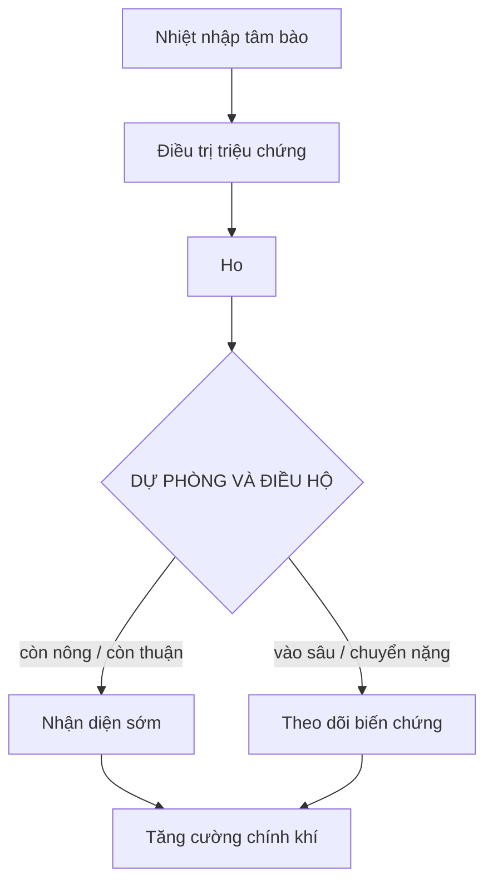

import KeyPoints from '~/components/KeyPoints.astro';
import CompareTable from '~/components/CompareTable.astro';
import ClinicalPearl from '~/components/ClinicalPearl.astro';
import MedicalNote from '~/components/MedicalNote.astro';
import RedFlags from '~/components/RedFlags.astro';
import SelfCheck from '~/components/SelfCheck.astro';
import SourceNote from '~/components/SourceNote.astro';

## Câu hỏi cơ chế

<MedicalNote title="Đọc trang này để trả lời">
Vì sao **Nhiệt nhập tâm bào** xảy ra, đi theo chuỗi nào, tạo dấu hiệu gì, và điểm rẽ nào làm đổi hướng chẩn đoán hoặc xử trí?
</MedicalNote>

## Bản đồ cơ chế 1 trang

<KeyPoints title="Nút cần nối bằng nhân quả">

- **Nhiệt nhập tâm bào:** - Nhiệt độc tích thịnh gia: Kim ngân hoa, Liên kiều, Bân lam căn, Đại thanh diệp... Đây là trục đọc ban đầu, cần được nối tiếp bằng các nút cơ chế phía dưới. Dùng làm trục chính để đọc phần còn lại của bài.
- **Điều trị triệu chứng:** Mỗi dấu hiệu phải được xem như bằng chứng của một cơ chế, không chỉ là tiêu chí liệt kê. Giúp tránh nhầm bệnh danh giống nhau nhưng cơ chế khác nhau.
- **Ho:** Đặt mục này vào chuỗi cơ chế của bài: nó là nguyên nhân, tầng trung gian, biểu hiện, biến chứng hay hướng xử trí? Dùng để hoàn thiện bản đồ cơ chế của chương.
- **DỰ PHÒNG VÀ ĐIỀU HỘ:** Nguyên tắc xử trí phải đi ngược lại cơ chế gây bệnh: giải cái đang bế, thanh cái đang nhiệt, hóa cái đang thấp, dưỡng cái đang hao. Giúp hiểu vì sao dùng pháp đó, không học pháp trị như câu thuộc lòng.
- **Tăng cường chính khí:** Đặt mục này vào chuỗi cơ chế của bài: nó là nguyên nhân, tầng trung gian, biểu hiện, biến chứng hay hướng xử trí? Dùng để hoàn thiện bản đồ cơ chế của chương.

</KeyPoints>

## Workflow diễn tiến

## Cầu nối sách vở → lâm sàng

<CompareTable title="Từ cơ chế đến quyết định">

| Nút cơ chế | Giải thích ngắn | Dấu hiệu kéo theo | Ý nghĩa chẩn đoán / xử trí |
| --- | --- | --- | --- |
| Nhiệt nhập tâm bào | - Nhiệt độc tích thịnh gia: Kim ngân hoa, Liên kiều, Bân lam căn, Đại thanh diệp... Đây là trục đọc ban đầu, cần được nối tiếp bằng các nút cơ chế phía dưới. | Tìm trong nguyên văn các dấu hiệu đi kèm và nối chúng với nút cơ chế. | Dùng làm trục chính để đọc phần còn lại của bài. |
| Điều trị triệu chứng | Mỗi dấu hiệu phải được xem như bằng chứng của một cơ chế, không chỉ là tiêu chí liệt kê. | Dấu hiệu then chốt, dấu hiệu loại trừ, dấu hiệu báo bệnh đã đổi tầng. | Giúp tránh nhầm bệnh danh giống nhau nhưng cơ chế khác nhau. |
| Ho | Đặt mục này vào chuỗi cơ chế của bài: nó là nguyên nhân, tầng trung gian, biểu hiện, biến chứng hay hướng xử trí? | Tìm trong nguyên văn các dấu hiệu đi kèm và nối chúng với nút cơ chế. | Dùng để hoàn thiện bản đồ cơ chế của chương. |
| DỰ PHÒNG VÀ ĐIỀU HỘ | Nguyên tắc xử trí phải đi ngược lại cơ chế gây bệnh: giải cái đang bế, thanh cái đang nhiệt, hóa cái đang thấp, dưỡng cái đang hao. | Đáp ứng sau xử trí, dấu hiệu cần theo dõi, dấu hiệu không nên công phạt thêm. | Giúp hiểu vì sao dùng pháp đó, không học pháp trị như câu thuộc lòng. |
| Tăng cường chính khí | Đặt mục này vào chuỗi cơ chế của bài: nó là nguyên nhân, tầng trung gian, biểu hiện, biến chứng hay hướng xử trí? | Tìm trong nguyên văn các dấu hiệu đi kèm và nối chúng với nút cơ chế. | Dùng để hoàn thiện bản đồ cơ chế của chương. |
| Thuốc dự phòng | Nguyên tắc xử trí phải đi ngược lại cơ chế gây bệnh: giải cái đang bế, thanh cái đang nhiệt, hóa cái đang thấp, dưỡng cái đang hao. | Đáp ứng sau xử trí, dấu hiệu cần theo dõi, dấu hiệu không nên công phạt thêm. | Giúp hiểu vì sao dùng pháp đó, không học pháp trị như câu thuộc lòng. |

</CompareTable>

## Worked example

1. Bắt đầu từ **Nhiệt nhập tâm bào**: hỏi đây là nguyên nhân, điều kiện nền hay định nghĩa khung.
2. Nối sang **Điều trị triệu chứng**: viết thành câu “vì X nên Y”, tránh chỉ chép lại heading.
3. Kiểm bằng **Ho**: dấu hiệu nào phải xuất hiện nếu cơ chế này đúng?
4. Kết luận bằng quyết định: cần phân biệt với gì, theo dõi điểm rẽ nào, và nguyên tắc xử trí đi ngược lại cơ chế nào.

<RedFlags>

- Đừng học trang này như một danh sách thuật ngữ. Hãy đọc theo mũi tên: nguyên nhân → cơ chế → dấu hiệu → quyết định.
- Nếu một dấu hiệu không nối được với cơ chế, quay lại nguyên thủy để kiểm tra văn cảnh trước khi ghi nhớ.
- Bản tự sinh này là khung cơ chế; khi biên tập, cần thay các nhãn khái quát bằng sơ đồ chuyên biệt hơn cho từng bệnh/chứng.

</RedFlags>

<ClinicalPearl>

- Cơ chế chỉ có giá trị học tập khi nó dự đoán được dấu hiệu tiếp theo hoặc giải thích được vì sao phải chọn pháp trị này thay vì pháp trị khác.

</ClinicalPearl>

## Tự kiểm

<SelfCheck>

1. Cơ chế trung tâm của bài này là gì?
2. Nút nào là điểm rẽ khiến bệnh nhẹ chuyển nặng hoặc từ biểu vào lý?
3. Dấu hiệu nào giúp chứng minh cơ chế đang diễn ra?
4. Nếu phải vẽ lại trong 60 giây, bạn sẽ giữ lại những mũi tên nào?

</SelfCheck>

<SourceNote>

- Nguồn: `Raw/on_benh_dai_cuong/02_benh-lam-sang/phong-on_002.md`
- Gợi ý template: `symptom-approach`
- Kiểu trình bày: mechanism map + workflow + worked example.

</SourceNote>
