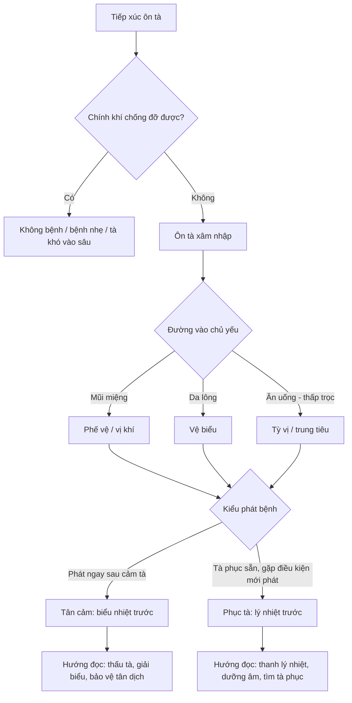
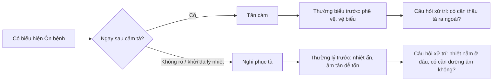

import KeyPoints from '~/components/KeyPoints.astro';
import CompareTable from '~/components/CompareTable.astro';
import ClinicalPearl from '~/components/ClinicalPearl.astro';
import MedicalNote from '~/components/MedicalNote.astro';
import RedFlags from '~/components/RedFlags.astro';
import SelfCheck from '~/components/SelfCheck.astro';
import SourceNote from '~/components/SourceNote.astro';

## Câu hỏi cơ chế

<MedicalNote title="Đọc trang này để trả lời">
Vì sao cùng tiếp xúc ôn tà nhưng người thì không bệnh, người thì phát nhanh ở biểu, người lại mới khởi đã thấy lý nhiệt?
</MedicalNote>

## Bản đồ 1 trang

<KeyPoints title="4 nút cơ chế phải nối được">

- **Ôn tà là tác nhân trực tiếp:** tà có tính ôn nhiệt, từ ngoài vào, dễ hóa nhiệt, hao tân dịch và làm rối loạn vệ-khí-dinh-huyết, tam tiêu.
- **Chính khí là điều kiện quyết định phát hay không:** cùng có tà, người chính khí vững có thể không phát bệnh hoặc bệnh nhẹ; chính khí suy, âm tân kém, tỳ vị yếu thì dễ phát và dễ nặng.
- **Đường vào định bệnh vị đầu:** mũi miệng thường liên hệ phế-vị; da lông liên hệ vệ biểu; ăn uống/thấp trọc liên hệ tỳ-vị; độc tà dễ đi nhanh vào huyết lạc hoặc hầu họng.
- **Tân cảm và phục tà là điểm rẽ:** tân cảm là cảm tà rồi phát ngay, thường biểu trước; phục tà là tà ẩn sẵn rồi phát, nên lúc khởi đã thiên lý nhiệt.

</KeyPoints>

## Workflow phát bệnh

## Cơ chế chính: không phải cứ có tà là có bệnh

Ôn bệnh hình thành từ **tương quan tà - chính**, không chỉ từ bản thân ôn tà. Ôn tà là điều kiện cần, nhưng phát bệnh phụ thuộc vào khả năng chính khí giữ cân bằng. Khi chính khí đủ, tà khó vượt qua vệ biểu hoặc bệnh chỉ nhẹ. Khi chính khí suy, tà dễ vào sâu, nhiệt dễ hóa mạnh, tân dịch dễ tổn, bệnh dễ chuyển tầng.

Điểm này rất quan trọng khi đọc bệnh học: nguyên nhân không nên học như danh sách "phong, thử, thấp, táo, hỏa, độc". Mỗi loại tà phải trả lời được ba câu hỏi:

1. Nó đi vào đâu trước?
2. Nó làm rối loạn chức năng nào?
3. Nó tạo ra dấu hiệu gì để mình nhận ra?

## Cầu nối sách vở → nhận diện

<CompareTable title="Từ cơ chế đến dấu hiệu">

| Nút cơ chế | Giải thích ngắn | Dấu hiệu kéo theo | Ý nghĩa học tập |
| --- | --- | --- | --- |
| Ôn tà phạm phế vệ | Tà nhiệt từ ngoài vào, phế vệ bị uất | Sốt, hơi sợ gió/lạnh, ho, khát, rêu mỏng | Đừng phát hãn kiểu hàn tà; nghĩ tân lương, thấu tà |
| Nhiệt vào khí phận | Tà đã rời biểu, nhiệt thịnh bên trong | Sốt cao, khát, mồ hôi, phiền, mạch hồng đại | Trọng tâm chuyển sang thanh khí nhiệt |
| Thấp nhiệt khốn trung tiêu | Thấp bế khiến nhiệt khó thoát | Sốt dai dẳng, nặng mình, ngực bụng đầy, rêu nhớt | Không chỉ thanh nhiệt; cần hóa thấp, khai uất |
| Nhiệt thương tân âm | Nhiệt lâu hoặc nhiệt mạnh làm hao dịch | Khát, môi lưỡi khô, tiểu ít, lưỡi đỏ | Vừa trừ tà vừa bảo vệ tân dịch |
| Nhiệt nhập dinh huyết | Tà vào sâu, nhiễu dinh huyết | Ban chẩn, xuất huyết, phiền táo, thần chí bất an | Báo động bệnh nặng, cần đổi tầng biện chứng |

</CompareTable>

## Điểm rẽ tân cảm - phục tà

Tân cảm và phục tà không phải hai tên gọi để học thuộc. Chúng là **hai mô hình khởi bệnh**. Tân cảm giúp giải thích ca sốt mới khởi còn biểu hiện ở nông. Phục tà giúp giải thích ca vừa phát đã thấy lý nhiệt, ít biểu chứng, hoặc có dấu hao tân âm sớm.

## Worked example

Một người bệnh sốt sau tiếp xúc thời khí, ho, khát, hơi sợ gió, rêu lưỡi mỏng:

1. **Tác nhân:** nghĩ ôn tà phạm từ ngoài.
2. **Đường vào:** mũi miệng → phế vệ.
3. **Tầng bệnh:** còn thiên biểu/phế vệ vì có ho, hơi sợ gió, rêu mỏng.
4. **Điểm cần theo dõi:** nếu sốt cao, khát nhiều, mồ hôi, phiền tăng thì tà đã vào khí phận.
5. **Ý nghĩa xử trí:** giai đoạn đầu ưu tiên thấu tà, tân lương giải biểu; nếu vào khí thì trọng tâm đổi sang thanh khí nhiệt.

<RedFlags>

- Nếu chỉ thấy chữ "nguyên nhân" mà học thuộc tên tà, bài này mất giá trị.
- Nếu không hỏi chính khí, sẽ không giải thích được vì sao cùng tiếp xúc mà mức bệnh khác nhau.
- Nếu không phân tân cảm và phục tà, rất dễ nhầm ca lý nhiệt khởi phát với ca biểu nhiệt mới cảm.

</RedFlags>

<ClinicalPearl>

Khi học một bệnh Ôn bệnh cụ thể, hãy viết một dòng theo mẫu: **tà gì → vào đường nào → chính khí ra sao → phát theo tân cảm hay phục tà → đang ở tầng nào**. Dòng này biến nguyên nhân thành bản đồ xử trí.

</ClinicalPearl>

## Tự kiểm

<SelfCheck>

1. Vì sao "có ôn tà" chưa đủ để nói chắc sẽ phát Ôn bệnh?
2. Đường vào mũi miệng gợi ý bệnh vị đầu nào?
3. Dấu hiệu nào khiến bạn nghĩ bệnh đã từ phế vệ vào khí phận?
4. Tân cảm và phục tà khác nhau ở điểm khởi bệnh nào?

</SelfCheck>

<SourceNote>

- Nguồn chính: `Raw/on_benh_dai_cuong/01_ly-thuyet/bai-02-nguyen-nhan-phat-benh_001.md`
- Nguồn liên quan: `Raw/on_benh_dai_cuong/01_ly-thuyet/bai-02-nguyen-nhan-phat-benh_002.md`, `Raw/on_benh_dai_cuong/01_ly-thuyet/bai-02-nguyen-nhan-phat-benh_003.md`
- Mục tiêu biên tập: biến phần nguyên nhân thành workflow cơ chế, không lặp lại tóm tắt chương.

</SourceNote>
