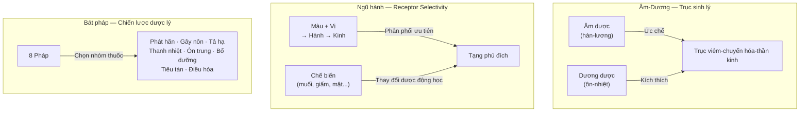
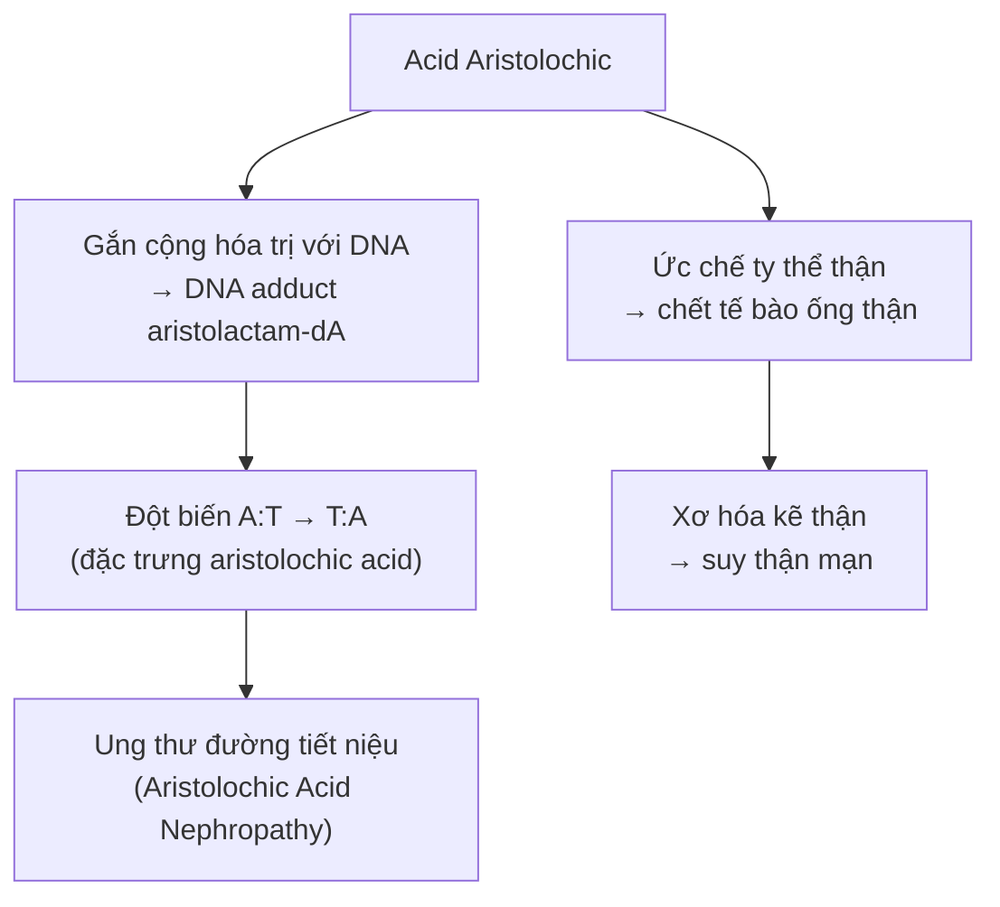

import KeyPoints from '~/components/KeyPoints.astro';
import CompareTable from '~/components/CompareTable.astro';
import ClinicalPearl from '~/components/ClinicalPearl.astro';
import RedFlags from '~/components/RedFlags.astro';
import SourceNote from '~/components/SourceNote.astro';

## Câu hỏi trung tâm

**Hệ thống phân loại Âm-Dương, Ngũ hành, Bát pháp trong dược học cổ truyền có cơ sở sinh học hay không — và nếu có, giải thích ở mức độ nào?**

<KeyPoints title="Luận điểm cốt lõi">

- **Âm-Dương dược học** phản ánh trục sinh lý **kích thích ↔ ức chế** — tương ứng với trục ANS (giao cảm/đối giao cảm) và trục viêm/chống viêm.
- **Ngũ hành quy kinh** là hệ thống **receptor selectivity** thô sơ: hợp chất trong thuốc có ái lực ưu tiên đến các mô/tạng nhất định.
- **Bát pháp** là thuật ngữ mô tả **8 chiến lược dược lý** dựa trên vị trí và bản chất tà khí.
- **Đặc điểm hình thái học** (hoa-lá nhẹ → thượng tiêu) có tương quan thực sự với thành phần hóa học — hợp chất bay hơi (tinh dầu) nhiều ở hoa lá, tác động đường hô hấp.
- **Danh mục 380 vị** Việt Nam là kết quả thực hành lâm sàng tích lũy, được chuẩn hóa theo YHHĐ hiện đại.

</KeyPoints>

---

## 1. Bản đồ cơ chế tổng thể

---

## 2. Cơ sở sinh học của Âm-Dương dược học

### 2.1. Âm dược = Thuốc ức chế

Âm dược (hàn, lương) tác động qua các cơ chế ức chế:

| Cơ chế YHHĐ | Biểu hiện lâm sàng YHCT | Nhóm hợp chất |
|---|---|---|
| Ức chế COX-1/COX-2 → giảm prostaglandin | Thanh nhiệt, giảm sốt | Flavonoid, terpenoid |
| Ức chế NF-κB → giảm cytokine viêm | Thanh nhiệt giải độc | Alkaloid, glycosid đắng |
| Ức chế thần kinh giao cảm | Hạ huyết áp, chậm nhịp tim | Alkaloid nhóm isoquinoline |
| Tăng tiết nước tiểu (lợi tiểu) | Lợi thủy, tiêu thũng | Flavonoid, saponin |
| Kháng khuẩn/kháng virus | Giải độc, trừ tà | Alkaloid, tannin, polyphenol |

**Ví dụ điển hình:** Hoàng liên (Âm trong Âm — hàn + khổ):
- Berberine ức chế NF-κB → chống viêm
- Berberine ức chế kênh IKr của tim → làm chậm nhịp tim (chống loạn nhịp)
- Berberine ức chế enzyme glucosamine-6-phosphate isomerase → kháng khuẩn

### 2.2. Dương dược = Thuốc kích thích

Dương dược (ôn, nhiệt) tác động qua các cơ chế kích thích:

| Cơ chế YHHĐ | Biểu hiện lâm sàng YHCT | Nhóm hợp chất |
|---|---|---|
| Kích hoạt TRPV1, TRPA1 (kênh nhiệt TRP) | Tán hàn, phát hãn, ôn trung | Tinh dầu, capsaicin, gingerol |
| Kích thích thần kinh giao cảm | Tăng nhịp tim, tăng huyết áp | Alkaloid ephedrin (Ma hoàng) |
| Tăng tuần hoàn ngoại vi (giãn mao mạch) | Thông kinh hoạt lạc | Phenylpropanoid |
| Tăng tiết dịch vị, tăng nhu động | Kiện Tỳ, ôn Vị | Tinh dầu bay hơi |
| Tăng chuyển hóa cơ bản | Hồi dương cứu nghịch | Alkaloid aconitine (Phụ tử) |

**Ví dụ nổi bật:** Ma hoàng (Dương trong Dương):
- Ephedrine kích thích receptor adrenergic α và β → phát hãn (giao cảm kích hoạt tuyến mồ hôi), giãn phế quản (β2)
- Pseudoephedrine co mạch → thông mũi
- Đây là lý do Ma hoàng "giải biểu hàn" và "tuyên Phế bình suyễn" đồng thời

### 2.3. Tính tương đối của Âm-Dương

Cùng một hợp chất, ở **liều khác nhau** có thể tác động ngược chiều:

| Hợp chất | Liều thấp | Liều cao |
|---|---|---|
| Aconitine (Phụ tử) | Dương: tăng co bóp tim, tăng tuần hoàn | Ngộ độc: loạn nhịp tim, ngừng tim |
| Cafein | Dương: kích thích TKTW, tăng tỉnh táo | Cao: lo âu, run, mất ngủ |
| Berberin | Âm: ức chế vi khuẩn, chống viêm | Quá cao: ức chế TKTW, hạ đường huyết |

→ Đây là lý do "tính Âm dương của thuốc YHCT mang tính tương đối."

---

## 3. Ngũ hành quy kinh — Receptor Selectivity

### 3.1. Tại sao quy kinh hoạt động?

Quy kinh không phải ma thuật — có 3 cơ chế:

**Cơ chế 1: Phân phối mô học (Tissue Distribution)**

Hợp chất trong thuốc có ái lực ưu tiên với mô/protein đặc hiệu:

| Quy kinh (YHCT) | Cơ sở phân phối (YHHĐ) |
|---|---|
| Thận (Thủy, Hàm) | Muối khoáng và hợp chất mang điện âm → được lọc bởi thận, tập trung tại ống thận |
| Can (Mộc, Toan) | Acid hữu cơ tích lũy trong gan qua vòng entero-hepatic circulation |
| Tâm (Hỏa, Khổ) | Alkaloid kỵ nước (log P cao) qua hàng rào máu não → TKTW và tim |
| Phế (Kim, Tân) | Tinh dầu bay hơi → đường hô hấp (hít hoặc phân phối ưu tiên) |
| Tỳ (Thổ, Cam) | Carbohydrat và saponin → tiêu hóa, niêm mạc ruột |

**Cơ chế 2: Ái lực receptor**

- Berberin (Hoàng liên → Tâm) ức chế kênh K⁺ tim (IKr) → tác động trực tiếp lên tim
- Saponin Nhân sâm (→ Tỳ, Phế) tương tác với glycoprotein bề mặt tế bào miễn dịch

**Cơ chế 3: Chế biến thay đổi dược động học**

| Phụ liệu | Thay đổi hóa học | Hệ quả phân phối |
|---|---|---|
| Muối (NaCl) | Ion Na⁺ thay đổi phân cực phân tử | Tăng thân nước → phân phối nhiều hơn vào mô thận (lọc cầu thận) |
| Giấm (Acid acetic) | Alkaloid → muối acetat (thân nước hơn) | Tăng hấp thu qua ruột, phân phối gan cao hơn |
| Rượu (Ethanol) | Tăng log P tạm thời | Tăng hòa tan hợp chất kỵ nước → tăng qua BBB → tác động TKTW (Tâm) |
| Mật ong (Đường) | Bao bọc bề mặt → giải phóng chậm | Tăng thời gian tiếp xúc niêm mạc ruột → bổ Tỳ Vị |
| Sao đen (Carbonhóa) | Tạo carbon hoạt tính và thay đổi thành phần | Tăng hấp phụ và tác động cầm máu tại chỗ |

### 3.2. Phân loại theo đặc điểm dược liệu — Cơ sở hóa thực vật

Nguyên lý "đồng khí tương cầu" (bộ phận → vùng tác dụng) có cơ sở:

| Bộ phận cây | Thành phần ưu thế | Tác dụng chủ yếu |
|---|---|---|
| **Hoa, Lá** | Tinh dầu bay hơi (monoterpene, sesquiterpene) | Đường hô hấp, da (bay vào không khí) → Phế, Bì phu |
| **Vỏ, Da cây** | Tannin, flavonoid lớp ngoài | Thu liễm, kháng khuẩn bề mặt → Bì phu |
| **Rễ, Củ** | Alkaloid, saponin (tích lũy dưới đất) | Tác dụng hệ thống, nội tạng sâu → Can, Thận |
| **Hạt** | Dầu béo, glycosid (dự trữ năng lượng) | Nhuận tràng, hoạt huyết (dầu béo) |
| **Khoáng vật** | Muối khoáng nặng (Mg, Ca, Fe) | Trầm giáng, an thần (khối lượng phân tử cao) |

---

## 4. Bát pháp — Dược lý học của 8 chiến lược

### 4.1. Mỗi "pháp" là một chiến lược tác động dược lý

```mermaid
flowchart TD
    subgraph "Hãn pháp — Tăng bài tiết qua da"
        H1["Tinh dầu kích hoạt TRPV1\n→ giãn mao mạch da"] --> H2["Tăng lưu lượng máu da\n→ tăng tiết mồ hôi"]
        H2 --> H3["Hạ nhiệt · Đuổi tà ở biểu"]
    end
    subgraph "Thổ pháp — Kích hoạt phản xạ nôn"
        T1["Kích thích TK cảm giác GI\nhoặc Area postrema"] --> T2["Phản xạ nôn\n→ tống chất ra ngoài"]
    end
    subgraph "Hạ pháp — Tăng nhu động / kéo nước vào ruột"
        HA1["Anthraquinon (Đại hoàng)\n→ kích thích cơ trơn đại tràng"] --> HA2["Tăng nhu động"]
        HA3["Sulfat Mg (Mang tiêu)\n→ kéo nước thẩm thấu vào lòng ruột"] --> HA4["Làm mềm phân"]
    end
    subgraph "Thanh pháp — Ức chế viêm"
        C1["Flavonoid, alkaloid\n→ ức chế COX, NF-κB"] --> C2["Hạ sốt · Chống viêm · Kháng khuẩn"]
    end
    subgraph "Bổ pháp — Adaptogen + Dinh dưỡng"
        B1["Saponin ginsenosid\n→ điều hòa trục HPA"] --> B2["Tăng sức chịu đựng stress\n→ bổ khí, bổ dương"]
        B3["Polysaccharid\n→ tăng miễn dịch tế bào"] --> B4["Tăng sức đề kháng\n→ bổ dương, bổ huyết"]
    end
```

### 4.2. Bát pháp và dược lý hiện đại — Bảng đối chiếu

<CompareTable
  headers={["Pháp", "Cơ chế YHHĐ", "Nhóm hợp chất chính"]}
  rows={[
    ["Hãn", "Kích hoạt TRPV1/TRPA1 → giãn mao mạch da → tăng tiết mồ hôi; hạ sốt ngoại biên", "Tinh dầu (menthol, borneol, thymol)"],
    ["Thổ", "Kích thích TK cảm giác dạ dày (ngoại vi) hoặc trực tiếp area postrema (trung khu)", "Cucurbitacin, CuSO₄, febrifugin"],
    ["Hạ", "Tăng nhu động đại tràng (anthraquinon) + thẩm thấu (muối, saponin) + bôi trơn (dầu béo)", "Sennoside, emodin, Mg²⁺, dầu thực vật"],
    ["Hòa", "Điều hòa serotonin/dopamine (an thần), chống co thắt, lợi mật", "Saponin, flavonoid, tinh dầu"],
    ["Thanh", "Ức chế COX/LOX, NF-κB, TNF-α; kháng khuẩn; hạ nhiệt trung khu", "Berberine, baicalin, chlorogenic acid"],
    ["Ôn", "Kích thích adrenergic → tăng nhiệt; giãn mạch ngoại vi; tăng tiết dịch tiêu hóa", "Alkaloid (ephedrine, aconitine), cinnamaldehyde"],
    ["Tiêu", "Tiêu huyết ứ: ức chế kết tập tiểu cầu; tiêu đàm: long đờm, giảm nhớt; tiêu thực: enzyme", "Saponin, flavonoid, enzyme (kê nội kim)"],
    ["Bổ", "Adaptogen (điều hòa HPA); tăng miễn dịch; hormone precursor; cung cấp vi chất", "Ginsenoside, polysaccharid, amino acid, khoáng vi lượng"],
  ]}
/>

---

## 5. Cơ chế an toàn — Tại sao nhầm tên thuốc nguy hiểm

### 5.1. Acid Aristolochic — Bài học thực tế

**Cam thảo nam** (*Abrus precatorius* hoặc *Scoparia dulcis*) về cơ bản vô hại. Nhưng nhiều loài trong chi *Aristolochia* (Nam mộc hương, Quảng phòng kỷ) chứa **acid aristolochic** — một trong những chất gây ung thư và độc thận được xác nhận mạnh nhất hiện nay.

Trường hợp lịch sử: Bỉ 1990s — hàng trăm người suy thận sau khi dùng thuốc giảm cân có Quảng phòng kỷ thay vì Phòng kỷ. Đây là lý do **nhầm tên thuốc = nguy hiểm tính mạng**, không chỉ là vấn đề học thuật.

### 5.2. Phục linh vs Thổ Phục linh

| | Phục linh | Thổ Phục linh |
|---|---|---|
| Cây | *Poria cocos* (nấm) | *Smilax glabra* (họ Smilacaceae) |
| Thành phần | Beta-glucan, triterpenoid | Sarsaponin, flavonoid |
| Tác dụng | An thần, lợi thủy, kiện Tỳ | Giải độc, trừ phong thấp, thanh nhiệt |
| Ngộ nhận | Tưởng có thể thay thế vì đều "lợi thủy" |  |

---

## 6. Cầu nối lâm sàng — Worked example

**Tình huống:** Bệnh nhân 55 tuổi, Thận âm hư, bốc hỏa, triều nhiệt, đạo hãn. Thầy thuốc dùng Lục vị hoàng hoàn (Thục địa, Sơn thù, Hoài sơn, Mẫu đơn bì, Trạch tả, Bạch linh).

**Phân tích cơ chế:**

| Vị thuốc | Màu-Vị-Hành | Quy kinh | Cơ chế YHHĐ |
|---|---|---|---|
| Thục địa | Đen-Cam-Thủy/Thổ | Thận, Tâm | Catalpol và polysaccharid → tăng tổng hợp testosterone, estrogen; tăng tạo máu |
| Sơn thù | Đỏ-Toan-Mộc | Can, Thận | Ursolic acid → kháng viêm; moric acid → kháng oxy hóa |
| Hoài sơn | Trắng-Cam-Thổ | Tỳ, Phế, Thận | Diosgenin (steroid tiền chất) → hỗ trợ nội tiết; allantoin → tái tạo mô |
| Mẫu đơn bì | Đỏ-Khổ-Hỏa | Tâm, Can, Thận | Paeonol → ức chế COX-2, chống viêm → "thanh hư nhiệt" |
| Trạch tả | Trắng-Ngọt/Nhạt-Thổ | Thận, Bàng quang | Alisol A/B → lợi tiểu thẩm thấu → "tả Thận hỏa" qua nước tiểu |
| Bạch linh (Phục linh) | Trắng-Ngọt/Nhạt-Thổ | Tâm, Tỳ, Phế | Beta-glucan → lợi niệu nhẹ, an thần → "bổ Tỳ lợi thủy" |

**Kết luận:** Lục vị hoàng hoàn = 3 vị bổ + 3 vị tả. Trạch tả và Phục linh không phải "thừa" — chúng **ngăn Thục địa gây trệ** (đặc tính nhớt dính của Thục địa có thể gây đầy bụng nếu dùng đơn lẻ). Đây là nguyên tắc "khai thông khi bổ" — cơ sở dược động học: lợi niệu giúp đào thải các chất chuyển hóa, không để tích lũy.

<SourceNote>

- Nguồn gốc: `Raw/Thuoc_YHCT/chuong-01-dai-cuong/bai-01-dai-cuong-thuoc-yhct_001.md`
- Sách: *Thuốc Y học cổ truyền (Tập 1)* — TS. Hứa Hoàng Oanh, TS. Nguyễn Thành Triết.

</SourceNote>
