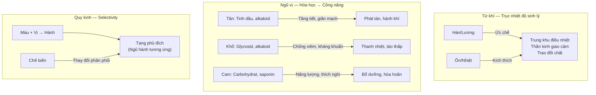
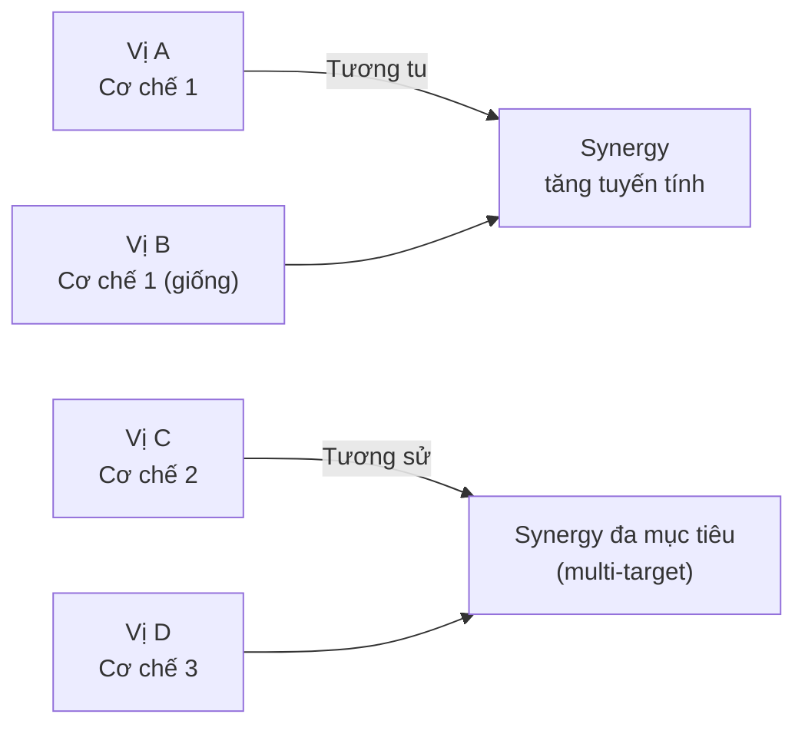

import KeyPoints from '~/components/KeyPoints.astro';
import CompareTable from '~/components/CompareTable.astro';
import ClinicalPearl from '~/components/ClinicalPearl.astro';
import RedFlags from '~/components/RedFlags.astro';
import SourceNote from '~/components/SourceNote.astro';

## Câu hỏi trung tâm

**Tính năng của thuốc cổ truyền là hệ thống mô tả kinh nghiệm lâm sàng 2000 năm — nhưng cơ chế sinh học nào đứng sau? Và khi cơ chế đó xung đột với quy tắc, ta tuân theo quy tắc hay cơ chế?**

<KeyPoints title="Luận điểm cốt lõi">

- **Tứ khí** phản ánh tác động sinh lý trên trục kích thích/ức chế cơ năng — tương ứng nhóm chất hóa học trong thuốc.
- **Ngũ vị** có nền tảng hóa học thực sự: tân → tinh dầu/alkaloid; cam → carbohydrat; khổ → glycosid; toan → acid hữu cơ; hàm → muối khoáng.
- **Quy kinh** là hệ thống chọn lọc tác dụng — tương tự khái niệm receptor selectivity — nhưng ở mức sinh lý hệ thống thay vì tế bào phân tử.
- **Phối ngũ** phản ánh dược lý tương tác: synergy, antagonism, trung hòa độc tính.
- **Tương phản** (Thập bát phản) có cơ sở thực nghiệm — một số cặp đã được chứng minh tăng độc tính trên mô hình động vật.

</KeyPoints>

---

## 1. Bản đồ cơ chế tổng thể

---

## 2. Tứ khí — Giải mã sinh học

### 2.1. Hàn và Lương

**Thuốc hàn-lương ức chế hưng phấn cơ năng** thông qua:

| Cơ chế YHHĐ | Biểu hiện YHCT |
|---|---|
| Ức chế trung khu điều nhiệt (hypothalamus) | Hạ sốt, thanh nhiệt |
| Ức chế hệ thần kinh giao cảm | Giảm nhịp tim, hạ huyết áp |
| Chống viêm (ức chế COX, NF-κB) | Thanh nhiệt giải độc |
| Lợi tiểu (tăng lọc cầu thận) | Lợi thủy, tiêu thũng |
| Kháng khuẩn/kháng virus | Giải độc, tiêu mụn nhọt |

*Ví dụ điển hình:* Hoàng liên — berberine (alkaloid) ức chế NF-κB, giảm TNF-α, ức chế vi khuẩn Gram+ và Gram-. Thạch cao — Ca²⁺ ức chế tiết prostaglandin tại trung khu điều nhiệt.

### 2.2. Ôn và Nhiệt

**Thuốc ôn-nhiệt kích thích chức năng suy nhược** thông qua:

| Cơ chế YHHĐ | Biểu hiện YHCT |
|---|---|
| Kích thích thần kinh giao cảm (tinh dầu) | Phát hãn, tán hàn |
| Tăng tuần hoàn ngoại vi (giãn mao mạch) | Thông kinh hoạt lạc |
| Tăng chuyển hóa cơ bản (alkaloid) | Hồi dương cứu nghịch |
| Kích thích tiết dịch tiêu hóa | Kiện Tỳ ôn Vị |

*Ví dụ điển hình:* Phụ tử — aconitine kích thích thụ thể Na⁺ (VGSCs), tăng co bóp cơ tim (cơ chế positive inotropic) → "Hồi dương cứu nghịch". Quế nhục — cinnamaldehyde ức chế tiểu cầu, tăng tuần hoàn → "Thông kinh mạch."

<ClinicalPearl>

**Tại sao Phụ tử có độc nhưng vẫn dùng?** Aconitine ở liều thấp = positive inotropic (có lợi trong suy tim lạnh). Ở liều cao = loạn nhịp nặng, ngừng tim. Chế biến (bào chế Phụ tử) thủy phân aconitine thành benzoylaconine (độc thấp hơn 50 lần) → giảm độc, giữ hiệu quả. Đây là "chế biến theo YHCT" có cơ sở hóa học thực sự.

</ClinicalPearl>

---

## 3. Ngũ vị — Cơ chế từ hóa học

### 3.1. Vị Tân (Cay) — Tinh dầu và kênh TRP

Tinh dầu (terpene, phenylpropanoid) và capsaicin/piperin kích hoạt kênh **TRPV1 và TRPA1** trên thần kinh cảm giác và tế bào biểu mô:

- Tăng tiết mồ hôi → phát hãn (tác dụng "phát tán")
- Giãn mao mạch da → tăng tuần hoàn cục bộ → "hành khí huyết"
- Kích thích đường tiêu hóa → tăng nhu động → "hành khí"
- Bay hơi vào đường hô hấp → khai thông mũi họng

### 3.2. Vị Khổ (Đắng) — Glycosid và alkaloid

Vị đắng kích hoạt **thụ thể TAS2R** (bitter taste receptors) trên lưỡi và niêm mạc dạ dày → reflex tăng tiết mật và dịch tiêu hóa. Ở nồng độ cao hơn, các alkaloid và glycosid tác động trực tiếp:

- **Berberine** (Hoàng liên): ức chế DNA gyrase vi khuẩn → kháng khuẩn; ức chế COX-2 → chống viêm
- **Baicalin** (Hoàng cầm): chống oxy hóa, kháng virus, ức chế tổng hợp prostaglandin
- **Gentiopicrin** (Long đởm thảo): kích thích tiết mật → lợi mật, tiêu thấp

### 3.3. Vị Cam (Ngọt) — Saponin và polysaccharid

- **Saponin** (Nhân sâm, Cam thảo): adaptogen — điều hòa trục HPA, tăng khả năng chịu stress
- **Polysaccharid** (Hoàng kỳ): tăng cường miễn dịch (kích thích đại thực bào, NK cells)
- **Glycyrrhizin** (Cam thảo): ức chế enzyme 11β-HSD2 → làm tăng nồng độ cortisol → chống viêm mạnh
- Carbohydrat đơn giản: cung cấp năng lượng nhanh → "bổ dưỡng"

### 3.4. Vị Toan (Chua) — Acid hữu cơ và tannin

- **Acid hữu cơ** (citric, malic, tartaric): kết tủa protein → se niêm mạc → cầm tiêu chảy, giảm tiết mồ hôi ("thu liễm")
- **Tannin** (Ngũ bội tử, Ô mai): kết hợp collagen da → làm se → "cố sáp"
- Giảm pH cục bộ → ức chế vi khuẩn gây thối → "sát khuẩn nhẹ"

### 3.5. Vị Hàm (Mặn) — Muối khoáng và mucopolysaccharid

- **Iod** (Hải tảo, Côn bố): điều hòa tuyến giáp, giảm bướu → "nhuận kiên (làm mềm khối cứng)"
- **Calcium phosphat** (Long cốt, Mẫu lệ): chống co giật, an thần → "bình can tiềm dương"
- **Mucopolysaccharid** (Quy bản, Miết giáp): liên kết nước → nhuận tràng

---

## 4. Quy kinh — Cơ sở sinh lý học hệ thống

### 4.1. Tại sao quy kinh có tính tương đối?

Quy kinh KHÔNG phải là "thuốc đi thẳng vào tạng đó" theo nghĩa giải phẫu. Đúng hơn, đây là mô tả **ái lực chọn lọc** (selectivity) dựa trên:

1. **Dược động học:** Hợp chất trong thuốc phân phối ưu tiên đến mô/tạng nào
2. **Dược lực học:** Thuốc tác động ưu tiên trên receptor/enzyme nào, và receptor đó có nhiều nhất ở tạng nào
3. **Kinh nghiệm lâm sàng tích lũy:** Quan sát thực tiễn qua nhiều thế hệ

*Ví dụ:* Hoàng liên quy kinh Tâm vì berberine ức chế kênh K⁺ tim (IKr), tác động mạnh trên nhịp tim — phù hợp "Tâm chủ huyết mạch." Nhưng berberine cũng tác động đường ruột (Trung tiêu) — vì vậy Hoàng liên thực tế quy nhiều kinh.

### 4.2. Chế biến thay đổi quy kinh — Cơ sở dược động học

| Phụ liệu | Thay đổi | Cơ sở hóa học |
|---|---|---|
| Muối (NaCl) | Tăng tan trong nước, tăng thấm thận | Ion Na⁺ thay đổi phân cực phân tử, tăng phân phối vào mô thận |
| Giấm (acid acetic) | Tạo muối acetat → tăng tan, thay đổi ionization | Alkaloid dạng muối acetat dễ hấp thu → tăng nồng độ ở gan |
| Rượu (ethanol) | Tăng chiết xuất terpene và alkaloid kỵ nước | Ethanol tăng log P → hợp chất dễ qua hàng rào máu não → tác dụng lên TKTW (Tâm) |
| Mật ong | Carbohydrat bọc bề mặt thuốc → chậm phóng thích | Giải phóng chậm ở dạ dày → tăng thời gian tác dụng tại Tỳ Vị |

---

## 5. Phối ngũ — Dược lý tương tác hiện đại

### 5.1. Tương tu và Tương sử = Synergy

*Ví dụ hiện đại:* Đại hoàng (sennosid → tả hạ) + Mang tiêu (sulfat Mg → kéo nước vào ruột) = hiệu lực tả hạ cao hơn từng vị đơn lẻ qua 2 cơ chế khác nhau.

### 5.2. Tương úy và Tương sát = Giải độc

Bán hạ chứa calcium oxalate needle crystals → kích ứng niêm mạc họng, gây nôn, buồn nôn. Sinh khương chứa gingerol + shogaol:
- Gingerol ức chế cảm thụ đau TRPV1 → giảm cảm giác kích ứng
- Shogaol có tác dụng chống nôn trực tiếp (5-HT3 antagonist)

→ Kết quả: "Bán hạ úy Sinh khương" có cơ sở dược lý thực sự, không chỉ là kinh nghiệm thực hành.

### 5.3. Thập bát phản — Cơ sở thực nghiệm

Một số nghiên cứu dược lý cho thấy:

| Cặp tương phản | Bằng chứng thực nghiệm |
|---|---|
| Cam thảo + Cam toại | Tăng độc tính ruột trên mô hình động vật; glycyrrhizin làm thay đổi chuyển hóa euphorbiol |
| Ô đầu + Bán hạ | Tăng nồng độ aconitine trong huyết tương trên chuột (tăng hấp thu) |
| Lê lô + Tế tân | Tế tân chứa aristolochic acid (từng bị nhầm nguồn) → độc thận, viêm thần kinh thị giác → mù mắt |

**Tuy nhiên:** Không phải tất cả Thập bát phản đều có bằng chứng mạnh. Cam thảo + Cam toại được dùng có chủ đích trong bài Cam toại tán (trục đờm ẩm) — đây là ứng dụng "tương phản dùng ngược chiều bệnh" theo nguyên tắc tòng trị.

---

## 6. Cầu nối lâm sàng — Worked example

**Tình huống:** Bệnh nhân 45 tuổi, viêm khớp dạng thấp, đang dùng methotrexate, tự mua thêm Cam thảo để "bổ dưỡng" và Đỗ trọng tẩm muối để "bổ thận."

**Phân tích tính năng:**
- Cam thảo (cam, bình, quy 12 kinh): glycyrrhizin ức chế 11β-HSD2 → tăng cortisol → **cũng ức chế miễn dịch** (cùng hướng methotrexate) → tăng nguy cơ nhiễm trùng cơ hội
- Đỗ trọng tẩm muối (cam, ôn, quy Thận): tương đối an toàn với methotrexate, nhưng cần theo dõi huyết áp (Đỗ trọng có thể hạ huyết áp nhẹ)

**Kết luận:** Phải hỏi và kiểm soát Cam thảo trong bệnh nhân dùng thuốc ức chế miễn dịch.

<SourceNote>

- Nguồn gốc: `Raw/Thuoc_YHCT/chuong-01-dai-cuong/bai-02-tinh-nang-thuoc-co-truyen_001.md`
- Sách: *Thuốc Y học cổ truyền (Tập 1)* — TS. Hứa Hoàng Oanh, TS. Nguyễn Thành Triết.

</SourceNote>
