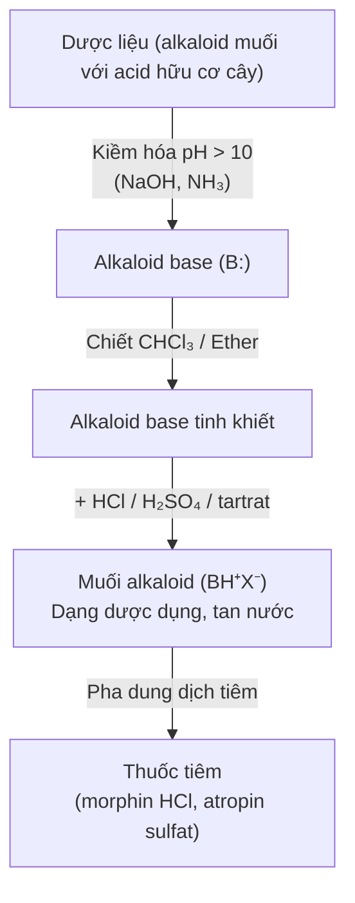
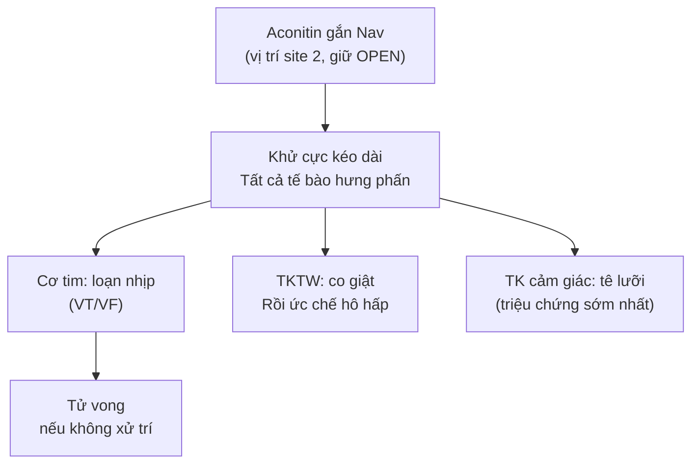
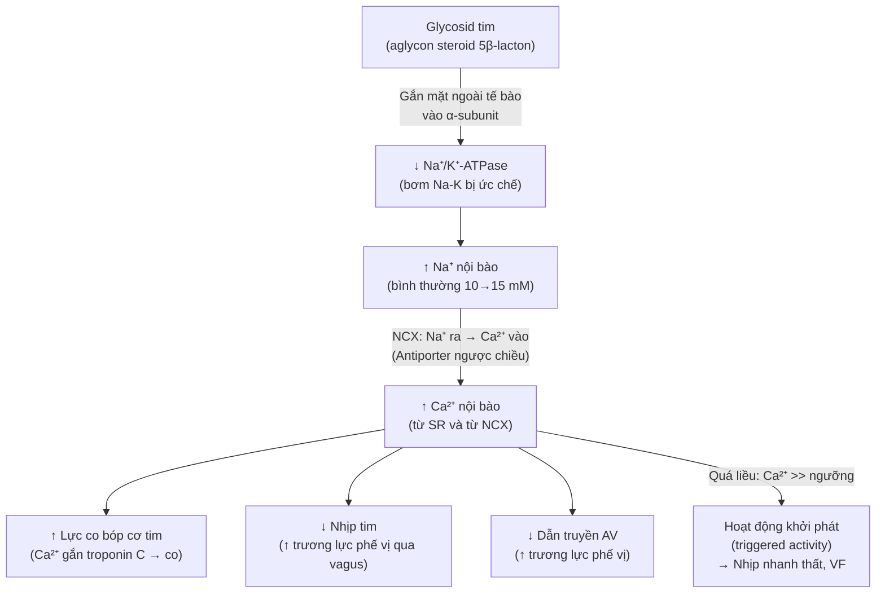
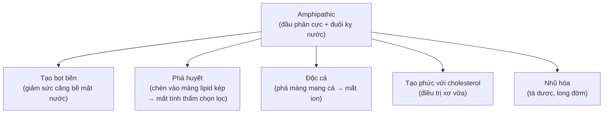
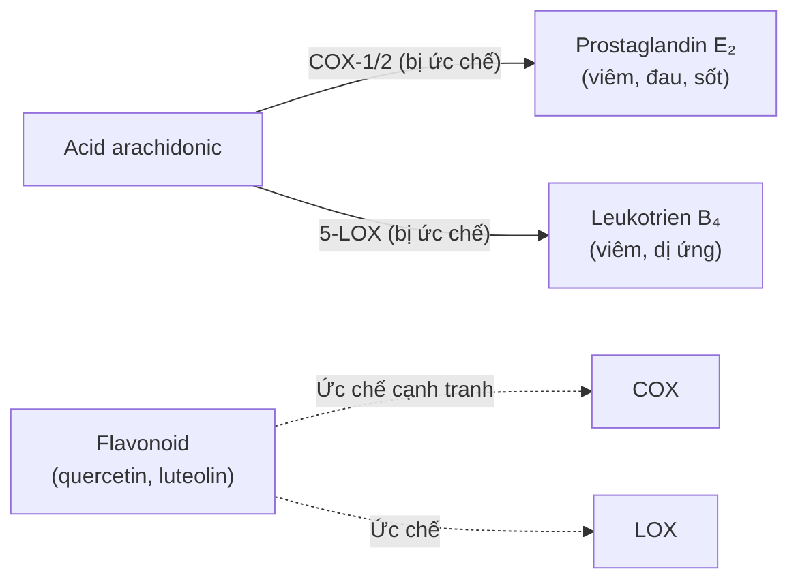
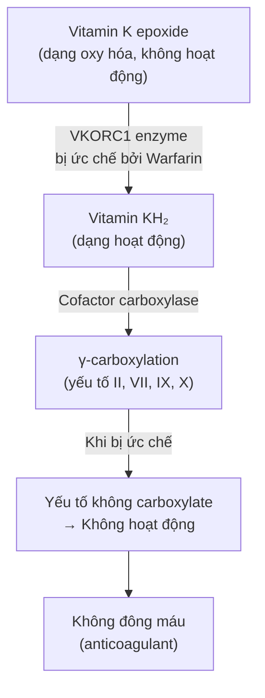
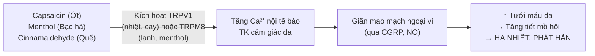

import KeyPoints from '~/components/KeyPoints.astro';
import CompareTable from '~/components/CompareTable.astro';
import ClinicalPearl from '~/components/ClinicalPearl.astro';
import RedFlags from '~/components/RedFlags.astro';
import SourceNote from '~/components/SourceNote.astro';

## Câu hỏi trung tâm

**Tính chất hóa lý của hợp chất tự nhiên trong dược liệu YHCT liên hệ với tác dụng dược lý, cách bào chế và an toàn lâm sàng như thế nào?**

<KeyPoints title="Luận điểm cốt lõi">

- **Alkaloid:** Tính kiềm từ cặp electron lone pair của N → tạo muối với acid → muối tan nước (dùng tiêm) vs base tan hữu cơ (chiết xuất). Receptor đặc hiệu theo khung cấu trúc.
- **Glycosid tim:** Ức chế Na/K-ATPase → ↑Ca²⁺ nội bào → cường tim. Ngưỡng độc rất gần ngưỡng điều trị — theo dõi nồng độ huyết thanh bắt buộc.
- **Saponin:** Phân tử amphipathic → tạo bọt (detergent), phá màng lipid kép (phá huyết) → không tiêm TM. Tác dụng hệ thống qua đường uống là an toàn.
- **Flavonoid:** Nhóm -OH phenol → cho H• → dập tắt gốc tự do → bảo vệ collagen, LDL, DNA khỏi oxy hóa.
- **Tannin:** Polyphenol PM lớn → liên kết hydro + tương tác kỵ nước với protein → kết tủa → cầm máu tại chỗ, giải độc alkaloid/kim loại nặng.
- **Coumarin Warfarin:** Ức chế cạnh tranh vitamin K epoxide reductase → thiếu VKH₂ → yếu tố đông máu không γ-carboxylate → không đông máu.

</KeyPoints>

---

## 1. Bản đồ cơ chế tổng thể

```mermaid
flowchart TD
    subgraph "NHÓM 1 — Tác dụng qua Receptor/Enzyme"
        ALK["Alkaloid\n(N dị vòng)"] -->|"Gắn receptor đặc hiệu"| R1["GPCR (opioid, muscarinic)\nChanel (Nav, IKr)\nEnzyme (PDE, AChE)"]
        R1 --> E1["Tác dụng mạnh, đặc hiệu\nNhưng độc tính cao"]
    end
    subgraph "NHÓM 2 — Tác dụng qua Màng tế bào"
        SAP["Saponin\n(amphipathic)"] -->|"Phá màng lipid kép"| M1["Phá huyết (TM)\nKháng khuẩn (GI)"]
        TAN["Tannin\n(polyphenol PM lớn)"] -->|"Kết tủa protein màng"| M2["Co se, cầm máu\nGiải độc"]
    end
    subgraph "NHÓM 3 — Tác dụng qua Oxy hóa-Khử"
        FLV["Flavonoid\n(C₆-C₃-C₆)"] -->|"Cho H•, dập gốc tự do"| O1["Chống oxy hóa\nBền thành mạch"]
        ANT["Antranoid"] -->|"Kích thích TK đám rối ruột"| O2["Nhuận tràng"]
    end
    subgraph "NHÓM 4 — Tác dụng Hóa học đặc hiệu"
        COUR["Coumarin\n(lacton)"] -->|"Ức chế VK epoxide reductase"| C1["Chống đông máu"]
        TD["Tinh dầu\n(bay hơi)"] -->|"TRPV1, kênh thụ thể TRP"| T1["Phát hãn, kháng khuẩn"]
    end
```

---

## 2. Alkaloid — Cơ sở phân tử của tính kiềm và độ tan

### 2.1. Tại sao alkaloid có tính kiềm?

Nitơ trong dị vòng (pyridin, quinolin, indol) có orbital sp² với cặp electron lone pair hướng ra ngoài vòng. Cặp này nhận proton từ acid:

**Alkaloid (B:) + H⁺ → Alkaloid-H⁺ (BH⁺)**

| Dạng | Điện tích | Tan trong | Không tan |
|---|---|---|---|
| Base (B:) | Trung tính | CHCl₃, ether, EtOH | Nước |
| Muối (BH⁺X⁻) | Dương | Nước | CHCl₃, ether |

### 2.2. Ứng dụng chiết xuất và bào chế

**Tại sao không dùng alkaloid base để tiêm?**
- Không tan nước → không pha được dung dịch đồng đều.
- Có thể kích ứng mô mạnh do pH.

### 2.3. Cơ chế receptor theo khung cấu trúc

| Khung | Ví dụ | Receptor/Target | Cơ chế phân tử |
|---|---|---|---|
| Isoquinolin (morphin) | Morphin, Codein | μ-opioid (GPCR) | ↓ adenylyl cyclase → ↓ cAMP → mở GIRK → hyperpolarize neuron → ức chế đau |
| Isoquinolin (papaverin) | Papaverin | PDE inhibitor | Ức chế phosphodiesterase → ↑ cAMP → giãn cơ trơn |
| Tropan | Atropin | mAChR (M1-M5) | Block muscarinic → ức chế phó giao cảm → giãn đồng tử, tim nhanh, khô miệng |
| Purin | Caffein | A₁, A₂ adenosine receptor | Block receptor adenosin (ức chế nội sinh) → TKTW tỉnh táo |
| Indol (vinca) | Vincristin | Tubulin | Gắn cộng hóa trị β-tubulin → ức chế polymerization → mitosis dừng ở M |
| Diterpen | Aconitin | Nav (voltage-gated Na⁺) | Kích hoạt và giữ kênh mở → khử cực kéo dài → loạn nhịp |

### 2.4. Ngộ độc aconitin — Chuỗi dược lý

**Chế biến Phụ tử:**
- Phụ tử sống: aconitin + mesaconitine (cực độc)
- Đun 8-12 giờ: thủy phân cắt nhóm acetyl → benzoylaconin (ít độc 200x), aconin (không độc)
- Kiểm soát chế biến = bắt buộc về mặt an toàn.

---

## 3. Glycosid tim — Na/K-ATPase và hệ quả Ca²⁺

### 3.1. Cơ chế phân tử chi tiết

### 3.2. Chỉ số điều trị hẹp

Digoxin (từ Dương địa hoàng) — ví dụ điển hình:
- Nồng độ điều trị: **0.5–2.0 ng/mL**
- Nồng độ độc: > **2.0 ng/mL** (rất gần ngưỡng điều trị)
- Phụ thuộc nhiều vào K⁺ huyết thanh: K⁺ thấp → tăng ái lực glycosid với Na/K-ATPase → dễ ngộ độc

**Dấu hiệu ngộ độc theo hệ thống:**

| Hệ | Dấu hiệu | Cơ chế |
|---|---|---|
| Tiêu hóa | Nôn, chán ăn, tiêu chảy | Kích thích TK phế vị và area postrema |
| Thị giác | Nhìn vàng (xanthopsia), halo | Ức chế photoreceptor rod/cone |
| Tim | Nhịp chậm, block AV, VT, VF | Ca²⁺ quá cao → triggered activity |

---

## 4. Saponin — Vật lý amphipathic quyết định mọi tính chất

### 4.1. Cấu trúc amphipathic

Saponin triterpenoid/steroid có:
- **Đầu phân cực (hydrophilic):** Phần đường (1-3 mạch đường)
- **Đuôi kỵ nước (hydrophobic):** Khung aglycone oleanane/ursane/dammrane/stigmastane

→ **Amphipathic** như detergent → **hoạt động bề mặt**.

### 4.2. Tính chất từ amphipathic

### 4.3. Tại sao uống an toàn nhưng tiêm TM không?

| Đường dùng | Điều kiện | Kết quả |
|---|---|---|
| Uống | Nồng độ loãng, chất nhầy GI bảo vệ màng tế bào | Không phá huyết, hấp thu như glycosid → an toàn |
| Tiêm TM | Tiếp xúc trực tiếp với hồng cầu nồng độ cao | Saponin chèn vào màng RBC → hemolysis cấp tính |

**Nguyên lý:** "Dose makes the poison" + điều kiện tiếp xúc.

### 4.4. Saponin ginsenoside — Cơ chế adaptogen

Ginsenoside Rb1, Rg1 (Nhân sâm):
- Gắn receptor glucocorticoid và mineralocorticoid → điều hòa trục HPA (Hypothalamic-Pituitary-Adrenal)
- Tăng tổng hợp NO tại nội mô mạch → giãn mạch, tăng tưới máu não
- Ức chế monoamine oxidase (MAO) → ↑ dopamin, serotonin, norepinephrin

---

## 5. Flavonoid — Hóa học chống oxy hóa

### 5.1. Cơ chế dập tắt gốc tự do (Radical Scavenging)

Vòng B của flavonoid (thường có catechol hoặc pyrogallol) là vùng hoạt động nhất:

**Flavonoid-OH + RO• → Flavonoid-O• + ROH**

Gốc flavonoid-O• bền do resonance (cộng hưởng qua hệ thống π liên hợp) → không tiếp tục phản ứng chuỗi → chuỗi peroxy hóa lipid bị dừng.

### 5.2. Flavonoid làm bền thành mạch — Cơ chế cụ thể

Rutin (quercetin-3-rutinoside) → quercetin → tác dụng:
1. **Ức chế hyaluronidase** → bảo vệ hyaluronic acid nền liên kết tế bào nội mô
2. **Bảo vệ collagen type IV** (thành phần màng đáy) khỏi oxy hóa bởi HO•
3. **Ức chế PKC** (protein kinase C) → giảm phosphorylation claudin/occludin → tight junction bền hơn

**Kết quả lâm sàng:** Giảm tính thấm mao mạch, giảm xuất huyết nhỏ → dùng trong trĩ, giãn tĩnh mạch, phù.

### 5.3. Ức chế COX và lipoxygenase

Nhiều flavonoid (quercetin, luteolin, kaempferol) ức chế COX-1, COX-2 và 5-LOX:

---

## 6. Tannin — Cơ chế kết tủa và giải độc

### 6.1. Tại sao tannin kết tủa protein?

Tannin (polyphenol, PM 600-2.000) có:
- **Nhiều nhóm -OH phenol** → liên kết hydro với -C=O, -NH, -OH của protein
- **Vòng phenol kỵ nước** → tương tác van der Waals và kỵ nước với domain kỵ nước protein

→ Cross-linking tannin-protein → phức khổng lồ không tan.

### 6.2. Ứng dụng giải độc

**Giải độc alkaloid:**

Alkaloid (cation BH⁺) + Tannin (polyanion) → phức tanat-alkaloid không tan, không hấp thu qua GI.

*Lưu ý lâm sàng:* Tannin chỉ hiệu quả khi dùng ngay sau uống (alkaloid chưa hấp thu). Sau hấp thu cần dùng antidote đặc hiệu (physostigmin cho atropin, naloxon cho morphin).

**Giải độc kim loại nặng:**

Tannin + M²⁺ (Pb²⁺, Hg²⁺, Cu²⁺) → chelat tannin-kim loại không tan → không hấp thu.

*Nhưng:* Chỉ hiệu quả ở GI. Kim loại đã vào máu cần DMSA (dimercaptosuccinic acid), EDTA, hoặc BAL (British Anti-Lewisite).

### 6.3. Tác dụng co se và cầm máu

Tannin + collagen/fibrinogen → lớp màng protein trên bề mặt vết thương/niêm mạc → giảm thấm, giảm bài tiết, cầm máu cơ học.

---

## 7. Coumarin — Warfarin từ vỏ cây Liễu và nấm mốc cỏ

### 7.1. Cơ chế chống đông (Warfarin, Dicoumarol)

### 7.2. Aflatoxin — Coumarin độc, cơ chế gây ung thư gan

Aflatoxin B₁ (nấm mốc *Aspergillus flavus*):
1. CYP3A4 (gan) oxy hóa → Aflatoxin B₁-8,9-exo-epoxide (AFBO)
2. AFBO gắn cộng hóa trị vào N7-guanin của DNA → DNA adduct AFBO-N7-Gua
3. Sửa chữa sai (translesion synthesis) → đột biến G:C → T:A
4. Đột biến đặc trưng tại codon 249 của TP53 → mất chức năng tumor suppressor
5. Kết hợp viêm gan B (HBV) → ung thư gan nguyên phát

**Biện pháp phòng ngừa:** Bảo quản dược liệu khô ráo (< 65% RH), dưới 25°C. Không dùng bất kỳ phần nào bị mốc.

---

## 8. Tinh dầu — Cơ chế sinh lý

### 8.1. Kháng khuẩn

Tinh dầu (terpene, phenylpropanoid) tác động trực tiếp lên màng vi khuẩn:
- Phá vỡ tính toàn vẹn màng → mất ion K⁺, đại phân tử → vi khuẩn chết
- Ức chế ATPase màng → thiếu năng lượng
- Ức chế sinh tổng hợp acid béo (thymol, carvacrol)

**MIC điển hình:** Thymol (Xạ hương) MIC với *S. aureus* ~0.1-0.5 μg/mL → mạnh tương đương kháng sinh.

### 8.2. Phát hãn — TRPV1 và mao mạch da

---

## 9. Worked example — Phân tích bài thuốc Ngân kiều tán

**Bài thuốc:** Kim ngân hoa, Liên kiều, Bạc hà, Kinh giới tuệ, Đạm đậu xị, Ngưu bàng tử, Cát cánh, Cảm thảo, Lô căn.

| Vị thuốc | Nhóm hoạt chất chính | Cơ chế YHHĐ | Vai trò trong bài |
|---|---|---|---|
| **Kim ngân hoa** | Flavonoid (luteolin), acid chlorogenic | Ức chế COX-2, NF-κB; kháng khuẩn | Thanh nhiệt giải độc |
| **Liên kiều** | Flavonoid (forsythiaside), lignan | Ức chế cytokine viêm; kháng virus | Thanh nhiệt giải độc |
| **Bạc hà** | Tinh dầu (menthol, menthon) | TRPV1/TRPM8 → mao mạch da giãn → phát hãn; kháng khuẩn đường hô hấp | Giải biểu, tán nhiệt |
| **Kinh giới** | Tinh dầu (pulegon, menthon) | Giãn mao mạch, phát hãn | Giải biểu |
| **Cát cánh** | Saponin (platycodin) | Long đờm (thay đổi tính nhớt) | Tuyên Phế, long đờm |
| **Cam thảo** | Saponin (glycyrrhizin) | Chống viêm, ức chế 11β-HSD2; long đờm | Điều hòa, long đờm |
| **Lô căn** | Flavonoid, đường (hydrat hóa) | Giảm sốt, giải khát, lợi tiểu nhẹ | Thanh nhiệt sinh tân |

**Kết luận:** Ngân kiều tán = phối hợp tinh dầu (phát hãn) + flavonoid/acid phenolic (chống viêm, kháng khuẩn) + saponin (long đờm) → tác dụng đa mục tiêu cho ngoại cảm phong nhiệt.

<SourceNote>

- Nguồn gốc: `Raw/Thuoc_YHCT/chuong-01-dai-cuong/bai-03-cac-hop-chat-tu-nhien_001.md`
- Sách: *Thuốc Y học cổ truyền (Tập 1)* — TS. Hứa Hoàng Oanh, TS. Nguyễn Thành Triết.

</SourceNote>
