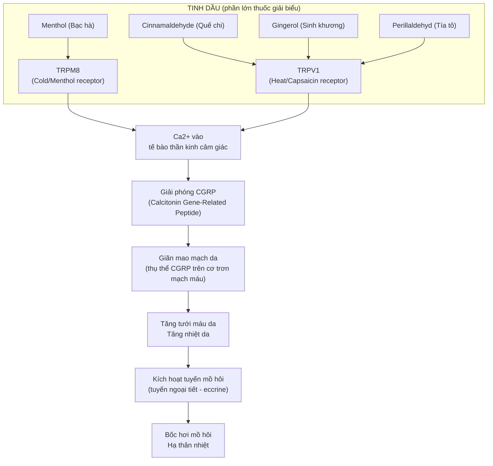
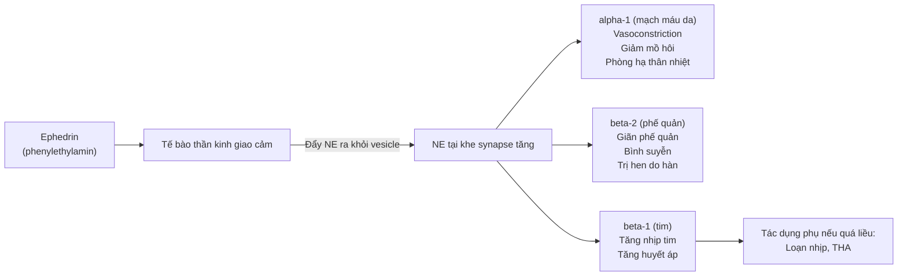
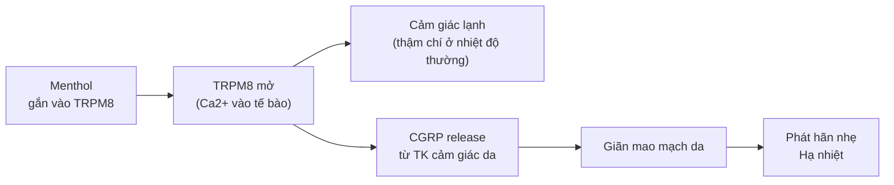
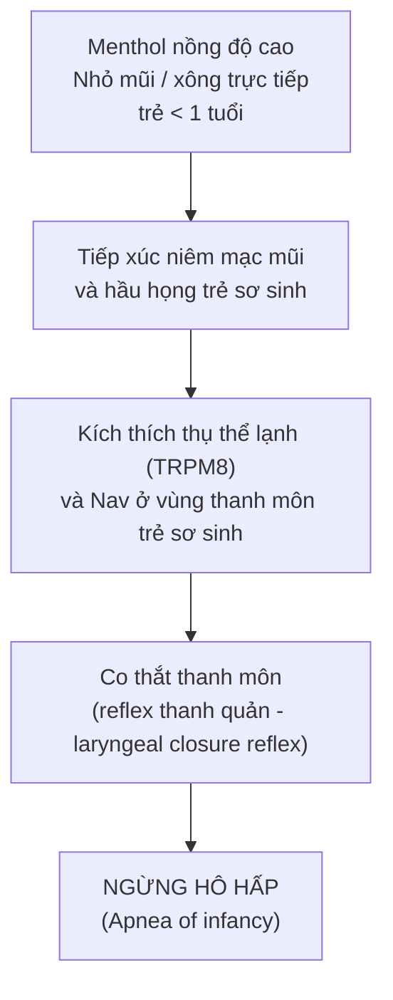

import KeyPoints from '~/components/KeyPoints.astro';
import CompareTable from '~/components/CompareTable.astro';
import ClinicalPearl from '~/components/ClinicalPearl.astro';
import RedFlags from '~/components/RedFlags.astro';
import SourceNote from '~/components/SourceNote.astro';

## Câu hỏi trung tâm

**Tại sao thuốc giải biểu — đặc biệt là tinh dầu — làm ra mồ hôi được? Mỗi hoạt chất tác động lên thụ thể nào, và từ đó giải thích được kiêng kỵ, tác dụng phụ và chỉ định đặc hiệu của từng vị?**

<KeyPoints title="6 luận điểm cốt lõi">

- **Tinh dầu → TRPV1/TRPM8 → CGRP → giãn mao mạch da → mồ hôi:** Mọi thuốc giải biểu có tinh dầu đều đi theo con đường này. Uống nóng + đắp chăn kín = tối ưu hóa cơ chế.
- **Ephedrin (Ma hoàng) = sympathomimetic:** Kích thích alpha-1 và beta-2 adrenergic → phát hãn (alpha-1) + giãn phế quản (beta-2). Không dùng khi dương hư vì tăng thêm giao cảm.
- **Menthol (Bạc hà) = kích thích TRPM8 (thụ thể lạnh):** Gây cảm giác mát, giãn mao mạch da, hạ nhiệt. Ở trẻ < 1 tuổi: block kênh Nav ở trung tâm hô hấp → NGỪNG THỞ.
- **Puerarin / daidzein (Cát căn) = giãn mạch não:** Ức chế phosphodiesterase → cAMP tăng → giãn cơ trơn mạch máu đốt sống → hết đau gáy đặc hiệu.
- **Arctigenin (Ngưu bàng tử) = ức chế AChE:** Tăng acetylcholin → kháng viêm thần kinh miễn dịch + cải thiện trí nhớ (giống galantamine).
- **Saponin Sài hồ = điều hòa cortisol và kháng viêm:** Ức chế 11-beta-HSD2 → tăng cortisol tự do tại mô → kháng viêm, hạ sốt. Liều cao → độc gan qua oxy hóa microsomal.

</KeyPoints>

---

## 1. Bản đồ cơ chế tổng thể — Phát hãn theo con đường tinh dầu

---

## 2. Ephedrin (Ma hoàng) — Sympathomimetic tự nhiên

### 2.1. Cấu trúc và cơ chế

Ephedrin là phenylethylamin (giống amphetamin) → vào tận bào tương thần kinh giao cảm → **đẩy norepinephrin ra** khỏi vesicle + **block tái thu nhận NE** → tăng NE tại khe synapse → kích thích adrenergic.

### 2.2. Nghịch lý: Ma hoàng phát hãn nhờ ephedrin hay tinh dầu?

**Tinh dầu** là chính cho phát hãn ban đầu (TRPV1/TRPM8 giãn mạch da → mồ hôi). **Ephedrin** duy trì nhịp tim và huyết áp để cơ thể chịu đựng được quá trình phát hãn lớn, đồng thời giãn phế quản khi có ho hen.

**Rễ Ma hoàng ngược lại:** Không có ephedrin đáng kể, có ephedroxane — ức chế tiết mồ hôi → dùng trị mồ hôi trộm. Thân vs rễ: 2 tác dụng đối lập từ cùng 1 cây.

### 2.3. Ma hoàng tẩm mật ong — Tại sao sức phát hãn giảm?

Mật ong (nước đường, keo) làm chậm hấp thu tinh dầu và alkaloid ephedrin → khởi phát chậm, tác dụng nhẹ hơn. Đồng thời, mật ong có tác dụng nhuận Phế → tăng tác dụng trị hen.

---

## 3. Menthol (Bạc hà) — Cơ chế kép và độc tính trẻ sơ sinh

### 3.1. TRPM8 — Receptor lạnh

TRPM8 là kênh TRP phản hồi với nhiệt độ < 26°C hoặc với hợp chất menthan (menthol, thymol, icilin). Khi kích thích:

### 3.2. Menthol và kênh Nav — Gây tê cục bộ

Ở nồng độ cao, menthol **block kênh Nav (voltage-gated Na+)** tại trạng thái bất hoạt → ngăn tái kích hoạt → giảm dẫn truyền xung thần kinh → **gây tê cục bộ** (như lidocain nhẹ). Đây là cơ chế giải thích tác dụng giảm đau, sát khuẩn vùng họng của Bạc hà.

### 3.3. Nguy hiểm với trẻ < 1 tuổi — Cơ chế ngừng thở

**Tại sao trẻ sơ sinh đặc biệt nhạy?**
Trẻ < 1 tuổi có reflex đóng thanh quản mạnh hơn người lớn (cơ chế bảo vệ khi bú). Menthol kích thích reflex này quá mức → co thắt thanh môn → ngừng thở. Người lớn không có reflex này mạnh → an toàn.

---

## 4. Puerarin và Daidzein (Cát căn) — Giãn mạch não

### 4.1. Cơ chế giãn mạch

Puerarin và daidzein (isoflavonoid từ Cát căn/Sắn dây):
1. **Ức chế phosphodiesterase (PDE)** → cAMP tích lũy trong cơ trơn mạch máu
2. cAMP → PKA → phosphorylate myosin light chain kinase (MLCK) → **bất hoạt MLCK**
3. Myosin không phosphorylate → cơ trơn mạch máu thư giãn → **giãn mạch**

Đặc biệt hiệu quả tại **động mạch đốt sống** và **động mạch nền** → tăng lưu lượng máu não sau → giải thích tác dụng đặc hiệu với đau gáy, chẩm.

### 4.2. Phytoestrogen và tim mạch

Daidzein là phytoestrogen (gắn ERbeta) → tác dụng bảo vệ tim mạch tương tự estrogen:
- Tăng NO từ nội mô mạch
- Giảm LDL oxy hóa
- Giảm đông máu

**Lưu ý:** BN ung thư vú ER+ — hạn chế Sắn dây vì phytoestrogen có thể kích thích.

---

## 5. Arctigenin (Ngưu bàng tử) — Ức chế AChE

### 5.1. Cơ chế ức chế Acetylcholinesterase

Arctigenin (lignan từ Ngưu bàng tử):
- Ức chế cạnh tranh **Acetylcholinesterase (AChE)** — enzyme phân giải acetylcholin
- AChE bị ức chế → ACh tích lũy tại synapse → tăng hiệu quả dẫn truyền cholinergic
- Tác dụng: cải thiện nhận thức, chống mất trí nhớ (cơ chế giống galantamine, donepezil)

### 5.2. Kháng ung thư từ ức chế TGF-beta

Arctigenin ức chế **TGF-beta signaling** trong tế bào ung thư tụy:
- Block SMAD2/3 phosphorylation → giảm biểu hiện fibronectin, vimentin
- Giảm epithelial-mesenchymal transition (EMT) → ức chế di căn

---

## 6. Saponin Sài hồ — Kháng viêm và độc gan

### 6.1. Cơ chế kháng viêm và hạ sốt

Saikosaponin A, C, D (triterpenoid glycosid từ Sài hồ):
1. **Ức chế 11-beta-hydroxysteroid dehydrogenase type 2 (11-HSD2)** → tăng cortisol tự do tại mô viêm → kháng viêm mạnh
2. **Ức chế COX-2 và NF-kappaB** → giảm prostaglandin E2 → hạ sốt
3. **Điều hòa trục HPA** → ổn định hàn nhiệt vãng lai (sốt dao động)

### 6.2. Tại sao Sài hồ gây độc gan ở liều cao?

Saponin Sài hồ bị chuyển hóa bởi **CYP3A4 (gan)** thành chuyển hóa chất oxy hóa (reactive oxygen species). Ở liều thấp, glutathion dập tắt được. Ở liều cao kéo dài, glutathion cạn kiệt → ROS tích lũy → tổn thương tế bào gan (drug-induced hepatitis).

---

## 7. Worked example — Phân tích cơ chế bài Ma hoàng phụ tử tế tân thang

Bài thuốc: Ma hoàng 9g + Phụ tử (chế) 9g + Tế tân 3g

**Chỉ định:** Cảm lạnh nặng ở người dương hư (người già, thể trạng yếu), sốt nhẹ, rét run nhiều, mạch phù nhược.

| Vị | Hoạt chất | Cơ chế | Vai trò |
|---|---|---|---|
| **Ma hoàng** | Ephedrin + tinh dầu | Beta-2 giãn phế quản + TRPV1 phát hãn | Khai biểu, đưa tà ra |
| **Phụ tử (chế)** | Benzoylaconin (aconitin thủy phân) | Kích thích Nav ở liều thấp → tăng co bóp tim + thân ấm | Trợ dương, duy trì tuần hoàn khi phát hãn |
| **Tế tân** | Metyl-eugenol | Block Nav cục bộ → giảm đau + block hô hấp trung ương (nhẹ) | Giảm đau, thông khiếu, hỗ trợ Ma hoàng |

**Tại sao phải chế Phụ tử?**
- Phụ tử sống: aconitin nguyên → block Nav → loạn nhịp → tử vong
- Phụ tử chế (đun 8-12 giờ): aconitin thủy phân → benzoylaconin → kích thích Nav nhẹ → tăng co bóp tim, ấm người mà không loạn nhịp

**Kết quả tổng hợp:**
- Ephedrin (Ma hoàng) → duy trì huyết áp và giãn phế quản
- Phụ tử chế → dương khí hồi phục, tim đập mạnh, ấm từ trong
- Tế tân → giảm đau dữ, thông mũi

→ Bài thuốc đặc trị người dương hư bị phong hàn nặng — nếu dùng Ma hoàng đơn thuần cho người dương hư sẽ hao tán dương khí thêm.

<SourceNote>

- Nguồn gốc: `Raw/Thuoc_YHCT/chuong-02-cac-nhom-thuoc/bai-04-thuoc-giai-bieu_001.md`
- Sách: *Thuốc Y học cổ truyền (Tập 1)* — TS. Hứa Hoàng Oanh, TS. Nguyễn Thành Triết.

</SourceNote>
