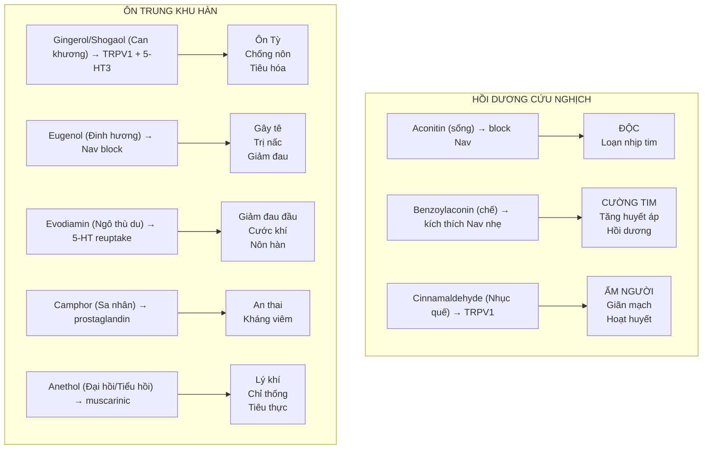
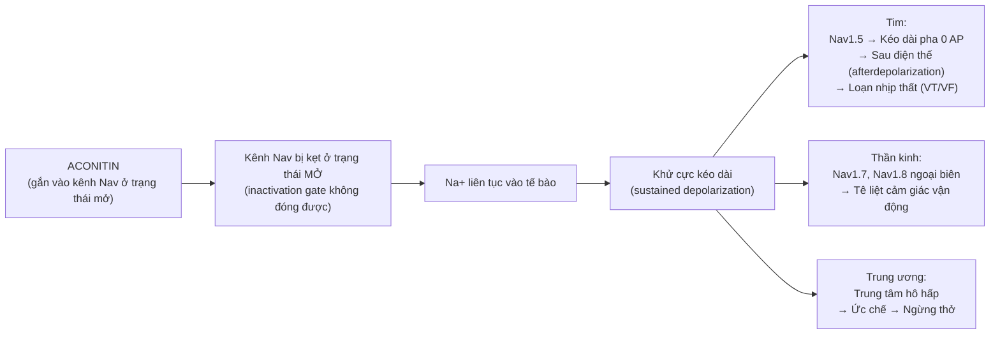
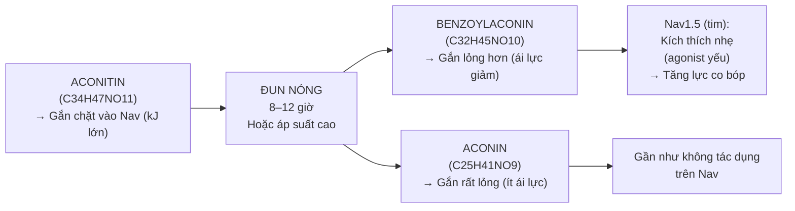
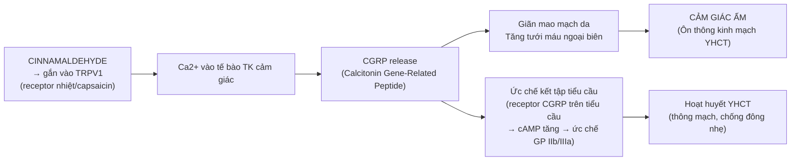
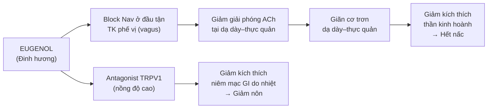

import KeyPoints from '~/components/KeyPoints.astro';
import CompareTable from '~/components/CompareTable.astro';
import ClinicalPearl from '~/components/ClinicalPearl.astro';
import RedFlags from '~/components/RedFlags.astro';
import SourceNote from '~/components/SourceNote.astro';

## Câu hỏi trung tâm

**Tại sao thuốc khử hàn vừa có thể cứu mạng (Phụ tử trong thoát dương) vừa gây tử vong (aconitin loạn nhịp)? Mỗi hoạt chất tác động lên thụ thể nào để giải thích công năng, liều dùng, kiêng kỵ và cách chế biến?**

<KeyPoints title="6 luận điểm cốt lõi">

- **Aconitin (Phụ tử sống) = block Nav không chọn lọc:** Block kênh Nav1.5 (tim) → loạn nhịp thất → tử vong. Block Nav ngoại biên → tê liệt. Chế biến thủy phân → benzoylaconin → kích thích Nav nhẹ (cường tim an toàn).
- **Benzoylaconin (Phụ tử chế) = cường tim qua kích thích Nav1.5 nhẹ:** Tăng co bóp cơ tim, tăng huyết áp — giải thích cơ chế hồi dương cứu nghịch theo YHHĐ.
- **Cinnamaldehyde (Nhục quế) = kích thích TRPV1:** Giãn mạch, tăng tưới máu ngoại biên, hạ đường huyết (ức chế gluconeogenesis), ức chế tiểu cầu — đa cơ chế giải thích "ôn kinh hoạt huyết".
- **Eugenol (Đinh hương) = block Nav + ức chế TRPV1:** Gây tê cục bộ (nha khoa), ức chế co thắt cơ trơn tiêu hóa (trị nấc), kháng viêm qua ức chế COX-2.
- **Evodiamin (Ngô thù du) = ức chế reuptake serotonin + TRPV1 agonist:** Giảm đau đầu migraine (cơ chế 5-HT) + ấm người (cơ chế TRPV1 giãn mạch da).
- **Anethol (Đại hồi, Tiểu hồi) = phytoestrogen yếu + antispasmodic:** Giãn cơ trơn đường tiêu hóa (kháng muscarinic nhẹ), giải thích tác dụng lý khí chỉ thống.

</KeyPoints>

---

## 1. Bản đồ cơ chế tổng thể — Thuốc khử hàn theo mục tiêu phân tử

---

## 2. Aconitin và Benzoylaconin (Phụ tử) — Hai mặt của một hoạt chất

### 2.1. Aconitin — Cơ chế độc tính

Aconitin là diterpene alkaloid, gắn **vĩnh viễn** vào trạng thái mở của kênh Nav (voltage-gated Na+ channel) → kênh không đóng được → Na+ liên tục vào tế bào.

### 2.2. Chế biến — Thủy phân aconitin → benzoylaconin

**Hiệu ứng thực tế của chế biến:**
- Aconitin (sống) 0,147% → Đun 8h → 0,058% (benzoylaconin)
- LD50 tăng ~100–500 lần sau chế biến
- Tác dụng cường tim được giữ lại; độc tính loạn nhịp giảm

### 2.3. Cam thảo giải độc aconitin — Cơ chế phân tử

Glycyrrhizin (triterpenoid glycosid của Cam thảo):
1. **Chelate với aconitin** — nhóm glucuronyl của glycyrrhizin gắn vào nhóm OH của aconitin → phức ít hấp thu qua ruột hơn
2. **Ức chế nhẹ CYP3A4** → chuyển hóa aconitin chậm lại → nồng độ đỉnh thấp hơn → giảm độc tính
3. **Kháng viêm** (ức chế PGE2) → giảm tổn thương tim do viêm kèm theo

<ClinicalPearl>

**Thực nghiệm ghép cặp:** Khi cho chuột uống Phụ tử + Cam thảo so với Phụ tử đơn, LD50 tăng 1,3–1,8 lần. Không ấn tượng như lý luận cổ điển, nhưng có ý nghĩa thực tế khi bệnh nhân đang ở ranh giới liều. Đây là lý do "Cam thảo điều hòa" không phải chỉ là triết lý.

</ClinicalPearl>

---

## 3. Cinnamaldehyde (Nhục quế) — Cơ chế đa mục tiêu

### 3.1. TRPV1 — Cơ chế ôn nhiệt chính

Cinnamaldehyde (trans-cinnamaldehyde, 60–90% tinh dầu Quế) là **TRPV1 agonist** — cùng nhóm với capsaicin ớt nhưng yếu hơn.

### 3.2. Cinnamaldehyde ức chế gluconeogenesis — Hạ đường huyết

Cinnamaldehyde ức chế phosphoenolpyruvate carboxykinase (PEPCK) và glucose-6-phosphatase — 2 enzyme chìa khóa tổng hợp glucose tại gan → hạ đường huyết.

**Lâm sàng:** Bệnh nhân tiểu đường type 2 dùng Nhục quế (bột hoặc chiết xuất) → cải thiện đường huyết đói. Cần theo dõi nếu đang dùng insulin hoặc sulfonyl urea (nguy cơ hạ đường huyết cộng hưởng).

### 3.3. Coumarin trong Nhục quế — Mặt tối

Nhục quế chứa **coumarin** (0,45–12 mg/g tùy loài):
- Liều thấp (< 0,1 mg/kg/ngày): an toàn
- Liều cao kéo dài: ức chế CYP2A6 → giảm chuyển hóa coumarin → tích lũy → **độc gan** (drug-induced hepatotoxicity)
- Nguy cơ cao hơn với *Cinnamomum cassia* (Quế Trung Quốc) — coumarin cao hơn *C. verum* (Quế Sri Lanka)

---

## 4. Eugenol (Đinh hương) — Block Nav và TRPV1 antagonist

### 4.1. Gây tê cục bộ — Block Nav1.7

Eugenol block **Nav1.7** (kênh Na+ chọn lọc cho thần kinh cảm giác đau) theo cơ chế **use-dependent block**:
- Gắn vào lòng kênh khi kênh mở
- Hiệu quả tăng khi neuron bắn nhiều xung (đau dữ)
- Cơ chế tương tự lidocain nhưng gây tê nhẹ hơn

**Ứng dụng:** Eugenol vẫn được nha khoa sử dụng (zinc oxide eugenol — ZOE) để gây tê tạm tại chỗ.

### 4.2. Trị nấc — Ức chế co thắt qua kênh ion

<ClinicalPearl>

**Nghịch lý eugenol và TRPV1:** Cinnamaldehyde (Nhục quế) là TRPV1 **agonist** → gây ấm, giãn mạch. Eugenol (Đinh hương) ở nồng độ cao lại là TRPV1 **antagonist** → giảm cảm giác nóng bỏng → dùng trong gây tê nha khoa vì bệnh nhân không đau thêm sau khi bôi. Cùng là tinh dầu "nóng" theo YHCT nhưng cơ chế phân tử trái chiều.

</ClinicalPearl>

---

## 5. Evodiamin (Ngô thù du) — Serotonin và TRPV1

### 5.1. Ức chế reuptake serotonin — Giảm đau đầu

Evodiamin ức chế **serotonin reuptake transporter (SERT)** — cơ chế tương tự SSRI — → tăng 5-HT tại synapse.

**Tại sao lại giảm đau đầu migraine?**
- Migraine liên quan đến giải phóng CGRP và kích hoạt thụ thể serotonin 5-HT1B/1D trên mạch máu não
- Tăng 5-HT → kích thích 5-HT1B/1D → co mạch nhẹ não → giảm cơn migraine (cơ chế tương tự triptan)
- Evodiamin còn ức chế giải phóng CGRP từ sợi C → giảm giãn mạch nội não

### 5.2. TRPV1 agonist — Tác dụng ôn nhiệt

Evodiamin cũng là TRPV1 agonist (tương tự capsaicin nhưng yếu hơn) → tăng nhiệt độ cơ thể, đốt cháy lipid (lipolysis).

**Thực nghiệm:** Evodiamin làm tăng nhiệt độ trực tràng chuột +0,3–0,5°C sau 30 phút uống — giải thích công năng "ôn trung" theo YHCT.

---

## 6. Anethol (Đại hồi, Tiểu hồi) — Kháng co thắt và phytoestrogen

### 6.1. Kháng co thắt cơ trơn tiêu hóa

trans-Anethol (90% tinh dầu Hồi) → ức chế co thắt cơ trơn qua **kháng muscarinic (M3)** nhẹ và **kháng Ca2+ (L-type calcium channel)** → giãn cơ trơn đường tiêu hóa.

**Hiệu ứng lâm sàng:** Giảm đầy hơi, sôi bụng, co thắt ruột. Giải thích tại sao Đại hồi và Tiểu hồi được dùng làm gia vị tiêu hóa (carminative).

### 6.2. Phytoestrogen — Anethol diol và anethol trithione

Sản phẩm oxy hóa của anethol (anethol diol) gắn vào thụ thể estrogen ERalpha và ERbeta → tác dụng estrogen yếu.

**Lâm sàng:**
- Tăng tiết sữa sau sinh (dùng Tiểu hồi từ lâu ở nhiều nền văn hóa)
- Giảm đau kinh nguyệt nhẹ
- **Cảnh báo:** Hạn chế ở bệnh nhân ung thư nhạy cảm với estrogen (ung thư vú ER+, ung thư nội mạc tử cung)

---

## 7. Worked example — Phân tích bài Tứ nghịch thang theo cơ chế phân tử

**Bài thuốc:** Phụ tử (chế) 9g + Can khương 9g + Cam thảo (chích) 6g

**Chỉ định lâm sàng:** Thoát dương — mồ hôi lạnh, tay chân co quắp, mạch vi muốn tuyệt, huyết áp tụt.

**Tương đương bệnh học hiện đại:** Choáng tim hoặc choáng do giảm thể tích huyết tương (không phải shock nhiễm khuẩn).

| Vị | Hoạt chất chính | Receptor/Enzyme | Tác dụng lâm sàng |
|---|---|---|---|
| **Phụ tử chế** | Benzoylaconin | Nav1.5 (kích thích nhẹ) | Tăng lực co bóp tim, tăng huyết áp |
| **Can khương** | Gingerol, shogaol | TRPV1 + 5-HT3 antagonist | Ôn Tỳ ấm bụng; cầm nôn; synergy với Phụ tử |
| **Cam thảo chích** | Glycyrrhizin | Chelate aconitin + CYP3A4 inhibit nhẹ | Giải độc; kéo dài tác dụng; kháng viêm |

**Synergy Phụ tử + Can khương:**
- Gingerol/shogaol ức chế phosphodiesterase → cAMP tăng → protein kinase A → phosphorylate troponin I → **tăng nhạy cảm của tim với Ca2+** → tăng co bóp (cơ chế bổ sung cho benzoylaconin)
- 2 cơ chế khác nhau cùng hướng tới tăng co bóp tim → hiệu lực tổng hợp mạnh hơn từng vị đơn lẻ

**Vì sao Tứ nghịch thang nhanh hơn hồi sức dịch truyền trong thoát dương hư hàn YHCT?**
Lý luận: Bệnh nhân hư hàn không thiếu dịch mà thiếu dương khí (cardiac output thấp do tim yếu). Truyền dịch tăng thể tích nhưng tim không đủ lực đẩy → không hiệu quả. Phụ tử + Can khương trực tiếp tăng lực co bóp tim → cardiac output tăng → huyết áp hồi phục.

<SourceNote>

- Nguồn gốc: `Raw/Thuoc_YHCT/chuong-02-cac-nhom-thuoc/bai-05-thuoc-khu-han_001.md`
- Sách: *Thuốc Y học cổ truyền (Tập 1)* — TS. Hứa Hoàng Oanh, TS. Nguyễn Thành Triết.

</SourceNote>
