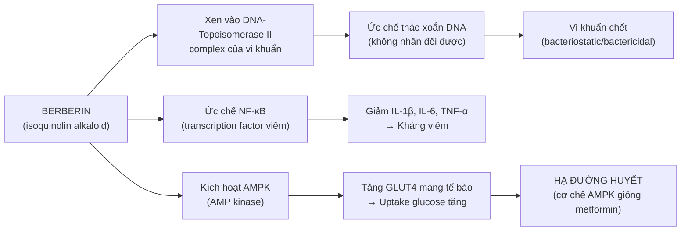
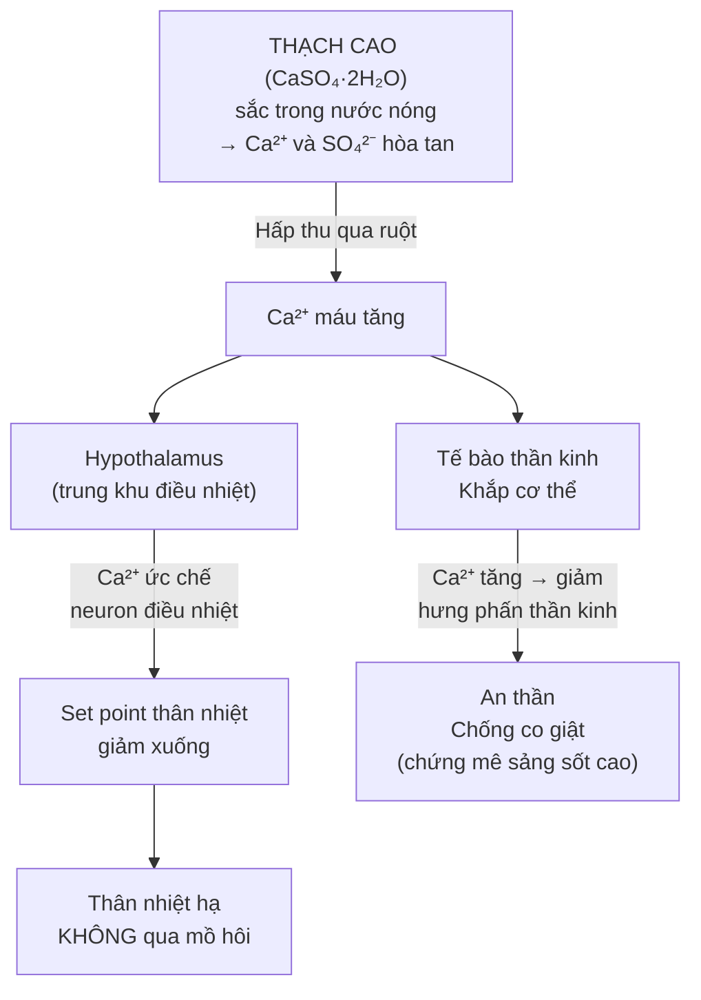
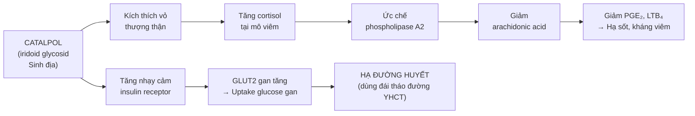
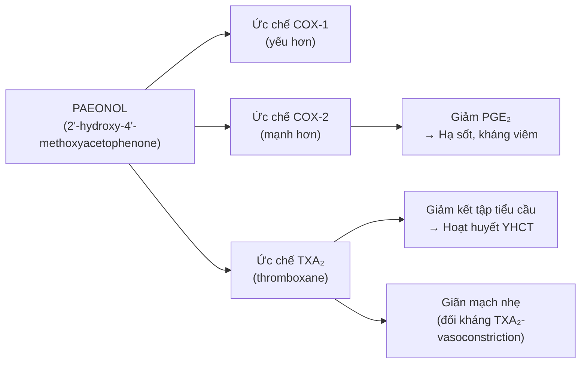
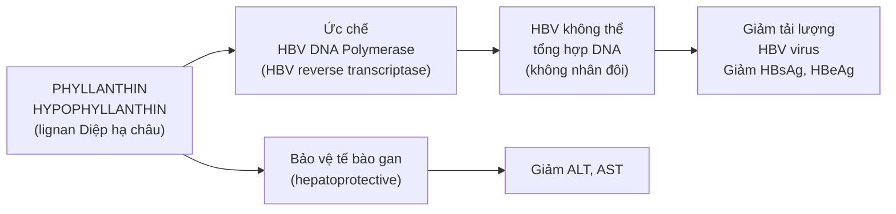

import KeyPoints from '~/components/KeyPoints.astro';
import CompareTable from '~/components/CompareTable.astro';
import ClinicalPearl from '~/components/ClinicalPearl.astro';
import RedFlags from '~/components/RedFlags.astro';
import SourceNote from '~/components/SourceNote.astro';

## Câu hỏi trung tâm

**Tại sao nhóm thuốc thanh nhiệt — đều có tác dụng "kháng khuẩn", "kháng viêm" — lại cần phân thành 4 nhóm với chỉ định khác nhau? Các hoạt chất tác động lên thụ thể/enzyme nào để giải thích tác dụng đặc hiệu của từng nhóm?**

<KeyPoints title="6 luận điểm cốt lõi">

- **Berberin (Hoàng liên/bá) = ức chế DNA gyrase (topoisomerase II vi khuẩn) + NF-κB:** Kháng khuẩn phổ rộng (Gram+/-) + kháng viêm. Đồng thời kích hoạt AMPK → hạ đường huyết (cơ chế giống metformin).
- **CaSO₄ (Thạch cao) = hấp thu Ca²⁺ → ức chế trung khu nhiệt + không gây mồ hôi:** Đây là cơ chế hạ sốt khác hoàn toàn với giải biểu (tinh dầu → TRPV1 → mồ hôi).
- **Catalpol (Sinh địa) = kích thích glucocorticoid nội sinh:** Tăng cortisol tại mô viêm → kháng viêm, hạ sốt. Đồng thời tăng insulin receptor sensitivity → hạ đường huyết.
- **Paeonol (Mẫu đơn bì) = ức chế COX-1/2 + TXA₂:** Kháng viêm + chống kết tập tiểu cầu → giải thích "hoạt huyết lương huyết" — lương huyết (hạ nhiệt) và hoạt huyết (chống đông).
- **Phyllanthin (Diệp hạ châu) = ức chế HBV DNA polymerase:** Ức chế tái bản virus viêm gan B → giải thích cơ chế "thanh nhiệt giải độc" bảo vệ gan đặc hiệu.
- **Chlorogenic acid (Kim ngân hoa) = ức chế FAS (fatty acid synthase) vi khuẩn:** Ức chế tổng hợp màng tế bào vi khuẩn → kháng khuẩn phổ rộng, đặc biệt Staphylococcus và Streptococcus.

</KeyPoints>

---

## 1. Berberin — Hoạt chất cốt lõi của Tam hoàng

### 1.1. Cơ chế kháng khuẩn — Ức chế topoisomerase II

Berberin (isoquinolin alkaloid) xen vào giữa chuỗi DNA và enzyme topoisomerase II (DNA gyrase) của vi khuẩn → ức chế tháo xoắn DNA → vi khuẩn không nhân đôi được.

### 1.2. Tại sao Hoàng liên, Hoàng cầm, Hoàng bá đều chứa berberin nhưng chỉ định khác nhau?

**Thành phần phụ** quyết định tính chất:

| Vị thuốc | Berberin | Hoạt chất phụ | Chỉ định tạng |
|---|---|---|---|
| Hoàng liên | Cao (5–8%) + palmatin | Coptisine → ức chế α-glucosidase | Trung tiêu: Tỳ Vị, Tâm |
| Hoàng cầm | Thấp + **baicalein, baicalin** | Baicalein → kháng virus HIV, kháng Phế cầu | Thượng tiêu: Phế |
| Hoàng bá | Cao (1.5–3%) + obaculacton | Obaculacton → 5α-reductase inhibit | Hạ tiêu: Thận, Bàng quang |

**Phân tích:** Hoàng cầm có baicalein/baicalin (flavonoid) — không có trong Hoàng liên/bá — hoạt tính kháng Phế cầu và kháng virus mạnh hơn 2 vị kia → giải thích vì sao Hoàng cầm vào Phế đặc biệt tốt.

### 1.3. Berberin kháng thuốc — Tại sao phối hợp tam hoàng?

Berberin đơn thuần có nguy cơ kháng thuốc qua bơm efflux (NorA pump) của *S. aureus*. Khi phối hợp Hoàng cầm (baicalein ức chế NorA pump) → berberin không bị bơm ra → nồng độ trong vi khuẩn cao hơn → giảm kháng thuốc.

→ **Đây là lý do tam hoàng phối hợp — không phải tăng liều, mà vô hiệu hóa cơ chế kháng thuốc.**

---

## 2. CaSO₄ (Thạch cao) — Cơ chế hạ sốt không ra mồ hôi

### 2.1. Ca²⁺ và trung khu nhiệt

### 2.2. Tại sao phải sắc trước 20 phút?

CaSO₄·2H₂O tan rất chậm trong nước lạnh (độ tan ~2 g/L ở 20°C). Đun sôi 20 phút trước → Ca²⁺ hòa tan nhiều hơn, đồng thời một phần thành CaSO₄ khan → dễ hấp thu qua niêm mạc ruột hơn. Nếu không sắc trước → ít Ca²⁺ hấp thu → tác dụng giảm rõ.

### 2.3. Thạch cao sống vs Đoạn thạch cao — Cơ chế dùng ngoài

Thạch cao nung (Đoạn thạch cao) → mất nước kết tinh → thành CaSO₄ khan (calcium sulfate anhydrous) → khi gặp nước trong dịch vết thương → hút ẩm mạnh → làm khô vết loét → thu miệng vết thương.

**Đây là lý do Đoạn thạch cao chỉ dùng ngoài — nếu uống, hút ẩm trong ruột → táo bón nặng.**

---

## 3. Catalpol (Sinh địa) — Glucocorticoid nội sinh và hạ đường huyết

### 3.1. Cơ chế kháng viêm qua glucocorticoid

Catalpol (iridoid glycosid chính của Sinh địa) → kích thích vỏ thượng thận tiết cortisol → cortisol tại mô:
1. Ức chế phospholipase A2 → giảm arachidonic acid → giảm PG/LT
2. Ức chế NF-κB → giảm cytokine viêm (IL-1β, IL-6, TNF-α)
3. Tăng IL-10 (cytokine chống viêm)

### 3.2. Tại sao Sinh địa tươi hàn hơn Sinh địa khô?

- **Tiên địa hoàng (tươi):** Catalpol hàm lượng cao nhất (3–5%), glucosamin tự do cao → tác dụng lương huyết mạnh nhất.
- **Sinh địa (sấy khô):** Catalpol giảm nhẹ (~2–3%), một phần catalpol bị thủy phân thành aucubin → ít hàn hơn, nhiều tư âm dưỡng huyết hơn.
- **Thục địa (chế):** Chế với Gừng + rượu + Sa nhân → phần lớn catalpol thủy phân, hình thành 5-HMF (5-hydroxymethylfurfural) và rehmannan polysaccharid → tính ấm, bổ huyết.

---

## 4. Paeonol (Mẫu đơn bì) — COX ức chế và chống huyết khối

### 4.1. Ức chế COX-1 và COX-2

Paeonol (phenolic ketone từ vỏ rễ Mẫu đơn) ức chế cả COX-1 và COX-2 nhưng chọn lọc COX-2 hơn → giảm PGE₂ → kháng viêm, hạ sốt.

**Giải thích lâm sàng:** Mẫu đơn bì vừa lương huyết (hạ nhiệt qua COX-2) vừa hoạt huyết (chống huyết khối qua TXA₂) → dùng được cả chứng nhiệt (ban chẩn) lẫn chứng ứ huyết (bế kinh).

### 4.2. Tại sao Mẫu đơn bì kỵ phụ nữ có thai?

Paeonol ức chế TXA₂ → giảm kết tập tiểu cầu → tăng nguy cơ xuất huyết bánh nhau. Ngoài ra, paeonol kích thích co tử cung nhẹ qua ức chế PGE₂ (PGE₂ ở nồng độ sinh lý thư giãn tử cung ở 3 tháng đầu) → nguy cơ sảy thai.

---

## 5. Phyllanthin (Diệp hạ châu) — Ức chế HBV polymerase

### 5.1. Cơ chế kháng HBV

Phyllanthin và hypophyllanthin (lignan từ Diệp hạ châu) → ức chế **HBV DNA polymerase** (reverse transcriptase của HBV):

**Lâm sàng:** Diệp hạ châu được dùng phối hợp với thuốc kháng virus (tenofovir, entecavir) trong viêm gan B mạn tính. Không thay thế được thuốc kháng virus hiện đại nhưng có tác dụng bảo vệ tế bào gan bổ sung.

### 5.2. Tại sao Diệp hạ châu liều 8–20 g là đủ (không cần liều cao như Bạch hoa xà thiệt thảo)?

Phyllanthin có sinh khả dụng cao hơn iridoid của Bạch hoa xà thiệt thảo (asperulosid) — phyllanthin là lipophilic, dễ hấp thu qua màng tế bào. Ngược lại asperulosid là hydrophilic → cần liều cao hơn nhiều để đạt nồng độ điều trị.

---

## 6. Chlorogenic acid (Kim ngân hoa) — Kháng khuẩn và chống oxy hóa

### 6.1. Ức chế FAS vi khuẩn

Chlorogenic acid (5-caffeoylquinic acid) → ức chế **Fatty Acid Synthase (FAS) của vi khuẩn** → vi khuẩn không tổng hợp được acid béo → màng tế bào không hình thành → vi khuẩn chết.

FAS ở vi khuẩn (type II FAS) khác FAS động vật/người (type I FAS) → chlorogenic acid chọn lọc vi khuẩn, ít độc với tế bào người.

### 6.2. Kháng viêm qua ức chế NF-κB và MAPK

Luteolin (flavonoid khác của Kim ngân hoa):
- Ức chế IκB kinase → NF-κB không phosphorylate → không vào nhân → giảm iNOS, COX-2
- Ức chế p38 MAPK → giảm TNF-α, IL-6

→ **Giải thích tại sao Kim ngân hoa có tác dụng kháng viêm dù không chứa berberin.**

---

## 7. Worked example — Phân tích bài Bạch hổ thang theo cơ chế phân tử

**Bài thuốc:** Thạch cao 30g + Tri mẫu 12g + Gạo tẻ 30g + Cam thảo 6g

**Chỉ định:** Sốt cao khí phận — sốt rất cao, khát nước nhiều, phát cuồng, không sợ lạnh, mạch hồng đại, mồ hôi nhiều.

| Vị | Hoạt chất | Cơ chế | Vai trò trong bài |
|---|---|---|---|
| **Thạch cao** | CaSO₄ → Ca²⁺ | Ức chế trung khu nhiệt → hạ sốt không mồ hôi thêm | Chủ dược: hạ sốt mạnh |
| **Tri mẫu** | Timosaponin BII | Ức chế Na⁺/K⁺-ATPase → giảm chuyển hóa nhiệt + nhuận táo | Trợ dược: dưỡng âm, sinh tân, chống háo khát |
| **Gạo tẻ** | Amylose, amylopectin | Tạo lớp bảo vệ niêm mạc dạ dày | Tá dược: bảo vệ Tỳ Vị khỏi Thạch cao lạnh |
| **Cam thảo** | Glycyrrhizin | Kháng viêm nhẹ + điều hòa vị thuốc | Tá dược: hài hòa bài thuốc |

**Tại sao Thạch cao cần Tri mẫu?**
- Thạch cao hạ sốt nhưng không ngăn mất nước (bệnh nhân đang đổ nhiều mồ hôi)
- Sốt cao kéo dài → tân dịch hao tổn → táo bón (ruột ráo)
- Tri mẫu (timosaponin) ức chế Na⁺/K⁺-ATPase → giảm chuyển hóa cơ bản → ít sinh nhiệt hơn; đồng thời nhuận táo → thải nhiệt qua đại tiện
- Phối hợp = hạ sốt (Thạch cao) + bảo toàn tân dịch + nhuận táo (Tri mẫu) → toàn diện hơn từng vị đơn lẻ

<SourceNote>

- Nguồn gốc: `Raw/Thuoc_YHCT/chuong-02-cac-nhom-thuoc/bai-06-thuoc-thanh-nhiet_001.md`
- Sách: *Thuốc Y học cổ truyền (Tập 1)* — TS. Hứa Hoàng Oanh, TS. Nguyễn Thành Triết.

</SourceNote>
