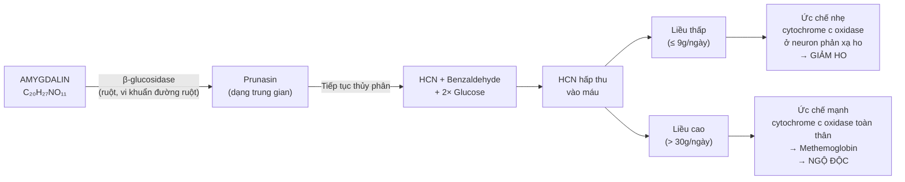
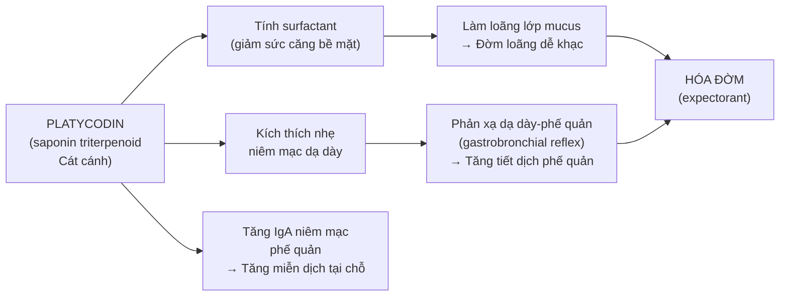
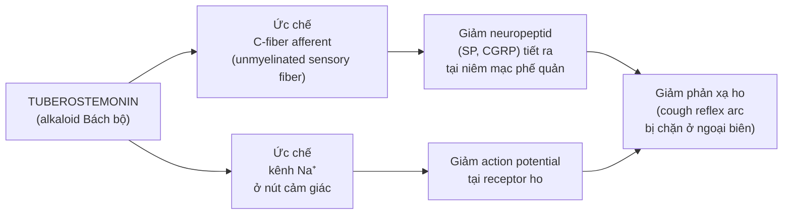
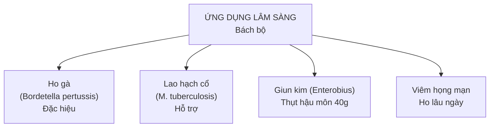
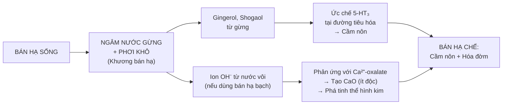
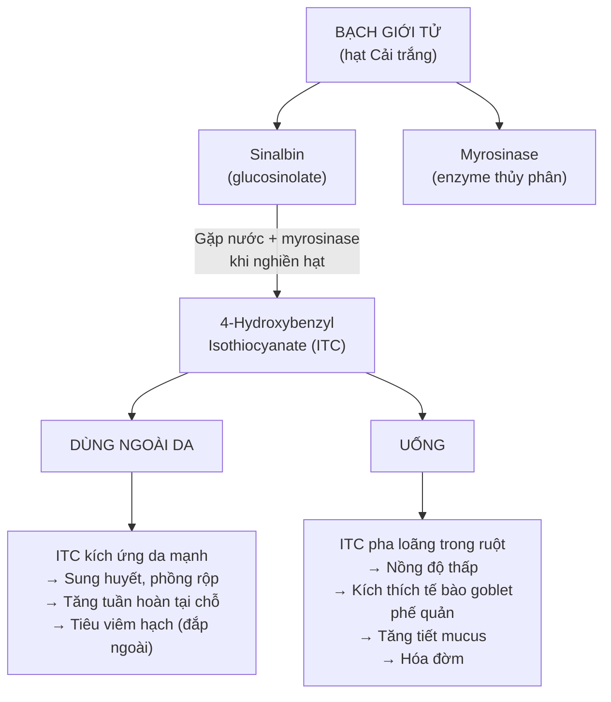
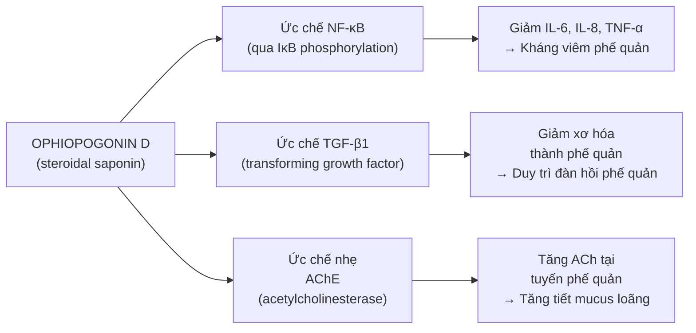

import KeyPoints from '~/components/KeyPoints.astro';
import CompareTable from '~/components/CompareTable.astro';
import ClinicalPearl from '~/components/ClinicalPearl.astro';
import SourceNote from '~/components/SourceNote.astro';

## Câu hỏi trung tâm

**Nhóm thuốc hóa đờm-chỉ khái-bình suyễn dùng trị các bệnh đường hô hấp nhưng cơ chế rất khác nhau: vị thì ức chế trực tiếp trung khu ho (Hạnh nhân), vị thì làm loãng đờm qua kích thích tiết dịch (Cát cánh), vị thì ức chế C-fiber (Bách bộ), vị thì giãn phế quản (Bối mẫu). Tại sao các vị thuốc "cùng nhóm" lại hoạt động theo 5 cơ chế hoàn toàn khác nhau?**

<KeyPoints title="5 cơ chế phân tử cốt lõi">

- **Amygdalin (Hạnh nhân) → HCN → ức chế cytochrome c oxidase tại neuron ho:** Liều thấp giảm ho; liều cao → methemoglobin, ngộ độc.
- **Platycodin saponin (Cát cánh) → surfactant + kích thích niêm mạc → tăng tiết dịch phế quản:** Đờm loãng → dễ khạc → "hóa đờm" theo cơ chế vật lý.
- **Tuberostemonin (Bách bộ) → ức chế C-fiber afferent → giảm phản xạ ho + ức chế M. tuberculosis:** Hoạt chất duy nhất kháng lao trong nhóm.
- **Fritimin alkaloid (Bối mẫu) → kích thích nhẹ β₂-adrenergic → giãn cơ trơn phế quản:** Giảm co thắt phế quản = chỉ khái + bình suyễn cùng lúc.
- **Calcium oxalate + alkaloid (Bán hạ sống) → gây độc; gừng phá oxalate + gingerol ức chế 5-HT₃ → cầm nôn:** Chế biến đảo ngược từ "gây nôn" thành "cầm nôn".

</KeyPoints>

---

## 1. Amygdalin (Hạnh nhân) — Cơ chế chữa ho và nguy cơ độc tính

### 1.1. Con đường sinh HCN

Amygdalin (cyanogenic glycoside) tồn tại trong Hạnh nhân sống ở dạng không hoạt tính. Khi Hạnh nhân bị nghiền hoặc đi qua đường tiêu hóa:

### 1.2. Cơ chế methemoglobin

HCN liều cao → ức chế Fe³⁺ trong cytochrome c oxidase (complex IV) → chuỗi vận chuyển điện tử bị chặn → tế bào không sản xuất được ATP dù có O₂ → "ngạt thở tế bào".

Song song đó, CN⁻ tác động trực tiếp lên hemoglobin → oxy hóa Fe²⁺ thành Fe³⁺ → methemoglobin (không gắn O₂) → thiếu O₂ mô.

**Triệu chứng:** Tím tái môi, ngón tay (methemoglobin), đau đầu, co giật, hôn mê.  
**Giải độc:** Methylene blue (khử Fe³⁺ → Fe²⁺) + thiosulfate (tạo thiocyanate không độc).

### 1.3. Sao vàng giảm độc tính

Nhiệt (150°C, 10 phút) → phá vỡ phần amygdalin bề mặt hạt → giảm ~30% HCN sinh ra khi uống. Tuy nhiên không phá hoàn toàn → vẫn cần kiểm soát liều.

---

## 2. Saponin (Cát cánh, Bối mẫu) — Hai cơ chế tiết dịch khác nhau

### 2.1. Platycodin saponin (Cát cánh) — Surfactant + phản xạ dạ dày-phế quản

**Kết luận:** Cát cánh không ức chế ho trực tiếp mà làm đờm loãng và dễ thoát → phản xạ ho trở nên hiệu quả hơn (productive cough) → đờm ra → hết ho tự nhiên. Đây là "hóa đờm" đúng nghĩa.

### 2.2. Fritimin alkaloid (Bối mẫu) — Giãn phế quản

Fritimin (isosteroidal alkaloid từ *Fritillaria*) → kích thích nhẹ **β₂-adrenergic receptor** trên cơ trơn phế quản → adenylyl cyclase → cAMP tăng → protein kinase A → giãn cơ trơn phế quản.

Cơ chế này tương tự (yếu hơn) salbutamol (β₂ agonist) nhưng thêm tác dụng kháng viêm (ức chế eosinophil, giảm IL-5).

**Giải thích tán kết của Bối mẫu:** Fritimin còn ức chế proliferative response của tế bào lympho và ức chế sản sinh cytokine tại hạch viêm → "tán kết" (làm tiêu hạch viêm).

---

## 3. Tuberostemonin (Bách bộ) — Ức chế C-fiber và kháng lao

### 3.1. Ức chế C-fiber afferent — Cơ chế giảm ho thần kinh

C-fiber là loại sợi thần kinh không có myelin, đáp ứng với kích thích hóa học (acid, capsaicin, bradykinin) tại phế quản. Tuberostemonin ức chế C-fiber → giảm "ngưỡng ho" → cần kích thích mạnh hơn mới ho.

### 3.2. Kháng Mycobacterium tuberculosis

Tuberostemonin ức chế **DNA gyrase** (topoisomerase II) của *M. tuberculosis* — cơ chế tương tự fluoroquinolone nhưng yếu hơn nhiều lần.

Ngoài tuberostemonin, Bách bộ còn có **stemonin** và **stemofoline** → cộng hưởng kháng lao.

**MIC (minimum inhibitory concentration) với M. tuberculosis:** ~32–64 μg/mL (cao hơn isoniazid nhiều, nhưng đủ để hỗ trợ điều trị lao hạch theo YHCT).

### 3.3. Ứng dụng lâm sàng

---

## 4. Bán hạ sống — Cơ chế độc tính và chế biến

### 4.1. 2 thành phần độc tính trong Bán hạ sống

| Thành phần | Cơ chế độc | Triệu chứng |
|---|---|---|
| **Calcium oxalate** (Ca-C₂O₄) tinh thể hình kim | Kích ứng cơ học niêm mạc → rách niêm mạc miệng | Rát, ngứa, phù niêm mạc miệng/họng ngay sau nhai |
| **3,4-dihydroxybenzaldehyde** + alkaloid kích ứng | Kích thích receptor nôn (5-HT₃, D₂) tại dạ dày và area postrema | Nôn mạnh, buồn nôn, đau bụng |
| Độc tính gan | Cơ chế chưa rõ hoàn toàn (có thể qua metabolite alkaloid) | Tăng ALT, AST khi dùng lâu dài |

### 4.2. Cơ chế chế biến gừng phá vỡ độc tính

**Điểm quan trọng:** Gingerol trong gừng ức chế **5-HT₃ receptor** (serotonin type 3) — chính là cơ chế của ondansetron (thuốc cầm nôn hiện đại). Vậy Bán hạ + Gừng = hóa đờm + cầm nôn ngay từ thế kỷ thứ II (Thương hàn luận).

### 4.3. Bán hạ kỵ Ô đầu — Cơ chế 18 phản

Alkaloid của Bán hạ kết hợp với aconitin (alkaloid Ô đầu) → tăng độc tính tim mạch (block Nav tăng cường). Nguy cơ: loạn nhịp nặng hơn so với dùng riêng từng vị.

---

## 5. Sinalbin + Myrosinase (Bạch giới tử) — Enzyme hoạt hóa isothiocyanate

### 5.1. Cơ chế kép: Ngoài da vs Uống

### 5.2. Tại sao Bạch giới tử đắp ngoài cẩn thận?

Khi đắp, ITC tiếp xúc trực tiếp da → nồng độ cao → kích thích TRPV1 receptor (capsaicin receptor) → cảm giác nóng rát → phản ứng sung huyết → phồng rộp nếu đắp quá 20–30 phút.

**Ứng dụng đắp ngoài:** Nhọt mới mọc, viêm hạch lympho → ITC gây sung huyết tại chỗ → tăng bạch cầu đến tiêu viêm. Không đắp lên vết thương hở.

---

## 6. Ophiopogonin (Mạch môn) — Saponin ức chế viêm đường hô hấp

### 6.1. Cơ chế chống viêm và chống xơ hóa phế quản

Ophiopogonin D (steroidal saponin chính của Mạch môn):

### 6.2. Mạch môn vs Thiên môn — Cùng nhóm nhưng khác tạng đích

| | Mạch môn | Thiên môn |
|---|---|---|
| Hoạt chất chính | Ophiopogonin (steroidal saponin) | Sarsasapogenin (steroidal saponin) + asparagin |
| Tạng đích | Phế > Tâm | Phế + Thận |
| Tác dụng đặc biệt | Bảo vệ tế bào cơ tim (chống thiếu máu cơ tim) | Hạ đường huyết (asparagin ức chế gluconeogenesis) |
| Khi dùng phối hợp | Tăng hiệu quả dưỡng âm nhuận Phế | Tăng tác dụng bổ Thận âm |

---

## 7. Worked example — Phân tích cơ chế Tam tử dưỡng thân thang

**Bệnh nhân:** Nam 70 tuổi, COPD giai đoạn III, ho mạn tính đờm trắng loãng, khó thở khi đi bộ, bụng đầy trướng, ăn kém.

| Vị | Hoạt chất | Cơ chế YHHĐ | Vai trò trong bài |
|---|---|---|---|
| **La bạch tử** | Sulforaphane (isothiocyanate từ glucosinolate) | Ức chế mucin secretion quá mức, giảm tiết dịch dư thừa + hỗ trợ tiêu hóa qua kích thích tiết pepsin | Giáng khí + tiêu thực (giảm đầy bụng) |
| **Tô tử** | α-linolenic acid (ALA) + perilla aldehyde | ALA → EPA/DHA → giảm prostaglandin viêm + giảm leukotriene (co phế quản); perillaldehyde → giảm co thắt ruột | Giáng khí tiêu đờm + nhuận tràng (thông xuống) |
| **Bạch giới tử** | 4-Hydroxybenzyl isothiocyanate (ITC) | Kích thích tế bào goblet phế quản → tiết mucus loãng → dễ khạc | Ôn Phế trừ đờm hàn (làm loãng đờm) |

**Phối hợp đa cơ chế:** La bạch tử nhắm Tỳ Vị (tiêu hóa), Tô tử nhắm phế quản + ruột, Bạch giới tử nhắm tuyến nhầy phế quản → 3 vị, 3 target, không chồng lấn.

<SourceNote>

- Nguồn gốc: `Raw/Thuoc_YHCT/chuong-02-cac-nhom-thuoc/bai-07-thuoc-hoa-dom-chi-khai-binh-suyen_001.md`
- Sách: *Thuốc Y học cổ truyền (Tập 1)* — TS. Hứa Hoàng Oanh, TS. Nguyễn Thành Triết.

</SourceNote>
