import MedicalNote from '~/components/MedicalNote.astro';
import ClinicalPearl from '~/components/ClinicalPearl.astro';

## Bản đồ cơ chế tổng quan — Bài 8

```mermaid
flowchart TD
    subgraph A["BÌNH CAN TỨC PHONG"]
        A1["Câu đằng\nRhinchophyllin"]
        A2["Thiên ma\nGastrodin"]
        A3["Bạch tật lê\nTribulus saponin"]
        A4["Bạch cương tàm\nCoumarin/Flavonoid"]
    end

    subgraph B["AN THẦN"]
        B1["Toan táo nhân\nJujubosid A"]
        B2["Viễn chí\nSaponin/Xanthon"]
        B3["Liên tâm\nNuciferin"]
        B4["Lạc tiên\nPassiflorin"]
        B5["Chu sa\nHgS → 5-HT↓"]
    end

    subgraph C["KHAI KHIẾU"]
        C1["Băng phiến\nD-borneol"]
        C2["Ngưu hoàng\nAcid cholic"]
        C3["Xương bồ\nβ-asarone"]
    end

    A1 -->|"Ca²⁺ channel block"| Hap["Hạ huyết áp\nGiãn mạch não"]
    A2 -->|"GABA-A ↑ + BDNF ↑"| Tk["Bảo vệ thần kinh\nChống co giật"]
    A3 -->|"LH ↑ → Testosterone ↑"| Bca["Bình Can\nCải thiện libido"]
    B1 -->|"5-HT₁ ↑ + GABA ↑"| Ngu["Gây ngủ sinh lý\nCải thiện trí nhớ"]
    B2 -->|"AChE ↓ + BChE ↓"| Tri["Tăng ACh não\nCải thiện nhận thức"]
    B3 -->|"D2 antagonist + α1 block"| Atk["An thần\nChống rối loạn tâm thần"]
    B5 -->|"Hg²⁺ → 5-HT↓ ở não"| Anxio["Giải lo âu\n(liều thấp, ngắn ngày)"]
    C1 -->|"Vượt BBB nhanh\n+ Kênh Ca²⁺ TRP"| Tinh["Tỉnh thần\nGiảm đau thần kinh"]
    C2 -->|"Acid cholic → GABA-A ↑"| Co["Chống co giật\nHạ sốt"]
    C3 -->|"AChE ↓ + mAChR"| Ki["Khai khiếu\nKiện Vị"]
```



---

## 1. Câu đằng — Rhinchophyllin: kênh Ca²⁺ + NO

**Rhinchophyllin** (alkaloid oxindole từ *Uncaria rhynchophylla*):

**Cơ chế hạ huyết áp:**

```
Rhinchophyllin
    ↓
Ức chế kênh Ca²⁺ typ L (VGCC) ở cơ trơn mạch máu
    ↓
[Ca²⁺]i ↓ trong tế bào cơ trơn
    ↓
Myosin light-chain kinase (MLCK) không được kích hoạt
    ↓
Cơ trơn mạch giãn → Sức cản ngoại vi ↓ → HA ↓
```

Rhinchophyllin cũng tăng eNOS (endothelial NO synthase) → NO → cGMP → giãn mạch thêm.

**Cơ chế bảo vệ não:**
- Ức chế HSP90 (heat shock protein 90) → giảm aggregation α-synuclein → bảo vệ neuron dopaminergic (liên quan Parkinson's — Lan et al., 2018).
- Ức chế NF-κB → giảm viêm thần kinh.

**Tại sao không sắc >20 phút:**

Rhinchophyllin có cấu trúc vòng lactam (oxindole). Nhiệt độ > 95°C kéo dài → vòng lactam bị mở và oxy hóa → mất nhóm chức hoạt động → mất khả năng block kênh Ca²⁺.

---

## 2. Thiên ma — Gastrodin: GABA-A và BDNF

**Gastrodin** (4-hydroxybenzyl glucoside, 30–40% hoạt chất khô *Gastrodia elata*):

```
Gastrodin
    ↓ (qua BBB dễ dàng — phân tử nhỏ, log P = 0.8)
    ├→ GABA-A receptor agonism → Cl⁻ influx → Hyperpolarization → ↓ neuronal excitability
    ├→ BDNF (Brain-Derived Neurotrophic Factor) ↑ → TrkB → neuroprotection, neuroplasticity
    └→ Ức chế NMDA receptor → Chống excitotoxicity (glutamate-mediated)
```

**Vanillin** (cùng trong Thiên ma) → MAO-B ức chế nhẹ → dopamine ↑ ở striatum → chống Parkinson.

**Tại sao kỵ âm hư?** Thiên ma tính ấm → kích thích chuyển hóa → tăng tiêu thụ âm dịch → người âm hư (miệng khô, táo bón, lưỡi đỏ) → sẽ khô hơn.

---

## 3. Toan táo nhân — Jujubosid A: GABA + 5-HT₁A

**Jujubosid A** (saponin từ *Ziziphus mauritiana*):

```
Jujubosid A
    ├→ Tăng biểu hiện GABA-A receptor subunit β₂ → Tăng nhạy cảm GABA → Ngủ dễ hơn
    ├→ 5-HT₁A partial agonist → Anxiolytic + cải thiện chất lượng giấc ngủ (giảm REM latency)
    └→ Chống oxy hóa → Bảo vệ hippocampus → Cải thiện trí nhớ dài hạn
```

**Sao đen Toan táo nhân:** Rang ở 200°C → tannin bị polyme hóa → ít gây se niêm mạc dạ dày; flavonoid bền vững hơn → tăng tác dụng an thần.

---

## 4. Liên tâm — Nuciferin: Dopamine D2 antagonist

**Nuciferin** (aporphine alkaloid từ tâm sen *Nelumbo nucifera*):

```
Nuciferin
    ├→ Dopamine D2 receptor antagonist → ↓ hyperactivity của đường dopamine → An thần, chống cuồng
    ├→ α1-adrenergic antagonist → Giãn mạch nhẹ → Hạ HA
    └→ Serotonin 5-HT₂ antagonist → Anxiolytic

Procyanidin (Liên tâm)
    └→ Ức chế xanthine oxidase → ↓ ROS → Bảo vệ nội mô mạch máu
```

Cơ chế D2 antagonism giải thích tại sao Liên tâm đặc biệt hiệu quả trong mất ngủ do **nhiệt nhập Tâm bào** (YHCT) — tương đương trạng thái kích động, nói nhảm, bồn chồn.

---

## 5. Viễn chí — Saponin: AChE inhibitor + neuroprotection

**Polygalasaponin XXXII và tenuifolin** (*Polygala tenuifolia*):

```
Polygalasaponin / Tenuifolin
    ├→ AChE (acetylcholinesterase) ↓ → ACh não ↑ → Cải thiện trí nhớ, học tập
    ├→ BChE ↓ (phụ trội)
    ├→ Kích hoạt CREB (cAMP response element-binding protein) → BDNF ↑ → Neuroplasticity
    └→ Anti-apoptotic: Bcl-2 ↑, Bax ↓ → Bảo vệ neuron khỏi stress oxy hóa

Xanthon (Viễn chí)
    └→ Ức chế MAO-A → Serotonin ↑ nhẹ → Antidepressant nhẹ
```

Cơ chế AChE inhibition tương tự donepezil (thuốc Alzheimer) — giải thích "ích trí" (cải thiện trí nhớ) trong YHCT.

---

## 6. Chu sa — HgS: Cơ chế anxiolytic và ngưỡng độc

**HgS hòa tan ít → Hg²⁺ thấm qua ruột rất thấp (< 2%).**

Cơ chế anxiolytic:

```
Hg²⁺ (lượng vi lượng từ HgS)
    ↓
Ức chế TPH (tryptophan hydroxylase) ở neuron raphe
    ↓
Serotonin (5-HT) ↓ tại não
    ↓
Khi [5-HT] giảm nhẹ: Lo âu giảm, trấn tĩnh
(Ngược với khi [5-HT] thiếu nhiều: Trầm cảm)
```

**Ngưỡng độc:**

| Liều | Tác dụng |
|---|---|
| 0,5–1 g HgS/ngày (ngắn hạn) | Anxiolytic, an thần |
| >2 g/ngày | Tích lũy Hg → thận, thần kinh |
| Dùng >30 ngày | Nguy cơ nhiễm Hg mạn dù liều thấp |
| Kết hợp acid mạnh (PPI, aspirin liều cao) | HgCl₂ hình thành → suy thận cấp |

---

## 7. D-borneol (Băng phiến) — Xuyên qua hàng rào máu não

**D-borneol** (tinh thể bicyclic monoterpene từ *Blumea balsamifera*):

```
D-borneol (log P = 2.1, MW = 154)
    ↓ (lipophilic → dễ qua BBB)
    ├→ Ức chế kênh TRPV1 (Transient Receptor Potential Vanilloid 1) → Giảm đau neuropathic
    ├→ Tăng tính thấm BBB tạm thời → Dẫn thuốc khác vào não (borneol làm "chất mang")
    ├→ Kháng khuẩn: Phá vỡ màng tế bào vi khuẩn (cấu trúc bicyclic)
    └→ Kháng viêm: ↓ NF-κB → ↓ IL-1β, TNF-α
```

**Tính chất vật lý giải thích "không sắc":**
- Điểm thăng hoa: 204°C (trong không khí thấp hơn) → dễ bay hơi khi đun nước 100°C
- Áp suất hơi: 1,3 mmHg ở 20°C → đủ để thất thoát đáng kể khi sắc 30 phút

---

## 8. β-asarone (Xương bồ) — Dual AChE + Anxiolytic

**β-asarone** (tinh dầu chính từ *Acorus calamus*):

```
β-asarone
    ├→ AChE ↓ (IC₅₀ ~50 µM) → ACh ↑ → Cải thiện nhận thức, kiện Vị (ACh kích thích cơ trơn dạ dày)
    ├→ 5-HT₃ antagonist → Giảm buồn nôn (giải thích "kiện Vị") + Anxiolytic
    ├→ GABA-A potentiation nhẹ → An thần
    └→ Chống amyloid β aggregation → Tiềm năng Alzheimer (in vitro)
```

**Chú ý an toàn:** β-asarone ở liều cao có tiềm năng genotoxic (ức chế topoisomerase II in vitro). Liều YHCT 4–8 g/ngày được coi là an toàn. Không dùng dài ngày quá chỉ định.

---

## 9. Ngưu hoàng — Acid cholic và bilirubin: Anti-seizure

**Acid cholic** (acid mật từ sỏi mật trâu/bò):

```
Acid cholic
    ├→ Kích hoạt TGR5 (G protein-coupled bile acid receptor) ở neuron
    │    → cAMP ↑ → PKA → Phosphorylate GABA-A receptor → Tăng nhạy cảm GABA
    │    → Chống co giật
    └→ Kháng viêm: ↓ NF-κB, TLR4 → Phù hợp điều trị hôn mê nhiễm trùng (nhiệt bế)

Bilirubin (neonatal form, từ Ngưu hoàng)
    └→ Antioxidant cực mạnh (IC₅₀ thấp hơn vitamin E) → Bảo vệ neuron
    └→ Ức chế protein kinase C → Giảm quá trình phosphorylation gây apoptosis neuron
```

---

## 10. Worked example — Thiên ma câu đằng thang

**Bệnh nhân:** Nam, 62 tuổi, THA lâu năm, đau đầu vùng đỉnh-gáy, mất ngủ, hoa mắt, đỏ mặt, lưỡi đỏ ít rêu, mạch huyền tế.

**YHCT:** Can Thận âm hư → Can dương vượng → Can phong nội động.

**Phân tích bài Thiên ma câu đằng thang qua cơ chế phân tử:**

| Vị | Cơ chế phân tử | Mục tiêu YHCT |
|---|---|---|
| **Thiên ma** | Gastrodin → GABA-A ↑, BDNF ↑ | Bình Can tức phong |
| **Câu đằng** | Rhinchophyllin → Ca²⁺ block → HA ↓ | Tức phong trấn kinh |
| **Chi tử** | Genipic acid → CRP ↓, IL-6 ↓ | Thanh nhiệt |
| **Ngưu tất** | β-ecdysterone → cải thiện vi tuần hoàn | Dẫn huyết xuống, bổ Thận |
| **Đỗ trọng + Tang ký sinh** | Pinoresinol → PPAR-γ → giảm viêm mạch | Bổ Thận âm, bền gân xương |
| **Dạ giao đằng** | Stilbene glycoside → 5-HT ↑ → cải thiện giấc ngủ | Dưỡng Tâm an thần |
| **Bạch phục linh** | Pachymic acid → GABA ↑ nhẹ | Kiện Tỳ an thần |

**Kết quả lâm sàng mong đợi:** HA ↓ nhẹ đến vừa, giảm đau đầu, cải thiện giấc ngủ, ít tác dụng phụ hơn thuốc tây liều cao.

<ClinicalPearl>

**YHCT phân tầng THA:** (1) Can dương vượng đơn thuần → Thiên ma câu đằng thang (nếu THA nhẹ-vừa, không biến chứng). (2) Can Thận âm hư nặng → thêm Lục vị địa hoàng hoàn. (3) Đờm thấp → Bán hạ bạch truật thiên ma thang (Thiên ma + Bán hạ + Bạch truật + Trần bì). Không thể dùng Thiên ma câu đằng thang cho tất cả THA — cần biện chứng.

</ClinicalPearl>

<MedicalNote>

**Giới hạn bằng chứng:** Nghiên cứu rhinchophyllin hạ HA chủ yếu in vitro và animal model. RCT trên người còn hạn chế. Thiên ma câu đằng thang có vài RCT nhỏ ở Trung Quốc với kết quả khích lệ nhưng chưa đủ mạnh theo tiêu chuẩn GRADE. Không thay thế thuốc tây trong THA có nguy cơ tim mạch cao.

</MedicalNote>
