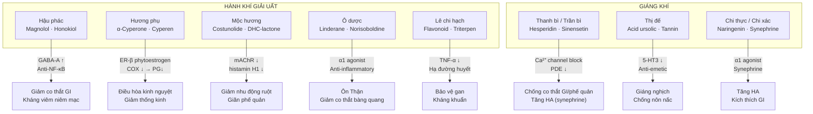
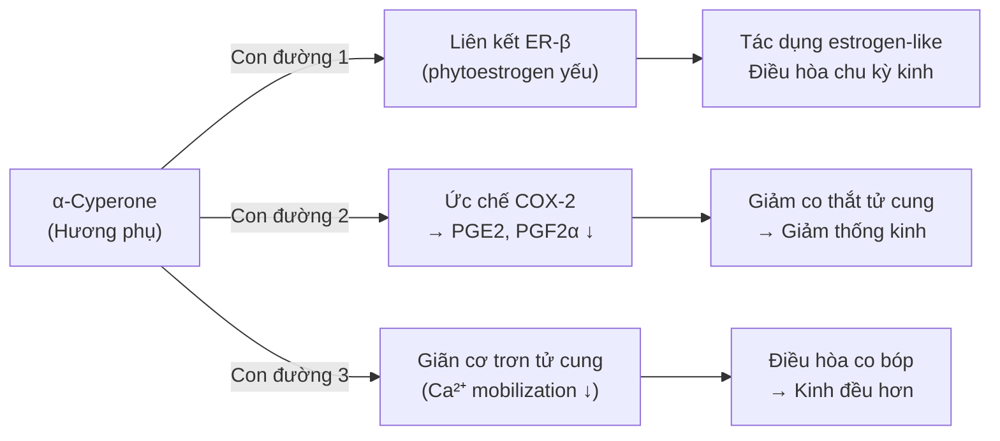
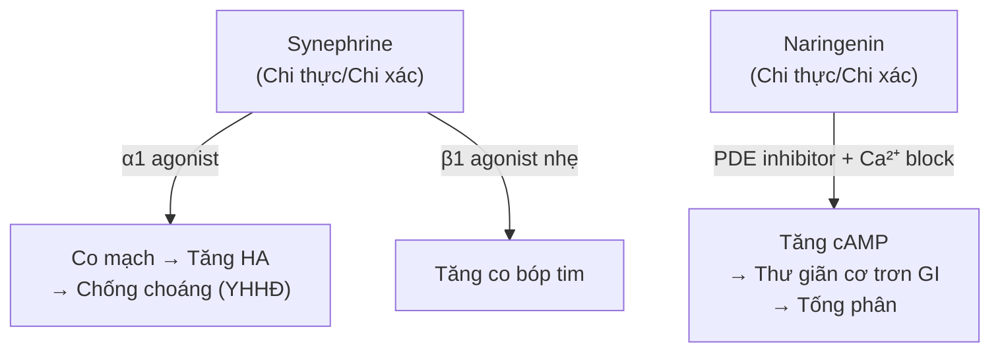

import MedicalNote from '~/components/MedicalNote.astro';
import ClinicalPearl from '~/components/ClinicalPearl.astro';

## Bản đồ cơ chế tổng quan — Bài 9



---

## 1. Hậu phác — Magnolol/Honokiol: đa cơ chế trên GI

**Hoạt chất chính:** Magnolol và Honokiol (bis-phenol liên kết biphenyl).

### Cơ chế 1: GABA-A potentiation (an thần nhẹ + giảm co thắt)

```
Magnolol/Honokiol
    ↓
Gắn vào vị trí allosteric của GABA-A receptor (khác với benzodiazepine)
    ↓
Tăng tần suất mở kênh Cl⁻
    ↓
Hyperpolarization tế bào cơ trơn + tế bào thần kinh
    ↓
Giảm co thắt GI + an thần nhẹ
```

### Cơ chế 2: Ức chế NF-κB → kháng viêm

Honokiol ức chế IκB kinase → NF-κB không được phosphoryl hóa → không vào nhân → COX-2 ↓, IL-6 ↓, TNF-α ↓ → giảm viêm niêm mạc ruột.

### Cơ chế 3: Kháng khuẩn trực tiếp

Magnolol phá vỡ màng tế bào vi khuẩn Gram-dương (*S. aureus*, *Streptococcus*) bằng cách kết hợp phospholipid → kiết lỵ do vi khuẩn được cải thiện.

<MedicalNote>

**Hậu phác + Thương truật = "Bình Vị tán" cốt lõi.** Thương truật (Atractylodes) ức chế vi khuẩn H. pylori, Hậu phác ức chế co thắt GI và giảm viêm → cặp đôi hoàn hảo cho viêm dạ dày do hàn thấp trong YHCT.

</MedicalNote>

---

## 2. Hương phụ — α-Cyperone: cơ chế điều kinh

**Hoạt chất chính:** α-Cyperone, β-Selinene (sesquiterpen trong tinh dầu); Aucubin (iridoid glycoside).

### Cơ chế điều kinh (3 con đường)



### Tác dụng kháng khuẩn — căn cứ cho "thanh Can hỏa"

Tinh dầu Hương phụ ức chế *S. aureus* và *Shigella shiga* (vi khuẩn gây lỵ trực khuẩn) — đây là cơ sở YHHĐ cho tác dụng "thanh Can hỏa" điều trị đau mắt đỏ do nhiễm khuẩn.

---

## 3. Mộc hương — Costunolide: cơ chế kháng co thắt

**Hoạt chất chính:** Costunolide và Dehydrocostus lactone (sesquiterpene lactone).

### Tại sao "kỵ lửa"?

| Điều kiện | Hóa học | Kết quả |
|---|---|---|
| Nhiệt độ phòng, dạng bột | Costunolide nguyên vẹn | Tác dụng đầy đủ |
| Sắc 100°C, 30 phút | Vòng lactone bị thủy phân + tinh dầu bay hơi | Mất >70% hoạt tính |
| Sắc >60 phút | Phân hủy hoàn toàn | Không còn tác dụng kháng co thắt |

### Cơ chế kháng co thắt GI

```
Costunolide
    ↓
Ức chế thụ thể muscarinic M3 (mAChR)
    ↓
Acetylcholine không gắn được vào M3 ở cơ trơn ruột
    ↓
IP3 ↓ → Ca²⁺ nội bào ↓
    ↓
Cơ trơn ruột giãn → Giảm nhu động
    ↓
YHCT: Hành khí chỉ thống, kiện Tỳ hòa Vị
```

### Cơ chế giãn phế quản

Tương tự, Costunolide kháng histamin H1 ở cơ trơn phế quản → giãn phế quản → YHCT gọi là "bình Can giảm áp" (thực ra là cơ chế phổi).

---

## 4. Thanh bì — Hesperidin: cơ chế đối lập với Trần bì

Cả Thanh bì và Trần bì đều chứa Hesperidin và Sinensetin, nhưng **tỷ lệ khác nhau** và **norirutin** trong Thanh bì cao hơn → tạo ra sự khác biệt tác dụng.

### Cơ chế giảm co thắt (chống "khí kết")

```
Hesperidin + Nobiletin
    ↓
Block kênh Ca²⁺ typ L ở cơ trơn (tương tự calcium channel blocker)
    ↓
Ca²⁺ vào tế bào ↓
    ↓
Co thắt cơ trơn ruột, phế quản, mạch máu ↓
    ↓
YHCT: Phá khí, sơ Can, chống co thắt
```

### Nghịch lý: Thanh bì vừa giảm co thắt GI vừa tăng huyết áp?

| Tác dụng | Cơ chế |
|---|---|
| Giảm co thắt GI, phế quản | Hesperidin block Ca²⁺ channel ở cơ trơn nội tạng |
| Tăng huyết áp | Synephrine (alkaloid nhỏ) kích thích α1 receptor ở mạch máu → co mạch → tăng HA |

Hai tác dụng này xảy ra song song ở các mô đích khác nhau. Lâm sàng: Thanh bì không dùng cho bệnh nhân tăng huyết áp.

---

## 5. Thị đế — Acid ursolic: cơ chế chống nôn

**Hoạt chất:** Acid ursolic, Acid oleanolic (triterpenoid pentacyclic); Tannin.

### Cơ chế anti-emetic (chống nôn)

```
Acid ursolic
    ↓
Ức chế thụ thể 5-HT3 ở Area postrema (CTZ — Chemoreceptor Trigger Zone)
và ở đám rối thần kinh ruột
    ↓
Tín hiệu gây nôn từ ruột lên não ↓
    ↓
Giảm nôn nấc
```

**So sánh với Ondansetron (thuốc chống nôn YHHĐ):** Cả hai cùng cơ chế 5-HT3 antagonist, nhưng Ondansetron mạnh và đặc hiệu hơn. Thị đế thường dùng cho nôn nấc nhẹ-vừa, thai nghén, trẻ sơ sinh.

### Tannin — cơ chế bổ trợ

Tannin trong Thị đế kết tủa protein bề mặt niêm mạc dạ dày → tạo màng bảo vệ → giảm kích thích gây nôn từ dạ dày.

---

## 6. Chi thực / Chi xác — Synephrine: cơ chế tăng HA và phá khí

**Hoạt chất:** Synephrine (alkaloid), Naringenin (flavanone), Neohesperidin.



**Nghịch lý YHCT-YHHĐ:** YHCT gọi Chi thực là "phá khí tiêu tích" (làm thông thoáng, đẩy xuống). YHHĐ thấy Synephrine lại làm **tăng huyết áp** và **tăng co bóp tim**. Giải thích: tác dụng "phá khí" là do Naringenin giải phóng co thắt GI và thúc đẩy nhu động ruột → tống phân, không phải qua Synephrine.

---

## 7. Worked example — Ca lâm sàng tích hợp cơ chế

**Bệnh nhân:** Nữ 32 tuổi, đau bụng kinh dữ 2 ngày trước kinh, kinh màu tím đen, có cục, ngực tức, hay cáu, lưỡi tím nhạt, mạch huyền sáp.

**YHCT phân tích:** Can khí uất kết (đau sườn, cáu) + huyết ứ (kinh tím, cục, mạch sáp) → khí trệ huyết ứ → thống kinh.

**Bài thuốc:** Hương phụ (hành khí) + Ích mẫu (hoạt huyết) + Xuyên khung (hành khí hoạt huyết) + Ngải diệp (ôn kinh).

**Cơ chế YHHĐ tích hợp:**

| Vị thuốc | Hoạt chất | Cơ chế YHHĐ | Tác dụng |
|---|---|---|---|
| Hương phụ | α-Cyperone | COX-2 ↓ → PGF2α ↓; ER-β | Giảm co thắt tử cung, điều kinh |
| Ích mẫu | Leonurine | α1 block → giãn mạch tử cung; tăng co bóp tử cung nhẹ | Thúc đẩy tống kinh, giảm ứ đọng |
| Xuyên khung | Ligustilide | PDE ↓ → cAMP ↑ → cơ trơn thư giãn; kháng tiểu cầu | Giảm đau, cải thiện tuần hoàn vùng chậu |
| Ngải diệp | Thujone, cineole | Tăng tưới máu tử cung (nhiệt) | Ôn kinh, giảm "cung lạnh" |

<ClinicalPearl>

Nguyên tắc vàng: khi thống kinh có **cả khí trệ lẫn huyết ứ**, phải phối **hành khí + hoạt huyết** cùng lúc. Chỉ dùng Hương phụ (hành khí) mà không có hoạt huyết giống như chỉ "thông đường" mà không "dọn rác" — hiệu quả 50%.

</ClinicalPearl>

---

## 8. Cầu nối: Khái niệm "khí trệ" → cơ chế phân tử nào?

| Biểu hiện YHCT | Cơ chế YHHĐ tương ứng | Nhóm thuốc tác động |
|---|---|---|
| Đầy bụng, trướng hơi | Tăng nhu động ruột không phối hợp, ứ khí ruột | Hành khí → điều hòa nhu động |
| Đau sườn | Spasm cơ liên sườn + viêm thần kinh liên sườn | Hành khí → giảm co thắt, kháng viêm |
| Kinh không đều, thống kinh | Rối loạn prostaglandin, thay đổi nồng độ estrogen/progesterone | Hương phụ → PG↓, ER-β |
| Tức ngực, khó thở | Co thắt phế quản, ứ tiết | Hậu phác, Mộc hương → giãn phế quản |
| Nôn nấc | 5-HT3 tăng hoạt ở CTZ, kích ứng Vị | Thị đế → 5-HT3 antagonist |
| Khí kết thành khối | Tắc ruột chức năng, u bướu lành tính | Giáng khí → tăng nhu động, phá khí |
