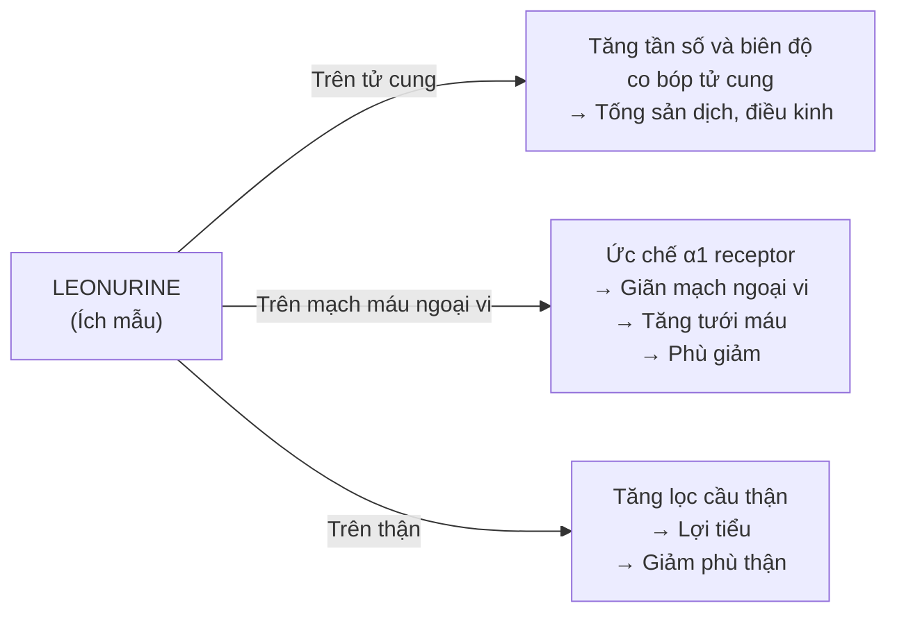
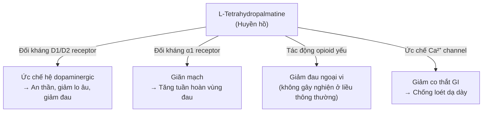
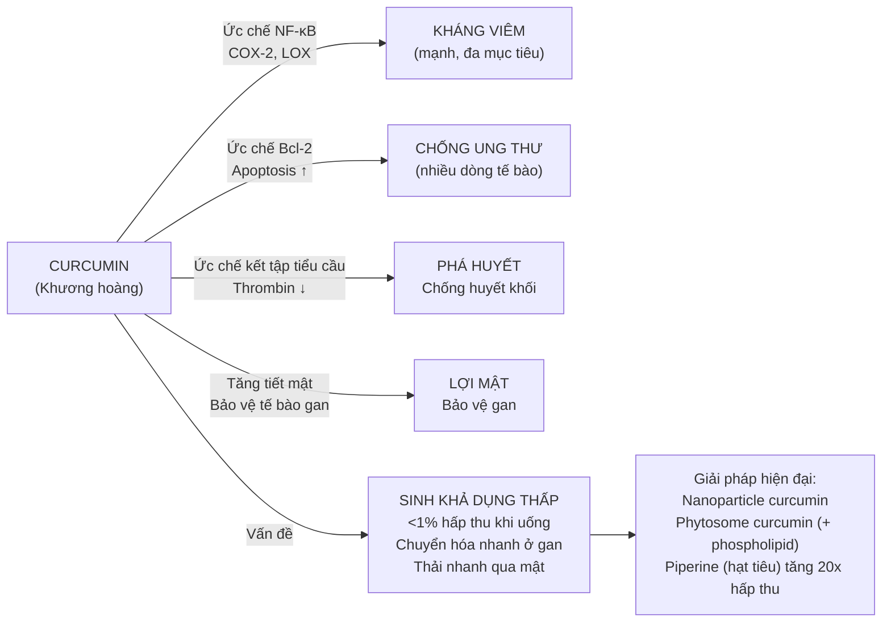

import MedicalNote from '~/components/MedicalNote.astro';
import ClinicalPearl from '~/components/ClinicalPearl.astro';

## Bản đồ cơ chế tổng quan — Bài 10

```mermaid
flowchart TD
    subgraph HAT["HOẠT HUYẾT"]
        H1["Đương quy\nLigustilide · Ferulic acid"]
        H2["Xuyên khung\nLigustilide · Z-butylidene"]
        H3["Ích mẫu\nLeonurine · Stachydrin"]
        H4["Hồng hoa\nCarthamin · HSYA"]
        H5["Huyền hồ\nCorydalin · Tetrahydropalmatine"]
        H6["Đan sâm\nTanshinon I/IIA · Cryptotanshinon"]
    end

    subgraph PHY["PHÁ HUYẾT"]
        P1["Khương hoàng\nCurcumin · Turmeron"]
        P2["Nga truật\nβ-Elemene · Furanodiene"]
        P3["Tam lăng\nPhenylpropanoid · Flavonoid"]
    end

    subgraph CHI["CHỈ HUYẾT"]
        C1["Tam thất\nNotoginsenoside R1 · Rg1"]
        C2["Bạch cập\nMiltiorrhizae glycosid · Chất nhầy"]
        C3["Bồ hoàng\nTyphaneosid · Flavonoid → Than hóa"]
        C4["Hoa hòe\nRutin · Quercetin"]
    end

    H1 -->|"PDE ↓ → cAMP ↑\ncơ trơn thư giãn"| TM["Tăng tuần hoàn\nGiải phóng ứ huyết"]
    H3 -->|"α1 block → giãn mạch\nTử cung co bóp ↑"| PK["Hoạt huyết điều kinh\nPhụ khoa"]
    H4 -->|"Tiểu cầu ↓\nOxytocin-like (liều cao)"| BD["Tán ứ → Phá huyết\n(liều phụ thuộc)"]
    H5 -->|"D2 receptor ↓\nOpioid-like"| GP["Giảm đau trung ương\nMạnh nhất nhóm"]
    H6 -->|"NF-κB ↓\nHMG-CoA ↓"| TT["Kháng viêm\nHạ mỡ máu"]
    P1 -->|"NF-κB ↓\nCOX-2 ↓"| KV["Kháng viêm đa cơ chế\n+ Chống ung thư"]
    C1 -->|"Tiểu cầu ↓ (R1)\nThrombin ↑ (Rg1)"| KD["Vừa tan ứ\nvừa cầm máu"]
    C4 -->|"Tăng bền thành mao mạch\nVitamin P-like"| CM["Giảm tính thấm mao mạch\n→ Chống xuất huyết"]
```



---

## 1. Đương quy + Xuyên khung — cặp Ligustilide: cơ chế hoạt huyết

**Hoạt chất chính chung:** Ligustilide (phthalide) — sesquiterpenoid tan trong dầu.

### Cơ chế hoạt huyết của Ligustilide

```
Ligustilide
    ↓
Ức chế Phosphodiesterase (PDE) ở tế bào cơ trơn mạch máu
    ↓
cAMP tích lũy nội bào ↑↑
    ↓
Protein kinase A (PKA) hoạt hóa
    ↓
Myosin light chain kinase (MLCK) bị phosphoryl hóa → bất hoạt
    ↓
Cơ trơn mạch máu GIÃN → tăng lưu lượng máu
    ↓
YHCT: Hoạt huyết thông kinh, trừ phong hàn (Xuyên khung)
```

### Sự khác nhau giữa Đương quy và Xuyên khung (cùng họ Apiaceae)

| Tiêu chí | Đương quy | Xuyên khung |
|---|---|---|
| Hoạt chất nổi bật | Ferulic acid (bổ huyết) + Ligustilide (hoạt huyết) | Ligustilide > Ferulic acid (hoạt huyết mạnh hơn) |
| Hướng tác dụng | Bổ huyết + hoạt huyết cân bằng | Hoạt huyết + hành khí (mạnh hơn Đương quy) |
| Trên não | Ít tác dụng trực tiếp | Tăng lưu lượng máu não, chống phù não |
| Tử cung | Liều thấp thư giãn; liều cao co bóp nhẹ | Co bóp tử cung rõ hơn |
| Phối hợp điển hình | Bạch thược (Tứ vật thang) | Sài hồ, Hương phụ (đau đầu) |

---

## 2. Ích mẫu — Leonurine: cơ chế "song song nghịch nhau" ở tử cung

**Hoạt chất chính:** Leonurine (alkaloid guanidine đặc trưng), Stachydrin.

### Tại sao Ích mẫu vừa "hoạt huyết điều kinh" vừa "lợi thủy tiêu thũng"?



**Nghịch lý:** Leonurine vừa co bóp tử cung (hành huyết) vừa giãn mạch (lợi thủy). Điều này giải thích tại sao Ích mẫu là vị thuốc **chuyên biệt phụ khoa** trong YHCT:
- Tử cung co bóp → tống sản dịch, thông kinh.
- Mạch máu giãn → giảm phù (thường đi kèm sau sinh hoặc trong chu kỳ kinh).

---

## 3. Hồng hoa — Carthamin và HSYA: cơ chế liều phụ thuộc

**Hai nhóm hoạt chất chính với cơ chế khác nhau:**

```
CARTHAMIN (pigment flavonoid — liều cao):
    ↓
Kích thích receptor oxytocin ở cơ trơn tử cung
    ↓
IP3 ↑ → Ca²⁺ nội bào ↑
    ↓
Co bóp tử cung mạnh
    ↓
Phá huyết: đẩy thai chết lưu, sản dịch ứ đọng

HYDROXYSAFFLOR YELLOW A (HSYA — ở mọi liều):
    ↓
Ức chế thromboxane A2 (TXA2) — chất gây kết tập tiểu cầu
    ↓
Tiểu cầu không kết tập → máu loãng hơn
    ↓
Hoạt huyết (liều thấp: nhẹ nhàng)
    ↓
Bảo vệ tế bào thần kinh ở não và tủy sống bị chấn thương (HSYA)
```

<ClinicalPearl>

HSYA đang được nghiên cứu trong điều trị **chấn thương tủy sống** và **đột quỵ thiếu máu** — đây là hướng nghiên cứu hiện đại từ Hồng hoa YHCT. Cơ chế: giảm apoptosis tế bào thần kinh qua ức chế caspase-3 và NF-κB.

</ClinicalPearl>

---

## 4. Huyền hồ — Corydalin: giảm đau mạnh nhất nhóm

**Hoạt chất:** Tetrahydropalmatine (L-THP) = dạng khử của Corydalin.

### Cơ chế giảm đau đa receptor



**Tại sao Huyền hồ "chỉ thống tối cường" (giảm đau mạnh nhất)?**

Vì L-THP tác động đồng thời lên **3 hệ receptor** (dopaminergic, adrenergic, opioid-like) → hiệu quả giảm đau vượt trội so với các vị chỉ tác động một đường.

**YHCT lý giải:** Huyền hồ hành khí + hoạt huyết → "Khí thông huyết hoạt → thống tự trừ" (thông thì không đau). YHHĐ bổ sung: ức chế cả cơ chế trung ương lẫn ngoại vi.

---

## 5. Đan sâm — Tanshinon: cơ chế tim mạch + thần kinh

**Hoạt chất:** Tanshinon I, Tanshinon IIA, Cryptotanshinon (diterpenoid quinon).

### Cơ chế "một Đan sâm = bốn vật thang"

YHCT nói Đan sâm thay được **Tứ vật thang** (Thục địa, Đương quy, Bạch thược, Xuyên khung):

| Tác dụng Tứ vật thang | Cơ chế Đan sâm tương đương |
|---|---|
| Bổ huyết (Thục địa) | Kích thích tạo máu, tăng hồng cầu |
| Hoạt huyết (Xuyên khung) | Tanshinon IIA ức chế kết tập tiểu cầu |
| Điều kinh (Đương quy) | Điều hòa hormone nữ qua phytoestrogen yếu |
| Dưỡng huyết (Bạch thược) | Chống oxy hóa, bảo vệ tế bào máu |

**Cơ chế bảo vệ tim mạch (ứng dụng YHHĐ):**
```
Tanshinon IIA
    ↓
Ức chế HMG-CoA reductase → Cholesterol tổng hợp ↓
    ↓
Ức chế smooth muscle proliferation → Không xơ vữa thêm
    ↓
Ức chế NF-κB ở mạch → Kháng viêm thành mạch
    ↓
Tổng hợp: Chống xơ vữa động mạch, bảo vệ cơ tim
```

<MedicalNote>

**Đan sâm + Warfarin:** Tanshinon ức chế CYP2C9 → Warfarin không chuyển hóa được → tăng nồng độ Warfarin → nguy cơ xuất huyết. Đây là tương tác thuốc YHCT-YHHĐ có bằng chứng lâm sàng. Không phối hợp.

</MedicalNote>

---

## 6. Curcumin (Khương hoàng) — đa cơ chế, vấn đề sinh khả dụng

**Tại sao curcumin nghiên cứu nhiều nhưng khó thương mại hóa?**



**YHCT đã "giải" vấn đề này không biết:** Trong y học cổ truyền, Khương hoàng thường dùng dạng bột + chế với giấm/rượu → thực ra rượu và chất béo làm tăng hòa tan và hấp thu curcumin (dạng lipid-soluble).

---

## 7. Tam thất — Notoginsenoside: cơ chế kép tiểu cầu

**Tại sao Tam thất vừa hoạt huyết vừa chỉ huyết?**

```
NOTOGINSENOSIDE R1 (Tam thất):
    ↓
Ức chế thromboxane A2 (TXA2) synthetase
    ↓
TXA2 không tạo được → tiểu cầu không kết tập
    ↓
Huyết khối (ứ huyết) không hình thành thêm → TÁN Ứ

GINSENOSIDE Rg1 (Tam thất):
    ↓
Kích thích tổng hợp thrombin (yếu tố II) + fibrinogen
    ↓
Rút ngắn thời gian đông máu ở vết thương MỚI
    ↓
Cầm máu nhanh → CHỈ HUYẾT
```

**Hai cơ chế này không mâu thuẫn** vì hoạt động theo thời gian và vị trí khác nhau:
- Ứ huyết cũ (thrombus đã hình thành) → R1 phân giải.
- Vết thương đang chảy máu (coagulation cascade) → Rg1 tăng cường.

---

## 8. Hoa hòe — Rutin: cơ chế "Vitamin P"

**Rutin (quercetin-3-rutinoside)** là flavonoid glycoside trong Hoa hòe, được gọi là "Vitamin P":

```
RUTIN (Hoa hòe)
    ↓
Ức chế hyaluronidase → không phân giải acid hyaluronic trong thành mạch
    ↓
Thành mao mạch GIỮ NGUYÊN cấu trúc + ĐỘ BỀN
    ↓
Tính thấm thấu mao mạch ↓
    ↓
Huyết tương không rỉ ra ngoài → Không xuất huyết vi mạch
    ↓
YHCT: Lương huyết chỉ huyết (đặc biệt xuất huyết do nhiệt làm tổn thương mao mạch)
```

**Ứng dụng YHHĐ:** Rutin từ Hoa hòe được bào chế thành viên Rutin điều trị xuất huyết mao mạch, trĩ xuất huyết, ban xuất huyết dị ứng — điều này giải thích hoàn toàn tác dụng "lương huyết chỉ huyết" của Hoa hòe trong YHCT.

---

## 9. Worked example — Ca lâm sàng tích hợp cơ chế

**Bệnh nhân:** Nam 58 tuổi, đau thắt ngực khi gắng sức 6 tháng nay, đau lan ra vai trái, da môi tím nhạt, lưỡi tím có điểm ứ, mạch trầm sáp. Siêu âm tim: EF 45%, rối loạn vận động vùng.

**YHCT phân tích:** Tâm khí hư + huyết ứ (tâm mạch bị ứ trệ) → Tâm tý chứng.

**Bài thuốc điển hình:** Đan sâm + Xuyên khung + Đương quy + Tam thất + Huyền hồ + Hậu phác.

**Cơ chế YHHĐ tích hợp:**

| Vị thuốc | Hoạt chất | Cơ chế | Tác dụng |
|---|---|---|---|
| Đan sâm | Tanshinon IIA | Giãn mạch vành, chống xơ vữa, NF-κB ↓ | Tăng tưới máu cơ tim, kháng viêm mạch |
| Xuyên khung | Ligustilide | PDE ↓ → cAMP ↑ → giãn cơ trơn mạch | Giảm sức cản mạch ngoại vi, hạ áp nhẹ |
| Tam thất | Notoginsenoside R1 | TXA2 ↓ → tiểu cầu không kết tập | Chống huyết khối, tan ứ |
| Huyền hồ | L-THP | Giảm đau đa receptor | Giảm đau thắt ngực |
| Đương quy | Ferulic acid | Chống oxy hóa, bảo vệ tế bào cơ tim | Bổ huyết + giảm tổn thương thiếu máu |
| Hậu phác | Magnolol | Giảm co thắt cơ trơn | Giảm gánh nặng tim (afterload nhẹ) |

<ClinicalPearl>

Bài thuốc này gần với **Huyết phủ trục ứ thang** của Vương Thanh Nhậm (Xuyên khung, Đào nhân, Hồng hoa, Xích thược, Ngưu tất, Sài hồ, Chỉ xác, Cam thảo, Đương quy, Sinh địa). Huyết phủ trục ứ thang là bài phối hành huyết + hành khí cân bằng nhất — điều trị ứ huyết vùng ngực kinh điển.

</ClinicalPearl>

---

## 10. Cầu nối: Khái niệm "huyết ứ" → cơ chế phân tử nào?

| Biểu hiện YHCT | Cơ chế YHHĐ tương ứng | Nhóm thuốc tác động |
|---|---|---|
| Đau cố định, đau như kim châm | Thrombus / viêm khu trú → kích hoạt nociceptor | Hoạt huyết → giải phóng ứ huyết, kháng viêm |
| Màu da/môi/lưỡi tím | Giảm tưới máu vi mạch, thiếu oxy mô → methemoglobin | Hoạt huyết → tăng tưới máu |
| Khối u/cục (癥瘕) | Huyết khối tổ chức + xơ hóa (fibrosis) | Phá huyết → chống xơ hóa (curcumin, β-elemene) |
| Kinh nguyệt màu tím, có cục | Cục máu đông trong kinh nguyệt (tử cung co bóp kém) | Hoạt huyết điều kinh → Ích mẫu, Hồng hoa, Đan sâm |
| Mạch sáp (涩) | Tăng độ nhớt máu, giảm biến dạng hồng cầu | Hoạt huyết → giảm fibrinogen, tăng deformability HC |
| Xuất huyết do nhiệt nhập huyết phận | Viêm mạch máu → tăng tính thấm → xuất huyết | Lương huyết chỉ huyết → Rutin bền thành mạch |
