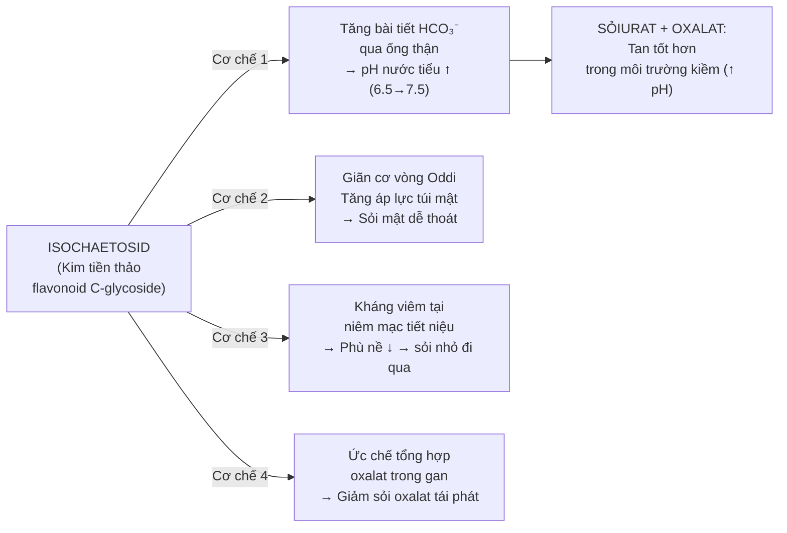
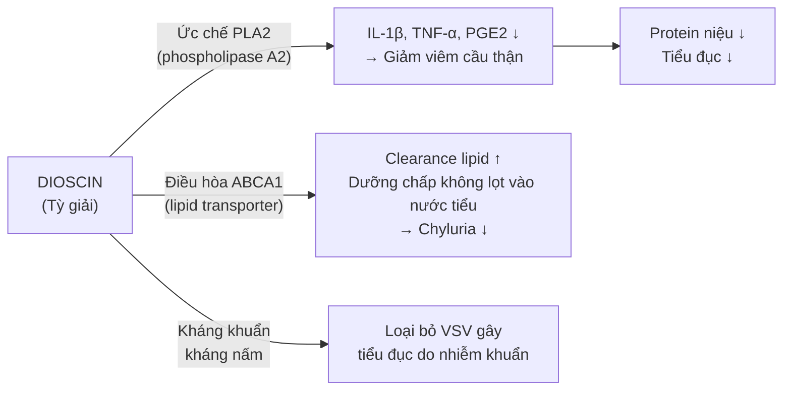

import MedicalNote from '~/components/MedicalNote.astro';
import ClinicalPearl from '~/components/ClinicalPearl.astro';

## Bản đồ cơ chế tổng quan — Bài 11

```mermaid
flowchart TD
    subgraph LT["NHÓM LỢI THỦY"]
        L1["Bạch linh (Phục linh)\nPachymaran · Triterpenoid"]
        L2["Trạch tả\nAlisol A/B · Triterpenoid"]
        L3["Trư linh\nPolyporus polysaccharide"]
        L4["Kim tiền thảo\nIsochaetosid (flavonoid)"]
        L5["Xa tiền\nAucubin · Plantenolic acid"]
        L6["Ý dĩ\nCoixin · Coicin"]
        L7["Tỳ giải\nDioscin · Saponin steroid"]
    end

    subgraph TT["NHÓM TRỤC THỦY (ĐỘC)"]
        T1["Cam toại\nKansuinin · Diterpenoid"]
        T2["Thương lục\nPhytolaccatoxin · Saponin"]
        T3["Khiên ngư\nPharbitin (alkaloid)"]
    end

    L1 -->|"AQP2 ↑\nGFR ↑"| DL["Tăng lọc cầu thận\nLợi niệu"]
    L1 -->|"GABA-A potentiation"| AT["An thần\n(Phục thần)"]
    L1 -->|"β-glucan → TLR4"| MI["Tăng miễn dịch\nChống ung thư"]
    L2 -->|"Alisol ức chế NaKATPase\n→ Na⁺ bài tiết ↑"| DL
    L3 -->|"Tăng GFR\nBảo vệ tế bào ống thận"| DL
    L4 -->|"Kiềm hóa nước tiểu\npH ↑ → sỏi tan"| SI["Tan sỏi\nNiệu đạo + túi mật"]
    L5 -->|"Adenin + cholin\nTăng tiết ở niêm mạc HH"| TH["Trấn ho\nLợi niệu"]
    L6 -->|"Coixin ức chế Bcl-2\nApoptosis tế bào ung thư"| UC["Chống ung thư\n(nghiên cứu)"]
    L7 -->|"Dioscin ↓ PLA2\nGiảm viêm cầu thận"| TU["Giảm protein niệu\nTiểu đục"]
    T1 -->|"Kích thích GI dữ dội\n→ Tả hạ mạnh"| TX["Trục thủy\n(cả 2 đường)"]
    T2 -->|"Phytolaccatoxin\nKích thích TK tự chủ"| NG["Ngộ độc:\nNhịp tim ↑, sốt, hôn mê"]
    T3 -->|"Pharbitin\nKích thích cơ trơn ruột"| TX
```



---

## 1. Phục linh — Pachymaran và triterpenoid: 3 cơ chế độc lập

**Hoạt chất chính:**
- **Pachymaran** (beta-1,3-glucan) — polysaccharide tan trong nước.
- **Pachymose** — oligosaccharide.
- **Poricoic acid** — triterpenoid (đặc biệt trong Phục thần).

### Cơ chế 1: Lợi niệu — qua AQP2 và GFR

```
Pachymaran
    ↓
Kích thích tế bào mesangial cầu thận
    ↓
Tăng tổng hợp ANP (Atrial Natriuretic Peptide) nội sinh
    ↓
ANP → tăng GFR + ức chế aldosterone
    ↓
Na⁺ bài tiết qua thận ↑ → nước theo Na⁺ → lợi niệu
```

### Cơ chế 2: An thần — Poricoic acid và GABA-A

```
Poricoic acid (Phục thần — có rễ Thông)
    ↓
Gắn vào vị trí allosteric GABA-A receptor
    ↓
Tần suất mở kênh Cl⁻ ↑
    ↓
Hyperpolarization tế bào thần kinh
    ↓
An thần, giảm lo âu (không gây lệ thuộc)
```

### Cơ chế 3: Tăng miễn dịch — β-glucan và TLR4

```
Pachymaran (β-1,3-glucan)
    ↓
Liên kết Toll-like receptor 4 (TLR4) trên đại thực bào
    ↓
NF-κB hoạt hóa → cytokine pro-immune (IL-2, TNF-α, IFN-γ)
    ↓
Tăng hoạt động tiêu diệt tế bào ung thư của NK cell + macrophage
    ↓
Ức chế tăng sinh tế bào ung thư (in vitro nhiều dòng)
```

<MedicalNote>

**Tại sao Phục linh "kiện Tỳ"?** Pachymaran → điều hòa vi sinh đường ruột (prebiotic effect) → tăng Bifidobacterium và Lactobacillus → cải thiện tiêu hóa. YHCT gọi là "kiện Tỳ hòa trung" — đây là nền tảng YHHĐ cho tác dụng cải thiện tiêu chảy Tỳ hư.

</MedicalNote>

---

## 2. Trạch tả — Alisol: cơ chế lợi tiểu + hạ lipid

**Hoạt chất:** Alisol A, Alisol B và dẫn xuất acetate (triterpenoid tetracyclic).

### Cơ chế lợi tiểu

```
Alisol A monoacetate
    ↓
Ức chế Na⁺/K⁺-ATPase ở ống lượn xa
    ↓
Na⁺ không được tái hấp thu → giữ trong ống thận
    ↓
Nước theo Na⁺ → bài tiết qua nước tiểu
    ↓
Lợi niệu (osmotic-like mechanism)
```

### Cơ chế hạ lipid (bonus — giải thích "thanh thấp nhiệt Can")

```
Alisol B acetate
    ↓
Ức chế HMG-CoA reductase (cơ chế tương tự statin)
    ↓
Cholesterol tổng hợp ↓
    ↓
YHCT: "Thanh thấp nhiệt ở Can" — đầu nặng, hoa mắt do lipid cao
```

**Lý giải điểm thi:** Trạch tả trị "đầu nặng, hoa mắt" là do hạ lipid máu (giảm cholesterol) + hạ huyết áp nhẹ → giảm triệu chứng não bị "ứ thấp" — một ví dụ kinh điển về YHCT-YHHĐ tương hợp.

---

## 3. Kim tiền thảo — Isochaetosid: cơ chế kiềm hóa và tan sỏi

**Tại sao Kim tiền thảo tan được sỏi?**



**Điều kiện để tan sỏi:** Sỏi urat (acid uric) và sỏi canxi oxalat KHÔNG tan được trong môi trường acid (pH thấp) nhưng tan khá tốt ở pH 7-7.5. Kim tiền thảo kiềm hóa nước tiểu đúng vùng này. **Sỏi struvite (magnesium ammonium phosphate) lại cần môi trường acid — Kim tiền thảo phản tác dụng cho sỏi loại này.**

---

## 4. Ý dĩ — Coixin và Coicin: cơ chế chống ung thư

**Hoạt chất chống ung thư:** Coixin (ester steroid), Coicin (phenol glucoside), Coixenolide.

### Cơ chế chống ung thư

```
COIXIN
    ↓
Ức chế Bcl-2 (anti-apoptotic protein) → Bax/Bcl-2 ratio ↑
    ↓
Cytochrome C thoát ra khỏi ty thể
    ↓
Caspase-9 → Caspase-3 hoạt hóa
    ↓
Apoptosis tế bào ung thư
    ↓
Các dòng ức chế được: Lung cancer, colon cancer, gastric cancer (in vitro + animal)
```

### Tại sao YHCT dùng Ý dĩ trị "Phế ung" (áp-xe phổi) và "Trùng ung" (viêm ruột thừa)?

| YHCT | Cơ chế YHHĐ |
|---|---|
| Phế ung (mủ phổi) | Coixenolide kháng khuẩn + chống viêm → giảm mủ (bài nùng) |
| Trùng ung (viêm ruột thừa giai đoạn sớm) | Coicin ức chế vi khuẩn ruột + kháng viêm → giảm áp lực viêm |
| Chống ung thư | Coixin gây apoptosis tế bào ác tính |

<ClinicalPearl>

**Coixin injection** (Kang Lai Te) — chế phẩm tiêm tĩnh mạch từ Ý dĩ — đã được phê duyệt ở Trung Quốc để hỗ trợ điều trị ung thư phổi, kết hợp hóa trị. Đây là ví dụ Ý dĩ đi từ YHCT → thuốc hiện đại. Tác dụng phụ: giảm bạch cầu hạt (thận trọng khi dùng cùng hóa trị).

</ClinicalPearl>

---

## 5. Tỳ giải — Dioscin: cơ chế phân thanh trừ trọc

**Hoạt chất:** Dioscin, Protodioscin (saponin steroid furostane).

### "Tiểu đục, tiểu ra dưỡng chấp" — cơ chế YHHĐ



**Điểm thú vị:** Dioscin là tiền chất quan trọng trong tổng hợp steroid hormone trong công nghiệp dược — đây là lý do Tỳ giải được nghiên cứu nhiều về điều hòa nội tiết.

---

## 6. Thương lục — Phytolaccatoxin: cơ chế độc tính

**Đây là vị thuốc độc nhất trong bài — cần hiểu cơ chế độc để dùng an toàn:**

```
PHYTOLACCATOXIN (Thương lục)
= Saponin triterpenoid ester đặc biệt
    ↓
Gắn vào thụ thể muscarinic M1/M2 trên tế bào tim và hệ thần kinh tự chủ
    ↓
Kích thích mạnh hệ phó giao cảm
    ↓
(Giai đoạn đầu) Co đồng tử, nhịp tim chậm, tiết mồ hôi, nôn
    ↓
(Liều cao) Thụ thể bão hòa → đảo chiều sang kích thích giao cảm
    ↓
Nhịp tim nhanh, huyết áp tăng, thân nhiệt tăng
    ↓
(Ngộ độc nặng) Sung huyết tim, rối loạn nhịp, hôn mê, ngừng thở
```

**Phytolaccatoxin còn gây độc tế bào trực tiếp:**
- Ức chế tổng hợp protein ở tế bào lympho → suy giảm miễn dịch ngắn hạn.
- Gây phù phổi cấp ở liều rất cao.

**Lý do YHCT vẫn dùng:** Liều điều trị (3-9 g) cho phytolaccatoxin vào máu ở nồng độ thấp → chỉ kích thích GI (tiêu chảy, đào thải nước) mà chưa đến ngưỡng độc toàn thân. Nhưng ngưỡng an toàn rất hẹp.

---

## 7. Xa tiền — Aucubin và cơ chế lợi niệu-minh mục

**Aucubin** (iridoid glycoside) — hoạt chất chính của Xa tiền thảo.

### Cơ chế lợi niệu

```
AUCUBIN (Xa tiền thảo)
    ↓
Kích thích thụ thể AT₁ (angiotensin II type 1)
theo hướng β-arrestin (không qua Gq) — "biased agonism"
    ↓
Tăng bài tiết Na⁺ ở ống lượn gần (mà không tăng HA)
    ↓
Lợi niệu không kèm tăng huyết áp
```

### Cơ chế "Thanh Can minh mục" (cải thiện thị lực) — từ Xa tiền tử

```
AUCUBIN + PLANTENOLIC ACID
    ↓
Ức chế aldose reductase ở thủy tinh thể và võng mạc
    ↓
Sorbitol không tích lũy trong tế bào mắt
    ↓
Không phù thủy tinh thể → không đục thủy tinh thể
    ↓
YHCT: "Thanh Can minh mục" — trị mắt đỏ, hoa mắt
```

**Ứng dụng YHHĐ:** Xa tiền tử đang được nghiên cứu phòng ngừa đục thủy tinh thể do đái tháo đường (diabetic cataract) — cơ chế ức chế aldose reductase giống các thuốc nhóm aldose reductase inhibitor.

---

## 8. Worked example — Ca lâm sàng tích hợp cơ chế

**Bệnh nhân:** Nam 52 tuổi, viêm thận mạn tính, phù 2 chân mức độ vừa, tiểu đục, protein niệu 2+, creatinine 150 μmol/L, không sốt, không nhiễm khuẩn. Lưỡi nhợt bệu, rêu trắng dày, mạch trầm hoạt (Thận khí hư + thấp trọc không thanh).

**YHCT phân tích:** Thận khí hóa kém → không phân thanh trừ trọc → thấp trọc lọt vào nước tiểu (protein niệu) + ứ lại (phù).

**Bài thuốc:** Tỳ giải + Phục linh + Trạch tả + Quế chi + Ý dĩ.

**Cơ chế YHHĐ tích hợp:**

| Vị thuốc | Hoạt chất | Cơ chế | Tác dụng |
|---|---|---|---|
| Tỳ giải | Dioscin | Ức chế PLA2 → giảm viêm cầu thận | Giảm protein niệu, tiểu đục |
| Phục linh | Pachymaran | Tăng GFR nhẹ + điều hòa miễn dịch | Lợi niệu + chống viêm thận |
| Trạch tả | Alisol A | Ức chế Na⁺/K⁺-ATPase → lợi niệu | Tăng bài tiết nước, giảm phù |
| Quế chi | Cinnamaldehyde | Kích thích Thận khí (ôn thông) + giãn mạch thận | Tăng lưu lượng máu thận → tăng GFR |
| Ý dĩ | Beta-glucan + Coixin | Chống viêm + điều hòa miễn dịch thận | Bảo vệ nephron, giảm xơ hóa |

<ClinicalPearl>

Bài này gần với **Tỳ giải phân thanh ẩm** gia giảm. Trong YHHĐ, phối hợp này được nghiên cứu cho hội chứng thận hư (nephrotic syndrome) giai đoạn sớm khi chưa cần corticoid — giảm protein niệu, cải thiện GFR nhẹ mà không tác dụng phụ như corticoid.

</ClinicalPearl>

---

## 9. Cầu nối: Khái niệm "thủy thấp" → cơ chế phân tử nào?

| Biểu hiện YHCT | Cơ chế YHHĐ tương ứng | Nhóm thuốc tác động |
|---|---|---|
| Phù thũng | Áp lực keo giảm (albumin ↓) hoặc thủy phù (Na⁺ tích lũy) hoặc lymph tắc | Lợi thủy → tăng bài tiết Na⁺ qua thận |
| Tiểu đục, dưỡng chấp | Protein niệu + lipid niệu do viêm cầu thận | Tỳ giải → ức chế PLA2, giảm viêm |
| Vàng da (thấp nhiệt ứ mật) | Tắc mật → bilirubin máu tăng | Kim tiền thảo + Râu bắp → tăng tiết mật |
| Sỏi (thấp nhiệt ngưng kết) | Khoáng chất kết tinh trong nước tiểu/mật khi pH, nồng độ thay đổi | Kim tiền thảo → kiềm hóa nước tiểu |
| Phong thấp khớp (thấp tý) | Ứ dịch khớp + viêm màng hoạt dịch + immune complex | Tỳ giải + Ý dĩ → kháng viêm khớp |
| Tiêu chảy (thấp trệ Đại trường) | Tăng tiết dịch ruột + giảm hấp thu nước ở đại tràng | Bạch linh + Ý dĩ sao → cân bằng lại hấp thu nước, kiện Tỳ |
| Cổ trướng nặng (thủy ẩm kết tụ) | Tăng áp cửa + giảm albumin → dịch ổ bụng | Trục thủy → kích thích mạnh GI, đào thải dịch qua tả hạ |
