import MedicalNote from '~/components/MedicalNote.astro';
import ClinicalPearl from '~/components/ClinicalPearl.astro';

## Bản đồ cơ chế tổng quan — Bài 12

```mermaid
flowchart TD
    subgraph PT["NHÓM TRỪ PHONG THẮNG THẤP"]
        P1["Cốt khí\nResveratrol · Polydatin · Emodin"]
        P2["Hy thiêm\nDarutosid · Flavonoid"]
        P3["Mã tiền / Hoàng nàn\nStrychnin · Brucin ĐỘC"]
        P4["Tang ký sinh\nQuercetin · Avicularin"]
        P5["Lá lốt\nβ-caryophyllen · Piperin"]
        P6["Tần giao\nAlkaloid (Justicin)"]
        P7["Độc hoạt / Khương hoạt\nCoumarin · Imperatorin"]
    end

    subgraph HT["NHÓM HÓA THẤP HÒA VỊ"]
        H1["Hoắc hương\nPatchouli alcohol"]
        H2["Thương truật\nSesquiterpen · β-eudesmol"]
    end

    P1 -->|"SIRT1↑\nNF-κB↓\nCOX-2↓"| VK["Kháng viêm khớp\n+ Tim mạch"]
    P2 -->|"AMPK↑\nNF-κB↓\nACE ức chế"| HA["Hạ HA\nChống viêm khớp nhiệt"]
    P3 -->|"Ức chế Glycine receptor\ntủy sống liều nhỏ"| TL["Tăng trương lực cơ\n(nhược cơ, liệt mềm)"]
    P3 -->|"Quá liều → block glycine\nhoàn toàn"| NG["Co giật\nTử vong (ngộ độc)"]
    P4 -->|"COX-2↓\nPGF2α↓\nOsteoblast↑"| BA["Kháng viêm\nAn thai\nBổ xương"]
    P5 -->|"CB2 receptor agonist\nGiảm prostaglandin"| DK["Kháng viêm\nGiảm đau không opioid"]
    P6 -->|"ACTH↑\nCortisol↑\nHạ sốt, an thần"| NH["Kháng viêm nội sinh\nThanh thấp nhiệt"]
    P7 -->|"Coumarin ức chế PLA2\nGiảm leukotriene"| KV["Kháng viêm khớp\nGiảm đau"]
    H1 -->|"5-HT3 receptor block\nDopamine D2 block"| NO["Chống nôn\nGiảm nhu động"]
    H2 -->|"β-eudesmol\nRetinol metabolism↑"| MM["Minh mục\n(cải thiện thị lực)"]
```



---

## 1. Strychnin và Brucin — cơ chế tác dụng và ngộ độc

**Hai alkaloid này là hoạt chất của cả Mã tiền lẫn Hoàng nàn** (cùng họ Loganiaceae).

### Cơ chế tác dụng liều điều trị

```
STRYCHNIN (liều nhỏ: 0.05-0.1 mg/kg)
    ↓
Ức chế competitive Glycine receptor (GlyR) tại synapse ức chế
ở tế bào Renshaw (tủy sống) và interneuron ức chế
    ↓
Ức chế ức chế → mất ức chế motor neuron (disinhibition)
    ↓
Motor neuron α hoạt động mạnh hơn
    ↓
Tăng trương lực cơ vân (cơ xương)
    ↓
Cải thiện nhược cơ · liệt mềm (flaccid paralysis)
· tăng phản xạ gân xương
```

### Cơ chế ngộ độc liều cao

```
STRYCHNIN (liều cao)
    ↓
Block hoàn toàn GlyR trên interneuron ức chế
    ↓
Mọi kích thích nhỏ → co giật cơ toàn thân
(cơ đặc trưng: cơ lưng ngắn → opisthotonus — ưỡn người ra sau)
    ↓
Co cứng cơ hô hấp → ngạt thở
    ↓
Tử vong trong 5 phút – 5 giờ
```

**Cửa sổ điều trị rất hẹp:**

| | Liều | Tác dụng |
|---|---|---|
| Ngưỡng dưới liều điều trị | &lt;0.02 mg/kg | Không tác dụng |
| **Liều điều trị** | **0.03–0.1 mg/kg** | **Tăng trương lực cơ** |
| Ngưỡng độc nhẹ | &gt;0.1 mg/kg | Co giật nhẹ, cứng hàm |
| Ngưỡng độc nặng | &gt;0.5 mg/kg | Co giật toàn thân, ngạt thở |
| LD50 (người) | ~1–2 mg/kg | Tử vong |

<MedicalNote>

**Xử trí ngộ độc Mã tiền/Hoàng nàn:** Không có antidote đặc hiệu. Nguyên tắc:
1. Benzodiazepine (diazepam IV) — tăng GABA để đối kháng mất ức chế.
2. Barbiturat (thiopental) nếu BZD không đủ.
3. Thở máy nếu co cứng cơ hô hấp.
4. Tránh mọi kích thích giác quan (ánh sáng, tiếng ồn) vì kích thích → co giật.
5. Rửa dạ dày sớm + than hoạt tính nếu uống dạng bột/viên.

</MedicalNote>

---

## 2. Resveratrol (Cốt khí) — hoạt tính đa mục tiêu

**Resveratrol** (3,5,4'-trihydroxystilbene) là polyphenol được nghiên cứu nhiều nhất trong nhóm stilben.

### Chuỗi cơ chế kháng viêm

```
RESVERATROL (Polydatin = Resveratrol-3-glucoside, dạng tiền chất)
    ↓
Hấp thu → Polydatin thủy phân → Resveratrol (ruột non)
    ↓ (song song 4 con đường)
1. SIRT1 deacetylase hoạt hóa
   → Deacetyl NF-κB subunit p65 → NF-κB mất hoạt tính
   → IL-6, IL-1β, TNF-α ↓

2. Ức chế IKKβ (IκB kinase β)
   → IκB không bị phosphoryl hóa
   → NF-κB không thoát vào nhân
   → COX-2 không được phiên mã

3. AMPK hoạt hóa
   → mTORC1 ức chế → Autophagy ↑
   → Chống tích lũy tế bào viêm tại khớp

4. eNOS phosphoryl hóa (Ser1177)
   → NO tăng → giãn mạch
   → Bảo vệ nội mạch, chống xơ vữa
```

### Cơ chế bảo vệ thần kinh

```
RESVERATROL
    ↓
SIRT1 → deacetyl PGC-1α (mitochondrial biogenesis)
    ↓
Tế bào thần kinh sản xuất nhiều ATP hơn
    ↓
Giảm stress oxy hóa tại ty thể thần kinh
    ↓
Bảo vệ axon + dendrite (phù hợp với công năng YHCT
"bảo vệ tế bào thần kinh" — trị tê bại, đau TK)
```

---

## 3. Darutosid (Hy thiêm) — AMPK và cơ chế bình Can tiềm dương

**Darutosid** (ent-pimarane diterpen glycoside) là hoạt chất đặc trưng của Hy thiêm.

### Cơ chế hạ huyết áp

```
DARUTOSID + FLAVONOID (Hy thiêm)
    ↓
Ức chế ACE (Angiotensin-Converting Enzyme)
    ↓
Angiotensin I → Angiotensin II ↓
    ↓
Aldosterone ↓ → Na⁺ retention ↓
Vasoconstriction ↓
    ↓
Huyết áp giảm
(Cơ chế tương tự thuốc ức chế men chuyển)
```

### Cơ chế kháng viêm khớp

```
DARUTOSID
    ↓
AMPK (AMP-activated protein kinase) hoạt hóa
    ↓
1. mTOR ức chế → IL-17 ↓ (cytokine chủ chốt RA)
2. NF-κB p65 ↓ → COX-2, iNOS ↓
3. RANKL ↓ → Osteoclast ↓ → Chống bào mòn xương
    ↓
Kháng viêm khớp dạng thấp
```

**Lý do "phong thấp nhiệt" dùng Hy thiêm:** Nhiệt = viêm mạnh (NF-κB cao, IL-17 cao) — Darutosid trúng đích. Khớp thuộc phong hàn thấp (không nhiệt) thì dùng vị khác ôn hơn.

---

## 4. Quercetin (Tang ký sinh) — cơ chế an thai qua PGF2α

**Quercetin** và **avicularin** (quercetin-3-arabinoside) là flavonoid chính của Tang ký sinh.

### Cơ chế an thai

```
QUERCETIN (Tang ký sinh)
    ↓
Ức chế phospholipase A2 tại màng tế bào cơ tử cung
    ↓
Arachidonic acid ↓
    ↓
COX-1/COX-2 không có substrate
    ↓
PGF2α (Prostaglandin F2α) ↓
    ↓
PGF2α là chất kích thích co bóp tử cung mạnh nhất
→ Khi PGF2α ↓ → Tử cung giảm co bóp
    ↓
Dọa sảy thai (co bóp tử cung quá sớm) → giảm nguy cơ
→ "An thai" trong YHCT
```

### Cơ chế bổ xương (bổ Can Thận mạnh gân cốt)

```
QUERCETIN
    ↓
Estrogen receptor β hoạt hóa (ERβ — phytoestrogenic effect)
    ↓
OPG (Osteoprotegerin) ↑ → RANKL ↓ → Osteoclast ↓
    ↓
Osteoblast differentiation ↑ (qua Runx2/Osterix pathway)
    ↓
Mật độ xương ↑ (chống loãng xương)
    ↓
YHCT: "Mạnh gân cốt" — phù hợp với chống loãng xương YHHĐ
```

---

## 5. β-caryophyllen (Lá lốt) — CB2 receptor và kháng viêm không opioid

**β-caryophyllen** (BCP) là sesquiterpene đặc trưng của Lá lốt và nhiều cây Piperaceae.

### Điểm độc đáo: CB2 agonist tự nhiên

```
β-CARYOPHYLLEN (BCP)
    ↓
CB2 receptor (Cannabinoid receptor type 2)
agonist chọn lọc (không tác động CB1 — không gây "high")
    ↓
CB2 trên macrophage/microglia hoạt hóa
    ↓
1. cAMP ↑ → PKA → NFκB ↓ → IL-1β, IL-6, TNF-α ↓
2. β-arrestin pathway → ERK ức chế → PGE2 ↓
    ↓
Kháng viêm tại khớp + thần kinh
Giảm đau không qua opioid receptor (không gây lệ thuộc)
```

```
PIPERIN (đồng hành Lá lốt)
    ↓
TRPV1 receptor (receptor đau nhiệt)
Desensitization sau khi hoạt hóa
    ↓
Giảm độ nhạy cảm đau nhiệt
    ↓
"Chỉ thống" — giảm đau nhiệt trong tý chứng hàn
```

<ClinicalPearl>

**Tại sao Lá lốt hay ăn với thịt bò (bò lá lốt)?** Thịt bò giàu acid arachidonic (AA, tiền chất viêm) — khi nướng tạo nhiều prostaglandin. Piperin + β-caryophyllen trong lá lốt ức chế COX và CB2 → giảm bớt tác dụng viêm của AA từ thịt bò. Đây là ví dụ phối hợp thực phẩm-dược liệu (food-herb interaction) có cơ sở khoa học.

</ClinicalPearl>

---

## 6. Patchouli alcohol (Hoắc hương) — cơ chế chỉ ẩu và giải thử

**Patchouli alcohol** (PA) là sesquiterpen chính của tinh dầu Hoắc hương (~50% thành phần).

### Cơ chế chống nôn (chỉ ẩu)

```
PATCHOULI ALCOHOL
    ↓
5-HT3 receptor antagonist (serotonin type 3)
tại zona trigger của thân não và niêm mạc ruột
    ↓
Serotonin không kích hoạt afferent vagal
    ↓
Phản xạ nôn không khởi phát
    ↓
Tương tự cơ chế Ondansetron (chống nôn hóa trị)
nhưng yếu hơn nhiều
```

### Cơ chế giải thử (cảm nắng hè)

"Thử" (nắng + ẩm nhiệt) trong YHCT = Nhiệt + Thấp tà ở trung tiêu gây:
- Rối loạn tiêu hóa (nôn, tiêu chảy).
- Đầu nặng, mệt mỏi.
- Người bứt rứt.

```
PATCHOULI ALCOHOL + FLAVONOID (Hoắc hương)
    ↓
1. Kháng khuẩn đường ruột (E. coli, Salmonella, Shigella)
   → Giảm tiêu chảy do nhiễm khuẩn mùa hè
2. Chống viêm niêm mạc ruột (NF-κB ↓)
   → Giảm nôn + tiêu chảy phản ứng
3. Điều hòa thần kinh ruột (ENS) qua 5-HT3
   → Giảm co thắt ruột
    ↓
YHCT gọi: "Hóa thấp trọc ở trung tiêu"
YHHĐ: Kháng khuẩn + kháng viêm ruột + chống nôn
```

---

## 7. Coumarin (Độc hoạt / Khương hoạt) — cơ chế kháng viêm khớp

**Họ Apiaceae (Hoa tán)** là kho coumarin phong phú nhất trong YHCT.

```
COUMARIN (Imperatorin — Khương hoạt; Osthole — Độc hoạt)
    ↓
Ức chế PLA2 (Phospholipase A2)
    ↓
Arachidonic acid ↓ (thiếu substrate cho COX và LOX)
    ↓
COX-2 → PGE2 ↓     LOX-5 → LTB4 ↓
    ↓                        ↓
Viêm khớp ↓           Phù nề, sưng ↓
```

**Tại sao Độc hoạt trị nửa dưới, Khương hoạt trị nửa trên?**

YHCT lý luận: Độc hoạt tính vi ôn, đi kinh Thận/Bàng quang (đi xuống thắt lưng-gối-cổ chân). Khương hoạt tính ôn hơn, đi kinh Can (đi lên vai-đầu).

YHHĐ chưa giải thích hoàn toàn sự phân hóa này. Một giả thuyết: Imperatorin (Khương hoạt) có liên kết protein khác với Osthole (Độc hoạt) → phân phối tổ chức khác nhau → tích lũy ở vùng khớp khác nhau.

---

## 8. Worked example — Ca lâm sàng viêm khớp dạng thấp đợt cấp

**Bệnh nhân:** Nữ 48 tuổi, RA đợt cấp. Khớp gối sưng nóng đỏ đau hai bên, CRP 52 mg/L, RF (+), Anti-CCP (+). Tăng huyết áp 155/90 mmHg. Mất ngủ. Lưỡi đỏ, rêu vàng nhờn, mạch hoạt sác (Nhiệt tý + Can dương vượng + Thấp nhiệt).

**Bài thuốc YHCT:** Hy thiêm 12 g + Tần giao 9 g + Cốt khí 12 g + Tang ký sinh 15 g + Ngũ gia bì 12 g + Hoàng bá 9 g (từ bài sau).

**Cơ chế YHHĐ tích hợp:**

| Vị thuốc | Hoạt chất chủ lực | Mục tiêu YHHĐ | Tác dụng |
|---|---|---|---|
| Hy thiêm | Darutosid | AMPK↑, NF-κB↓, ACE ức chế | Kháng viêm khớp + hạ HA |
| Tần giao | Justicin alkaloid | Trục hạ đồi-tuyến yên-thượng thận | Tăng cortisol nội sinh → kháng viêm |
| Cốt khí | Resveratrol | SIRT1↑, COX-2↓, eNOS↑ | Kháng viêm + bảo vệ mạch máu |
| Tang ký sinh | Quercetin | COX-2↓, RANKL↓, OPG↑ | Bảo vệ sụn khớp + chống bào mòn xương |
| Ngũ gia bì | Saponin triterpenoid | IL-1β↓, MMP ức chế | Giảm viêm màng hoạt dịch |

---

## 9. Cầu nối YHCT → YHHĐ — Bài 12 tóm tắt

| Khái niệm YHCT | Cơ chế YHHĐ | Chứng minh bởi |
|---|---|---|
| Tý chứng (phong-hàn-thấp-nhiệt) | Cytokine viêm (TNF-α, IL-1β, IL-17) + Prostaglandin + Leukotriene tại khớp | CRP, IL-6, Anti-CCP trên lâm sàng |
| Trừ phong thắng thấp | Ức chế NF-κB, COX-2, PLA2 | In vitro + animal models |
| Hóa thấp hòa Vị | Kháng khuẩn ruột + điều hòa motility + chống nôn | Lâm sàng ngộ độc thức ăn, RLTD mùa hè |
| Bổ Can Thận mạnh gân cốt (Tang ký sinh) | Quercetin → Osteoblast↑, Osteoclast↓, chống loãng xương | Nghiên cứu osteoporosis |
| An thai (Tang ký sinh) | PGF2α↓ → Tử cung giảm co | Pharmacology experiments |
| Bình Can tiềm dương (Hy thiêm) | ACE inhibition → Hạ HA | Clinical studies |
| Trừ phong thấp nhược cơ (Mã tiền) | Strychnin → Disinhibition motor neuron → Tăng trương lực cơ | Neurophysiology |
| Minh mục (Thương truật) | β-eudesmol → Lipid metabolism → Retinol ↑ | Experimental |
