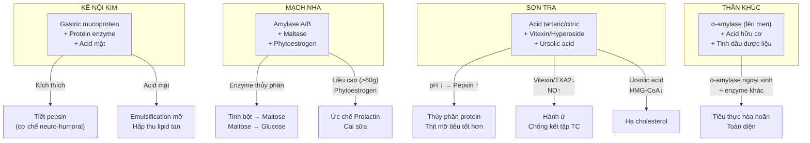

import MedicalNote from '~/components/MedicalNote.astro';
import ClinicalPearl from '~/components/ClinicalPearl.astro';

## Bản đồ cơ chế tổng quan — Bài 13



---

## 1. Kê nội kim — Gastric mucoprotein và cơ chế pepsin

**Tại sao màng mề gà lại tiêu hóa được?**

Gà (như nhiều loài chim ăn hạt) có dạ dày cơ (mề) rất phát triển để nghiền thức ăn cứng. Màng trong mề (Kê nội kim) chứa:

- **Gastric mucoprotein** — glycoprotein màng nhầy đặc biệt của gà.
- **Protease tự nhiên** — enzyme thủy phân protein từ tế bào biểu mô mề.
- **Acid mật dạng liên hợp** — tích lũy từ ruột non qua chu trình enterohepatic.
- **Isoflavon** — tác dụng kháng viêm niêm mạc GI.

### Cơ chế kích thích tiết pepsin

```
GASTRIC MUCOPROTEIN (Kê nội kim)
    ↓
Tiếp xúc trực tiếp niêm mạc Vị (dạ dày)
    ↓
Kích thích tế bào G vùng hang vị → Gastrin ↑
    ↓
Gastrin → tế bào thành (parietal cell) → HCl ↑
    ↓
pH dạ dày ↓ (acid hóa)
    ↓
Pepsinogen (từ tế bào chính) → Pepsin (hoạt hóa ở pH <3.5)
    ↓
Pepsin thủy phân protein hiệu quả
    ↓
YHCT: "Kiện Vị tiêu thực" — thức ăn được tiêu hóa tốt hơn
```

### Lý giải khoa học: Tại sao DẠNG TÁN > DẠNG SẮC

```
DẠNG SẮC (đun sôi 30-60 phút ở 100°C):
Protein → denaturation (mất cấu trúc bậc 2, 3, 4)
    ↓
Enzyme site bị phá hủy → Mất hoạt tính xúc tác
    ↓
Gastric mucoprotein bị thủy phân sơ bộ trong quá trình sắc
→ Không còn khả năng kích thích niêm mạc dạ dày
→ Hiệu quả kém

DẠNG TÁN (bột sao vàng nhẹ, uống với nước ấm):
Protein không bị denaturation hoàn toàn (sao nhẹ chỉ làm khô)
    ↓
Bột mịn tiếp xúc trực tiếp với niêm mạc
    ↓
Gastric mucoprotein nguyên vẹn → Kích thích Gastrin → Pepsin ↑
    ↓
Hiệu quả tiêu thực tốt hơn đáng kể
```

<MedicalNote>

**YHCT biết điều này từ thực hành lâm sàng** — hàng thế kỷ trước khi có sinh hóa học hiện đại. Quan sát: "Kê nội kim sao vàng nghiền bột mịn uống cho hiệu quả tốt hơn dạng sắc" — đây là empirical evidence dẫn đến quy tắc dùng thuốc. YHHĐ giải thích qua protein denaturation. Đây là ví dụ tốt về YHCT thực nghiệm đi trước lý thuyết.

</MedicalNote>

---

## 2. Kê nội kim "sáp tinh" — cơ chế trị sỏi và di tinh

**Sáp tinh** trong YHCT = Cố Thận, ngăn tinh khí thoát ra ngoài không kiểm soát (di tinh, đái dầm). Sỏi tiết niệu cũng thuộc Bàng quang → quy kinh Bàng quang.

### Trị sỏi (kết hợp Kim tiền thảo)

```
KÊ NỘI KIM (acid mật) + KIM TIỀN THẢO (isochaetosid)
    ↓
Acid mật (Kê nội kim): Tăng độ hòa tan phospholipid + cholesterol mật
→ Sỏi mật cholesterol có thể bị hòa tan dần
    ↓
Isochaetosid (Kim tiền thảo): Kiềm hóa nước tiểu
→ Sỏi oxalat/urat tan trong môi trường kiềm
    ↓
Kê nội kim: Tăng co bóp bàng quang
→ Đẩy sỏi nhỏ ra ngoài (tác dụng cơ học)
    ↓
Phối hợp 2 cơ chế: Hòa tan + Tống xuất
```

### Trị di tinh/đái dầm

Cơ chế chưa rõ hoàn toàn. Giả thuyết:
- Isoflavon trong Kê nội kim → tác dụng hormone nhẹ → tăng trương lực cơ thắt bàng quang.
- Gastric mucoprotein → qua trục ruột-não → điều hòa phản xạ tiểu tiện.

---

## 3. Mạch nha — Amylase và cơ chế liều phụ thuộc hồi nhũ

### Cơ chế tiêu thực (liều thường 9-15 g)

**Mầm đại mạch** là nguồn enzyme amylase phong phú — đây là lý do Mạch nha được dùng trong công nghiệp sản xuất bia và malt.

```
AMYLASE A (α-amylase) — Mạch nha
    ↓
Cắt liên kết α-1,4-glycosidic ở vị trí ngẫu nhiên trong tinh bột
    ↓
Polysaccharide lớn → Dextrin (trung gian) + Maltose

AMYLASE B (β-amylase) — Mạch nha
    ↓
Cắt maltose từ đầu khử của tinh bột (exo-enzyme)
    ↓
Maltose + Dextrin (giới hạn)

MALTASE — Mạch nha
    ↓
Maltose → 2 × Glucose (hấp thu trực tiếp)

TỔNG HỢP:
Tinh bột → [Amylase A+B] → Dextrin + Maltose → [Maltase] → Glucose
    ↓
Năng lượng hấp thu được hoàn toàn
    ↓
Không còn "ứ đọng tinh bột" trong ruột
```

### Cơ chế hồi nhũ (liều cao 60-100 g/ngày)

```
ISOFLAVONE + COUMARIN (Mạch nha — liều cao)
    ↓
Phytoestrogen nồng độ cao
    ↓
Cạnh tranh với estradiol tại ER-α (Estrogen Receptor Alpha)
→ Ức chế signaling estrogen nội sinh
    ↓
VIP (Vasoactive Intestinal Peptide) ↓ tại tuyến sữa
    ↓
HOẶC:
Dopamine pathway ↑ (gián tiếp qua GI hormone)
    ↓
Prolactin từ tuyến yên ↓
    ↓
Tuyến sữa không nhận được tín hiệu tiết sữa
    ↓
Sữa dần cạn sau 3 ngày (hồi nhũ)
```

<ClinicalPearl>

**Lưu ý dược tương tác:** Mạch nha liều cao có tính phytoestrogen → không dùng cho phụ nữ có tiền căn ung thư vú hormone-receptor-positive. Đây là ứng dụng lâm sàng của hiểu biết cơ chế — YHCT ghi "kiêng phụ nữ có thai" nhưng YHHĐ mở rộng thêm kiêng kỵ này.

</ClinicalPearl>

---

## 4. Sơn tra — Acid hữu cơ và cơ chế đa tác dụng

### Cơ chế tiêu thịt mỡ (đặc hiệu)

**Tại sao Sơn tra tiêu thịt mỡ tốt hơn Kê nội kim và Mạch nha?**

```
ACID TARTARIC + ACID CITRIC (Sơn tra)
    ↓
Giảm pH dịch vị (acid hóa mạnh hơn nội sinh)
    ↓
Pepsinogen → Pepsin hoạt hóa tối ưu (pH 1.5–2.0)
    ↓
Pepsin hoạt tính cao → Protein thịt bị thủy phân nhanh hơn
    ↓
ĐỒNG THỜI:
Acid citric → Kích thích CCK (cholecystokinin) từ tá tràng
    ↓
CCK → Túi mật co bóp → Đổ mật vào tá tràng
CCK → Tụy tiết lipase
    ↓
Lipase + mật → Emulsification và thủy phân triglyceride
    ↓
YHCT: "Tiêu thịt mỡ dầu đặc biệt"
```

### Cơ chế hành ứ (tác dụng trên huyết)

```
VITEXIN (flavone C-glycoside) + HYPEROSIDE (quercetin-3-galactoside)
    ↓
Ức chế COX-1 → TXA2 ↓ (thromboxane A2 — kết tập TC)
Tăng tổng hợp PGI2 (prostacyclin — chống kết tập TC)
    ↓
Kết tập tiểu cầu ↓ → Độ nhớt máu ↓
    ↓
Vitexin → eNOS hoạt hóa → NO ↑ → Giãn mạch
    ↓
YHCT: "Hành ứ" = vi tuần hoàn cải thiện
    ↓
ỨNG DỤNG: Sản hậu ứ huyết (đau bụng dưới sau sinh do cục máu đông sót)
Bài thuốc: Sơn tra 15-20 g + Hồi hương 3 g
```

### Cơ chế hạ cholesterol

```
URSOLIC ACID + OLEANOLIC ACID (triterpenoid Sơn tra)
    ↓
Ức chế HMG-CoA reductase
(bước rate-limiting tổng hợp cholesterol tại gan)
    ↓
Cholesterol nội sinh ↓
LDLR (LDL receptor) ↑ → LDL-C thanh thải từ máu ↑
    ↓
TC ↓, LDL-C ↓, HDL-C ↑ (sau 4-8 tuần điều trị)
```

---

## 5. Thần khúc — Vi sinh học lên men và enzyme phức hợp

**Thần khúc là "sinh phẩm" đầu tiên trong YHCT** — sản phẩm của quá trình lên men vi sinh có kiểm soát.

### Cơ chế tạo enzyme trong lên men

```
VI SINH VẬT LÊN MEN (Aspergillus oryzae, Saccharomyces cerevisiae...):
Phát triển trên môi trường bột mì + dược liệu
    ↓
Tiết α-amylase ngoại bào (vào sản phẩm)
Tiết protease nhẹ
Tạo acid hữu cơ (lactic acid, acetic acid)
    ↓
Sản phẩm cuối (bánh phơi khô) chứa:
1. Enzyme tiêu hóa (α-amylase)
2. Acid hữu cơ (kích thích tiêu hóa)
3. Tinh dầu dược liệu (Hương nhu, Sa nhân, Bạc hà...)
4. Thành phần từ các vị dược liệu (Sơn tra, Hậu phác, Trần bì...)
```

### Tại sao Thần khúc "toàn diện" hơn các vị đơn?

```
THẦN KHÚC = Tiêu thực enzyme (α-amylase)
           + Hành khí (tinh dầu Bạc hà, Sa nhân, Hương phụ)
           + Hóa thấp (Hậu phác, Trần bì, Thương nhĩ tử)
           + Tiêu mỡ (Sơn tra trong bài lên men)
           + Ôn trung (Quế, Gừng trong bài)
    ↓
Bài thuốc lên men = "All-in-one digestive enzyme"
trong y học cổ truyền
```

---

## 6. Worked example — Ca lâm sàng Cam tích trẻ em

**Bệnh nhi:** 4 tuổi, kém ăn 3 tháng, bụng trướng, gầy yếu, vàng da nhẹ, lưỡi nhợt rêu trắng nhờn, mạch tế nhược. Phân thối chua, đôi khi tiêu chảy nhão. YHCT: Tỳ hư + Thực tích (Cam tích).

**YHCT chẩn đoán:** Cam tích = Tỳ hư mạn (hư) + Thực tích (thực) tồn tại cùng lúc. Không thể chỉ tiêu thực (làm hao Tỳ thêm) hay chỉ kiện Tỳ (không giải được tích).

**Bài thuốc phối hợp:**

| Vị thuốc | Vai trò | Cơ chế YHHĐ |
|---|---|---|
| Kê nội kim 3 g (bột) | Tiêu thực — mọi loại thức ăn tích | Gastric mucoprotein → Pepsin ↑; enzyme tiêu hóa |
| Thần khúc 9 g | Tiêu thực hòa Vị | α-amylase lên men + acid hữu cơ + tinh dầu |
| Mạch nha sao 9 g | Tiêu bột + kiện Tỳ | Amylase A/B + Kiện Tỳ dưỡng Vị nhẹ |
| Bạch truật 6 g | Kiện Tỳ táo thấp | Polysaccharide Bạch truật → tăng tiêu hóa + tăng miễn dịch |
| Sơn dược 9 g | Bổ Tỳ Phế | Mannoproteins → nuôi dưỡng niêm mạc ruột |
| Trần bì 4 g | Lý khí hóa thấp | D-limonene → Giảm co thắt trơn GI |

**Tích hợp cơ chế:**

```
Kê nội kim (pepsin ↑)
+ Thần khúc (α-amylase + lên men)
+ Mạch nha sao (amylase A/B)
    ↓
ENZYME COMPLEX → Thủy phân protein + tinh bột + mỡ
    ↓
Thức ăn tích được tiêu hóa
    ↓
Bạch truật + Sơn dược
    ↓
Phục hồi niêm mạc ruột + tăng hấp thu
    ↓
Trần bì
    ↓
Giảm co thắt, giảm đầy hơi
    ↓
KẾT QUẢ: Giải tích + Phục hồi Tỳ Vị (cam tích cải thiện dần)
```

<ClinicalPearl>

**Trên lâm sàng hiện đại:** Cam tích (Failure to thrive) ở trẻ em YHCT tương đương với suy dinh dưỡng + rối loạn tiêu hóa chức năng. Bài thuốc YHCT tiêu đạo + kiện Tỳ trong nghiên cứu lâm sàng Trung Quốc cho thấy cải thiện BMI, appetite, và GI motility sau 4–8 tuần. Cơ chế: enzyme tiêu hóa ngoại sinh (Kê nội kim, Thần khúc) + tăng nhu động (Trần bì, Mộc hương) + nuôi dưỡng niêm mạc (Bạch truật, Sơn dược).

</ClinicalPearl>

---

## 7. Cầu nối YHCT → YHHĐ — Bài 13 tóm tắt

| Khái niệm YHCT | Cơ chế YHHĐ | Hoạt chất chủ lực |
|---|---|---|
| Thực tích Trung tiêu | Thức ăn ứ lại do thiếu enzyme tiêu hóa, giảm nhu động | Amylase, protease, lipase (ngoại sinh từ thuốc) |
| Kê nội kim kiện Vị tiêu thực | Gastrin ↑ → Pepsin ↑; Acid mật → Lipase ↑ | Gastric mucoprotein, acid mật |
| Kê nội kim sáp tinh trị sỏi | Acid mật hòa tan sỏi cholesterol; co bóp bàng quang → tống sỏi | Acid mật conjugated |
| Mạch nha kiện Tỳ tiêu thực | α-amylase, β-amylase, maltase thủy phân tinh bột | Amylase A/B, maltase |
| Mạch nha hồi nhũ | Phytoestrogen liều cao → Prolactin ↓ | Isoflavone, coumarin |
| Sơn tra tiêu thịt mỡ | pH ↓ → Pepsin ↑; CCK → Lipase + Mật tiết | Acid tartaric, acid citric |
| Sơn tra hành ứ | TXA2 ↓, PGI2 ↑, NO ↑ → Kết tập TC ↓, vi tuần hoàn ↑ | Vitexin, hyperoside |
| Sơn tra hạ cholesterol | HMG-CoA reductase ↓ → Cholesterol nội sinh ↓ | Ursolic acid, oleanolic acid |
| Thần khúc tiêu thực hòa Vị | α-amylase lên men + tinh dầu + acid hữu cơ từ nhiều vị | α-amylase + enzyme phức hợp |
