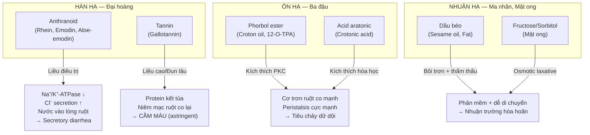

import MedicalNote from '~/components/MedicalNote.astro';
import ClinicalPearl from '~/components/ClinicalPearl.astro';

## Bản đồ cơ chế tổng quan — Bài 14



---

## 1. Anthranoid (Đại hoàng) — cơ chế secretory diarrhea

**Đại hoàng chứa 5 antraglycosid chính:**
- **Rhein** — hoạt tính tả mạnh nhất
- **Emodin** — tả + kháng khuẩn + kháng ung thư
- **Aloe-emodin** — tả + kháng viêm
- **Chrysophanol** — yếu nhất về tả
- **Physcion** — kháng khuẩn

### Cơ chế ức chế Na⁺/K⁺-ATPase

```
RHEIN + EMODIN (antraglycosid hoạt hóa sau thủy phân ở đại tràng)
    ↓
BƯỚC 1: Ức chế Na⁺/K⁺-ATPase ở tế bào ruột già
→ Na⁺ không bơm ra ngoài tế bào (gradient giảm)
→ Hấp thu Na⁺ và nước ở ruột già giảm mạnh
    ↓
BƯỚC 2: Mở kênh Cl⁻ (via cAMP pathway)
→ Cl⁻ tiết từ tế bào vào lòng ruột ↑
→ Na⁺ và H₂O theo thẩm thấu vào lòng ruột ↑
    ↓
BƯỚC 3: Kích thích thụ thể 5-HT₄ ở đám rối thần kinh Auerbach
→ Acetylcholine phóng thích ↑
→ Nhu động ruột già ↑↑
    ↓
KẾT QUẢ: Secretory diarrhea
(tiêu chảy do tăng tiết nước — không phải do tổn thương niêm mạc)
```

<MedicalNote>

**Tại sao gọi là "secretory" chứ không phải osmotic?** Anthranoid CHỦ ĐỘNG kích thích tế bào bài tiết nước và điện giải vào lòng ruột (active secretion), không chỉ đơn giản giữ nước theo áp suất thẩm thấu. Phân biệt với Mang tiêu (Na₂SO₄) — osmotic laxative thuần túy (không hấp thu được → kéo nước vào lòng ruột thụ động). Đây giải thích tại sao anthranoid hiệu quả ngay cả khi phân đã mềm, còn osmotic chỉ hoạt động khi phân còn rắn.

</MedicalNote>

### Anthranoid phụ thuộc vi khuẩn đường ruột

```
ANTRAGLYCOSID (dạng glycoside) uống vào
    ↓
Dạ dày + ruột non: Không hấp thu (hydrophilic glycoside lớn)
    ↓
Đại tràng: Vi khuẩn đường ruột (Bacteroides, E. coli)
→ Cắt đường glucose → Anthranone (aglycone tự do)
    ↓
Anthranone hoạt hóa → Hấp thu qua niêm mạc đại tràng
→ Ức chế Na⁺/K⁺-ATPase cục bộ
    ↓
TẠI SAO KHÔNG SẮC LÂU: Nhiệt độ cao → Thủy phân antraglycosid sớm
→ Anthranone bay hơi hoặc polymer hóa → Mất hoạt tính
→ Còn lại tannin → Chỉ cầm máu, không tả
```

### Tannin Đại hoàng — cầm máu khi sao cháy

```
TANNIN (Gallotannin trong Đại hoàng)
    ↓
Môi trường nhiệt độ cao (sao cháy):
Anthranoid bị phân hủy, tannin bền nhiệt → Tannin chiếm ưu thế
    ↓
Tannin tiếp xúc niêm mạc/vết thương:
→ Protein kết tủa (protein coagulation)
→ Niêm mạc bị "thuộc da" (tanning effect)
→ Lớp màng protein bao phủ vết thương
→ Co mạch cục bộ (ngăn chảy máu)
→ Giảm tính thấm mao mạch (mao mạch bền vững hơn)
    ↓
KẾT QUẢ: Hemostasis (cầm máu)
YHCT: "Chỉ huyết — Đại hoàng thán"
```

### Đại hoàng "trục ứ" — cơ chế hoạt huyết

**Tại sao Đại hoàng (thuốc tả hạ) lại trục ứ, thông kinh?**

```
RHEIN + STILBENE GLYCOSIDE (Đại hoàng)
    ↓
Ức chế kết tập tiểu cầu (antiplatelet):
→ Giảm TXA₂ (thromboxane A₂)
→ Tăng PGI₂ (prostacyclin)
    ↓
Kích thích co bóp tử cung:
→ Anthraquinone → oxytocin-like effect
→ Tử cung co → Đẩy huyết ứ ra
    ↓
YHCT: "Trục ứ thông kinh"
= Phá khối huyết ứ + Thúc đẩy huyết lưu thông
    ↓
ỨNG DỤNG: Bế kinh, chấn thương ứ huyết, sản hậu ứ huyết
PHỐI HỢP: Đào nhân + Hồng hoa + Đại hoàng = Đào hạch thừa khí thang
```

---

## 2. Phorbol ester Ba đậu — kích thích PKC cực mạnh

**Ba đậu chứa dầu Croton (Croton oil) — một trong những chất gây kích thích ruột mạnh nhất tự nhiên.**

### Chuỗi PKC → co thắt cơ trơn

```
PHORBOL ESTER (12-O-Tetradecanoylphorbol-13-acetate — TPA)
    ↓
Bắt chước DAG (Diacylglycerol — second messenger tự nhiên)
    ↓
Gắn vào C1 domain của PKC (Protein Kinase C)
→ Kích hoạt PKC mạnh mẽ và kéo dài
(PKC tự nhiên được kích hoạt ngắn bởi DAG; Phorbol = kích hoạt liên tục)
    ↓
PKC phosphoryl hóa Myosin Light Chain Kinase (MLCK) ↑
→ Myosin light chain phosphoryl hóa
→ Actomyosin cross-bridge formation
→ Cơ trơn ruột co mạnh liên tục
    ↓
Nhu động ruột tăng cực mạnh
Tiết dịch ruột ↑↑ (qua PKC → Cl⁻ secretion)
    ↓
TIÊU CHẢY DỮ DỘI + NÔN MỬA (phản xạ bảo vệ)
```

### Tại sao Ba đậu cũng có thể gây ung thư?

```
PHORBOL ESTER (TPA) — Co-carcinogen
    ↓
Cơ chế: TPA bình thường không gây ung thư trực tiếp
Nhưng khi TIẾP XÚC SAU carcinogen khởi đầu (initiation):
    ↓
TPA → Kích hoạt PKC → Gene expression thay đổi
→ Tăng proliferation của tế bào đã bị transform
→ Thúc đẩy promotion (giai đoạn 2 gây ung thư)
    ↓
TRONG PHÒNG THÍ NGHIỆM: TPA là "tumor promoter" kinh điển
Mô hình 2-stage carcinogenesis: DMBA (initiator) + TPA (promoter)
    ↓
LÂM SÀNG YHCT: Ba đậu KHÔNG dùng lâu dài → Đây là lý do
Dùng liều nhỏ, ngắn ngày → Tổng lượng phorbol thấp → An toàn
```

<ClinicalPearl>

**Liều trị liệu vs Liều ngộ độc Ba đậu:** Liều điều trị (0,02–0,5 g) chứa lượng phorbol rất nhỏ → chỉ kích thích cơ trơn đại tràng. Liều ngộ độc (>0,5 g nguyên hạt) → phorbol ngấm vào máu → tan huyết, hoại tử ruột, viêm tấy toàn thân. Cửa sổ điều trị CỰC HẸP — nhỏ hơn nhiều so với Ba đậu sương.

</ClinicalPearl>

---

## 3. Dầu béo Ma nhân — cơ chế nhuận hạ đa cơ chế

**Ma nhân (Sesame seed) chứa ~50-60% dầu béo — cơ chế hoàn toàn khác anthranoid và phorbol.**

### Cơ chế 1: Thẩm thấu + Bôi trơn

```
DẦU BÉO (Sesame oil — oleic acid 40%, linoleic acid 40%)
    ↓
BƯỚC 1: Dầu KHÔNG hấp thu được ở ruột non (một phần)
→ Đến đại tràng còn nguyên dạng emulsion
    ↓
BƯỚC 2: Bao phủ bề mặt phân (lubrication)
→ Giảm ma sát giữa phân và thành ruột
→ Phân di chuyển dễ hơn cơ học
    ↓
BƯỚC 3: Dầu hút nước → Phân mềm ra
→ Dễ đi ngoài
    ↓
KHÔNG gây tiêu chảy dữ dội (khác anthranoid hoàn toàn)
→ An toàn cho người già, sau sinh
```

### Cơ chế 2: Prostaglandin + Nhu động nhẹ

```
ACID LINOLENIC (omega-3 trong dầu Mè)
    ↓
PGE₁ + PGE₂ (Prostaglandin E series) từ arachidonic cascade
→ Kích thích cơ trơn ruột già nhẹ
→ Nhu động tăng vừa phải (không mạnh như anthranoid)
    ↓
Phối hợp: Bôi trơn + Nhu động nhẹ = Nhuận hạ hòa hoãn
```

### Sesamin + Sesamolin — giải thích công năng bổ Can Thận

```
SESAMIN + SESAMOLIN (lignans trong Mè đen)
    ↓
Chống oxy hóa mạnh (mạnh hơn Vitamin E đơn lẻ)
→ Bảo vệ tế bào gan khỏi oxy hóa lipid (lipid peroxidation)
→ YHCT: "Bổ Can" (Can liên quan gan)
    ↓
Sesamin → ức chế Δ5-desaturase (enzyme chuyển hóa lipid)
→ Tăng DHA/EPA tỷ lệ → Chống viêm thần kinh
→ YHCT: "Bổ Thận" (Thận liên quan não/tủy)
    ↓
Sesamin → Phytoestrogen nhẹ
→ Kích thích tạo máu (gián tiếp qua estrogen receptor)
→ YHCT: "Dưỡng huyết"
```

---

## 4. Mật ong — cơ chế đa thành phần

### Fructose/Sorbitol — osmotic laxative

```
FRUCTOSE (~38% trong mật ong) + SORBITOL (~1%)
    ↓
Fructose: Hấp thu ở ruột non qua GLUT5 (không qua SGLT1)
→ Tốc độ hấp thu CHẬM HƠN glucose
→ Khi quá liều fructose: Không hấp thu hết → Ở lại lòng ruột
→ Áp suất thẩm thấu trong lòng ruột ↑ → Kéo nước vào
    ↓
Sorbitol: Không hấp thu được hoàn toàn ở người
→ Áp suất thẩm thấu ↑ → Giữ nước trong lòng ruột
    ↓
Phân mềm ra + Nhu động kích thích nhẹ
→ Nhuận trường hòa hoãn (osmotic type)
```

### H₂O₂ + Defensin-1 — kháng khuẩn

```
GLUCOSE OXIDASE (enzyme trong mật ong tươi)
    ↓
Glucose + O₂ → Gluconic acid + H₂O₂
    ↓
H₂O₂ nồng độ thấp (~0,03%) = Kháng khuẩn hiệu quả
(không đủ gây tổn thương tế bào người)
    ↓
ĐỒNG THỜI:
DEFENSIN-1 (Royal jelly bee peptide) trong mật
→ Phá vỡ màng tế bào vi khuẩn
→ Kháng khuẩn phổ rộng (kể cả MRSA trong nghiên cứu)
    ↓
pH thấp (3,2–4,5) của mật ong
→ Ức chế hầu hết vi khuẩn gây bệnh
→ YHCT: "Giải độc" + "Nhuận gan mật"
```

### Mật ong giải độc Ô đầu (Aconitine)

```
ALKALOID ACONITINE (Ô đầu — Aconitum) — Rất độc
Cơ chế độc: Kích hoạt kênh Na⁺ tim → Nhịp tim rối loạn + Ngộ độc thần kinh
    ↓
CHẾ BI (Mật ong gia nhiệt với Ô đầu):
Mật ong + Nhiệt độ cao
    ↓
MG (Methylglyoxal) trong mật ong phản ứng với alkaloid
→ Maillard reaction → Alkaloid polymer hóa/biến đổi hóa học
→ Aconitine → Benzaconine (dạng ít độc hơn nhiều lần)
    ↓
Protein mật ong → Adsorption alkaloid
→ Giảm hấp thu Aconitine ở GI
    ↓
SONG SONG: Đường trong mật → Bổ sung glycogen gan
→ Tăng detox alkaloid ở gan (Phase 2 metabolism)
    ↓
YHCT: "Mật ong giải độc Ô đầu" = Cả bào chế + Dùng cùng
```

---

## 5. Worked example — Ca lâm sàng tắc ruột sau mổ

**Bệnh nhân:** Nam 58 tuổi, mổ ruột thừa viêm 3 ngày trước. Sau mổ: không trung tiện, bụng chướng căng, sốt nhẹ 38°C, mạch nhanh, lưỡi đỏ rêu vàng khô, không đi đại tiện. YHHĐ: Liệt ruột cơ năng sau mổ (Paralytic ileus). YHCT: Dương minh phủ chứng — Thực nhiệt táo kết.

**Bài thuốc YHCT phối hợp:**

| Vị thuốc | Vai trò YHCT | Cơ chế YHHĐ |
|---|---|---|
| Đại hoàng 9 g (hậu hạ) | Tả nhiệt thông trường | Rhein → Na⁺/K⁺-ATPase ↓ → Secretory diarrhea + Nhu động ↑ |
| Mang tiêu 6 g (hòa vào nước) | Nhuyễn kiên nhuận táo | Na₂SO₄ → Osmotic giữ nước → Làm mềm phân + Nhu động ↑ |
| Hậu phác 12 g | Hành khí giáng trọc | Magnolol/Honokiol → Acetylcholinesterase ↓ → Nhu động ↑ |
| Chỉ thực 9 g | Phá khí tiêu tích | Synephrine → Adrenergic ↑ cơ trơn → Nhu động ↑ |
| Đào nhân 9 g | Hoạt huyết trục ứ | PGF₂α → Co mạch ruột → Giảm viêm + Tăng lưu máu mạc treo |

**Cơ chế tổng hợp:**

```
Đại hoàng (secretory) + Mang tiêu (osmotic)
    ↓
Nước tăng trong lòng đại tràng
    ↓
Hậu phác + Chỉ thực
    ↓
Nhu động đại tràng phục hồi
    ↓
Phân mềm + Ruột co bóp được
    ↓
Trung tiện + Đại tiện → Liệt ruột cải thiện
    ↓
Giảm áp lực ổ bụng → Giảm đau, giảm sốt
→ YHCT: Phủ khí thông, nhiệt tà xuất
```

<ClinicalPearl>

**Bằng chứng lâm sàng hiện đại:** Nghiên cứu tại Trung Quốc (nhiều RCT từ 2000–2020) cho thấy Đại thừa khí thang + Tiểu thừa khí thang cải thiện paralytic ileus sau mổ bụng tốt hơn điều trị thông thường đơn thuần. Cơ chế được xác định: Rhein tăng motility qua 5-HT₄, Magnolol ức chế acetylcholinesterase (acetylcholine nhiều hơn → cơ trơn co), Mang tiêu thẩm thấu giảm thời gian transit. Đây là ứng dụng kinh điển YHCT có bằng chứng khoa học rõ nhất trong bài này.

</ClinicalPearl>

---

## 6. Cầu nối YHCT → YHHĐ — Bài 14 tóm tắt

| Khái niệm YHCT | Cơ chế YHHĐ | Hoạt chất chủ lực |
|---|---|---|
| Hàn hạ (Đại hoàng) | Na⁺/K⁺-ATPase ↓ → Secretory diarrhea + 5-HT₄ → Nhu động | Rhein, Emodin, Aloe-emodin |
| Đại hoàng sắc ngắn tả mạnh | Anthranoid bền nhiệt ngắn, phân hủy khi đun lâu | Antraglycosid |
| Đại hoàng thán cầm máu | Tannin → Protein coagulation + Mao mạch bền vững | Gallotannin |
| Đại hoàng trục ứ thông kinh | Ức chế kết tập TC + Oxytocin-like co tử cung | Rhein, Stilbene glycoside |
| Cam thảo giảm tả Đại hoàng | Glycyrrhizin adsorb anthranoid → giảm hấp thu | Glycyrrhizin |
| Ôn hạ (Ba đậu) | Phorbol → PKC → Co thắt cơ trơn cực mạnh | Phorbol ester (TPA) |
| Ba đậu sương ít độc hơn | Loại bỏ dầu Croton (bỏ phorbol đậm đặc) | (Giảm phorbol ester) |
| Ba đậu giải độc Đậu xanh | Protein liên kết phorbol → Giảm hấp thu | (Protein adsorption) |
| Nhuận hạ (Ma nhân) | Dầu béo lubrication + PGE nhu động nhẹ | Oleic acid, Linolenic acid |
| Ma nhân bổ Can Thận | Sesamin → Chống oxy hóa gan + Anti-inflammatory thần kinh | Sesamin, Sesamolin |
| Nhuận hạ (Mật ong) | Fructose/Sorbitol osmotic + Bôi trơn | Fructose, Sorbitol |
| Mật ong kháng khuẩn | H₂O₂ (glucose oxidase) + Defensin-1 + pH thấp | Glucose oxidase, Defensin-1 |
| Mật ong giải độc Ô đầu | Methylglyoxal biến đổi Aconitine + Protein adsorption | MG + Protein mật |
